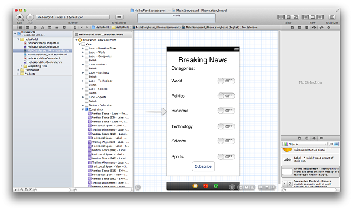
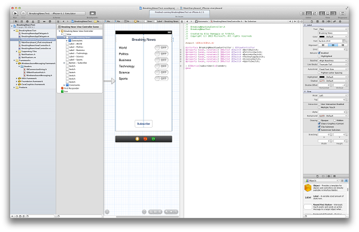
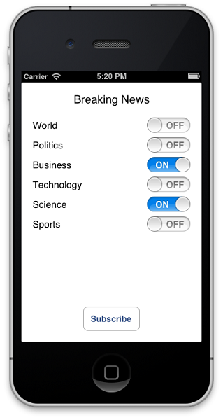

<properties linkid="develop-notificationhubs-tutorials-send-breaking-news-ios" urlDisplayName="Breaking News" pageTitle="Notification Hubs Breaking News Tutorial - iOS" metaKeywords="" description="Learn how to use Azure Service Bus Notification Hubs to send breaking news notifications to iOS devices." metaCanonical="" services="mobile-services,notification-hubs" documentationCenter="" title="Use Notification Hubs to send breaking news" authors="ricksal" solutions="" manager="" editor="" />

Verwenden von Notification Hubs zum Übermitteln von aktuellen Nachrichten
=========================================================================

[Windows Store C\#](/en-us/manage/services/notification-hubs/breaking-news-dotnet "Windows Store C#")[Windows Phone](/en-us/manage/services/notification-hubs/breaking-news-wp8 "Windows Phone")[iOS](/en-us/manage/services/notification-hubs/breaking-news-ios "iOS")

In diesem Thema wird gezeigt, wie Sie mit Azure Notification Hubs Benachrichtigungen zu aktuellen Nachrichten an eine iOS-Anwendung senden können. Sie werden anschließend in der Lage sein, sich für Kategorien aktueller Nachrichten zu registrieren, die Sie interessieren, und nur Pushbenachrichtigungen für diese Kategorien zu empfangen. Dieses Szenario ist ein häufiges Muster für viele Anwendungen, bei denen Benachrichtigungen an Benutzergruppen gesendet werden müssen, die zuvor Interesse daran bekundet haben, zum Beispiel RSS-Reader, Apps für Musikliebhaber, etc.

Übertragungsszenarien werden durch das Einfügen von einem oder mehreren *Tags* möglich, wenn eine Registrierung im Notification Hub erstellt wird. Wenn Benachrichtigungen an ein Tag gesendet werden, erhalten alle Geräte, die für das Tag registriert wurden, diese Benachrichtigung. Da es sich bei Tags um Zeichenfolgen handelt, müssen diese nicht im Voraus bereitgestellt werden. Weitere Informationen zu Tags finden Sie unter [Notification Hubs-Leitfaden](http://msdn.microsoft.com/en-us/library/jj927170.aspx).

In diesem Lernprogramm werden die folgenden grundlegenden Schritte zur Aktivierung dieses Szenarios behandelt:

1.  [Hinzufügen der Kategorieauswahl zur App](#adding-categories)
2.  [Registrieren für Benachrichtigungen](#register)
3.  [Senden von Benachrichtigungen von Ihrem Back-End aus](#send)
4.  [Ausführen der Anwendung und Erzeugen von Benachrichtigungen](#test-app)

Dieses Thema baut auf die App auf, die Sie in [Erste Schritte mit Notification Hubs](/en-us/manage/services/notification-hubs/get-started-notification-hubs-ios/) erstellt haben. Bevor Sie dieses Lernprogramm beginnen, müssen Sie [Erste Schritte mit Notification Hubs](/en-us/manage/services/notification-hubs/get-started-notification-hubs-ios/) abgeschlossen haben.

Hinzufügen der Kategorieauswahl zur App
---------------------------------------

Zunächst werden Sie Benutzeroberflächenelemente zum vorhandenen Storyboard hinzufügen, mit denen Benutzer Kategorien für die Registrierung auswählen können. Die durch den Benutzer ausgewählten Kategorien werden auf dem Gerät gespeichert. Wenn die App gestartet wird, wird eine Geräteregistrierung in Ihrem Notification Hub mit den ausgewählten Kategorien als Tags erstellt.

2. Fügen Sie die folgenden Komponenten aus der Objektbibliothek zu MainStoryboard\_iPhone.storyboard hinzu:

    -   Eine Beschriftung mit dem Text "Breaking News",
    -   Beschriftungen mit den Kategorien "World", "Politics", "Business", "Technology", "Science", "Sports",
    -   Sechs Switches, einen pro Kategorie,
    -   Eine Schaltfläche mit der Beschriftung "Subscribe"

    Ihr Storyboard sollte nun folgendermaßen aussehen:

    

3. Erstellen Sie im Assistant Editor Outlets für alle Switches und nennen Sie diese "WorldSwitch", "PoliticsSwitch", "BusinessSwitch", "TechnologySwitch", "ScienceSwitch", "SportsSwitch"

    

4. Erstellen Sie eine Action für Ihre Schaltfläche mit dem Namen "subscribe". Die Datei BreakingNewsViewController.h sollte den folgenden Code enthalten:

         @property (weak, nonatomic) IBOutlet UISwitch *WorldSwitch;
         @property (weak, nonatomic) IBOutlet UISwitch *PoliticsSwitch;
         @property (weak, nonatomic) IBOutlet UISwitch *BusinessSwitch;
         @property (weak, nonatomic) IBOutlet UISwitch *TechnologySwitch;
         @property (weak, nonatomic) IBOutlet UISwitch *ScienceSwitch;
         @property (weak, nonatomic) IBOutlet UISwitch *SportsSwitch;

         - (IBAction)subscribe:(id)sender;

5. Erstellen Sie eine neue Klasse `Notifications`. Fügen Sie den folgenden Code im Schnittstellenbereich der Datei Notifications.h ein:

         - (void)storeCategoriesAndSubscribeWithCategories:(NSArray*) categories completion: (void (^)(NSError* error))completion;
         - (void)subscribeWithCategories:(NSSet*) categories completion:(void (^)(NSError *))completion;

6. Fügen Sie die folgende Import-Anweisung zu Notifications.h hinzu:

         #import <WindowsAzureMessaging/WindowsAzureMessaging.h>

7. Fügen Sie den folgenden Code im Implementierungsbereich der Datei Notifications.m ein:

         - (void)storeCategoriesAndSubscribeWithCategories:(NSSet *)categories completion:(void (^)(NSError *))completion {
             NSUserDefaults* defaults = [NSUserDefaults standardUserDefaults];
             [defaults setValue:[categories allObjects] forKey:@"BreakingNewsCategories"];
                
             [self subscribeWithCategories:categories completion:completion];
         }

         - (void)subscribeWithCategories:(NSSet *)categories completion:(void (^)(NSError *))completion{
             SBNotificationHub* hub = [[SBNotificationHub alloc] initWithConnectionString:@"<connection string with listen access>" notificationHubPath:@"<hub name>"];
                
             [hub registerNativeWithDeviceToken:self.deviceToken tags:categories completion: completion];
         }

    Diese Klasse verwendet den lokalen Speicher, um Nachrichtenkategorien zu speichern, die das Gerät empfangen soll. Sie enthält außerdem Methoden zum Registrieren dieser Kategorien.

7.  Ersetzen Sie im Code oben die Platzhalter `<hub name>` und `<connection string with listen access>` durch den Namen Ihres Notification Hubs und die Verbindungszeichenfolge für *DefaultListenSharedAccessSignature*, die Sie zuvor erhalten haben.

    **Hinweis**

    Da Anmeldenamen, die mit einer Client-App verteilt werden, nicht sehr sicher sind, sollten Sie nur den Schlüssel für den Abhörzugriff mit Ihrer Client-App verteilen. Der Abhörzugriff ermöglicht der App, sich für Benachrichtigungen zu registrieren, aber es können keine vorhandenen Registrierungen geändert und keine Benachrichtigungen versendet werden. Der Vollzugriffsschlüssel wird in einem gesicherten Back-End-Dienst für das Versenden von Benachrichtigungen und das Ändern vorhandener Benachrichtigungen verwendet.

8.  Fügen Sie in BreakingNewsAppDelegate.h die folgende Eigenschaft hinzu:

         @property (nonatomic) Notifications* notifications;

    Diese Eigenschaft erstellt eine Singleton-Instanz der Notification-Klasse in AppDelegate.

9.  Fügen Sie in der **didFinishLaunchingWithOptions**-Methode in BreakingNewsAppDelegate.m den folgenden Code vor **registerForRemoteNotificationTypes** ein:

         self.notifications = [[Notifications alloc] init];

    Dieser Code initialisiert den Notification-Singleton.

10. Entfernen Sie in der **didRegisterForRemoteNotificationsWithDeviceToken**-Methode in BreakingNewsAppDelegate.m den Aufruf von **registerNativeWithDeviceToken** und fügen Sie den folgenden Code ein:

        self.notifications.deviceToken = deviceToken;

    Die **didRegisterForRemoteNotificationsWithDeviceToken**-Methode sollte nun keinen weiteren Code mehr enthalten.

11. Fügen Sie die folgende Methode in BreakingNewsAppDelegate.m ein:

        - (void)application:(UIApplication *)application didReceiveRemoteNotification:
            (NSDictionary *)userInfo {
            NSLog(@"%@", userInfo);
            UIAlertView *alert = [[UIAlertView alloc] initWithTitle:@"Notification" message:
            [[userInfo objectForKey:@"aps"] valueForKey:@"alert"] delegate:nil cancelButtonTitle: @"OK" otherButtonTitles:nil, nil];
            [alert show];
        }

    Diese Methode verarbeitet Benachrichtigungen, die während der Ausführung der App empfangen werden, durch Anzeige eines einfachen **UIAlert**.

12. Fügen Sie in BreakingNewsViewController.m den folgenden Code in die von XCode generierte **subscribe**-Methode ein:

         NSMutableArray* categories = [[NSMutableArray alloc] init];
            
         if (self.WorldSwitch.isOn) [categories addObject:@"World"];
         if (self.PoliticsSwitch.isOn) [categories addObject:@"Politics"];
         if (self.BusinessSwitch.isOn) [categories addObject:@"Business"];
         if (self.TechnologySwitch.isOn) [categories addObject:@"Technology"];
         if (self.ScienceSwitch.isOn) [categories addObject:@"Science"];
         if (self.SportsSwitch.isOn) [categories addObject:@"Sports"];
            
         Notifications* notifications = [(BreakingNewsAppDelegate*)[[UIApplication sharedApplication]delegate] notifications];
            
         [notifications storeCategoriesAndSubscribeWithCategories:categories completion: ^(NSError* error) {
             if (!error) {
                 UIAlertView *alert = [[UIAlertView alloc] initWithTitle:@"Notification" message:
                                       @"Subscribed!" delegate:nil cancelButtonTitle:
                                       @"OK" otherButtonTitles:nil, nil];
                 [alert show];
             } else {
                 NSLog(@"Error subscribing: %@", error);
             }
         }];

    Diese Methode erstellt ein **NSMutableArray** von Kategorien und verwendet die **Notifications**-Klasse zum Speichern der Liste im lokalen Speicher sowie zum Registrieren der entsprechenden Tags bei Ihrem Notification Hub. Wenn Kategorien geändert werden, wird die Registrierung mit neuen Kategorien neu erstellt.

Die App kann jetzt verschiedene Kategorien in einem lokalen Speicher auf dem Gerät speichern und beim Notification Hub registrieren, wenn der Benutzer die Auswahl der Kategorien ändert.

Registrieren für Benachrichtigungen
-----------------------------------

Durch diese Schritte findet beim Starten eine Registrierung beim Notification Hub statt, wobei die im lokalen Speicher gespeicherten Kategorien verwendet werden.

**Hinweis**

Da sich der durch den Apple Push Notification Service (APNS) zugeteilte Geräte-Token jederzeit ändern kann, sollten Sie sich regelmäßig für Benachrichtigungen registrieren, um Benachrichtigungsfehler zu vermeiden. Dieses Beispiel registriert sich jedes Mal für Benachrichtigungen, wenn die App gestartet wird. Für häufig ausgeführte Anwendungen (öfters als einmal täglich) können Sie die Registrierung wahrscheinlich überspringen, wenn weniger als ein Tag seit der letzten Registrierung vergangen ist, um Bandbreite einzusparen.

1.  Fügen Sie die folgende Methode im Schnittstellenbereich der Datei Notifications.h ein:

         - (NSSet*)retrieveCategories;

    Dieser Code ruft die Kategorien in der Notifications-Klasse ab.

2.  Fügen Sie die entsprechende Implementierung in der Datei Notifications.m ein:

         - (NSSet*)retrieveCategories {
             NSUserDefaults* defaults = [NSUserDefaults standardUserDefaults];
                
             NSArray* categories = [defaults stringArrayForKey:@"BreakingNewsCategories"];
                
             if (!categories) return [[NSSet alloc] init];
             return [[NSSet alloc] initWithArray:categories];
         }

3.  Fügen Sie den folgenden Code zur **didRegisterForRemoteNotificationsWithDeviceToken**-Methode hinzu:

         Notifications* notifications = [(BreakingNewsAppDelegate*)[[UIApplication sharedApplication]delegate] notifications];

         NSSet* categories = [notifications retrieveCategories];
         [notifications subscribeWithCategories:categories completion:^(NSError* error) {
             if (error != nil) {
                 NSLog(@"Error registering for notifications: %@", error);
             }
         }];

    Dadurch wird sichergestellt, dass bei jedem Start der App die Kategorien vom lokalen Speicher abgerufen werden und eine Registrierung für diese Kategorien abgefragt wird.

4.  Fügen Sie in BreakingNewsViewController.h den folgenden Code zur **viewDidLoad**-Methode hinzu:

         Notifications* notifications = [(BreakingNewsAppDelegate*)[[UIApplication sharedApplication]delegate] notifications];

         NSSet* categories = [notifications retrieveCategories];
            
         if ([categories containsObject:@"World"]) self.WorldSwitch.on = true;
         if ([categories containsObject:@"Politics"]) self.PoliticsSwitch.on = true;
         if ([categories containsObject:@"Business"]) self.BusinessSwitch.on = true;
         if ([categories containsObject:@"Technology"]) self.TechnologySwitch.on = true;
         if ([categories containsObject:@"Science"]) self.ScienceSwitch.on = true;
         if ([categories containsObject:@"Sports"]) self.SportsSwitch.on = true;

    Dadurch wird die Benutzeroberfläche beim Start basierend auf dem Status der zuvor gespeicherten Kategorien aktualisiert.

Die App kann ist jetzt vollständig und kann verschiedene Kategorien in einem lokalen Speicher auf dem Gerät speichern und beim Notification Hub registrieren, wenn der Benutzer die Auswahl der Kategorien ändert. Als nächstes definieren Sie ein Back-End, das Kategoriebenachrichtigungen an diese App senden kann.

Senden von BenachrichtigungenSenden von Benachrichtigungen aus Ihrem Back-End
-----------------------------------------------------------------------------

[WACOM.INCLUDE [notification-hubs-back-end](../includes/notification-hubs-back-end.md)]

Ausführen der Anwendung und Erzeugen von Benachrichtigungen
-----------------------------------------------------------

1.  Klicken Sie auf die Schaltfläche Ausführen, um das Projekt zu erstellen und die App zu starten.

    

    Die Benutzeroberfläche der App bietet verschiedene Umschaltmöglichkeiten, mit denen Sie die Kategorien auswählen können, die Sie abonnieren möchten.

2.  Aktivieren Sie eine oder mehrere Kategorien, und klicken Sie dann auf **Subscribe**.

    Wenn Sie **Subscribe** auswählen, konvertiert die App die ausgewählten Kategorien in Tags und fordert eine neue Geräteregistrierung für die ausgewählten Tags vom Notification Hub an.

3.  Verwenden Sie eine dieser Möglichkeiten, um eine neue Benachrichtigung vom Back-End zu versenden:

    -   **Konsolenanwendung:** Starten Sie die Konsolenanwendung.

    -   **Mobile Services:** Klicken Sie auf die Registerkarte **Scheduler**, klicken Sie auf die Aufgabe, und klicken Sie dann auf **Run once**.

4.  Die Benachrichtigungen für die ausgewählten Kategorien werden als Popupbenachrichtigungen angezeigt.

Nächste Schritte
----------------

In diesem Lernprogramm haben Sie erfahren, wie aktuelle Nachrichten nach Kategorie übermittelt werden. Sie können nun eines der folgenden Lernprogramme durchführen, die andere komplexe Notification Hubs-Szenarien zeigen:

-   **[Verwenden von Notification Hubs zum Übertragen lokalisierter Nachrichten](/en-us/manage/services/notification-hubs/breaking-news-localized-dotnet/)**

    Hier erfahren Sie, wie Sie die App zu aktuellen Nachrichten für das Versenden von lokalisierten Benachrichtigungen erweitern.

-   **[Benachrichtigen von Benutzern mit Notification Hubs](/en-us/manage/services/notification-hubs/notify-users/)**

    Hier erfahren Sie, wie Sie Pushbenachrichtigungen an bestimmte authentifizierte Benutzer versenden. Dies ist eine gute Möglichkeit, um Benachrichtigungen nur an bestimmte Benutzer zu versenden.

