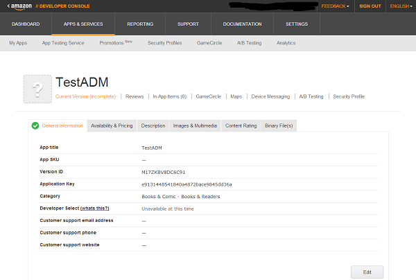
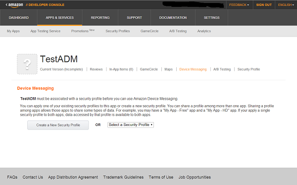
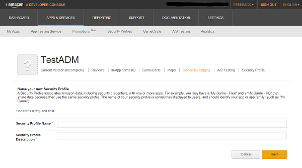
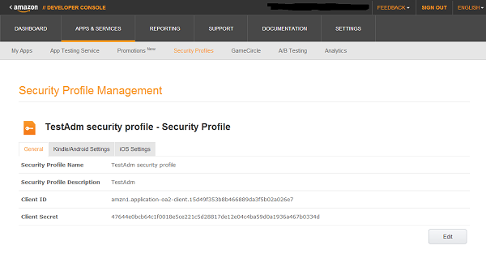
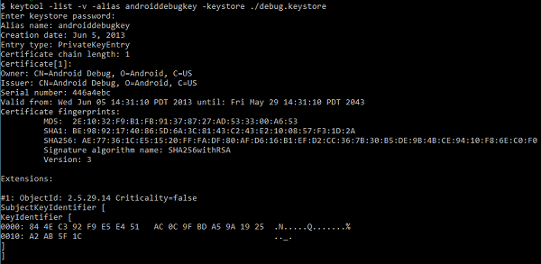
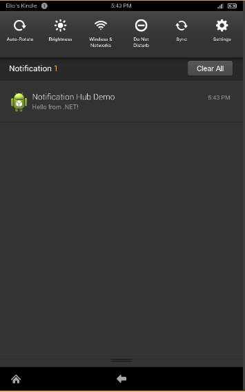

<properties linkid="develop-notificationhubs-tutorials-get-started-kindle" urlDisplayName="Get Started" pageTitle="Get Started with Azure Notification Hubs" metaKeywords="" description="Learn how to use Azure Notification Hubs to send push notifications." metaCanonical="" services="notification-hubs" documentationCenter="Mobile" title="Get started with Notification Hubs" authors="sethm" solutions="" manager="dwrede" editor="" />

Erste Schritte mit Benachrichtigungshubs
========================================

[Windows Store C\#](/de-de/manage/services/notification-hubs/getting-started-windows-dotnet "Windows Store C#")[Windows Phone](/de-de/documentation/articles/notification-hubs-windows-phone-get-started/ "Windows Phone")[iOS](/de-de/documentation/articles/notification-hubs-ios-get-started/ "iOS")[Android](/de-de/documentation/articles/notification-hubs-android-get-started/ "Android")[Kindle](/de-de/documentation/articles/notification-hubs-kindle-get-started/ "Kindle")[Xamarin.iOS](/de-de/documentation/articles/partner-xamarin-notification-hubs-ios-get-started/ "Xamarin.iOS")[Xamarin.Android](/de-de/documentation/articles/partner-xamarin-notification-hubs-android-get-started/ "Xamarin.Android")

In diesem Thema wird gezeigt, wie Sie mit Azure Benachrichtigungshubs Pushbenachrichtigungen an eine Kindle-Anwendung senden können. In diesem Lernprogramm erstellen Sie eine leere Kindle-App, die Pushbenachrichtigungen über Google Cloud Messaging (GCM) empfängt.

Für dieses Lernprogramm ist Folgendes erforderlich:

-   Das Android-SDK (es wird davon ausgegangen, dass Sie Eclipse verwenden), das Sie [hier](http://go.microsoft.com/fwlink/?LinkId=389797) herunterladen können.
-   Befolgen Sie [diese](https://developer.amazon.com/appsandservices/resources/development-tools/ide-tools/tech-docs/01-setting-up-your-development-environment) Schritte zum Einrichten Ihrer Entwicklungsumgebung für Kindle.

Hinzufügen einer neuen App zum Entwicklerportal
-----------------------------------------------

1.  Erstellen Sie zuerst eine App im [Entwicklerportal](https://developer.amazon.com/home.html).

    

2.  Kopieren Sie den **Anwendungsschlüssel**.

    

3.  Klicken Sie im Portal auf den Namen der App und dann auf die Registerkarte **Device Messaging**.

    

4.  Klicken Sie auf **Create a New Security Profile**, und erstellen Sie ein neues Sicherheitsprofil (z. B. **TestAdm Sicherheitsprofil**). Klicken Sie anschließend auf **Save**.

    

5.  Klicken Sie auf "Security Profiles", um das soeben erstellte Sicherheitsprofil anzuzeigen. Kopieren Sie die Werte für **Client ID** und **Client Secret** zur späteren Verwendung.

    

Erstellen eines API-Schlüssels
------------------------------

1.  Öffnen Sie eine Eingabeaufforderung mit Administratorberechtigungen.
2.  Navigieren Sie zum Android SDK-Ordner.
3.  Geben Sie den folgenden Befehl ein:

    keytool -list -v -alias androiddebugkey -keystore ./debug.keystore

    

4.  Geben Sie als **keystore**-Kennwort **android** ein.

5.  Kopieren Sie den **MD5**-Fingerabdruck.
6.  Klicken Sie im Entwicklerportal auf der Registerkarte **Messaging** auf **Android/Kindle**, und geben Sie den Paketnamen für Ihre App ein (z. B. **com.sample.notificationhubtest**), den Wert für **MD5**, und klicken Sie dann auf **Generate API Key**.

Hinzufügen von Anmeldeinformationen zum Hub
-------------------------------------------

Geben Sie im Portal den geheimen Clientschlüssel und die Client-ID in die Registerkarte **Configure** des Benachrichtigungshubs ein.

Einrichten der Anwendung
------------------------

**Hinweis**

Verwenden Sie beim Erstellen einer Anwendung mindestens API-Level 17.

Fügen Sie die ADM-Bibliotheken zum Eclipse-Projekt hinzu.

1.  Um die ADM-Bibliothek zu erhalten, [laden Sie das SDK herunter](https://developer.amazon.com/public/resources/development-tools/sdk). Extrahieren Sie die SDK-ZIP-Datei.
2.  Klicken Sie in Eclipse mit der rechten Maustaste auf das Projekt, und klicken Sie dann auf **Properties**. Wählen Sie den **Java Build Path** auf der linken Seite, und klicken Sie oben auf die Registerkarte **Libraries \*\*. Klicken Sie auf \*\*Add External Jar**, und wählen Sie die Datei `\SDK\Android\DeviceMessaging\lib\amazon-device-messaging-*.jar` aus dem Verzeichnis aus, in das Sie das Amazon-SDK extrahiert haben.
3.  Laden Sie das NotificationHubs Android-SDK (Link) herunter.
4.  Entpacken Sie das Paket, und ziehen Sie die Datei `notification-hubs-sdk.jar` in den Ordner `libs `in Eclipse.

Bearbeiten Sie Ihr App-Manifest zur Unterstützung von ADM:

1.  Fügen Sie den Amazon-Namespace in das Manifest-Stammelement ein:

         xmlns:amazon="http://schemas.amazon.com/apk/res/android"

2.  Fügen Sie Berechtigungen als erstes Element unter dem Manifestelement hinzu. Ersetzen Sie **[IHR PAKETNAME]** durch das Paket, das Sie zum Erstellen der App verwendet haben.

         <permission android:name="[IHR PAKETNAME].permission.RECEIVE_ADM_MESSAGE"
          android:protectionLevel="signature" />

         <uses-permission android:name="android.permission.INTERNET" />

         <uses-permission android:name="[IHR PAKETNAME].permission.RECEIVE_ADM_MESSAGE" />
         
         <!-- Mit dieser Berechtigung erhält die App Zugriff auf den Empfang von
         Pushbenachrichtigungen von ADM. -->
         <uses-permission android:name="com.amazon.device.messaging.permission.RECEIVE" />
         
         <!-- ADM verwendet WAKE_LOCK, um zu verhindern, dass der Prozess beim Empfang von Meldungen pausiert. -->
         <uses-permission android:name="android.permission.WAKE_LOCK"/>

3.  Fügen Sie das folgende Element als erstes untergeordnetes Element des Anwendungselements ein. Ersetzen Sie **[IHR DIENSTNAME]** durch den Namen des ADM-Meldungshandlers, den Sie im nächsten Abschnitt erstellen (einschließlich Paket), und ersetzen Sie **[IHR PAKETNAME]** durch den Namen des Pakets, mit dem Sie Ihre App erstellt haben.

         <amazon:enable-feature
               android:name="com.amazon.device.messaging"
                      android:required="true"/>
         <service android:name="[IHR DIENSTNAME]"
             android:exported="false" />
             
         <receiver android:name="[IHR DIENSTNAME]$Receiver"
             
             <!-- Diese Berechtigung stellt sicher, dass nur ADM Ihre App-Registrierungs-Broadcasts senden kann. -->
             android:permission="com.amazon.device.messaging.permission.SEND" >
             
             <!-- Zur Interaktion mit ADM muss Ihre App folgende Absichten überwachen. -->
             <intent-filter>
           <action android:name="com.amazon.device.messaging.intent.REGISTRATION" />
           <action android:name="com.amazon.device.messaging.intent.RECEIVE" />
             
           <!-- Ersetzen Sie den Namen im Kategorie-Tag durch den Paketnamen der App. -->
           <category android:name="[IHR PAKETNAME]" />
             </intent-filter>
         </receiver>

Erstellen des ADM-Meldungshandlers:
-----------------------------------

1.  Erstellen Sie eine neue Klasse als Erbe von `com.amazon.device.messaging.ADMMessageHandlerBase`, und nennen Sie sie `MyADMMessageHandler`, wie in der folgenden Abbildung gezeigt:

    

2.  Fügen Sie die folgenden `import`-Anweisungen hinzu:

        import android.app.NotificationManager;
         import android.app.PendingIntent;
         import android.content.Context;
         import android.content.Intent;
         import android.support.v4.app.NotificationCompat;
         import com.amazon.device.messaging.ADMMessageReceiver;
         import com.microsoft.windowsazure.messaging.NotificationHub

3.  Fügen Sie den folgenden Code zur soeben erstellten Klasse hinzu. Ersetzen Sie den Hubnamen und die Verbindungszeichenfolge (Überwachung):

        public static final int NOTIFICATION_ID = 1;
         private NotificationManager mNotificationManager;
         NotificationCompat.Builder builder;

    private static NotificationHub hub;

         public static NotificationHub getNotificationHub(Context context) {
             Log.v("com.wa.hellokindlefire", "getNotificationHub");
             if (hub == null) {
                 hub = new NotificationHub("[hub name]", "[listen connection string]", context);
             }
             return hub;
         }

         public MyADMMessageHandler() {
                 super("MyADMMessageHandler");
             }

             public static class Receiver extends ADMMessageReceiver

    	{

                 public Receiver()
                {
                    super(MyADMMessageHandler.class);
                }

    	}

             private void sendNotification(String msg) {
                 Context ctx = getApplicationContext();
            
                 mNotificationManager = (NotificationManager)
                    ctx.getSystemService(Context.NOTIFICATION_SERVICE);

            PendingIntent contentIntent = PendingIntent.getActivity(ctx, 0,
                new Intent(ctx, MainActivity.class), 0);

            NotificationCompat.Builder mBuilder =
                new NotificationCompat.Builder(ctx)
                .setSmallIcon(R.drawable.ic_launcher)
                .setContentTitle("Notification Hub Demo")
                .setStyle(new NotificationCompat.BigTextStyle()
                          .bigText(msg))
                .setContentText(msg);

            mBuilder.setContentIntent(contentIntent);
            mNotificationManager.notify(NOTIFICATION_ID, mBuilder.build());
         }

4.  Fügen Sie den folgenden Code zur `OnMessage()`-Methode hinzu:

         String nhMessage = intent.getExtras().getString("msg");
         sendNotification(nhMessage);

5.  Fügen Sie den folgenden Code zur `OnRegistered`-Methode hinzu:

          try {
         getNotificationHub(getApplicationContext()).register(registrationId);
             } catch (Exception e){
         Log.e("[Ihr Paketname]", "Fail onRegister: " + e.getMessage(), e);
             }

6.  Fügen Sie den folgenden Code zur `OnUnregistered`-Methode hinzu:

          try {
                getNotificationHub(getApplicationContext()).unregister();
            } catch (Exception e){
                Log.e("[Ihr Paketname]", "Fail onUnregister: " + e.getMessage(), e);
            }

7.  Fügen Sie anschließend in der `MainActivity`-Methode die folgende Import-Anweisung ein:

         import com.amazon.device.messaging.ADM;             

8.  Fügen Sie nun am Ende der `OnCreate`-Methode folgenden Code hinzu:

         final ADM adm = new ADM(this);
         if (adm.getRegistrationId() == null)
         {
            adm.startRegister();
         } else {
             new AsyncTask() {
                   @Override
                   protected Object doInBackground(Object... params) {
                      try {                      MyADMMessageHandler.getNotificationHub(getApplicationContext()).register(adm.getRegistrationId());
                      } catch (Exception e){
                         Log.e("com.wa.hellokindlefire", "Hub-Registrierung fehlgeschlagen", e);
                         return e;
                      }
                      return null;
                  }
                }.execute(null, null, null);
         }

Hinzufügen Ihres API-Schlüssels zur App
---------------------------------------

1.  Erstellen Sie in Eclipse eine neue Datei namens **api\_key.txt** im Verzeichnisobjekt des Projekts.
2.  Öffnen Sie die Datei, und kopieren Sie den **API-Schlüssel**, den Sie im Amazon-Entwicklerportal generiert haben.

Ausführen der App
-----------------

1.  Starten Sie den Emulator.
2.  Streifen Sie im Emulator nach unten, und klicken Sie auf **Einstellungen** und anschließend auf **Mein Konto**, und registrieren Sie sich mit einem Amazon-Konto.
3.  Führen Sie die App in Eclipse aus.

**Hinweis**

Falls Probleme auftreten, überprüfen Sie die Uhrzeit des Emulators (oder des Geräts). Die Uhrzeit muss stimmen. Um die Uhrzeit des Kindle-Emulators zu ändern, können Sie folgenden Befehl aus dem Tools-Verzeichnis der Android SDK-Plattform ausführen:

     adb shell  date -s "yyyymmdd.hhmmss"

Senden einer Nachricht
----------------------

So senden Sie eine Nachricht mit .NET:

    static void Main(string[] args)
        {
            NotificationHubClient hub = NotificationHubClient.CreateClientFromConnectionString("[conn string]", "[hub name]");

            hub.SendAdmNativeNotificationAsync("{static void Main(string[] args)
        {
            NotificationHubClient hub = NotificationHubClient.CreateClientFromConnectionString("[conn string]", "[hub name]");

            hub.SendAdmNativeNotificationAsync("{\"data\":{\"msg\" : \"Hello from .NET!\"}}").Wait();
        }

