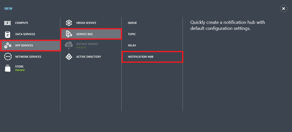
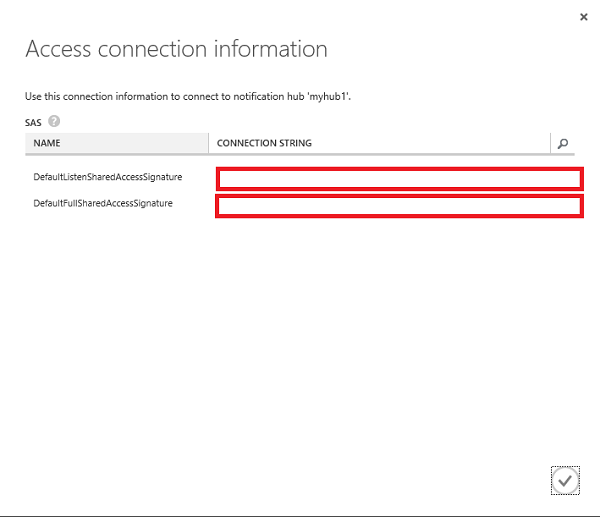

<properties linkid="develop-notificationhubs-tutorials-get-started-windowsphone" urlDisplayName="Get Started" pageTitle="Get Started with Azure Notification Hubs" metaKeywords="" description="Learn how to use Azure Notification Hubs to push notifications." metaCanonical="" services="notification-hubs" documentationCenter="Mobile" title="Get started with Notification Hubs" authors="elioda" solutions="" manager="" editor="" />

Erste Schritte mit Benachrichtigungshubs
========================================

[Windows Store C#](/de-de/manage/services/notification-hubs/getting-started-windows-dotnet "Windows Store C#")[Windows Phone](/de-de/documentation/articles/notification-hubs-windows-phone-get-started/ "Windows Phone")[iOS](/de-de/documentation/articles/notification-hubs-ios-get-started/ "iOS")[Android](/de-de/documentation/articles/notification-hubs-android-get-started/ "Android")[Kindle](/de-de/documentation/articles/notification-hubs-kindle-get-started/ "Kindle")[Xamarin.iOS](/de-de/documentation/articles/partner-xamarin-notification-hubs-ios-get-started/ "Xamarin.iOS")[Xamarin.Android](/de-de/documentation/articles/partner-xamarin-notification-hubs-android-get-started/ "Xamarin.Android")

In diesem Thema wird gezeigt, wie Sie mit Azure Benachrichtigungshubs Pushbenachrichtigungen an eine Windows Phone 8-Anwendung senden können. In diesem Lernprogramm erstellen Sie eine leere Windows Phone 8-App, die Pushbenachrichtigungen mithilfe des Microsoft-Pushbenachrichtigungsdienst (MPNS) erhält. Sobald Sie dieses Lernprogramm abgeschlossen haben, können Sie über Ihren Benachrichtigungshub Pushbenachrichtigungen an alle Geräte senden, die Ihre App ausführen.

In diesem Lernprogramm werden die folgenden Schritte zur Aktivierung von Pushbenachrichtigungen behandelt:

1.  [Erstellen Ihres Benachrichtigungshubs](#configure-hub)
2.  [Verbinden Ihrer App mit dem Benachrichtigungshub](#connecting-app)
3.  [Senden von Benachrichtigungen von Ihrem Back-End aus](#send)

Das Lernprogramm zeigt ein einfaches Übertragungsszenario mithilfe von Benachrichtigungshubs. Bearbeiten Sie auch das nachfolgende Lernprogramm, um mehr über die Verwendung von Benachrichtigungshubs zur Adressierung von speziellen Benutzern und Gerätegruppen zu erfahren. Für dieses Lernprogramm ist Folgendes erforderlich:

-   [Visual Studio 2012 Express für Windows Phone](https://go.microsoft.com/fwLink/p/?LinkID=268374) oder eine höhere Version

Das Abschließen dieses Lernprogramms ist eine Voraussetzung für alle anderen Benachrichtigungshubs-Lernprogramme für Windows Phone 8-Apps.

**Hinweis**

Sie benötigen ein aktives Azure-Konto, um dieses Lernprogramm abzuschließen. Wenn Sie über kein Konto verfügen, können Sie in nur wenigen Minuten ein kostenloses Testkonto erstellen. Weitere Informationen finden Sie unter [Kostenloses Azure-Testkonto](http://www.windowsazure.com/de-de/pricing/free-trial/?WT.mc_id=A0E0E5C02&returnurl=http%3A%2F%2Fwww.windowsazure.com%2Fen-us%2Fdevelop%2Fmobile%2Ftutorials%2Fget-started%2F).

Erstellen Ihres BenachrichtigungshubsErstellen Ihres Benachrichtigungshubs
--------------------------------------------------------------------------

1.  Melden Sie sich beim [Azure Verwaltungsportal](https://manage.windowsazure.com/) an, klicken Sie im unteren Bereich des Bildschirms auf **+NEU**.

2.  Klicken Sie auf **App-Dienste**, dann auf **Service Bus**, **Benachrichtigungshub** und **Schnellerfassung**.

   	

3.  Geben Sie einen Namen für Ihren Benachrichtigungshub ein, wählen Sie Ihre gewünschte Region aus, und klicken Sie dann auf **Create a new Notification Hub**.

   	

4.  Klicken Sie auf den soeben erstellen Namespace (für gewöhnlich ***Name des Benachrichtigungshubs*-ns**), und klicken Sie anschließend oben auf die Registerkarte **Konfigurieren**.

   	

5.  Klicken Sie oben auf die Registerkarte **Benachrichtigungshubs** und dann auf den soeben erstellen Benachrichtigungshub.

   	

6.  Klicken Sie unten auf **Verbindungsinformationen**. Notieren Sie sich die beiden Verbindungszeichenfolgen.

   	

7.  Klicken Sie auf die Registerkarte **Konfigurieren** und dann im Abschnitt **Windows Phone notifications settings** auf das Kontrollkästchen **Enable unauthenticated push notifications**.

   	

Nun verfügen Sie über die Verbindungszeichenfolgen, die Sie zum Registrieren Ihrer Windows Phone 8-App und zum Senden von Benachrichtigungen benötigen.

**Hinweis**

Dieses Lernprogramm verwendet MPNS im nicht authentifizierten Modus. Im nicht authentifizierten MPNS-Modus liegen Einschränkungen für Benachrichtigungen vor, die Sie an jeden Kanal senden können. Benachrichtigungshubs unterstützen den [authentifizierten MPNS-Modus](http://msdn.microsoft.com/de-de/library/windowsphone/develop/ff941099(v=vs.105).aspx).

Verbinden Ihrer AppVerbinden Ihrer App mit dem Benachrichtigungshub
-------------------------------------------------------------------

1.  Erstellen Sie in Visual Studio eine neue Windows Phone 8-Anwendung.

   	

2.  Fügen Sie mithilfe des [WindowsAzure.Messaging.Managed NuGet-Pakets](http://nuget.org/packages/WindowsAzure.Messaging.Managed/) eine Referenz zur Azure Messaging-Bibliothek für Windows Store hinzu. Klicken Sie im Visual Studio-Menü auf **Tools**, **Library Package Manager** und dann auf **Paket-Managerkonsole**. Geben Sie dann folgenden Code in das Konsolenfenster ein:

		Install-Package WindowsAzure.Messaging.Managed

    Drücken Sie die Eingabetaste.

3.  Öffnen Sie die Datei "App.xaml.cs", und fügen Sie die folgenden `using`-Anweisungen hinzu:

		using Microsoft.Phone.Notification;
		using Microsoft.WindowsAzure.Messaging;

4.  Fügen Sie den folgenden Code oben in der Methode **Application_Launching** in App.xaml.cs ein:

		var channel = HttpNotificationChannel.Find("MyPushChannel");
		if (channel == null)
		{
			channel = new HttpNotificationChannel("MyPushChannel");
			channel.Open();
			channel.BindToShellToast();
		}

		channel.ChannelUriUpdated += new EventHandler<NotificationChannelUriEventArgs>(async (o, args) =>
		{
			var hub = new NotificationHub("<hub name>", "<connection string>");
			await hub.RegisterNativeAsync(args.ChannelUri.ToString());
		});

    Stellen Sie sicher, dass Sie den Namen des Hubs und die Verbindungszeichenfolge **DefaultListenSharedAccessSignature** einfügen, die Sie im vorigen Abschnitt erhalten haben. Dieser Code ruft die Kanal-URI für die App von MPNS ab und registriert dann diese Kanal-URI bei Ihrem Benachrichtigungshub. Er sorgt außerdem dafür, dass die Kanal-URI in Ihrem Benachrichtigungshub registriert ist, sobald die Anwendung gestartet wird.

    **Hinweis**

    Dieses Lernprogramm sendet eine Popupbenachrichtigung an das Gerät. Wenn Sie eine Kachelbenachrichtigung senden, müssen Sie stattdessen die **BindToShellTile**-Methode für den Kanal aufrufen. Um Popup- und Kachelbenachrichtigungen zu unterstützen, rufen Sie beide Methoden, **BindToShellTile** und **BindToShellToast**, auf.

5.  Erweitern Sie im Projektmappen-Explorer **Eigenschaften**, öffnen Sie die Datei "WMAppManifest.xml", klicken Sie auf die Registerkarte **Funktionen**, und aktivieren Sie die Funktion **ID__CAP__PUSH_NOTIFICATION**.

   	

   	Damit stellen Sie sicher, dass Ihre App Pushbenachrichtigungen empfangen kann.

6.  Drücken Sie die Taste **F5**, um die App auszuführen.

Senden einer BenachrichtigungSenden einer Benachrichtigung von Ihrem Back-End aus
---------------------------------------------------------------------------------

Sie können Benachrichtigungen mit Benachrichtigungshubs von jedem beliebigen Back-End aus mithilfe der [REST-Schnittstelle](http://msdn.microsoft.com/de-de/library/windowsazure/dn223264.aspx) senden. Dieses Lernprogramm sendet Benachrichtigungen mit einer .NET-Konsolenanwendung und mit einem Mobile Service mithilfe eines Knotenskripts.

Senden von Benachrichtigungen mit einer .NET-App:

1.  Erstellen einer neuen Visual C#-Konsolenanwendung:

   	

2.  Fügen Sie mithilfe des [WindowsAzure.ServiceBus NuGet-Pakets](http://nuget.org/packages/WindowsAzure.ServiceBus/) eine Referenz zum Windows Azure Service Bus-SDK hinzu. Klicken Sie im Visual Studio-Hauptmenü auf **Tools**, **Library Package Manager** und dann auf **Paket-Managerkonsole**. Geben Sie dann folgenden Code in das Konsolenfenster ein:

		Install-Package WindowsAzure.ServiceBus

    Drücken Sie die Eingabetaste.

3.  Öffnen Sie die Datei "Program.cs", und fügen Sie die folgende `using`-Anweisung hinzu:

		using Microsoft.ServiceBus.Notifications;

4.  Fügen Sie in Ihrer Klasse `Program` die folgende Methode hinzu:

		private static async void SendNotificationAsync()
		{
			NotificationHubClient hub = NotificationHubClient.CreateClientFromConnectionString("<connection string with full access>", "<hub name>");
			string toast = "<?xml version=\"1.0\" encoding=\"utf-8\"?>" +
				"<wp:Notification xmlns:wp=\"WPNotification\">" +
					"<wp:Toast>" +
						"<wp:Text1>Hello from a .NET App!</wp:Text1>" +
					"</wp:Toast> " +
				"</wp:Notification>";
			await hub.SendMpnsNativeNotificationAsync(toast);
		}

    Stellen Sie sicher, dass Sie den Namen Ihres Hubs einfügen und die Verbindungszeichenfolge namens DefaultFullSharedAccessSignature, die Sie im Abschnitt "Konfigurieren Ihres Benachrichtigungshubs" erhalten haben. Beachten Sie, dass dies die Verbindungszeichenfolge mit Vollzugriff und nicht mit Abhörzugriff ist.

5.  Fügen Sie dann die folgende Zeile zu Ihrer Main-Methode hinzu:

		SendNotificationAsync();
		Console.ReadLine();

6.  Drücken Sie die Taste **F5**, um die App auszuführen. Sie sollten dann eine Popupbenachrichtigung erhalten. Stellen Sie sicher, dass Ihr Windows Phone-Emulator ausgeführt wird und Ihre App geschlossen ist.

Sie finden alle möglichen Nutzlasten auf MSDN im [Toast-Katalog](http://msdn.microsoft.com/de-de/library/windowsphone/develop/jj662938(v=vs.105).aspx) und im [Kachelkatalog](http://msdn.microsoft.com/de-de/library/windowsphone/develop/hh202948(v=vs.105).aspx).

Nächste Schritte
----------------

In diesem einfachen Beispiel übertragen Sie Benachrichtigungen an all Ihre Windows Phone 8-Geräte. Informationen zum Adressieren bestimmter Benutzer finden Sie in dem Lernprogramm [Benachrichtigen von Benutzern mit Benachrichtigungshubs](/de-de/manage/services/notification-hubs/notify-users-aspnet). Wenn Sie Ihre Benutzer in Interessengruppen einteilen möchten, finden Sie unter [Verwenden von Benachrichtigungshubs zum Übermitteln von Nachrichten](/de-de/manage/services/notification-hubs/breaking-news-dotnet) weitere Informationen. Weitere Informationen zur Verwendung von Benachrichtigungshubs finden Sie in der [Benachrichtigungshubs-Anleitung](http://msdn.microsoft.com/de-de/library/jj927170.aspx).

