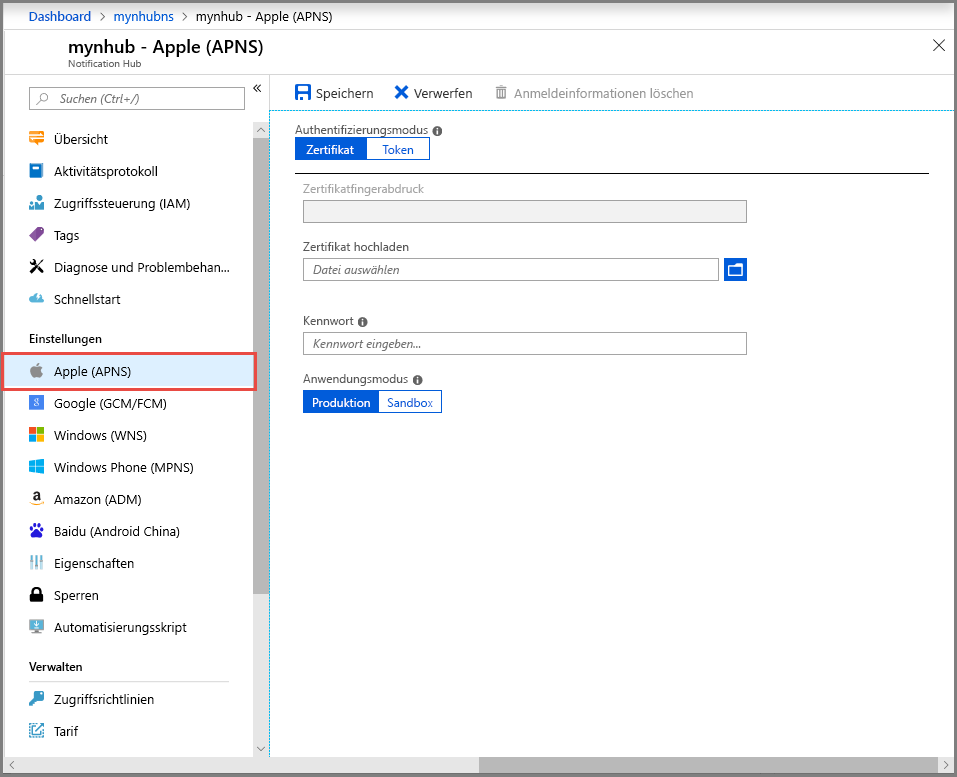

# Konfigurieren von Apple Push Notification Service-Einstellungen (APNS) für einen Notification Hub im Azure-Portal
In diesem Artikel wird gezeigt, wie Sie Apple Push Notification Service-Einstellungen (APNS) für einen Azure Notification Hub über das Azure-Portal konfigurieren. 

## Voraussetzungen
Wenn Sie noch keinen Notification Hub erstellt haben, erstellen Sie ihn jetzt. Weitere Informationen finden Sie unter [Erstellen einer Azure Notification Hub-Instanz über das Azure-Portal](create-notification-hub-portal.md). 

## Konfigurieren von Apple Push Notification Service

Die folgende Vorgehensweise beschreibt die Schritte zum Konfigurieren der Apple Push Notification Service-Einstellungen (APNS) für einen Notification Hub:

1. Wählen Sie im Azure-Portal auf der Seite **Notification Hub** im Menü auf der linken Seite die Option **Apple (APNS)** aus.

1. Wählen Sie für **Authentifizierungsmodus** entweder **Zertifikat** oder **Token** aus.

   a. Wenn Sie **Zertifikat** auswählen:
   * Wählen Sie das Dateisymbol und anschließend die hochzuladende *P12*-Datei aus.
   * Geben Sie ein Kennwort ein.
   * Wählen Sie den Modus **Sandbox** aus. Alternativ können Sie den Modus **Produktion** auswählen, um Pushbenachrichtigungen an Benutzer zu senden, die Ihre App im Store erworben haben.

     

   b. Wenn Sie **Token** auswählen:

   * Geben Sie die Werte für **Schlüssel-ID**, **Bündel-ID**, **Team-ID** und **Token** ein.
   * Wählen Sie den Modus **Sandbox** aus. Alternativ können Sie den Modus **Produktion** auswählen, um Pushbenachrichtigungen an Benutzer zu senden, die Ihre App im Store erworben haben.

     

## Nächste Schritte
Ein Tutorial mit Schrittanleitungen zum Pushen von Benachrichtigungen an iOS-Geräte finden Sie im folgenden Artikel: [Senden von Pushbenachrichtigungen an iOS-Apps mit Azure Notification Hubs](notification-hubs-ios-apple-push-notification-apns-get-started.md)
