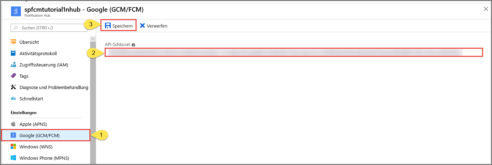
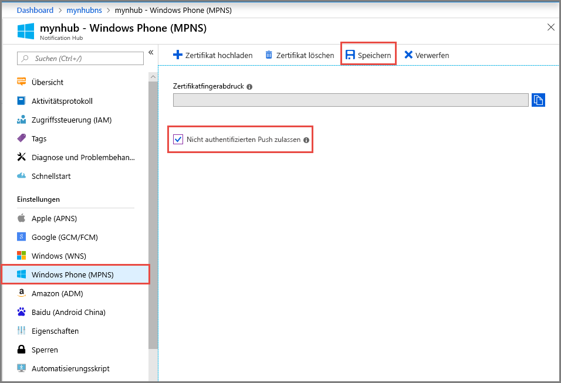

# Konfigurieren von Azure Notification Hubs mit Einstellungen des Plattformbenachrichtigungssystems über das Azure-Portal 
Azure Notification Hubs bietet ein benutzerfreundliches, horizontal skalierbares Pushmodul, mit dem Sie von einem beliebigen Back-End (cloudbasiert oder lokal) Benachrichtigungen an sämtliche Plattformen (iOS, Android, Windows, Kindle, Baidu usw.) senden können. Weitere Informationen zu diesem Dienst finden Sie unter [Was ist Azure Notification Hubs?](notification-hubs-push-notification-overview.md).

[Erstellen Sie über das Azure-Portal einen Azure Notification Hub](create-notification-hub-portal.md), sofern Sie noch keinen erstellt haben. In dieser Schnellstartanleitung erfahren Sie, wie Sie im Azure-Portal einen Notification Hub mit Einstellungen des Plattformbenachrichtigungssystems (Platform Notification System, PNS) konfigurieren.

## Apple Push Notification Service (APNS)
1. Wählen Sie im Azure-Portal auf der Seite **Notification Hub** im Menü auf der linken Seite unter **Einstellungen** die Option **Apple (APNS)** aus.
2. Gehen Sie bei Verwendung der Option **Zertifikat** wie folgt vor:
    1. Wählen Sie das **Ordnersymbol** und anschließend die hochzuladende P12-Datei**** aus. 
    2. Geben Sie das **Kennwort** an.
    3. Wählen Sie den Modus **Sandbox** aus. Wählen Sie den Modus **Produktion** nur dann, wenn Sie Pushbenachrichtigungen an Benutzer senden möchten, die Ihre App im Store erworben haben.

        
3. Gehen Sie bei Verwendung der Option **Token** wie folgt vor: 
    1. Geben Sie die Werte für **Schlüssel-ID**, **Bündel-ID**, **Team-ID** und **Token** ein.
    2. Wählen Sie den Modus **Sandbox** aus. Wählen Sie den Modus **Produktion** nur dann, wenn Sie Pushbenachrichtigungen an Benutzer senden möchten, die Ihre App im Store erworben haben.

        

Ein umfassendes Tutorial zum Pushen von Benachrichtigungen an iOS-Geräte unter Verwendung von Azure Notification Hubs und Apple Push Notification Service (APNS) finden Sie [hier](notification-hubs-ios-apple-push-notification-apns-get-started.md).

## Google Firebase Cloud Messaging (FCM)
1. Wählen Sie im Azure-Portal auf der Seite **Notification Hub** im Menü auf der linken Seite unter **Einstellungen** die Option **Google (GCM/FCM)** aus. 
2. Fügen Sie den **Serverschlüssel** für das FCM-Projekt ein, den Sie zuvor gespeichert haben. 
3. Wählen Sie auf der Symbolleiste **Speichern** aus. 

    
4. In den Warnungen wird eine Meldung angezeigt, dass die Notification Hubs aktualisiert wurden. Die Schaltfläche **Save** (Speichern) ist deaktiviert. 

Ein umfassendes Tutorial zum Pushen von Benachrichtigungen an Android-Geräte unter Verwendung von Azure Notification Hubs und Google Firebase Cloud Messaging finden Sie [hier](notification-hubs-android-push-notification-google-fcm-get-started.md).

## Windows-Pushbenachrichtigungsdienst (Windows Push Notification Service, WNS)
1. Wählen Sie im Azure-Portal auf der Seite **Notification Hub** im Menü auf der linken Seite unter **Einstellungen** die Option **Windows (WNS)** aus.
2. Geben Sie Werte für **Paket-SID** und **Sicherheitsschlüssel** ein.
3. Wählen Sie auf der Symbolleiste **Speichern** aus.

    

Ein umfassendes Tutorial zum Pushen von Benachrichtigungen an eine auf einem Windows-Gerät ausgeführte UWP-App (Universelle Windows-Plattform) finden Sie [hier](notification-hubs-windows-store-dotnet-get-started-wns-push-notification.md).

## Windows Phone – Microsoft-Pushbenachrichtigungsdienst
1. Wählen Sie im Azure-Portal auf der Seite **Notification Hub** unter **Einstellungen** die Option **Windows Phone (MPNS)** aus.
2. Wenn Sie nicht authentifizierte Pushbenachrichtigungen zulassen möchten, aktivieren Sie das Kontrollkästchen **Nicht authentifizierte Pushbenachrichtigungen zulassen**, und wählen Sie anschließend auf der Symbolleiste die Option **Speichern** aus.

    
3. Wenn Sie **authentifizierte** Pushbenachrichtigungen verwenden möchten, gehen Sie wie folgt vor:
    1. Wählen Sie auf der Symbolleiste die Option **Zertifikat hochladen** aus.
    2. Wählen Sie das **Ordnersymbol** und anschließend die Zertifikatdatei aus.
    3. Geben Sie das **Kennwort** für das Zertifikat ein. 
    4. Wählen Sie **OK** aus, um die Seite **Zertifikat hochladen** zu schließen. 
    5. Wählen Sie auf der Seite **Windows Phone (MPNS)** auf der Symbolleiste die Option **Speichern** aus.

Ein umfassendes Tutorial zum Pushen von Benachrichtigungen an eine Windows Phone 8-App unter Verwendung des Microsoft-Pushbenachrichtigungsdiensts (Microsoft Push Notification Service, MPNS) finden Sie [hier](notification-hubs-windows-mobile-push-notifications-mpns.md).
      
## Amazon Device Messaging (ADM)
1. Wählen Sie im Azure-Portal auf der Seite **Notification Hub** im Menü auf der linken Seite unter **Einstellungen** die Option **Amazon (ADM)** aus.
2. Geben Sie Werte für **Client ID** (Client-ID) und **Client Secret** (Geheimer Clientschlüssel) ein.
3. Wählen Sie auf der Symbolleiste **Speichern** aus.
    
    

Ein umfassendes Tutorial zur Verwendung von Azure Notification Hubs-Pushbenachrichtigungen für eine Kindle-Anwendung finden Sie [hier](notification-hubs-kindle-amazon-adm-push-notification.md).

## Baidu (Android China)
1. Wählen Sie im Azure-Portal auf der Seite **Notification Hub** im Menü auf der linken Seite unter **Einstellungen** die Option **Baidu (Android China)** aus. 
2. Geben Sie den **API-Schlüssel** aus der Baidu-Konsole in das Baidu Cloud Push-Projekt ein. 
3. Geben Sie den **geheimen Schlüssel** aus der Baidu-Konsole in das Baidu Cloud Push-Projekt ein. 
4. Wählen Sie auf der Symbolleiste **Speichern** aus. 

    
4. In den Warnungen wird eine Meldung angezeigt, dass die Notification Hubs aktualisiert wurden. Die Schaltfläche **Save** (Speichern) ist deaktiviert. 

Ein umfassendes Tutorial zum Pushen von Benachrichtigungen unter Verwendung von Azure Notification Hubs und Baidu Cloud Push finden Sie [hier](notification-hubs-baidu-china-android-notifications-get-started.md).

## Nächste Schritte
In dieser Schnellstartanleitung haben Sie gelernt, wie Sie im Azure-Portal verschiedene Benachrichtigungssysteme für einen Notification Hub konfigurieren. 

Umfassende Schritt-für-Schritt-Anleitungen zum Pushen von Benachrichtigungen an die verschiedenen Plattformen finden Sie in den Tutorials im Abschnitt **Tutorials**.

- [Tutorial: Senden von Pushbenachrichtigungen an iOS-Apps mit Azure Notification Hubs](notification-hubs-ios-apple-push-notification-apns-get-started.md)
- [Tutorial: Senden von Pushbenachrichtigungen an Android-Geräte mit Azure Notification Hubs und Google Firebase Cloud Messaging](notification-hubs-android-push-notification-google-fcm-get-started.md)
- [Tutorial: Senden von Benachrichtigungen an Apps für die universelle Windows-Plattform mit Azure Notification Hubs](notification-hubs-windows-store-dotnet-get-started-wns-push-notification.md)
- [Tutorial: Senden von Pushbenachrichtigungen an Windows Phone-Apps mit Azure Notification Hubs](notification-hubs-windows-mobile-push-notifications-mpns.md)
- [Erste Schritte mit Notification Hubs für Kindle-Apps](notification-hubs-kindle-amazon-adm-push-notification.md)
- [Erste Schritte mit Notification Hubs mit Baidu](notification-hubs-baidu-china-android-notifications-get-started.md)
