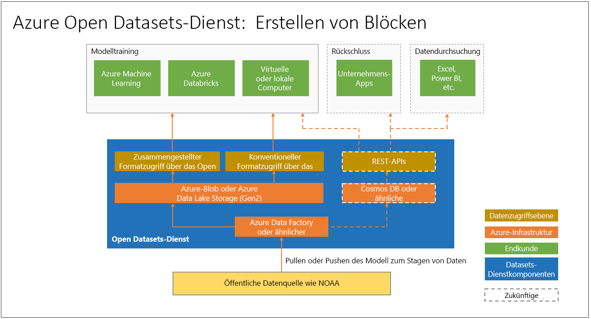

# Was sind öffentliche Azure-Datasets (Vorschauversion), und wie können Sie sie verwenden?

[Öffentliche Azure-Datasets](https://azure.microsoft.com/services/open-datasets/) sind kuratierte öffentliche Datasets, mit denen Sie Lösungen mit maschinellem Lernen szenariospezifische Features hinzufügen können, um genauere Modelle zu erzielen. Öffentliche Datasets befinden sich bei Microsoft Azure in der Cloud und sind für Azure Databricks, Machine Learning Service und Machine Learning Studio jederzeit verfügbar. Sie können auch über APIs auf die Datasets zugreifen und sie in anderen Produkten wie Power BI und Azure Data Factory verwenden.

Die Datasets umfassen gemeinfreie Daten für Wetter, Volkszählungen, Feiertage, öffentliche Sicherheit und Orte, mit denen Sie Machine Learning-Modelle trainieren und Vorhersagelösungen anreichern können. Sie können in den öffentlichen Azure-Datasets auch Ihre eigenen öffentlichen Datasets freigeben. 

## Kuratierte, vorbereitete Datasets
Die kuratierten offenen und öffentlichen Datasets, aus denen sich die öffentlichen Azure-Datasets zusammensetzen, sind für den Gebrauch in Workflows mit maschinellem Lernen optimiert. 

Data Science-Experten verbringen oft den Großteil ihrer Zeit mit dem Bereinigen und Vorbereiten von Daten für komplexe Analysen. Öffentliche Datasets werden in die Azure-Cloud kopiert und vorverarbeitet, um Ihnen Zeit zu sparen. In regelmäßigen Abständen werden Daten aus den Quellen abgerufen, z. B. über eine FTP-Verbindung mit der National Oceanic and Atmospheric Administration (NOAA), in ein strukturiertes Format analysiert und dann mit Features wie Postleitzahlen oder den Standort der nächsten Wetterstation angereichert.

Datasets werden in Azure gemeinsam mit Compute gehostet, um den Zugriff und die Bearbeitung zu vereinfachen.  

Es folgen Beispiele von verfügbaren Datasets. 

### Wetterdaten
 
|Datensatz         | Notebooks     | BESCHREIBUNG                                    |
|----------------|---------------|------------------------------------------------|
|[Integrierte NOAA-Oberflächendaten (ISD)](https://azure.microsoft.com/services/open-datasets/catalog/noaa-integrated-surface-data/) | [Azure Notebooks](https://azure.microsoft.com/services/open-datasets/catalog/noaa-integrated-surface-data/?tab=data-access#AzureNotebooks)   [Azure Databricks](https://azure.microsoft.com/services/open-datasets/catalog/noaa-integrated-surface-data/?tab=data-access#AzureDatabricks) | Weltweite stündliche Wetterdaten von NOAA mit der besten räumlichen Abdeckung in Nordamerika, Europa, Australien und Teilen von Asien. Täglich aktualisiert. |
|[NOAA Global Forecast System (GFS)](https://azure.microsoft.com/services/open-datasets/catalog/noaa-global-forecast-system/) | [Azure Notebooks](https://azure.microsoft.com/services/open-datasets/catalog/noaa-global-forecast-system/?tab=data-access#AzureNotebooks)   [Azure Databricks](https://azure.microsoft.com/services/open-datasets/catalog/noaa-global-forecast-system/?tab=data-access#AzureDatabricks) | Stündliche US-Wettervorhersagedaten von NOAA für 15 Tage. Täglich aktualisiert. |

### Kalenderdaten

|Datensatz         | Notebooks     | BESCHREIBUNG                                    |
|----------------|---------------|------------------------------------------------|
|[Gesetzliche Feiertage](https://azure.microsoft.com/services/open-datasets/catalog/public-holidays/) | [Azure Notebooks](https://azure.microsoft.com/services/open-datasets/catalog/public-holidays/?tab=data-access#AzureNotebooks)   [Azure Databricks](https://azure.microsoft.com/services/open-datasets/catalog/public-holidays/?tab=data-access#AzureDatabricks) | Weltweite Feiertagsdaten für 41 Länder oder Regionen von 1970 bis 2099. Enthält Länder und die Angabe, ob die meisten Einwohner bezahlte Freizeit haben. |

## Zugriff auf Datasets  
Mit einem Azure-Konto können Sie über Code oder über die Azure-Dienstschnittstelle auf öffentliche Datasets zugreifen. Die Daten werden in Azure gemeinsam mit Compute gehostet, damit Sie sie in Ihrer Lösung mit maschinellem Lernen verwenden können.  

Öffentliche Datasets bieten Azure Notebooks und Azure Databricks-Notebooks, mit denen Sie Daten mit Azure Machine Learning Service und Azure Databricks verbinden können. Auch über ein Python-SDK kann auf die Datasets zugegriffen werden. 

Sie benötigen jedoch kein Azure-Konto, um auf öffentliche Datasets zuzugreifen. Die sind aus jeder Python-Umgebung mit oder ohne Spark zugänglich.

## Anfordern von Datasets oder Beitragen zu diesen

Wenn Sie die gewünschten Daten nicht finden können, senden Sie uns eine E-Mail zum [Anfordern eines Datasets](mailto:aod@microsoft.com?Subject=Contribute%20dataset%3A%20%3Creplace%20with%20dataset%20name%3E&Body=%0AYour%20name%20and%20institution%3A%20%0A%0ADataset%20name%3A%0A%20%0ADataset%20description%3A%20%0A%3Cfill%20in%20a%20brief%20description%20and%20share%20any%20web%20links%20of%20the%20dataset%3E%20%0A%0ADataset%20size%3A%20%0A%3Chow%20much%20space%20does%20the%20dataset%20need%20today%20and%20how%20much%20is%20it%20expected%20to%20grow%20each%20year%3E%20%0A%0ADataset%20file%20formats%3A%20%0A%3Ccurrent%20dataset%20file%20formats%2C%20and%20optionally%2C%20any%20formats%20that%20the%20dataset%20must%20be%20transformed%20to%20for%20easy%20access%3E%0A%0ALicense%3A%20%0A%3Cwhat%20is%20the%20license%20or%20terms%20and%20conditions%20governing%20the%20distribution%20of%20this%20dataset%3E%0A%0AUse%20cases%3A%20%0A%3CExplain%20some%20common%20use%20of%20the%20dataset.%20E.g.%20weather%20dataset%20can%20be%20useful%20in%20demand%20forecasting%20and%20predictive%20maintenance%20scenarios%3E%20%0A%0AAny%20additional%20information%20you%20want%20us%20to%20know%3A%0A) oder [Beitragen eines Datasets](mailto:aod@microsoft.com?Subject=Request%20dataset%3A%20%3Creplace%20with%20dataset%20name%3E&Body=%0AYour%20name%20and%20institution%3A%20%0A%0ADataset%20name%3A%0A%20%0ADataset%20description%3A%20%0A%3Cfill%20in%20a%20brief%20description%20and%20share%20any%20web%20links%20of%20the%20dataset%3E%20%0A%0ADataset%20size%3A%20%0A%3Chow%20much%20space%20does%20the%20dataset%20need%20today%20and%20how%20much%20is%20it%20expected%20to%20grow%20each%20year%3E%20%0A%0ADataset%20file%20formats%3A%20%0A%3Ccurrent%20dataset%20file%20formats%2C%20and%20optionally%2C%20any%20formats%20that%20the%20dataset%20must%20be%20transformed%20to%20for%20easy%20access%3E%0A%0ALicense%3A%20%0A%3Cwhat%20is%20the%20license%20or%20terms%20and%20conditions%20governing%20the%20distribution%20of%20this%20dataset%3E%0A%0AUse%20cases%3A%20%0A%3CExplain%20some%20common%20use%20of%20the%20dataset.%20E.g.%20weather%20dataset%20can%20be%20useful%20in%20demand%20forecasting%20and%20predictive%20maintenance%20scenarios%3E%20%0A%0AAny%20additional%20information%20you%20want%20us%20to%20know%3A%0A). 

## Nächste Schritte
* [Beispielnotebook](samples.md)
* [Tutorial: Regressionsmodellierung mit Taxidaten aus New York](tutorial-opendatasets-automl.md)
* [Python-SDK für öffentliche Datasets](https://aka.ms/open-datasets-api)
