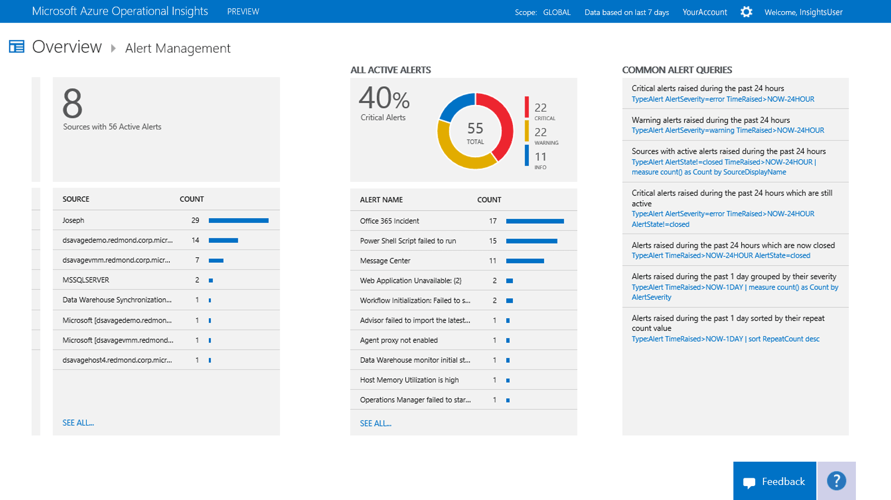

<properties 
   pageTitle="Anzeigen von Warnungen in Operations Manager"
   description="Erhalten Sie Informationen zum Verwalten von Operations Manager-Warnungen für überwachte Servern in Ihrer Infrastruktur"
   services="operational-insights"
   documentationCenter=""
   authors="bandersmsft"
   manager="jwhit"
   editor="tysonn" />
<tags 
   ms.service="operational-insights"
   ms.devlang="na"
   ms.topic="article"
   ms.tgt_pltfrm="na"
   ms.workload="na"
   ms.date="03/20/2015"
   ms.author="banders" />

# Anzeigen von Operations Manager-Warnungen

Bevor Sie Alert Management in Microsoft Azure Operational Insights verwenden können, müssen Sie das Intelligence Pack installiert haben. Weitere Informationen zum Installieren von Intelligence Packs finden Sie unter [Verwenden der Galerie zum Hinzufügen oder Entfernen von Intelligence Packs](operational-insights-add-intelligence-packs.md). Das Intelligence Pack funktioniert nur, wenn Sie Ihre Server mit Operations Manager-Agents überwacht werden. Informationen zur Verwendung von Operations Manager mit Operational Insights finden Sie unter [Sammeln von Computerdaten](operational-insights-collect-data.md).

Nach der Installation des Intelligence Packs können Sie Warnungen für die überwachten Server in Operational Insights über die Kachel **Alert Management** im Dashboard **Übersicht** anzeigen. 

Sie können Microsoft Azure Operational Insights-Warnungen im Dashboard **Warnungen** anzeigen und verwalten. Im Dashboard werden Warnungsinformationen in den folgenden Kategorien angezeigt:

- Aktive Warnungen
	- Kritische Warnungen
	- Warnungen
	- Warnungsquellen
- Alle aktiven Warnungen
	- Zeigt den Prozentsatz der Warnungen an, die kritisch sind oder nur der Warnung bzw. der Information dienen.
- Allgemeine Warnungsabfragen
	- Dieser Bereich enthält vorgefertigte Abfragen, die vom Operational Insights-Softwareentwicklungsteams erstellt wurden, um Ihnen den Einstieg in Warnungen zu erleichtern.

Warnungen zeigen, dass ein Problem erkannt wurde, welcher Server von der Warnung betroffen ist, die Priorität sowie den Namen der Warnung.

Im Dashboard **Alert Management** können Sie alle Warnungen anzeigen, die Microsoft Azure Operational Insights vorgefunden hat.

## So zeigen Sie Operational Insights-Warnungen an

1. Klicken Sie auf der Seite **Übersicht** auf die Kachel **Alert Management**.

2. Zeigen Sie im Dashboard **Alert Management** die Warnungskategorien an, und wählen Sie diejenige aus, mit der Sie arbeiten möchten.

3. Klicken Sie auf eine Kachel oder ein Element, um detaillierte Informationen auf der Seite **Search** anzuzeigen.

4. Anhand der gefundenen Informationen können Sie die Warnung untersuchen und zusätzliche Aktionen ermitteln, die Sie zur Fehlerbehebung durchführen müssen.

<!--HONumber=52-->