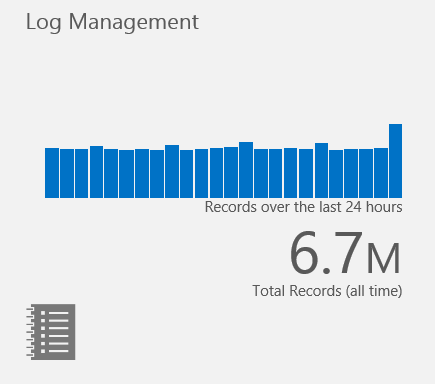
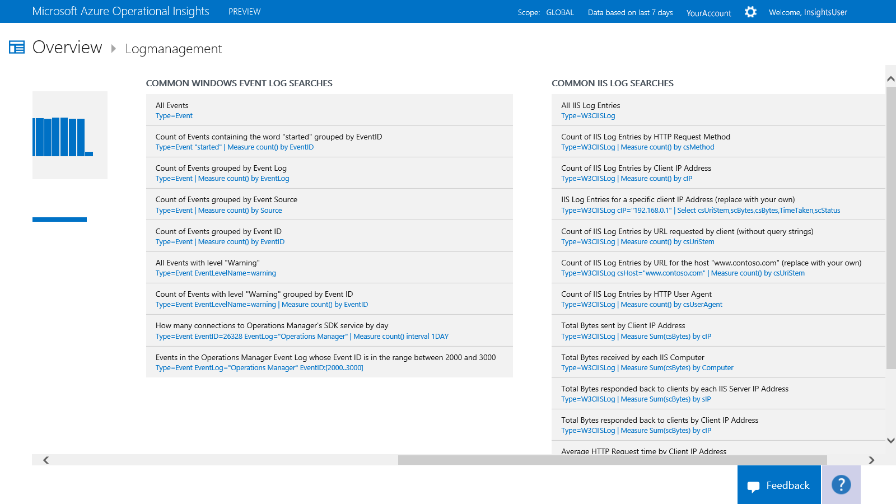

<properties 
   pageTitle="Verwenden von Log Management" 
   description="Mit Log Management in Microsoft Azure Operational Insights können Sie die von den überwachten Servern gesammelte Protokollereignisse anzeigen" 
   services="operational-insights" 
   documentationCenter="" 
   authors="bandersmsft" 
   manager="jwhit" 
   editor=""/>

<tags
   ms.service="operational-insights"
   ms.devlang="na"
   ms.topic="article"
   ms.tgt_pltfrm="na"
   ms.workload="operational-insights" 
   ms.date="03/20/2015"
   ms.author="banders"/>

# Verwenden von Log Management 

Bevor Sie Log Management in Microsoft Azure Operational Insights verwenden können, müssen Sie das Intelligence Pack installiert haben. Da dieses Pack konfiguriert werden muss und standardmäßig nichts sammelt, wird es in jedem neuen Arbeitsbereich standardmäßig aktiviert. Wenn Sie es entfernt haben, können Sie es über die Intelligence Packs-Galerie erneut hinzufügen. Informationen hierzu finden Sie unter [Verwenden der Galerie zum Hinzufügen oder Entfernen von Intelligence Packs](operational-insights-add-intelligence-packs.md). 

Sie können neue Protokolle zum Sammeln von Ereignissen hinzufügen und auswählen, welche Ereignisebenen oder Schweregrade Sie für die Protokolle sammeln möchten.
Nach der Konfiguration von Log Management werden Ihre Richtlinien zur Datensammlung auf untergeordnete Elemente angewendet, und das Sammeln von Ereignissen wird gestartet.
Über die Kachel **Log Management** auf der Seite **Übersicht** in Operational Insights können Sie auf einige erste Aufschlüsselungen der von Ihren überwachten Servern gesammelten Protokollereignisse zugreifen. 

Über die Kachel wird die Seite **Log Management** geöffnet, auf der Sie eine Zusammenfassung der in den Protokollen enthaltenen Ereignisse anzeigen können.
Alternativ dazu können Sie die Suchfunktion, wie bei allen anderen Datentypen, auch direkt verwenden.

Diese Seite enthält die folgenden Kategorien:

- Windows-Ereignisprotokolle
- IIS-Protokolle
- Andere Protokolle, die Sie hinzugefügt haben

## IIS-Protokolldateiformat

Im Moment wird als IIS-Protokollformat nur W3C unterstützt. Dies ist jedoch das gängigste Format und wird standardmäßig in IIS 7 und IIS 8 verwendet. Wenn Sie also im systemeigenen Format von NCSA oder IIS protokollieren, übernimmt Operational Insights diese Protokolle nicht. Selbst im W3C-Format werden Sie feststellen, dass nicht alle Felder standardmäßig protokolliert werden. Weitere Informationen zum Format finden Sie unter [Auswählen von W3C-Feldern für die Protokollierung (IIS 7)](https://technet.microsoft.com/library/cc754702(v=WS.10).aspx). 

> [AZURE.TIPP] Für ein optimales Sucherlebnis empfiehlt es sich, für jede Website alle Felder der Protokollierung über die **Protokollierung** in IIS auszuwählen. Außerdem sollte der Zeitplan **Protokolldateirollover** für neue Protokolle in **Stündlich** geändert werden. Dadurch werden kleinere Dateien in die Cloud hochgeladen, was weniger Bandbreite in Anspruch nimmt.

## Sammeln von Windows-Ereignisprotokollen von Operations Manager oder direkt verbundenen Agents

1. Klicken Sie auf der Seite **Übersicht** auf die Kachel **Log Management**. 

2. Klicken Sie im Dashboard **Log Management** auf die Kachel **Konfigurieren**.
 
3. Geben Sie den Namen des Ereignisprotokolls ein, aus dem Sie Informationen erfassen möchten. Wenn Sie nicht sicher sind, welchen Namen Sie verwenden sollen, wählen Sie in der **Ereignisanzeige** die Eigenschaften des Windows-Ereignisprotokolls aus, kopieren Sie den Namen im Feld **Vollständiger Name**, und fügen Sie diesen in das Feld **Ereignisse aus folgenden Ereignisprotokollen erfassen** ein.

4. Klicken Sie auf **+**, um das Protokoll hinzuzufügen.

5. Wählen Sie die Ereignisebenen oder den Schweregrad aus, die bzw. den Sie für das Protokoll erfassen möchten. **Überwachungserfolg** und **Überwachungsfehler** werden in dieser Version nicht unterstützt.

6. Wiederholen Sie die vorherigen Schritte für jedes Protokoll, aus dem Sie Informationen sammeln möchten, und klicken Sie dann auf **Speichern**.

7. Ereignisse sollten in wenigen Minuten in Operational Insights angezeigt werden, und anschließend können Sie dann die Daten durchsuchen. 

## So sammeln Sie IIS-Protokolle von Operations Manager oder direkt angeschlossenen Agents

1. Klicken Sie auf der Seite **Übersicht** auf die Kachel **Log Management**. 

2. Klicken Sie im Dashboard **Log Management** auf die Kachel **Konfigurieren**.
 
3. Klicken Sie unter **IIS-PROTOKOLLE** auf **Protokolle aus Operations Manager erfassen**.

## Sammeln von IIS-Protokollen und/oder Windows-Ereignissen mit der Azure-Diagnose
Dies kann über das Azure-Verwaltungsportal, nicht +über das Operational Insights-Portal, konfiguriert werden. Wechseln Sie in Ihrem Arbeitsbereich auf die Registerkarte **Storage**. Dort können Sie die Protokollerfassung von diesem Storage-Konto aus aktivieren.

## Arbeiten mit Protokolldateien
 
1. Klicken Sie auf der Seite **Übersicht** auf die Kachel **Log Management**.

2. Zeigen Sie im Dashboard **Log Management** die Ereignisprotokolle an, und wählen Sie eines aus, mit dem Sie arbeiten möchten.
  
3. Klicken Sie auf ein Element, um detaillierte Informationen auf der Seite **Search** anzuzeigen.

4. Sie können von den anfänglichen Ergebnissen aus weitere Suchläufe durchführen und Protokolle dann analysieren und Zusammenhänge herstellen.

 
# Zusätzliche Ressourcen
- [Anforderungen des IIS-Protokollformats in Azure Operational Insights](http://blogs.technet.com/b/momteam/archive/2014/09/19/iis-log-format-requirements-in-system-center-advisor.aspx)
- Sehen Sie sich im [Feedback-Forum](http://feedback.azure.com/forums/267889-azure-operational-insights/category/88086-log-management-and-log-collection-policy) an, welche weiteren Datenquellen und Protokolltypen die Community implementiert haben möchte.

<!--HONumber=52-->