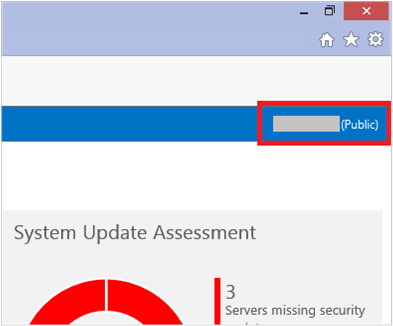
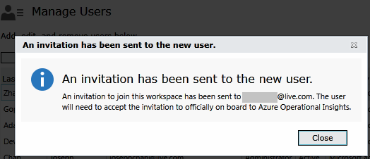

<properties 
    pageTitle="Einrichten Ihres Arbeitsbereichs und Verwalten von Einstellungen" 
    description="Erfahren Sie mehr über das Einrichten Ihres Arbeitsbereichs und das Verwalten von Einstellungen in Microsoft Azure Operational Insights" 
    services="operational-insights" 
    documentationCenter="" 
    authors="bandersmsft" 
    manager="jwhit" 
    editor=""/>

<tags 
    ms.service="operational-insights" 
    ms.workload="operational-insights" 
    ms.tgt_pltfrm="na" 
    ms.devlang="na" 
    ms.topic="article" 
    ms.date="04/30/2015" 
    ms.author="banders"/>

# Einrichten Ihres Arbeitsbereichs und Verwalten von Einstellungen 

[AZURE.INCLUDE [operational-insights-note-moms](../includes/operational-insights-note-moms.md)]

Zum Erstellen eines neuen Microsoft Azure Operational Insights-Arbeitsbereichs wählen Sie einen Arbeitsbereichsnamen, den Sie Ihrem Konto zuordnen, und einen geografischen Standort. Ein Operational Insights-Arbeitsbereich ist im Wesentlichen ein Container, der Kontoinformationen und einfache Konfigurationsinformationen für das Konto enthält. Sie oder andere Mitglieder Ihrer Organisation können mehrere Operational Insights-Arbeitsbereiche nutzen, um unterschiedliche Mengen von Daten zu verwalten, die in Ihrer gesamten IT-Infrastruktur oder Teilen davon gesammelt werden.

Nachdem der Arbeitsbereich erstellt wurde, können Sie andere Aufgaben darin ausführen, z. B. Operational Insights verwalten, Ihre Verwendungsdaten im Dashboard anzeigen, Speicherkonten auswählen, Agents direkt verbinden oder eine Verbindung mit System Center Operations Manager herstellen. Außerdem Sie können die Einstellungen für jeden Arbeitsbereich verwalten.

Um mehr über das Erstellen eines Arbeitsbereichs mithilfe von Azure zu erfahren, sehen sich Sie das folgende Video an:

> [AZURE.VIDEO creating-a-workspace-for-azure-customers-opinsights]

## Wie viele Arbeitsbereiche benötige ich?
Ein Arbeitsbereich wird im Azure-Verwaltungsportal als Azure-Ressource angezeigt.

Sie können entweder einen neuen Arbeitsbereich erstellen oder eine Verknüpfung mit einem aus einer Vorschauversion vorhandenen Arbeitsbereich herstellen, den Sie zuvor für die Verwendung mit System Center Operations Manager geöffnet, aber möglicherweise noch keinem Azure-Abonnement zugeordnet haben (was für die Abrechnung erforderlich ist).
Ein Arbeitsbereich stellt die Ebene dar, auf der Daten gesammelt, aggregiert, analysiert und im Operational Insights-Portal angezeigt werden. 
Sie können nach Wunsch mit mehreren Arbeitsbereichen arbeiten, um Daten aus verschiedenen Umgebungen und Systemen zu trennen. Jede Operations Manager-Verwaltungsgruppe (und alle ihre Agents) oder einzelne VMs/Agents können jeweils mit nur einem Arbeitsbereich verbunden werden.

Jedem Arbeitsbereich können mehrere Benutzerkonten zugeordnet sein, und jedes Benutzerkonto (Microsoft- oder Organisationskonto) hat Zugriff auf mehrere Operational Insights-Arbeitsbereiche.
Standardmäßig wird der Besitzer des Microsoft- oder Organisationskontos, das zum Erstellen des Arbeitsbereichs verwendet wird, zum Administrator des Arbeitsbereichs. Der Administrator kann anschließend zusätzliche Microsoft-Konten einladen oder Benutzer in seinem Azure Active Directory auswählen.

##Verknüpfen eines vorhandenen Arbeitsbereichs mit einem Azure-Abonnement

Es ist möglich, unter [opinsights.azure.com](http://opinsights.azure.com) einen Arbeitsbereich zu erstellen.  Es gelten jedoch bestimmte Grenzwerte für diese Arbeitsbereiche. Der wichtigste bei Verwenden eines kostenlosen Kontos ist die Beschränkung für das Hochladen von Daten auf 500 MB pro Tag.  Um Änderungen für diesen Arbeitsbereich vorzunehmen, müssen Sie **Ihren vorhandenen Arbeitsbereich mit einem Azure-Abonnement verknüpfen**.

>[AZURE.WICHTIG] Damit Sie einen Arbeitsbereich verknüpfen können, muss Ihr Azure-Konto bereits Zugriff auf den Arbeitsbereich haben, zu dem Sie eine Verknüpfung herstellen möchten.  Anders ausgedrückt muss das Konto, das Sie für den Zugriff auf das Azure-Portal verwenden, **identisch** mit dem Konto sein, mit dem Sie auf Ihren Operational Insights-Arbeitsbereich zugreifen. Wenn dies nicht der Fall ist, siehe [Hinzufügen eines Benutzers zu einem vorhandenen Arbeitsbereich](#addusertoexistingworkspace).

1. Melden Sie sich beim Azure-Verwaltungsportal an.
2. Klicken Sie links unten im Portal auf **+ Neu**.
3. Klicken Sie auf **App Services**, führen Sie einen Bildlauf zu **Operational Insights** durch, und wählen Sie diesen Eintrag aus.
4. Klicken Sie auf **Schnellerfassung**.
5. In der Liste **Konto** sollte eine Liste Ihrer vorhandenen Arbeitsbereiche enthalten sein, die noch nicht mit dem Azure-Abonnement verknüpft sind. Wählen Sie ein Konto aus.

	>[AZURE.NOTE] Wenn der Arbeitsbereich, den Sie verknüpfen möchten, hier nicht angezeigt wird, bedeutet dies, dass Ihr Azure-Abonnement keinen Zugriff auf Ihren Operational Insights-Arbeitsbereich hat.  Sie müssen in Ihrem Operational Insights-Arbeitsbereich den Zugriff auf dieses Konto gewähren.  Sehen Sie sich hierfür [Hinzufügen eines Benutzers zu einem vorhandenen Arbeitsbereich](#addusertoexistingworkspace).

6. Füllen Sie die verbleibenden Felder aus, und wählen Sie dann **Arbeitsbereich erstellen** aus.

## Aktualisieren des Arbeitsbereichs auf einen kostenpflichtigen Plan

Es gibt drei Arten von Arbeitsbereichsplänen für Operational Insights: **Kostenlos**, **Standard** und **Premium**.  Wenn Sie mit einem Plan vom Typ "Kostenlos" arbeiten, ist Ihre Datenübertragung auf 500 MB begrenzt.  Sie müssen für den Arbeitsbereich die **nutzungsbasierte Bezahlung** aktivieren, damit Sie Daten über diesen Grenzwert hinaus sammeln können. Sie können Ihren Plantyp jederzeit ändern.  Weitere Informationen zu den Preisen von Operational Insights finden Sie unter [Preisdetails](http://azure.microsoft.com/pricing/operational-insights/).

>[AZURE.WICHTIG] Pläne für Arbeitsbereiche können nur geändert werden, wenn sie mit einem Azure-Abonnement verknüpft sind.  Wenn Sie den Arbeitsbereich in Azure erstellt haben oder bereits eine Verknüpfung mit dem Arbeitsbereich hergestellt haben, können Sie diese Meldung ignorieren.  Wenn Sie den Arbeitsbereich unter [opinsights.azure.com](http://opinsights.azure.com) erstellt haben, müssen Sie die Schritte unter [Verknüpfen eines vorhandenen Arbeitsbereichs mit einem Azure-Abonnement](#linkworkspace) ausführen. 

### Ändern des Plantyps

Navigieren Sie im Azure-Verwaltungsportal zum Operational Insights-Arbeitsbereich, auf den Sie aktualisieren möchten:

Wählen Sie diesen Arbeitsbereich und dann auf den Registerkarten am oberen Bildschirmrand **SKALIEREN** aus.

Wählen Sie abschließend den Plan aus, auf den Sie aktualisieren möchten, und klicken Sie auf **SPEICHERN**.  Die Änderungen werden im Portal übernommen, und Sie jetzt in der Lage, Daten über die Begrenzung des Tarifs "Kostenlos" hinaus zu sammeln.

## Ändern des Namens des Arbeitsbereichs

Wenn Sie Administrator eines Microsoft Azure Operational Insights-Arbeitsbereichs sind, können Sie den Namen des Arbeitsbereichs ändern.

###So ändern Sie den Namen des Arbeitsbereichs

1. Klicken Sie auf den Namen Ihres Arbeitsbereichs.

2. Klicken Sie auf das Symbol "Konfigurieren".

3. Klicken Sie in Operational Insights auf der Seite **Einstellungen** im Abschnitt **Benutzerkonten verwalten** auf **Benutzer verwalten**.

 

4. Geben Sie im Operational Insights-Portal auf der Seite **Einstellungen** den neuen Namen in das Feld **Arbeitsbereichsname** ein.

5. Klicken Sie auf **Speichern**.

## Ändern von Benutzerinformationen

Sie können den einem Operational Insights-Benutzer zugeordneten Namen, aber nicht den Namen des Microsoft-Kontos ändern, dem dieser Benutzer zugeordnet ist.

Für Benutzer mit einem Microsoft-Konto können Sie auch die Benachrichtigungseinstellungen ändern. Wenn Sie ein Organisationskonto über Azure Active Directory verwendet haben, können Sie derzeit nicht das Feature **Benachrichtigungen** in Operational Insights nutzen.

### So ändern Sie Benutzerinformationen
1. Geben Sie auf der Seite **Einstellungen** in Operational Insights im Abschnitt **Benutzerinformationen** den Namen in die Felder **Vorname** und **Nachname** ein.

2. Ändern Sie für Benutzer von Microsoft-Konten Ihre Benachrichtigungseinstellungen. Standardmäßig werden alle Kontobenutzer benachrichtigt, wenn eine Warnung generiert wird. Wenn Benutzer diese Benachrichtigungen nicht mehr erhalten sollen, deaktivieren die Option **E-Mail-Benachrichtigungen zu neuen Operational Insights-Warnungen erhalten**.

3. Klicken Sie auf **Speichern**.

## Ändern von Benachrichtigungseinstellungen

Standardmäßig erhalten alle Benutzer, die einem Operational Insights-Arbeitsbereich zugeordnet sind, eine E-Mail, die Warnungen zu Konfigurationsbewertungen zusammenfasst, die in den letzten sieben Tagen generiert wurden. Auf der Seite **Einstellungen** können Benutzer steuern, ob sie diese E-Mail-Benachrichtigungen erhalten.

>[AZURE.NOTE] Benachrichtigungen sind nur für Benutzer mit einem Microsoft-Konto verfügbar. Wenn Sie ein Organisationskonto über Azure Active Directory verwendet haben, können Sie derzeit nicht das Feature **Benachrichtigungen** in Operational Insights nutzen.

Erhalten Sie nicht die E-Mails, die Sie eigentlich erhalten sollten? Überprüfen Sie Ihre Spamfilter. Stellen Sie sicher, die E-Mails von  *operationalinsights@opinsights.azure.com* nicht herausgefiltert werden.

1. Deaktivieren Sie auf der Seite **Einstellungen** in Operational Insights im Abschnitt **Benutzerinformationen** die Option **E-Mail-Benachrichtigungen zu neuen Operational Insights-Warnungen empfangen**.

2. Klicken Sie auf **Speichern**.

##Hinzufügen eines Benutzers zu einem vorhandenen Arbeitsbereich

Gehen Sie folgendermaßen vor, um einem Operational Insights-Arbeitsbereich einen Benutzer oder eine Gruppe hinzuzufügen. Der Benutzer oder die Gruppe kann alle Warnungen, die diesem Arbeitsbereich zugeordnet sind, anzeigen und darauf reagieren.

>[AZURE.NOTE] Wenn Sie einen Benutzer oder eine Gruppe von aus Ihrem Azure Active Directory-Organisationskonto hinzufügen möchten, müssen Sie zunächst sicherstellen, dass Sie Ihr Operational Insights-Konto mit Ihrer Active Directory-Domäne verknüpft haben. Siehe [Hinzufügen einer Azure Active Directory-Organisation zu einem vorhandenen Arbeitsbereich](#).

### So fügen Sie einen Benutzer einem vorhandenen Arbeitsbereich hinzu
1. Klicken Sie auf den Namen Ihres Arbeitsbereichs.
2. Klicken Sie auf das Symbol "Konfigurieren".
3. Klicken Sie in Operational Insights auf der Seite **Einstellungen** im Abschnitt **Benutzerkonten verwalten** auf **Benutzer verwalten**.

 

4. Klicken Sie im Fenster **Benutzer verwalten** auf **Hinzufügen**.

5. Wenn Ihr Operational Insights-Konto Azure Active Directory zugeordnet ist, geben Sie **Organisationskonto** an.

    >[AZURE.NOTE] Dieser Schritt wird nicht angezeigt, wenn Ihr Operational Insights-Konto nur Microsoft-Konten verwendet.

6. Geben Sie die neuen Benutzerinformationen für das Microsoft- oder Organisationskonto ein. Wenn Sie ein Organisationskonto hinzufügen, können Sie sie einen Teil des Benutzer- oder Gruppennamens oder E-Mail-Alias eingeben und dann auf **Namen überprüfen** klicken, um den jeweiligen Benutzer oder die Gruppe zu suchen.
 
    >[AZURE.NOTE] Zum Erzielen einer optimalen Leistung begrenzen Sie die Anzahl von Active Directory-Gruppen, die einem einzelnen Operational Insights-Konto zugeordnet sind, auf zwei - eines für Administratoren und eines für Benutzer. Mehr Gruppen können sich auf die Leistung von Operational Insights auswirken.

7. Wählen Sie die Rolle für den neuen Benutzer aus: **Administrator** oder **Benutzer**.

 
 

8. Klicken Sie auf **OK**.
    
    Wenn Sie ein Microsoft-Konto hinzufügen, wird eine Einladung zur Teilnahme an Ihrem Konto an die angegebene E-Mail-Adresse gesendet. Nachdem der Benutzer die Anweisungen in der Einladung zur Teilnahme an Operational Insights befolgt hat, kann der Benutzer die Warnungen und Kontoinformationen für dieses Operational Insights-Konto anzeigen, und Sie können die Benutzerinformationen im Fenster **Benutzer verwalten** anzeigen.
 
    Wenn Sie ein Organisationskonto hinzufügen, kann der Benutzer sofort auf Operational Insights zugreifen.

## Hinzufügen einer Azure Active Directory-Organisation zu einem vorhandenen Arbeitsbereich

Sie können Ihren Operational Insights-Arbeitsbereich einer Azure Active Directory-Domäne zuordnen. Dies ermöglicht Ihnen, Benutzer aus Active Directory direkt Ihrem Operational Insights-Arbeitsbereich hinzufügen, ohne dass ein separates Microsoft-Konto erforderlich ist.

### So fügen Sie eine Azure Active Directory-Organisation einem vorhandenen Arbeitsbereich hinzu

1. Klicken Sie auf der Seite "Einstellungen" in Operational Insights auf **Organisation hinzufügen**.

2. Überprüfen Sie die Informationen zu Organisationskonten, und klicken Sie dann auf **Weiter**.

3. Geben Sie die Identitätsinformationen des Administrators Ihrer Azure Active Directory-Domäne ein, und klicken Sie dann auf **Anmelden**.

4. Klicken Sie auf **Zugriff gewähren**, damit Operational Insights die Identitätsinformationen in Ihrer Active Directory-Domäne verwenden kann.

 
 

## Bearbeiten eines vorhandenen Benutzerkontos

Sie können die Kontorolle eines Benutzers ändern, der Ihrem Operational Insights-Konto zugeordnet ist. Sie haben die folgenden Rollenoptionen:

 - *Administrator*: Kann Benutzer verwalten, alle Warnungen anzeigen und darauf reagieren sowie Server hinzufügen und entfernen

 - *Benutzer*: Kann alle Warnungen anzeigen und darauf reagieren sowie Server hinzufügen und entfernen

### So bearbeiten Sie ein Konto
1. Klicken Sie in Operational Insights auf der Seite **Einstellungen** im Abschnitt **Benutzerkonten verwalten** auf **Benutzer verwalten**.

2. Wählen Sie im Fenster **Benutzer verwalten** den Namen des Benutzers, den Sie ändern möchten, und klicken Sie dann auf **Benutzer bearbeiten**.

3. Wählen Sie die Rolle für diesen Benutzer aus: **Administrator** oder **Benutzer**.

4. Klicken Sie auf **OK**.

## Entfernen eines Benutzers aus einem Operational Insights-Arbeitsbereich

Gehen Sie folgendermaßen vor, um einen Benutzer aus einem Operational Insights-Arbeitsbereich zu entfernen. Beachten Sie, dass dadurch der Arbeitsbereich des Benutzers nicht geschlossen wird. Stattdessen wird die Zuordnung zwischen diesem Benutzer und dem Arbeitsbereich aufgehoben. Wenn ein Benutzer mehreren Arbeitsbereichen zugeordnet ist, kann sich dieser Benutzer weiter an Operational Insights anmelden.

### So entfernen Sie einen Benutzer aus einem Arbeitsbereich

1. Klicken Sie in Operational Insights auf der Seite **Einstellungen** im Abschnitt **Benutzerkonten verwalten** auf **Benutzer verwalten**.

2. Klicken Sie im Fenster **Benutzer verwalten** auf den Namen des Benutzers, den Sie entfernen möchten, und klicken Sie dann auf **Benutzer entfernen**.

3. Klicken Sie auf **OK**, um zu bestätigen, dass Sie den Benutzer entfernen möchten.

## Schließen Ihres Operational Insights-Arbeitsbereichs

Wenn Sie einen Operational Insights-Arbeitsbereich schließen, werden alle Daten im Zusammenhang mit Ihrem Arbeitsbereich 30 Tage nach Schließen des Arbeitsbereichs aus dem Operational Insights-Dienst gelöscht.

Wenn Sie Administrator sind und mehrere Benutzer mit dem Arbeitsbereich verknüpft sind, wird die Zuordnung zwischen den Benutzern und dem Arbeitsbereich aufgehoben. Wenn die Benutzer anderen Arbeitsbereichen zugeordnet sind, können sie Operational Insights mit diesen Arbeitsbereichen weiter nutzen. Wenn sie jedoch keinen anderen Arbeitsbereichen zugeordnet sind, müssen sie einen neuen Arbeitsbereich erstellen, um Operational Insights verwenden zu können.

### So schließen Sie einen Operational Insights-Arbeitsbereich

1. Klicken Sie auf der Seite **Einstellungen** in Operational Insights im Abschnitt **Arbeitsbereich schließen** auf **Arbeitsbereich schließen**.

2. Wählen Sie einen der Gründe für das Schließen des Arbeitsbereichs aus, oder geben Sie einen anderen Grund in das Textfeld ein.

3. Klicken Sie auf **Arbeitsbereich schließen**.

<!--HONumber=54-->