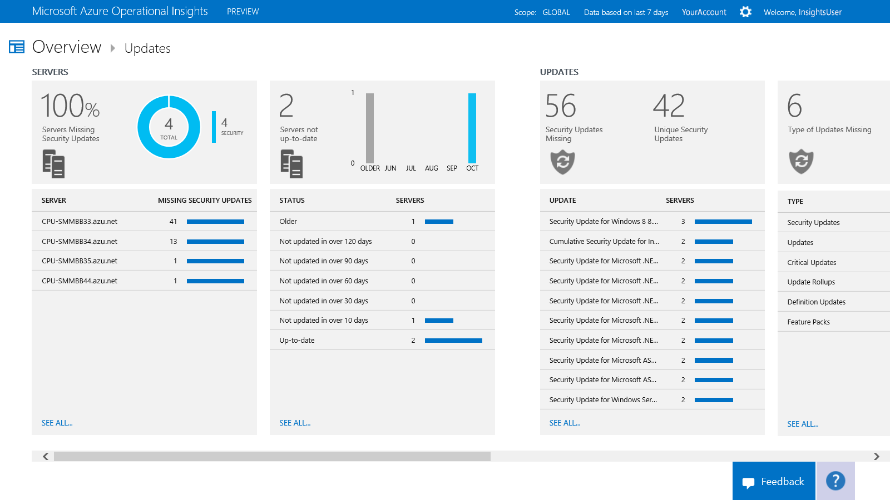

<properties 
   pageTitle="Aktualisieren von Servern mit System Updates"
   description="Erfahren Sie, wie Sie mithilfe des System Updates Intelligence Packs in Microsoft Azure Operational Insights fehlende Updates auf Server in Ihrer Infrastruktur anwenden."
   services="operational-insights"
   documentationCenter=""
   authors="bandersmsft"
   manager="jwhit"
   editor="tysonn" />
<tags 
   ms.service="operational-insights"
   ms.devlang="na"
   ms.topic="article"
   ms.tgt_pltfrm="na"
   ms.workload="na"
   ms.date="03/20/2015"
   ms.author="banders" />

# Aktualisieren von Servern mit System Updates

Mithilfe des System Updates Intelligence Packs in Microsoft Azure Operational Insights können Sie fehlende Updates auf Server in Ihrer Infrastruktur anwenden. Sie installieren das Intelligence Pack, um den Operations Manager-Agent und das Basiskonfigurationsmodul für Operational Insights zu aktualisieren. Updateinformationen werden auf den überwachten Servern gelesen und dann zur Verarbeitung an den Operational Insights-Dienst in der Cloud gesendet. Auf die Updatedaten wird Logik angewendet, und der Cloud-Dienst zeichnet die Daten auf. Wenn ermittelt wird, dass Updates fehlen, werden diese im Dashboard **Updates** angezeigt. Mithilfe des Dashboards **Updates** können Sie mit fehlenden Updates arbeiten und einen Plan für deren Anwendung auf die betreffenden Server entwickeln.

## Verwenden von System Updates zum Aktualisieren von Servers

Bevor Sie System Updates in Microsoft Azure Operational Insights verwenden können, müssen Sie das Intelligence Pack installiert haben. Weitere Informationen zum Installieren von Intelligence Packs finden Sie unter [Verwenden der Galerie zum Hinzufügen oder Entfernen von Intelligence Packs](operational-insights-add-intelligence-packs.md). Nach der Installation können Sie die Updates, die auf den überwachten Servern fehlen, in Operational Insights über die Kachel **System Update Assessment** auf der Seite **Übersicht** anzeigen. 

Die Kachel öffnet das Dashboard **Updates**, welches eine allgemeine Zusammenfassung der fehlenden Updates anzeigt. Diese Seite enthält die folgenden Kategorien:

- Server, auf denen Sicherheitsupdates fehlen

- Server, die nicht kürzlich aktualisiert wurden

- Updates, die auf bestimmte Server angewendet werden sollen

- Typ der fehlenden Updates

Klicken Sie auf eine beliebige Kachel oder ein Element, um Details dazu auf der Seite **Search** anzuzeigen und weitere Informationen zu dem fehlenden Update zu erhalten. 

## Suchergebnisse##
Zu den Updatesuchergebnissen gehören:

- Server

- Updatetitel

- Knowledge Base-ID

- Das Produkt, für welches das Update gilt

- Updateschweregrad

- Veröffentlichungsdatum

Zu den *Server*suchergebnissen gehören:

- Servername

- Name der Betriebssystemversion

- Methode zur automatischen Updateaktivierung

- Tage seit dem letzten Update

- Version des Windows Update-Agents

## So arbeiten Sie mit Updates

1. Klicken Sie auf der Seite **Übersicht** auf die Kachel **System Update Assessment**.

2. Zeigen Sie im Dashboard **Updates** die Updatekategorien an, und wählen Sie diejenige aus, mit der Sie arbeiten möchten.

3. Klicken Sie auf eine Kachel oder ein Element, um detaillierte Informationen auf der Seite **Search** anzuzeigen.

4. Anhand der gefundenen Informationen können Sie einen Plan zum Anwenden fehlender Updates erstellen.

<!--HONumber=52-->