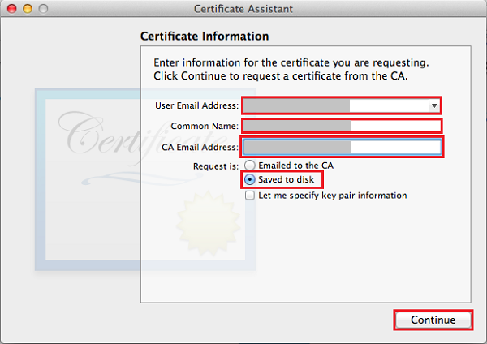
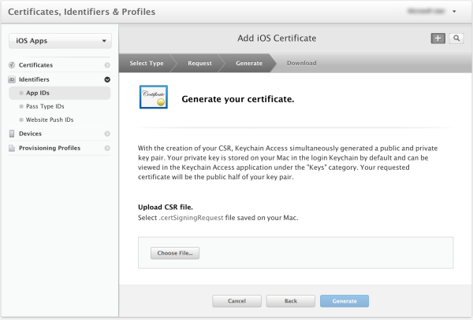
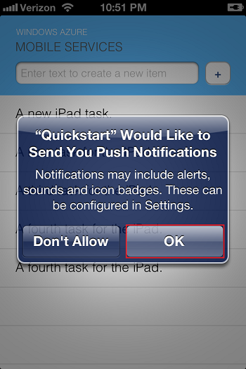

<properties linkid="develop-mobile-tutorials-get-started-with-push-xamarin-ios" urlDisplayName="Get Started with Push Notifications" pageTitle="Get started with push notifications (Xamarin.iOS) - Mobile Services" metaKeywords="" description="Learn how to use push notifications in Xamarin.iOS apps with Azure Mobile Services." metaCanonical="" disqusComments="0" umbracoNaviHide="1" editor="mollybos" documentationCenter="Mobile" title="Get started with push notifications in Mobile Services" authors="" />

Erste Schritte mit Pushbenachrichtigungen in Mobile Services
============================================================

[Windows Store C\#](/de-de/develop/mobile/tutorials/get-started-with-push-dotnet "Windows Store C#")[Windows Store JavaScript](/de-de/develop/mobile/tutorials/get-started-with-push-js "Windows Store JavaScript")[Windows Phone](/de-de/develop/mobile/tutorials/get-started-with-push-wp8 "Windows Phone")[iOS](/de-de/develop/mobile/tutorials/get-started-with-push-ios "iOS")[Android](/de-de/develop/mobile/tutorials/get-started-with-push-android "Android")[Xamarin.iOS](/de-de/develop/mobile/tutorials/get-started-with-push-xamarin-ios "Xamarin.iOS")[Xamarin.Android](/de-de/develop/mobile/tutorials/get-started-with-push-xamarin-android "Xamarin.Android")

In diesem Thema erfahren Sie, wie Sie mithilfe von Azure Mobile Services Pushbenachrichtigungen an eine Xamarin.iOS-App senden. In diesem Lernprogramm fügen Sie mithilfe des Apple Push Notification Services (APNS) Pushbenachrichtigungen zum Schnellstart-Projekt hinzu. Wenn dies abgeschlossen ist, sendet Ihr mobiler Dienst immer dann, wenn ein Datensatz eingefügt wird, eine Pushbenachrichtigung.

**Hinweis**

In diesem Lernprogramm wird eine vereinfachte Möglichkeit zum Senden von Pushbenachrichtigungen präsentiert, bei der ein Pushbenachrichtigungs-Gerätetoken zu dem eingefügten Eintrag hinzugefügt wird. Fahren Sie deshalb unbedingt mit dem nächsten Lernprogramm fort. Darin wird vermittelt, wie Sie Pushbenachrichtigungen in realistische Apps einfügen.

In diesem Lernprogramm werden die folgenden grundlegenden Schritte zur Aktivierung von Pushbenachrichtigungen behandelt:

1.  [Erstellen der Zertifikatsignieranforderungsdatei](#certificates)
2.  [Registrieren der App und Aktivieren von Pushbenachrichtigungen](#register)
3.  [Erstellen eines Bereitstellungsprofils für die App](#profile)
4.  [Konfigurieren von Mobile Services](#configure)
5.  [Hinzufügen von Pushbenachrichtigungen zur App](#add-push)
6.  [Aktualisieren von Skripts zum Senden von Pushbenachrichtigungen](#update-scripts)
7.  [Einfügen von Daten zum Empfangen von Benachrichtigungen](#test)

Für dieses Lernprogramm ist Folgendes erforderlich:

-   [XCode 5.0](https://go.microsoft.com/fwLink/p/?LinkID=266532)
-   Ein Gerät, das auf iOS 5.0 (oder einer neueren Version) laufen kann
-   iOS-Entwicklerprogramm-Mitgliedschaft
-   [Xamarin.iOS]
-   [Azure Mobile Services-Komponente](http://components.xamarin.com/view/azure-mobile-services/)

    **Hinweis**

    Pushbenachrichtigungen müssen aufgrund von Konfigurationsanforderungen auf einem iOS-fähigen Gerät (iPhone oder iPad) anstatt im Emulator bereitgestellt und getestet werden.

Dieses Lernprogramm baut auf dem Mobile Services-Schnellstart auf. Bevor Sie mit diesem Lernprogramm beginnen, müssen Sie zunächst [Erste Schritte mit Mobile Services](/de-de/develop/mobile/tutorials/get-started-xamarin-ios) abschließen.

Der Apple Push Notification Service (APNS) verwendet Zertifikate zur Authentifizierung Ihres mobilen Dienstes. Folgen Sie diesen Anweisungen zum Erstellen der erforderlichen Zertifikate und zum Hochladen auf Ihren mobilen Dienst. Die offizielle Dokumentation der APNS-Merkmale finden Sie unter [Apple Push Notification Service](http://go.microsoft.com/fwlink/p/?LinkId=272584).

Generieren der CSR-DateiGenerieren der Zertifikatsignieranforderungsdatei
-------------------------------------------------------------------------

Zunächst müssen Sie die Zertifikatsignieranforderungsdatei (CSR-Datei) erstellen, die von Apple zur Generierung eines signierten Zertifikats verwendet wird.

1.  Führen Sie das Programm "Schlüsselbundverwaltung" im Ordner "Dienstprogramme" aus.

2.  Klicken Sie auf **Schlüsselbundverwaltung**, erweitern Sie **Zertifikatsassistent**, und klicken Sie dann auf **Zertifikat einer Zertifizierungsinstanz anfordern …**.

	

3.  Machen Sie entsprechende Angaben für die Felder **E-Mail des Benutzers** sowie **Allgemeiner Name** und **E-Mail der Zert.-Instanz**, vergewissern Sie sich, dass **Auf der Festplatte sichern** ausgewählt ist, und klicken Sie dann auf **Fortfahren**.

	

4.  Geben Sie einen Namen für die Zertifikatsignieranforderungsdatei (CSR-Datei) in **Sichern unter** ein, wählen Sie den Speicherort in **Ort**, und klicken Sie dann auf **Sichern**.

	 

	Hierdurch wird die CSR-Datei am gewählten Ort gespeichert, wobei der Desktop der Standardspeicherort ist. Merken Sie sich den für diese Datei gewählten Speicherort.

Anschließend werden Sie Ihre App bei Apple registrieren, Pushbenachrichtigungen aktivieren und diese exportierte CSR hochladen, um ein Pushzertifikat zu erstellen.

Registrieren Ihrer AppRegistrieren Ihrer App für Pushbenachrichtigungen
-----------------------------------------------------------------------

Um von mobilen Diensten Pushbenachrichtigungen an eine iOS-App senden zu können, muss diese selbst bei Apple registriert und auch für Pushbenachrichtigungen angemeldet werden.

1.  Falls Sie Ihre App noch nicht registriert haben, gehen Sie im Apple Developer Center zum [iOS Provisioning Portal](http://go.microsoft.com/fwlink/p/?LinkId=272456), melden Sie sich mit Ihrer Apple-ID an, klicken Sie auf **Identifiers**, dann auf **App IDs** und schließlich auf das Zeichen **+**, um eine neue App zu registrieren.

    ![][102] 

2.  Geben Sie in **Description** einen Namen für Ihre App ein, tragen Sie den Wert *MobileServices.Quickstart* in **Bundle Identifier** ein, markieren Sie die Option "Push Notifications" im Abschnitt "App Services", und klicken Sie dann auf **Continue**. In diesem Beispiel wird die ID **MobileServices.Quickstart** verwendet. Dieselbe ID kann jedoch nicht erneut benutzt werden, da App-IDs über alle Benutzer einzigartig sein müssen. Daher empfiehlt es sich, dass Sie Ihren vollen Namen oder Ihre Initialen an den App-Namen anhängen.

    ![][103]
       
    Hierdurch wird Ihre App-ID generiert, und Sie werden zum **Übermitteln** der Daten aufgefordert. Klicken Sie auf **Submit**.
       
    ![][104] 
       
    Nachdem Sie **Submit** angeklickt haben, erscheint die Registrierabschlussanzeige **Registration complete**, wie unten gezeigt. Klicken Sie auf **Done**.
       
    ![][105]

    Hinweis: Wenn Sie sich dafür entscheiden, einen anderen **Bundle Identifier**-Wert als *MobileServices.Quickstart* vorzugeben, müssen Sie auch die Bundle-ID in Ihrem Xcode-Projekt aktualisieren.

3.  Lokalisieren Sie die soeben erstellte App-ID, und klicken Sie auf deren Zeile.

    ![][106]
       
    Durch Anklicken der App-ID werden Einzelheiten zur App und die App-ID angezeigt.
     Klicken Sie auf die Schaltfläche **Settings**.   
    ![][107] 

4.  Scrollen Sie bis zur Unterseite des Bildschirms, und klicken Sie auf die Schaltfläche **Create Certificate...** unter dem Abschnitt **Development Push SSL Certificate**.

    ![][108] 

    Hierdurch wird der Assistent "Add iOS Certificate" angezeigt.
       
    ![][108] 

    Hinweis: In diesem Lernprogramm wird ein Entwicklungszertifikat verwendet. Derselbe Prozess wird auch zum Registrieren eines Produktionszertifikats durchgeführt. Vergewissern Sie sich nur, dass Sie denselben Zertifikattyp einstellen, wenn Sie das Zertifikat zu Mobile Services hochladen.

5.  Klicken Sie auf **Choose File**, browsen Sie zum Speicherort der in der ersten Aufgabe erstellten CSR-Datei, und klicken Sie dann auf **Generate**.

	

6.  Nach Erstellung des Zertifikats durch das Portal klicken Sie auf die Schaltfläche **Download** und dann auf **Done**.

	
 
	Hierdurch wird das Signierzertifikat heruntergeladen und auf Ihrem Computer in Ihrem Download-Ordner gespeichert.

	

    Hinweis: Standardmäßig ist die heruntergeladene Datei ein Entwicklungszertifikat namens <strong>aps_development.cer</strong>.

7.  Doppelklicken Sie auf das heruntergeladene Pushzertifikat **aps\_development.cer**.

    Hierdurch wird das neue Zertifikat im Schlüsselbund installiert, wie unten gezeigt:

    ![][10]

    Hinweis: Der Name in Ihrem Zertifikat kann verschieden sein, aber er wird das Präfix **Apple Development iOS Push Notification Services:** haben.

Später können Sie mit diesem Zertifikat eine .p12-Datei erstellen und zu Mobile Services hochladen, um Authentifizierung mit APNS zu ermöglichen.

Bereitstellen der AppErstellen eines Bereitstellungsprofils für die App
-----------------------------------------------------------------------

1.  Zurück im [iOS Provisioning Portal](http://go.microsoft.com/fwlink/p/?LinkId=272456) wählen Sie **Provisioning Profiles**, dann **All**, und klicken Sie schließlich auf die Schaltfläche **+**, um ein neues Profil zu erstellen. Hierdurch wird der Assistent **Add iOS Provisiong Profile** gestartet.

    ![][112]

2.  Unter **Development** wählen Sie **iOS App Development** als Bereitstellungsprofiltyp, und klicken Sie dann auf **Continue**

    ![][113]

3.  Anschließend wählen Sie die App-ID für die Mobile Services Quickstart-App aus der **App ID**-Dropdown-Liste, und klicken Sie auf **Continue**.

    ![][114]

4.  Auf dem Bildschirm **Select certificates** wählen Sie das zuvor erstellte Zertifikat, und klicken Sie auf **Continue**.

    ![][115]

5.  Anschließend wählen Sie die zum Testen zu verwendenden **Devices**, und klicken Sie auf **Continue**

    ![][116]

6.  Geben Sie schließlich einen Namen für das Profil im Feld **Profile Name** ein, klicken Sie auf **Generate**, dann auf **Done**.

    ![][117]

	Dadurch wird ein neues Bereitstellungsprofil erstellt.

7.  In Xcode öffnen Sie den Organisator, wählen Sie die Geräteansicht, dann **Provisioning Profiles** im Abschnitt **Library** im linken Bereich, und klicken Sie schließlich auf die Schaltfläche **Refresh** an der Unterseite im mittleren Bereich.

    ![][101]

8.  Unter **Targets** klicken Sie auf **Quickstart**, erweitern Sie **Code Signing Identity**, und unter **Debug** wählen Sie dann das neue Profil.

    ![][17]

Hierdurch wird sichergestellt, dass das Xcode-Projekt das neue Profil für Codesignierung verwendet. Als Nächstes laden wir das Zertifikat zu Mobile Services hoch.

<h2>Konfigurieren des ServicesKonfigurieren von Mobile Services zum Senden von Pushanforderungen</h2>

Nachdem Sie Ihre App bei APNS registriert und Sie Ihr Projekt konfiguriert haben, müssen Sie als Nächstes Ihren mobilen Dienst für die Integration mit APNS konfigurieren.

1.  In der Schlüsselbundverwaltung klicken Sie mit der rechten Maustaste auf das neue Zertifikat, klicken Sie auf **Exportieren**, nennen Sie Ihre Datei "QuickstartPusher", wählen Sie das Format **.p12**, und klicken Sie dann auf **Sichern**.

    ![][28]

	Notieren Sie sich den Dateinamen und den Ort des exportierten Zertifikats.

    
<b>Hinweis</b>
    
In diesem Lernprogramm wird eine QuickstartPusher.p12-Datei erstellt. Name und Ort Ihrer Datei können verschieden sein.

    

2.  Melden Sie sich beim [Azure Verwaltungsportal](https://manage.windowsazure.com/) an, klicken Sie auf **Mobile Services** und dann auf Ihre App.

    ![][18]

3.  Klicken Sie auf die Registerkarte **Push** und dann auf **Hochladen**.

    ![][19]

    Der Dialog "Zertifikat hochladen" wird angezeigt.

4.  Klicken Sie auf **Datei**, wählen Sie die exportierte QuickstartPusher.p12-Zertifikatsdatei, geben Sie das **Kennwort** ein, vergewissern Sie sich, dass der richtige **Modus** gewählt ist, klicken Sie auf das Häkchensymbol und dann auf **Speichern**.

    ![][20] 

    **Hinweis**

    In diesem Lernprogramm werden Entwicklungszertifikate verwendet.

Ihr mobiler Dienst ist nun für APNS konfiguriert.

<h2>Hinzufügen von PushbenachrichtigungenHinzufügen von Pushbenachrichtigungen zu Ihrer App</h2>

1.  Öffnen Sie in Xamarin.Studio die Datei "AppDelegate.cs", und fügen Sie die folgende Eigenschaft hinzu:

         public string DeviceToken { get; set; }

2.  Öffnen Sie die Klasse **TodoItem**, und fügen Sie die folgende Eigenschaft hinzu:

         [DataMember(Name = "deviceToken")]
         public string DeviceToken { get; set; }

    **Hinweis**

    Wenn für Ihren mobilen Dienst das dynamische Schema aktiviert ist, wird automatisch eine neue "deviceToken"-Spalte zur **TodoItem**-Tabelle hinzugefügt, wenn ein neues Element mit dieser Eigenschaft eingefügt wird.

3.  Überschreiben Sie in **AppDelegate** das Ereignis **FinishedLaunching**:

         public override bool FinishedLaunching(UIApplication application, NSDictionary launchOptions)
         {
             UIRemoteNotificationType notificationTypes = UIRemoteNotificationType.Alert | 
                 UIRemoteNotificationType.Badge | UIRemoteNotificationType.Sound;
             UIApplication.SharedApplication.RegisterForRemoteNotificationTypes(notificationTypes); 

             return true;
         }

4.  Überschreiben Sie in **AppDelegate** das Ereignis **RegisteredForRemoteNotifications**:

         public override void RegisteredForRemoteNotifications(UIApplication application, NSData deviceToken)
         {
             string trimmedDeviceToken = deviceToken.Description;
             if (!string.IsNullOrWhiteSpace(trimmedDeviceToken))
             {
                 trimmedDeviceToken = trimmedDeviceToken.Trim('<');
                 trimmedDeviceToken = trimmedDeviceToken.Trim('>');
             }
             DeviceToken = trimmedDeviceToken;
         }

5.  Überschreiben Sie in **AppDelegate** das Ereignis **ReceivedRemoteNotification**:

         public override void ReceivedRemoteNotification(UIApplication application, NSDictionary userInfo)
         {
             Debug.WriteLine(userInfo.ToString());
             NSObject inAppMessage;

             bool success = userInfo.TryGetValue(new NSString("inAppMessage"), out inAppMessage);

             if (success)
             {
                 var alert = new UIAlertView("Got push notification", inAppMessage.ToString(), null, "OK", null);
                 alert.Show();
             }
         }

6.  Modifizieren Sie in **TodoListViewController** die Aktion **OnAdd**, um den in **AppDelegeate** gespeicherten Gerätetoken abzurufen, und speichern Sie ihn in dem hinzugefügten **TodoItem**.

    string deviceToken = ((AppDelegate)UIApplication.SharedApplication.Delegate).DeviceToken;

             var newItem = new TodoItem() 
             {
                 Text = itemText.Text, 
                 Complete = false,
                 DeviceToken = deviceToken
             };

Ihre App kann Pushbenachrichtigungen nun unterstützen.

Aktualisieren des EinfügeskriptsAktualisieren des registrierten Einfügeskripts im Verwaltungsportal
---------------------------------------------------------------------------------------------------

1.  Klicken Sie im Verwaltungsportal auf die Registerkarte **Daten** und dann auf die Tabelle **TodoItem**.

    ![][21]

2.  Klicken Sie unter **todoitem** auf die Registerkarte **Skript**, und wählen Sie **Einfügen** aus.

	

	Daraufhin wird die Funktion angezeigt, die aufgerufen wird, wenn etwas in die Tabelle **TodoItem** eingefügt wird.

1.  Ersetzen Sie die Einfügefunktion durch den folgenden Code. Klicken Sie dann auf **Speichern**:

         function insert(item, user, request) {
             request.execute();
             // Zeitüberschreitung für Verzögerung der Benachrichtigung festlegen, um Zeit für das 
             // Schließen der App auf dem Gerät zu lassen und Toastbenachrichtigungen zu demonstrieren
             setTimeout(function() {
                 push.apns.send(item.deviceToken, {
                     alert: "Toast: " + item.text,
                     payload: {
                         inAppMessage: "Hey, a new item arrived: '" + item.text + "'"
                     }
                 });
             }, 2500);
         }

    Auf diese Weise wird ein neues Einfügeskript registriert, das über das [apns object] eine Pushbenachrichtigung (den eingefügten Text) zum in der Einfügeanforderung angegebenen Gerät sendet. 

    
<b>Hinweis</b>
    
Dieses Skript verzögert die Übermittlung der Benachrichtigung, um Ihnen Zeit zum Schließen der App für den Empfang einer Toastbenachrichtigung zu geben.

    

Testen der AppTesten von Pushbenachrichtigungen in Ihrer App
------------------------------------------------------------

1.  Drücken Sie auf **Run**, um das Projekt zu erstellen, starten Sie die App auf einem iOS-fähigen Gerät, und klicken Sie dann auf **OK**, um Pushbenachrichtigungen zu akzeptieren

	

    
<b>Hinweis</b>
    
Pushbenachrichtigungen von Ihrer App müssen ausdrücklich akzeptiert werden. Diese Anforderung tritt nur beim ersten Ausführen der App auf.

    

2.  In der App geben Sie eine Beschreibung ein, wie zum Beispiel *Neue Mobile Services-Aufgabe*, und klicken Sie dann auf das Plussymbol (**+**).

	

3.  Stellen Sie sicher, dass Sie eine Benachrichtigung erhalten haben, und klicken Sie dann auf **OK**, um diese zu schließen.

	

4.  Wiederholen Sie Schritt 2, schließen Sie die App unverzüglich, und überprüfen Sie dann, ob der folgende Toast angezeigt wird.

	

Sie haben dieses Lernprogramm erfolgreich abgeschlossen.

Abgeschlossenes Beispiel abrufen
--------------------------------

Laden Sie das [abgeschlossene Beispielprojekt](http://go.microsoft.com/fwlink/p/?LinkId=331303) herunter. Stellen Sie sicher, dass Sie die Variablen **applicationURL** und **applicationKey** mit Ihren eigenen Azure-Einstellungen aktualisieren.

Nächste Schritte
----------------

In diesem einfachen Beispiel empfängt ein Benutzer eine Pushbenachrichtigung mit den soeben eingegebenen Daten. Der von APNS verwendete Gerätetoken wird vom Client in der Anforderung an den mobilen Dienst geliefert. Im nächsten Lernprogramm [Pushbenachrichtigungen an App-Benutzer](/de-de/develop/mobile/tutorials/push-notifications-to-users-ios) werden wir eine eigene Gerätetabelle zum Speichern von Gerätetoken erstellen und beim Auftreten einer Einfügung eine Pushbenachrichtigung an alle gespeicherten Kanäle aussenden.

<!-- Anchors. -->
[Generate the certificate signing request]: #certificates
[Register your app and enable push notifications]: #register
[Create a provisioning profile for the app]: #profile
[Configure Mobile Services]: #configure
[Update scripts to send push notifications]: #update-scripts
[Add push notifications to the app]: #add-push
[Insert data to receive notifications]: #test
[Next Steps]:#next-steps

<!-- Images. -->

[5]: ./media/partner-xamarin-mobile-services-ios-get-started-push/mobile-services-ios-push-step5.png
[6]: ./media/partner-xamarin-mobile-services-ios-get-started-push/mobile-services-ios-push-step6.png
[7]: ./media/partner-xamarin-mobile-services-ios-get-started-push/mobile-services-ios-push-step7.png

[9]: ./media/partner-xamarin-mobile-services-ios-get-started-push/mobile-services-ios-push-step9.png
[10]: ./media/partner-xamarin-mobile-services-ios-get-started-push/mobile-services-ios-push-step10.png

[17]: ./media/partner-xamarin-mobile-services-ios-get-started-push/mobile-services-ios-push-step17.png
[18]: ./media/partner-xamarin-mobile-services-ios-get-started-push/mobile-services-selection.png
[19]: ./media/partner-xamarin-mobile-services-ios-get-started-push/mobile-push-tab-ios.png
[20]: ./media/partner-xamarin-mobile-services-ios-get-started-push/mobile-push-tab-ios-upload.png
[21]: ./media/partner-xamarin-mobile-services-ios-get-started-push/mobile-portal-data-tables.png
[22]: ./media/partner-xamarin-mobile-services-ios-get-started-push/mobile-insert-script-push2.png
[23]: ./media/partner-xamarin-mobile-services-ios-get-started-push/mobile-quickstart-push1-ios.png
[24]: ./media/partner-xamarin-mobile-services-ios-get-started-push/mobile-quickstart-push2-ios.png
[25]: ./media/partner-xamarin-mobile-services-ios-get-started-push/mobile-quickstart-push3-ios.png
[26]: ./media/partner-xamarin-mobile-services-ios-get-started-push/mobile-quickstart-push4-ios.png
[28]: ./media/partner-xamarin-mobile-services-ios-get-started-push/mobile-services-ios-push-step18.png

[101]: ./media/partner-xamarin-mobile-services-ios-get-started-push/mobile-services-ios-push-01.png
[102]: ./media/partner-xamarin-mobile-services-ios-get-started-push/mobile-services-ios-push-02.png
[103]: ./media/partner-xamarin-mobile-services-ios-get-started-push/mobile-services-ios-push-03.png
[104]: ./media/partner-xamarin-mobile-services-ios-get-started-push/mobile-services-ios-push-04.png
[105]: ./media/partner-xamarin-mobile-services-ios-get-started-push/mobile-services-ios-push-05.png
[106]: ./media/partner-xamarin-mobile-services-ios-get-started-push/mobile-services-ios-push-06.png
[107]: ./media/partner-xamarin-mobile-services-ios-get-started-push/mobile-services-ios-push-07.png
[108]: ./media/partner-xamarin-mobile-services-ios-get-started-push/mobile-services-ios-push-08.png

[110]: ./media/partner-xamarin-mobile-services-ios-get-started-push/mobile-services-ios-push-10.png
[111]: ./media/partner-xamarin-mobile-services-ios-get-started-push/mobile-services-ios-push-11.png
[112]: ./media/partner-xamarin-mobile-services-ios-get-started-push/mobile-services-ios-push-12.png
[113]: ./media/partner-xamarin-mobile-services-ios-get-started-push/mobile-services-ios-push-13.png
[114]: ./media/partner-xamarin-mobile-services-ios-get-started-push/mobile-services-ios-push-14.png
[115]: ./media/partner-xamarin-mobile-services-ios-get-started-push/mobile-services-ios-push-15.png
[116]: ./media/partner-xamarin-mobile-services-ios-get-started-push/mobile-services-ios-push-16.png
[117]: ./media/partner-xamarin-mobile-services-ios-get-started-push/mobile-services-ios-push-17.png

[Install Xcode]: https://go.microsoft.com/fwLink/p/?LinkID=266532
[iOS Provisioning Portal]: http://go.microsoft.com/fwlink/p/?LinkId=272456
[Mobile Services iOS SDK]: https://go.microsoft.com/fwLink/p/?LinkID=266533
[Apple Push Notification Service]: http://go.microsoft.com/fwlink/p/?LinkId=272584
[Get started with Mobile Services]: /de-de/develop/mobile/tutorials/get-started-xamarin-ios
[Get started with data]: /de-de/develop/mobile/tutorials/get-started-with-data-xamarin-ios
[Get started with authentication]: /de-de/develop/mobile/tutorials/get-started-with-users-xamarin-ios
[Get started with push notifications]: /de-de/develop/mobile/tutorials/get-started-with-push-xamarin-ios
[Push notifications to app users]: /de-de/develop/mobile/tutorials/push-notifications-to-users-ios
[Authorize users with scripts]: /de-de/develop/mobile/tutorials/authorize-users-in-scripts-xamarin-ios

[Azure Management Portal]: https://manage.windowsazure.com/
[apns object]: http://go.microsoft.com/fwlink/p/?LinkId=272333
[Azure Mobile Services Component]: http://components.xamarin.com/view/azure-mobile-services/
[completed example project]: http://go.microsoft.com/fwlink/p/?LinkId=331303
