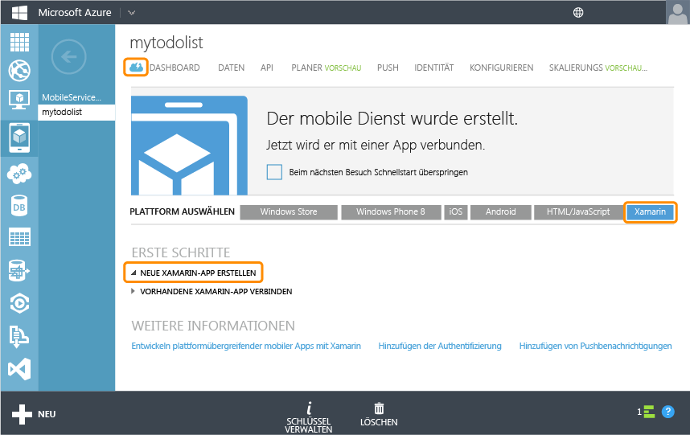
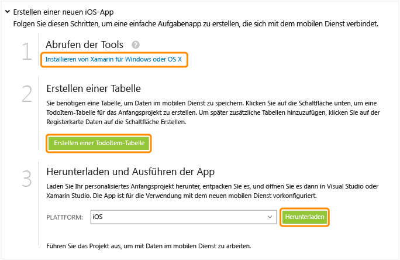
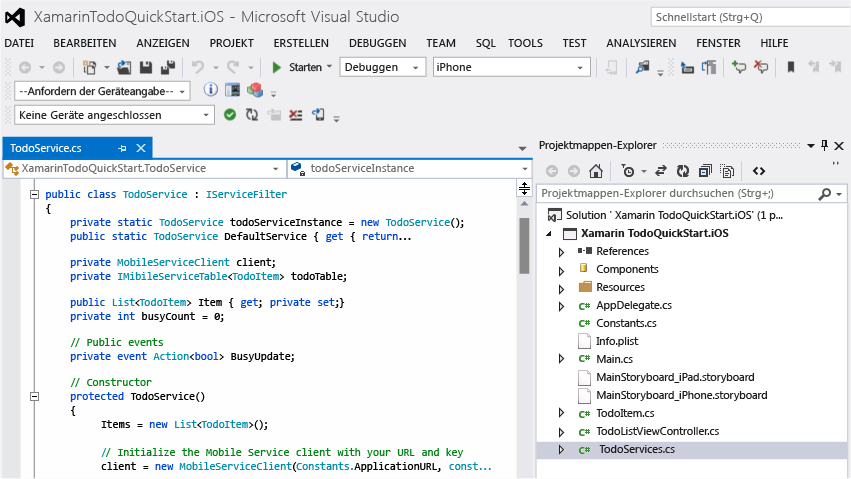

<properties pageTitle="Get Started with Mobile Services for Xamarin iOS apps" metaKeywords="" description="Follow this tutorial to get started using Azure Mobile Services for Xamarin iOS development." metaCanonical="" services="mobile" documentationCenter="Mobile" title="Get started with Mobile Services" authors="craigd" solutions="" manager="" editor="" />

Erste Schritte mit Mobile Services
==================================

[Windows Store](/en-us/documentation/articles/mobile-services-windows-store-get-started "Windows Store") [Windows Phone](/en-us/documentation/articles/mobile-services-windows-phone-get-started "Windows Phone") [iOS](/en-us/documentation/articles/mobile-services-ios-get-started "iOS") [Android](/en-us/documentation/articles/mobile-services-android-get-started "Android") [HTML](/en-us/documentation/articles/mobile-services-html-get-started "HTML") [Xamarin.iOS](/en-us/documentation/articles/partner-xamarin-mobile-services-ios-get-started "Xamarin.iOS") [Xamarin.Android](/en-us/documentation/articles/partner-xamarin-mobile-services-android-get-started "Xamarin.Android") [Sencha](/en-us/documentation/articles/partner-sencha-mobile-services-get-started/ "Sencha") [PhoneGap](/en-us/documentation/articles/mobile-services-javascript-backend-phonegap-get-started/ "PhoneGap")

In diesem Lernprogramm erfahren Sie, wie Sie mit den Azure Mobile Services einen cloudbasierten Back-End-Dienst zu einer Xamarin.iOS-App hinzufügen können. In diesem Lernprogramm erstellen Sie einen neuen mobilen Dienst und eine einfache *To-Do-Listen*-App, die App-Daten im neuen mobilen Dienst speichert.

Wenn Sie sich lieber ein Video ansehen möchten, finden Sie die Schritte dieses Lernprogramms auch im Clip rechts.

[Lernprogramm ansehen](http://channel9.msdn.com/Series/Windows-Azure-Mobile-Services/Getting-Started-with-Xamarin-and-Windows-Azure-Mobile-Services) [Video abspielen](http://channel9.msdn.com/Series/Windows-Azure-Mobile-Services/Getting-Started-with-Xamarin-and-Windows-Azure-Mobile-Services) 10:05:00

Unten finden Sie einen Screenshot aus der fertigen App:

Zum Abschließen dieses Lernprogramms sind XCode 4.5 und iOS 5.0 oder neuere Versionen sowie [Xamarin Studio](http://xamarin.com/download) für OS X oder das Xamarin Visual Studio-Plug-in für Visual Studio unter Windows erforderlich.

**Hinweis**

Sie benötigen ein Azure-Konto, um dieses Lernprogramm auszuführen. Wenn Sie über kein Konto verfügen, können Sie in nur wenigen Minuten ein kostenloses Testkonto erstellen. Weitere Informationen finden Sie unter [Kostenloses Azure-Testkonto](http://www.windowsazure.com/en-us/pricing/free-trial/?WT.mc_id=A643EE910&returnurl=http%3A%2F%2Fwww.windowsazure.com%2Fen-us%2Fdevelop%2Fmobile%2Ftutorials%2Fget-started-xamarin-ios%2F).

Erstellen eines neuen mobilen Diensts
-------------------------------------

[WACOM.INCLUDE [mobile-services-create-new-service](../includes/mobile-services-create-new-service.md)]

Erstellen einer neuen AppErstellen einer neuen Xamarin.iOS-App
--------------------------------------------------------------

Sobald Sie den mobilen Dienst erstellt haben, können Sie einem einfachen Schnellstart im Verwaltungsportal folgen, um eine neue App zu erstellen oder eine vorhandene App für die Verbindung zum mobilen Dienst zu ändern.

In diesem Abschnitt erstellen Sie eine neue Xamarin.iOS-App, die mit dem mobilen Dienst verbunden ist.

1.  Klicken Sie im Verwaltungsportal auf **Mobile Services** und dann auf den mobilen Dienst, den Sie gerade erstellt haben.

2.  Klicken Sie auf der Schnellstartregisterkarte unter **Plattform auswählen** auf **Xamarin.iOS**, und erweitern Sie **Create a new Xamarin.iOS app**.

    

    Dadurch werden drei einfache Schritte zum Erstellen einer Xamarin.iOS-App angezeigt, die mit dem mobilen Dienst verbunden wird.

   

3.  Wenn Sie dies noch nicht durchgeführt haben, laden Sie [Xcode] v4.4 oder eine neuere Version und [Xamarin Studio](http://xamarin.com/download) herunter, und installieren Sie diese.

4.  Klicken Sie auf **TodoItems-Tabelle erstellen**, um eine Tabelle zum Speichern der App-Daten zu erstellen.

5.  Klicken Sie unter **App herunterladen und ausführen** auf **Herunterladen**.

    Dadurch wird das Projekt für die Beispielanwendung der *To-do-List* heruntergeladen, die mit dem mobilen Dienst verbunden ist und auf die Azure Mobile Services-Komponente für Xamarin.iOS verweist. Speichern Sie die komprimierte Projektdatei auf Ihrem lokalen Computer, und notieren Sie sich den Speicherort.

Ausführen der AppAusführen der neuen Xamarin.iOS-App
----------------------------------------------------

Der letzte Schritt dieses Lernprogramms besteht im Erstellen und Ausführen der neuen App.

1.  Navigieren Sie zu dem Verzeichnis, in dem Sie die komprimierten Projektdateien gespeichert haben, erweitern Sie die Dateien auf Ihrem Computer, und öffnen Sie die Projektmappen-Datei **XamarinTodoQuickStart.iOS.sln** mithilfe von Xamarin Studio oder Visual Studio.

    

    

2.  Klicken Sie auf die Schaltfläche **Ausführen**, um das Projekt zu erstellen und die App im iPhone-Emulator zu starten, was die Voreinstellung bei diesem Projekt darstellt.

3.  Geben Sie in der App einen sinnvollen Text, wie z. B. *Tutorial fertigstellen* ein, und klicken Sie dann auf das Plus-Symbol (**+**).

    

    Dadurch wird eine POST-Anforderung an den neuen, in Azure gehosteten mobilen Dienst gesendet. Daten von der Anforderung werden in die TodoItem-Tabelle eingefügt. In der Tabelle gespeicherte Einträge werden von dem mobilen Dienst zurückgegeben, und die Daten werden in der Liste angezeigt.

    **Hinweis**

    Sie können den Code überprüfen, der auf den Mobile Service zugreift, um Daten abzufragen und einzufügen. Sie finden ihn in der C\#-Datei "TodoService.cs".

4.  Zurück im Verwaltungsportal klicken Sie auf die Registerkarte **Daten** und dann auf die Tabelle **TodoItem**.

    

    Nun können Sie die von der App in die Tabelle eingefügten Daten durchsuchen.

    

Nächste Schritte
----------------

Da Sie den Schnellstart jetzt abgeschlossen haben, erfahren Sie, wie zusätzliche wichtige Aufgaben in Mobile Services ausgeführt werden:

-   [Erste Schritte mit Daten](/en-us/develop/mobile/tutorials/get-started-with-data-xamarin-ios)
    
    Informationen zum Speichern und Abfragen von Daten mit Mobile Services.

-   [Erste Schritte mit der Authentifizierung](/en-us/develop/mobile/tutorials/get-started-with-users-xamarin-ios)
    
    Informationen zur Authentifizierung von Benutzern Ihrer App bei einem Identitätsanbieter.

-   [Erste Schritte mit Pushbenachrichtigungen](/en-us/develop/mobile/tutorials/get-started-with-push-xamarin-ios)
    
    Informationen zum Senden einer einfachen Pushbenachrichtigung an Ihre App.

