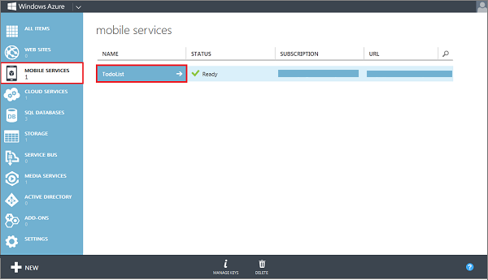

<properties linkid="develop-mobile-tutorials-validate-modify-and-augment-data-Xamarin-iOS" urlDisplayName="" pageTitle="Use server scripts to validate and modify data (Xamarin iOS) | Mobile Dev Center" metaKeywords="" description="Learn how to validate and modify data sent using server scripts from your Xamarin iOS app." metaCanonical="" services="" documentationCenter="Mobile" title="Validate and modify data in Mobile Services by using server scripts" authors="" solutions="" manager="" editor="" />

Überprüfen und Ändern von Daten in Mobile Services mithilfe von Serverskripts
=============================================================================

[Windows Store C\#](/de-de/develop/mobile/tutorials/validate-modify-and-augment-data-dotnet "Windows Store C#")[Windows Store JavaScript](/de-de/develop/mobile/tutorials/validate-modify-and-augment-data-js "Windows Store JavaScript")[Windows Phone](/de-de/develop/mobile/tutorials/validate-modify-and-augment-data-wp8 "Windows Phone")[iOS](/de-de/develop/mobile/tutorials/validate-modify-and-augment-data-ios "iOS")[Android](/de-de/develop/mobile/tutorials/validate-modify-and-augment-data-android "Android")[HTML](/de-de/develop/mobile/tutorials/validate-modify-and-augment-data-html "HTML")[Xamarin.iOS](/de-de/develop/mobile/tutorials/validate-modify-and-augment-data-xamarin-ios "Xamarin.iOS")[Xamarin.Android](/de-de/develop/mobile/tutorials/validate-modify-and-augment-data-xamarin-android "Xamarin.Android")

In diesem Thema erfahren Sie, wie Sie Serverskripts in Azure Mobile Services nutzen. Serverskripts sind in einem mobilen Dienst registriert und können verwendet werden, um eine Vielzahl an Vorgängen für Daten, die eingefügt und aktualisiert werden, durchzuführen, einschließlich Überprüfen und Ändern. In diesem Lernprogramm definieren und registrieren Sie Serverskripts, die Daten prüfen und ändern. Da sich das Verhalten von serverseitigen Skripts häufig auf den Client auswirkt, werden Sie auch Ihre iOS-App aktualisieren, um von diesen neuen Verhalten zu profitieren. Der komplette Code ist verfügbar in der [ValidateModifyData -Beispielapp](http://go.microsoft.com/fwlink/p/?LinkId=331330).

In diesem Lernprogramm werden die grundlegenden Schritte erläutert:

1.  [Überprüfung der Zeichenfolgenlänge hinzufügen](#string-length-validation)
2.  [Client zur Unterstützung der Überprüfung aktualisieren](#update-client-validation)
3.  [Zeitstempel beim Einfügen hinzufügen](#add-timestamp)
4.  [Client zum Anzeigen des Zeitstempels aktualisieren](#update-client-timestamp)

Dieses Lernprogramm basiert auf den Schritten und der Beispiel-App aus dem vorherigen Lernprogramm [Erste Schritte mit Daten](/de-de/develop/mobile/tutorials/get-started-with-data-xamarin-ios). Bevor Sie mit diesem Lernprogramm beginnen, müssen Sie zunächst [Erste Schritte mit Daten](/de-de/develop/mobile/tutorials/get-started-with-data-xamarin-ios) abschließen.

Überprüfung hinzufügen
----------------------

Es empfiehlt sich, die Länge der Daten, die von Benutzern übermittelt werden, zu überprüfen. Zunächst registrieren Sie ein Skript, das die Länge von Zeichenfolgendaten überprüft, die an den mobilen Dienst gesendet werden, und das Zeichenfolgen ablehnt, die zu lang sind, in diesem Fall länger als zehn Zeichen.

1.  Melden Sie sich beim [Azure-Verwaltungsportal](https://manage.windowsazure.com/) an. Klicken Sie auf **Mobile Services** und dann auf Ihre App.

    

2.  Klicken Sie auf die Registerkarte **Daten** und dann auf die Tabelle **TodoItem**.

	![][1]

3.  Klicken Sie auf **Skript** und wählen Sie die **Einfügen**-Operation aus.

	![][2]

4.  Ersetzen Sie das vorhandene Skript durch die folgende Funktion, und klicken Sie dann auf **Speichern**.

	    function insert(item, user, request) {
	        if (item.text.length > 10) {
	                request.respond(statusCodes.BAD_REQUEST, 'Text length must be 10 characters or less.');
	            } else {
	                request.execute();
	            }
	        }	

    Das Skript überprüft die Länge der Eigenschaft **text** und sendet eine Fehlerantwort, wenn die Länge zehn Zeichen überschreitet. Andernfalls wird die **execute**-Methode aufgerufen, um das Einfügen abzuschließen.

    **Hinweis**

    Sie können ein registriertes Skript auf der Registerkarte **Skript** entfernen, indem Sie auf **Löschen** und dann auf **Speichern** klicken.

Den Client aktualisieren
------------------------

Der mobile Dienst überprüft nun Daten und sendet Fehlerantworten. Nun müssen Sie Ihre App aktualisieren, damit sie Fehlerantworten der Überprüfung verarbeiten kann.

1.  Öffnen Sie in Xamarin Studio das Projekt, das Sie im Lernprogramm [Erste Schritte mit Daten](/de-de/develop/mobile/tutorials/get-started-with-data-xamarin-ios) geändert haben.

2.  Drücken Sie die **Run**-Taste, um das Projekt zu erstellen und die App zu starten. Geben Sie anschließend einen Text mit mehr als 10 Zeichen in das Textfeld ein, und klicken Sie auf das Plus-Symbol (**+**).

    Beachten Sie, dass die App einen unbehandelten Fehler als Ergebnis der vom mobilen Dienst zurückgegebenen 400-Antwort (Bad Request) ausgibt.

3.  Suchen Sie in der Datei TodoService.cs nach der aktuellen `try/catch`-Ausnahmebehandlung in der **InsertTodoItemAsync**-Methode, und ersetzen Sie den`Catch` durch Folgendes:

	    catch (Exception ex) {
	        var exDetail = (ex.InnerException.InnerException as MobileServiceInvalidOperationException);
	        Console.WriteLine(exDetail.Message);
	                                
	        UIAlertView alert = new UIAlertView() { 
	            	Title = "Error", 
	            	Message = exDetail.Message
	        } ;
	        alert.AddButton("Ok");
	        alert.Show();
	
	        return -1;
			}

    Nun öffnet sich ein Popup-Fenster, in dem dem Benutzer der Fehler angezeigt wird.

4.  Suchen Sie **OnAdd**-Methode in **TodoListViewController.cs**. Aktualisieren Sie die Methode, um sicherzustellen, dass der zurückgegebene `index` nicht `-1` ist (wie in der zurückgegebenen Ausnahmebehandlung in **InsertTodoItemAsync**). In diesem Falle fügen wir keine neue Zeile in die `TableView` ein.

	    if (index != -1) {
	        TableView.InsertRows(new [] { NSIndexPath.FromItemSection(index, 0) },
	            UITableViewRowAnimation.Top);
	        itemText.Text = "";
	    }

5.  Erstellen und starten Sie die App.

    

    Beachten Sie, dass der Fehler behandelt und die Fehlermeldung für den Benutzer angezeigt wird.

Nächste Schritte
----------------

Da Sie dieses Lernprogramm nun abgeschlossen haben, können Sie mit dem letzten Lernprogramm der Datenreihe fortfahren: [Optimieren von Abfragen mit Paging](/de-de/develop/mobile/tutorials/add-paging-to-data-xamarin-ios).

Serverskripts werden auch zum Autorisieren von Benutzern und zum Senden von Pushbenachrichtigungen verwendet. Weitere Informationen finden Sie in den folgenden Lernprogrammen:

-   [Autorisieren von Benutzern mit Skripts](/de-de/develop/mobile/tutorials/authorize-users-in-scripts-xamarin-ios)
    Erfahren Sie, wie Sie Daten basierend auf der ID eines authentifizierten Benutzers filtern.

-   [Erste Schritte mit Pushbenachrichtigungen](/de-de/develop/mobile/tutorials/get-started-with-push-xamarin-ios)
    Informationen zum Senden einer einfachen Pushbenachrichtigung an Ihre App.

-   [Mobile Services: Serverskriptreferenz](http://go.microsoft.com/fwlink/?LinkId=262293)
    Lernen Sie mehr über das Registrieren und Verwenden von Serverskripts.

<!-- Anchors. -->
[Add string length validation]: #string-length-validation
[Update the client to support validation]: #update-client-validation
[Add a timestamp on insert]: #add-timestamp
[Update the client to display the timestamp]: #update-client-timestamp
[Next Steps]: #next-steps

<!-- Images. -->
[0]: ./media/partner-xamarin-mobile-services-ios-validate-modify-data-server-scripts/mobile-services-selection.png
[1]: ./media/partner-xamarin-mobile-services-ios-validate-modify-data-server-scripts/mobile-portal-data-tables.png
[2]: ./media/partner-xamarin-mobile-services-ios-validate-modify-data-server-scripts/mobile-insert-script-users.png

[4]: ./media/partner-xamarin-mobile-services-ios-validate-modify-data-server-scripts/mobile-quickstart-data-error-ios.png

<!-- URLs. -->
[Mobile Services server script reference]: http://go.microsoft.com/fwlink/?LinkId=262293
[Get started with Mobile Services]: /de-de/develop/mobile/tutorials/get-started-xamarin-ios
[Authorize users with scripts]: /de-de/develop/mobile/tutorials/authorize-users-in-scripts-xamarin-ios
[Refine queries with paging]: /de-de/develop/mobile/tutorials/add-paging-to-data-xamarin-ios
[Get started with data]: /de-de/develop/mobile/tutorials/get-started-with-data-xamarin-ios
[Get started with authentication]: /de-de/develop/mobile/tutorials/get-started-with-users-xamarin-ios
[Get started with push notifications]: /de-de/develop/mobile/tutorials/get-started-with-push-xamarin-ios

[Management Portal]: https://manage.windowsazure.com/
[Azure Management Portal]: https://manage.windowsazure.com/
[GitHub]: http://go.microsoft.com/fwlink/p/?LinkId=331330
