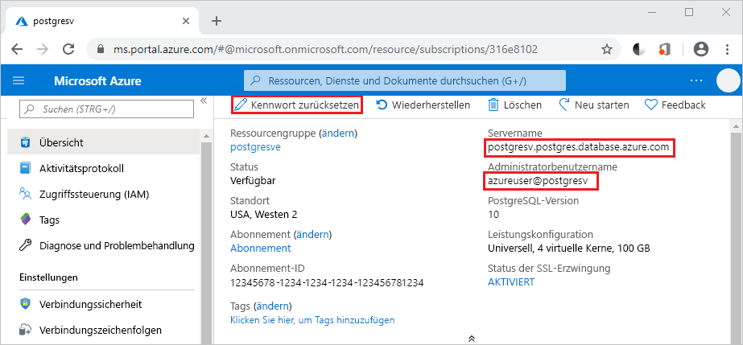
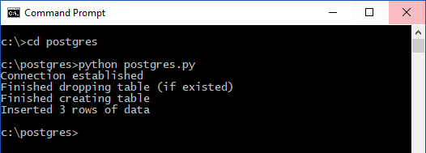

# <a name="azure-database-for-postgresql-use-python-to-connect-and-query-data"></a>Azure-Datenbank für PostgreSQL: Verwenden von Python zum Herstellen von Verbindungen mit Daten und Durchführen von Abfragen
In dieser Schnellstartanleitung erfahren Sie, wie Sie mithilfe von [Python](https://python.org) eine Verbindung mit einer Azure-Datenbank für PostgreSQL herstellen. Außerdem wird gezeigt, wie Sie SQL-Anweisungen verwenden, um Daten in der Datenbank über macOS, Ubuntu Linux und Windows-Plattformen abzufragen, einzufügen, zu aktualisieren und zu löschen. Bei den Schritten in diesem Abschnitt wird davon ausgegangen, dass Sie mit der Python-Entwicklung vertraut sind und noch keine Erfahrung mit Azure-Datenbank für PostgreSQL haben.

## <a name="prerequisites"></a>Voraussetzungen
In diesem Schnellstart werden die Ressourcen, die in den folgenden Anleitungen erstellt wurden, als Startpunkt verwendet:
- [Erstellen einer Datenbank – Portal](quickstart-create-server-database-portal.md)
- [Erstellen einer Datenbank – CLI](quickstart-create-server-database-azure-cli.md)

Außerdem benötigen Sie:
- Installation von [Python](https://www.python.org/downloads/)
- Installation des [pip](https://pip.pypa.io/en/stable/installing/)-Pakets (pip ist bereits installiert, wenn Sie Binärdateien der Version Python 2 (mindestens 2.7.9) oder Python 3 (mindestens 3.4) verwenden, die Sie von [python.org](https://python.org) heruntergeladen haben.)

## <a name="install-the-python-connection-libraries-for-postgresql"></a>Installieren der Python-Verbindungsbibliotheken für PostgreSQL
Installieren Sie das Paket [psycopg2](http://initd.org/psycopg/docs/install.html), um eine Verbindung herstellen und die Datenbank abfragen zu können. „psycopg2“ steht auf [PyPI](https://pypi.python.org/pypi/psycopg2/) in Form von [Wheel](http://pythonwheels.com/)-Paketen für die gängigsten Plattformen (Linux und OSX, Windows) zur Verfügung. Verwenden Sie „pip install“, um die Binärversion des Moduls mit allen Abhängigkeiten zu erhalten.

1. Starten Sie auf Ihrem eigenen Computer eine Befehlszeilenschnittstelle:
    - Starten Sie unter Linux die Bash-Shell.
    - Starten Sie unter macOS das Terminal.
    - Starten Sie unter Windows die Eingabeaufforderung über das Startmenü.
2. Vergewissern Sie sich, dass Sie die aktuelle pip-Version verwenden. Führen Sie hierzu einen Befehl wie den folgenden aus:
    ```cmd
    pip install -U pip
    ```

3. Führen Sie den folgenden Befehl aus, um das Paket „psycopg2“ zu installieren:
    ```cmd
    pip install psycopg2
    ```

## <a name="get-connection-information"></a>Abrufen von Verbindungsinformationen
Rufen Sie die Verbindungsinformationen ab, die zum Herstellen einer Verbindung mit der Azure-Datenbank für PostgreSQL erforderlich sind. Sie benötigen den vollqualifizierten Servernamen und die Anmeldeinformationen.

1. Melden Sie sich beim [Azure-Portal](https://portal.azure.com/)an.
2. Klicken Sie im Azure-Portal im linken Menü auf **Alle Ressourcen**, und suchen Sie dann nach dem soeben erstellten Server, z.B. **mydemoserver**.
3. Klicken Sie auf den Servernamen.
4. Notieren Sie sich im Bereich **Übersicht** des Servers den **Servernamen** und den **Anmeldenamen des Serveradministrators**. Wenn Sie Ihr Kennwort vergessen haben, können Sie es in diesem Bereich auch zurücksetzen.
 

## <a name="how-to-run-python-code"></a>Ausführen von Python-Code
Dieser Artikel enthält insgesamt vier Codebeispiele, die jeweils eine bestimmte Funktion ausführen. In der folgenden Anleitung erfahren Sie, wie Sie eine Textdatei erstellen, einen Codeblock einfügen und die Datei anschließend speichern, um sie später ausführen zu können. Erstellen Sie unbedingt vier separate Dateien (jeweils eine pro Codeblock).

- Erstellen Sie mithilfe Ihres bevorzugten Text-Editors eine neue Datei.
- Kopieren Sie eines der Codebeispiele aus den folgenden Abschnitten in die Textdatei. Ersetzen Sie die Parameter **host**, **dbname**, **user** und **password** durch die Werte, die Sie beim Erstellen des Servers und der Datenbank angegeben haben.
- Speichern Sie die Datei mit der Erweiterung „.py“ (Beispiel: postgres.py) in Ihrem Projektordner. Achten Sie bei der Ausführung unter Windows darauf, dass beim Speichern die UTF-8-Codierung ausgewählt wird. 
- Starten Sie die Eingabeaufforderung, das Terminal oder die Bash-Shell, und wechseln Sie zu Ihrem Projektordner (Beispiel: `cd postgres`).
-  Geben Sie zum Ausführen des Codes den Python-Befehl und anschließend den Dateinamen ein (Beispiel: `Python postgres.py`).

> [!NOTE]
> Ab Version 3 von Python wird beim Ausführen der folgenden Codeblöcke unter Umständen der Fehler `SyntaxError: Missing parentheses in call to 'print'` angezeigt. Ersetzen Sie in diesem Fall jeden Aufruf des Befehls `print "string"` durch einen Funktionsaufruf mit Klammern (beispielsweise `print("string")`).

## <a name="connect-create-table-and-insert-data"></a>Herstellen der Verbindung, Erstellen der Tabelle und Einfügen von Daten
Verwenden Sie den folgenden Code, um die Verbindung herzustellen und die Daten zu laden, indem Sie die Funktion [psycopg2.connect](http://initd.org/psycopg/docs/connection.html) mit der **INSERT**-SQL-Anweisung nutzen. Die Funktion [cursor.execute](http://initd.org/psycopg/docs/cursor.html#execute) wird verwendet, um die SQL-Abfrage für die PostgreSQL-Datenbank auszuführen. Ersetzen Sie die Parameter „host“, „dbname“, „user“ und „password“ durch die Werte, die Sie beim Erstellen des Servers und der Datenbank angegeben haben.

```Python
import psycopg2

# Update connection string information obtained from the portal
host = "mydemoserver.postgres.database.azure.com"
user = "mylogin@mydemoserver"
dbname = "mypgsqldb"
password = "<server_admin_password>"
sslmode = "require"

# Construct connection string
conn_string = "host={0} user={1} dbname={2} password={3} sslmode={4}".format(host, user, dbname, password, sslmode)
conn = psycopg2.connect(conn_string) 
print "Connection established"

cursor = conn.cursor()

# Drop previous table of same name if one exists
cursor.execute("DROP TABLE IF EXISTS inventory;")
print "Finished dropping table (if existed)"

# Create table
cursor.execute("CREATE TABLE inventory (id serial PRIMARY KEY, name VARCHAR(50), quantity INTEGER);")
print "Finished creating table"

# Insert some data into table
cursor.execute("INSERT INTO inventory (name, quantity) VALUES (%s, %s);", ("banana", 150))
cursor.execute("INSERT INTO inventory (name, quantity) VALUES (%s, %s);", ("orange", 154))
cursor.execute("INSERT INTO inventory (name, quantity) VALUES (%s, %s);", ("apple", 100))
print "Inserted 3 rows of data"

# Cleanup
conn.commit()
cursor.close()
conn.close()
```

Nach erfolgreicher Ausführung des Codes erscheint folgende Ausgabe:



## <a name="read-data"></a>Lesen von Daten
Verwenden Sie den folgenden Code, um die eingefügten Daten mit der Funktion [cursor.execute](http://initd.org/psycopg/docs/cursor.html#execute) per **SELECT**-SQL-Anweisung zu lesen. Diese Funktion akzeptiert eine Abfrage und gibt ein Resultset zurück, das mithilfe von [cursor.fetchall()](http://initd.org/psycopg/docs/cursor.html#cursor.fetchall) durchlaufen werden kann. Ersetzen Sie die Parameter „host“, „dbname“, „user“ und „password“ durch die Werte, die Sie beim Erstellen des Servers und der Datenbank angegeben haben.

```Python
import psycopg2

# Update connection string information obtained from the portal
host = "mydemoserver.postgres.database.azure.com"
user = "mylogin@mydemoserver"
dbname = "mypgsqldb"
password = "<server_admin_password>"
sslmode = "require"

# Construct connection string
conn_string = "host={0} user={1} dbname={2} password={3} sslmode={4}".format(host, user, dbname, password, sslmode)
conn = psycopg2.connect(conn_string) 
print "Connection established"

cursor = conn.cursor()

# Fetch all rows from table
cursor.execute("SELECT * FROM inventory;")
rows = cursor.fetchall()

# Print all rows
for row in rows:
    print "Data row = (%s, %s, %s)" %(str(row[0]), str(row[1]), str(row[2]))

# Cleanup
conn.commit()
cursor.close()
conn.close()
```

## <a name="update-data"></a>Aktualisieren von Daten
Verwenden Sie den folgenden Code, um die Bestandszeile, die Sie zuvor mit der Funktion [cursor.execute](http://initd.org/psycopg/docs/cursor.html#execute) eingefügt haben, per **UPDATE**-SQL-Anweisung zu aktualisieren. Ersetzen Sie die Parameter „host“, „dbname“, „user“ und „password“ durch die Werte, die Sie beim Erstellen des Servers und der Datenbank angegeben haben.

```Python
import psycopg2

# Update connection string information obtained from the portal
host = "mydemoserver.postgres.database.azure.com"
user = "mylogin@mydemoserver"
dbname = "mypgsqldb"
password = "<server_admin_password>"
sslmode = "require"

# Construct connection string
conn_string = "host={0} user={1} dbname={2} password={3} sslmode={4}".format(host, user, dbname, password, sslmode)
conn = psycopg2.connect(conn_string) 
print "Connection established"

cursor = conn.cursor()

# Update a data row in the table
cursor.execute("UPDATE inventory SET quantity = %s WHERE name = %s;", (200, "banana"))
print "Updated 1 row of data"

# Cleanup
conn.commit()
cursor.close()
conn.close()
```

## <a name="delete-data"></a>Löschen von Daten
Verwenden Sie den folgenden Code, um ein Bestandselement, das Sie zuvor mit der Funktion [cursor.execute](http://initd.org/psycopg/docs/cursor.html#execute) eingefügt haben, per **DELETE**-SQL-Anweisung zu löschen. Ersetzen Sie die Parameter „host“, „dbname“, „user“ und „password“ durch die Werte, die Sie beim Erstellen des Servers und der Datenbank angegeben haben.

```Python
import psycopg2

# Update connection string information obtained from the portal
host = "mydemoserver.postgres.database.azure.com"
user = "mylogin@mydemoserver"
dbname = "mypgsqldb"
password = "<server_admin_password>"
sslmode = "require"

# Construct connection string
conn_string = "host={0} user={1} dbname={2} password={3} sslmode={4}".format(host, user, dbname, password, sslmode)
conn = psycopg2.connect(conn_string) 
print "Connection established"

cursor = conn.cursor()

# Delete data row from table
cursor.execute("DELETE FROM inventory WHERE name = %s;", ("orange",))
print "Deleted 1 row of data"

# Cleanup
conn.commit()
cursor.close()
conn.close()
```

## <a name="next-steps"></a>Nächste Schritte
> [!div class="nextstepaction"]
> [Migrieren der Datenbank mit Export und Import](./howto-migrate-using-export-and-import.md)
