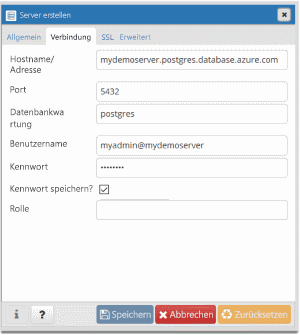
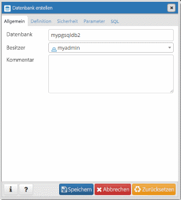

# <a name="quickstart-create-an-azure-database-for-postgresql---single-server-using-the-azure-cli"></a>Schnellstart: Erstellen eines Azure Database for PostgreSQL-Einzelservers mit der Azure CLI

> [!TIP]
> Erwägen Sie die Verwendung eines vereinfachten [az postgres up](/cli/azure/ext/db-up/postgres#ext-db-up-az-postgres-up)-Azure CLI-Befehls (derzeit in der Vorschauphase). Probieren Sie den [Schnellstart](./quickstart-create-server-up-azure-cli.md) aus.

Azure-Datenbank für PostgreSQL ist ein verwalteter Dienst, mit dem Sie hochverfügbare PostgreSQL-Datenbanken in der Cloud ausführen, verwalten und skalieren können. Die Azure CLI dient zum Erstellen und Verwalten von Azure-Ressourcen über die Befehlszeile oder mit Skripts. Dieser Schnellstart veranschaulicht das Erstellen einer Azure-Datenbank für PostgreSQL-Server in einer [Azure-Ressourcengruppe](https://docs.microsoft.com/azure/azure-resource-manager/resource-group-overview) mithilfe der Azure-CLI.

Wenn Sie kein Azure-Abonnement besitzen, können Sie ein [kostenloses Konto](https://azure.microsoft.com/free/) erstellen, bevor Sie beginnen.

[!INCLUDE [cloud-shell-try-it](../../includes/cloud-shell-try-it.md)]

Wenn Sie die CLI lokal installieren und verwenden möchten, müssen Sie für diesen Artikel die Azure CLI-Version 2.0 oder höher ausführen. Führen Sie den Befehl `az --version` aus, um die installierte Version anzuzeigen. Informationen zum Durchführen einer Installation oder eines Upgrades finden Sei bei Bedarf unter [Installieren der Azure CLI]( /cli/azure/install-azure-cli). 

Wenn Sie die CLI lokal ausführen, müssen Sie sich mit dem Befehl [az login](/cli/azure/authenticate-azure-cli?view=interactive-log-in) bei Ihrem Konto anmelden. Beachten Sie die Eigenschaft **ID** aus der Befehlsausgabe für den entsprechenden Abonnementnamen.
```azurecli-interactive
az login
```

Wenn Sie über mehrere Abonnements verfügen, wählen Sie das entsprechende Abonnement aus, in dem die Ressource fakturiert sein sollte. Wählen Sie mithilfe des Befehls [az account set](/cli/azure/account) die Abonnement-ID unter Ihrem Konto aus. Ersetzen Sie den Platzhalter für die Abonnement-ID durch die Eigenschaft **ID** aus der Ausgabe von **az login** für Ihr Abonnement.
```azurecli-interactive
az account set --subscription <subscription id>
```

## <a name="create-a-resource-group"></a>Erstellen einer Ressourcengruppe

Erstellen Sie mit dem Befehl [az group create](/cli/azure/group) eine [Azure-Ressourcengruppe](../azure-resource-manager/resource-group-overview.md). Eine Ressourcengruppe ist ein logischer Container, in dem Azure-Ressourcen bereitgestellt und als Gruppe verwaltet werden. Geben Sie daher einen eindeutigen Namen an. Im folgenden Beispiel wird eine Ressourcengruppe mit dem Namen `myresourcegroup` am Standort `westus` erstellt.
```azurecli-interactive
az group create --name myresourcegroup --location westus
```

## <a name="create-an-azure-database-for-postgresql-server"></a>Erstellen einer Azure-Datenbank für PostgreSQL-Server

Erstellen Sie mit dem Befehl [az postgres server create](/cli/azure/postgres/server) eine [Azure-Datenbank für PostgreSQL-Server](overview.md). Ein Server kann mehrere Datenbanken enthalten.


**Einstellung** | **Beispielwert** | **Beschreibung**
---|---|---
name | mydemoserver | Wählen Sie einen eindeutigen Namen, der Ihre Azure-Datenbank für PostgreSQL-Server identifiziert. Der Servername darf nur Kleinbuchstaben, Zahlen und den Bindestrich (-) enthalten. Es muss zwischen drei und 63 Zeichen lang sein.
resource-group | myresourcegroup | Geben Sie den Namen der Azure-Ressourcengruppe an.
sku-name | GP_Gen5_2 | Der Name der SKU. Folgt der Konvention „{Tarif}\_{Computegeneration}\_{virtuelle Kerne}“ in Kurzform. Unter dieser Tabelle finden Sie weitere Informationen zum sku-name-Parameter.
backup-retention | 7 | Gibt die Aufbewahrungsdauer für eine Sicherung an. Die Einheit ist Tage. Der Bereich umfasst 7 bis 35. 
geo-redundant-backup | Deaktiviert | Gibt an, ob georedundante Sicherungen für diesen Server aktiviert werden sollen. Zulässige Werte: „Aktiviert“, „Deaktiviert“
location | westus | Der Azure-Standort für den Server.
ssl-enforcement | Enabled | Gibt an, ob SSL für diesen Server aktiviert werden soll. Zulässige Werte: „Aktiviert“, „Deaktiviert“
storage-size | 51.200 | Die Speicherkapazität des Servers (Einheit: MB). Die kleinste gültige Speichergröße ist 5.120MB, die in Schritten von 1.024MB erhöht wird. Im Dokument [Tarife](./concepts-pricing-tiers.md) finden Sie weitere Informationen zu den Grenzwerten bei der Speichergröße. 
Version | 9,6 | Die PostgreSQL-Hauptversion.
admin-user | myadmin | Der Benutzername für die Administratoranmeldung. Dieser darf nicht **azure_superuser**, **admin**, **administrator**, **root**, **guest** oder **public** lauten.
admin-password | *sicheres Kennwort* | Das Kennwort des Administratorbenutzers. Es muss zwischen acht und 128 Zeichen lang sein. Das Kennwort muss Zeichen aus drei der folgenden Kategorien enthalten: Englische Großbuchstaben, englische Kleinbuchstaben, Zahlen und nicht alphanumerische Zeichen.


Für den Parameterwert des SKU-Namens wird die Konvention „{Tarif}\_{Computegeneration}\_{V-Kerne}“ verwendet, wie in den folgenden Beispielen:
+ `--sku-name B_Gen5_1` ist „Basic“, „Gen 5“ und „1 virtueller Kern“ zugeordnet. Bei dieser Option handelt es sich um die kleinste verfügbare SKU.
+ `--sku-name GP_Gen5_32` ist „Universell“, „Gen 5“ und „32 V-Kerne“ zugeordnet.
+ `--sku-name MO_Gen5_2` ist „Arbeitsspeicheroptimiert“, „Gen 5“ und „2 V-Kerne“ zugeordnet.

Informationen zu den gültigen Werten pro Region und Tarif finden Sie in der Dokumentation zu [Tarifen](./concepts-pricing-tiers.md).

Im folgenden Beispiel wird in der Region „USA, Westen“ die PostgreSQL 9.6-Serverinstanz `mydemoserver` in der Ressourcengruppe `myresourcegroup` mit dem Serveradministrator-Anmeldenamen `myadmin` erstellt. Dies ist ein **Gen 4**-Server vom Typ **Universell** mit zwei **virtuellen Kernen**. Ersetzen Sie das `<server_admin_password>` durch einen eigenen Wert.
```azurecli-interactive
az postgres server create --resource-group myresourcegroup --name mydemoserver  --location westus --admin-user myadmin --admin-password <server_admin_password> --sku-name GP_Gen4_2 --version 9.6
```

> [!NOTE]
> Ziehen Sie die Verwendung des Tarifs „Basic“ in Betracht, wenn geringe Compute- und E/A-Leistung für Ihre Workload angemessen ist. Beachten Sie, dass im Tarif „Basic“ erstellte Server später nicht auf „Universell“ oder „Arbeitsspeicheroptimiert“ skaliert werden können. Weitere Informationen hierzu finden Sie in der [Preisübersicht](https://azure.microsoft.com/pricing/details/postgresql/).
> 

## <a name="configure-a-server-level-firewall-rule"></a>Konfigurieren einer Firewallregel auf Serverebene

Erstellen Sie mit dem Befehl [az postgres server firewall-rule create](/cli/azure/postgres/server/firewall-rule) eine Azure-PostgreSQL-Firewallregel auf Serverebene. Eine Firewallregel auf Serverebene ermöglicht einer externen Anwendung wie z.B. [psql](https://www.postgresql.org/docs/9.2/static/app-psql.html) oder [PgAdmin](https://www.pgadmin.org/), über die Firewall des Azure-PostgreSQL-Diensts eine Verbindung mit Ihrem Server herzustellen. 

Sie können eine Firewallregel festlegen, die einen Bereich von IP-Adressen abdeckt, mit denen Verbindungen aus dem Netzwerk hergestellt werden können. Im folgenden Beispiel wird mit [az postgres server firewall-rule create](/cli/azure/postgres/server/firewall-rule) die Firewallregel `AllowMyIP` für eine einzelne IP-Adresse erstellt.
```azurecli-interactive
az postgres server firewall-rule create --resource-group myresourcegroup --server mydemoserver --name AllowMyIP --start-ip-address 192.168.0.1 --end-ip-address 192.168.0.1
```

> [!NOTE]
> Der Azure-PostgreSQL-Server kommuniziert über Port 5432. Wenn Sie eine Verbindung aus einem Unternehmensnetzwerk heraus herstellen, wird der ausgehende Datenverkehr über Port 5432 von der Firewall Ihres Netzwerks unter Umständen nicht zugelassen. Ihre IT-Abteilung muss Port 5432 öffnen, damit Sie eine Verbindung mit Ihrem Azure PostgreSQL-Server herstellen können.

## <a name="get-the-connection-information"></a>Abrufen der Verbindungsinformationen

Zum Herstellen einer Verbindung zum Server müssen Sie Hostinformationen und Anmeldeinformationen für den Zugriff angeben.
```azurecli-interactive
az postgres server show --resource-group myresourcegroup --name mydemoserver
```

Das Ergebnis liegt im JSON-Format vor. Notieren Sie sich die Werte für **administratorLogin** und **fullyQualifiedDomainName**.
```json
{
  "administratorLogin": "myadmin",
  "earliestRestoreDate": null,
  "fullyQualifiedDomainName": "mydemoserver.postgres.database.azure.com",
  "id": "/subscriptions/00000000-0000-0000-0000-000000000000/resourceGroups/myresourcegroup/providers/Microsoft.DBforPostgreSQL/servers/mydemoserver",
  "location": "westus",
  "name": "mydemoserver",
  "resourceGroup": "myresourcegroup",
  "sku": {
    "capacity": 2,
    "family": "Gen5",
    "name": "GP_Gen5_2",
    "size": null,
    "tier": "GeneralPurpose"
  },
  "sslEnforcement": "Enabled",
  "storageProfile": {
    "backupRetentionDays": 7,
    "geoRedundantBackup": "Disabled",
    "storageMb": 5120
  },
  "tags": null,
  "type": "Microsoft.DBforPostgreSQL/servers",
  "userVisibleState": "Ready",
  "version": "9.6"
}
```

## <a name="connect-to-postgresql-database-using-psql"></a>Herstellen einer Verbindung mit einer PostgreSQL-Datenbank mithilfe von psql

Wenn auf Ihrem Clientcomputer PostgreSQL installiert ist, können Sie mit einer lokalen Instanz von [psql](https://www.postgresql.org/docs/current/static/app-psql.html) eine Verbindung mit einer Azure-PostgreSQL-Serverinstanz herstellen. Wir stellen jetzt mit dem Befehlszeilen-Hilfsprogramm psql eine Verbindung mit dem Azure-PostgreSQL-Server her.

1. Führen Sie den folgenden psql-Befehl aus, um für eine PostgreSQL-Serverinstanz eine Verbindung mit einer Azure-Datenbank herzustellen:
   ```bash
   psql --host=<servername> --port=<port> --username=<user@servername> --dbname=<dbname>
   ```

   Mit dem folgenden Befehl wird beispielsweise mit den Zugriffsanmeldeinformationen eine Verbindung mit der Standarddatenbank **postgres** auf Ihrem PostgreSQL-Server **mydemoserver.postgres.database.azure.com** hergestellt. Geben Sie das `<server_admin_password>` ein, das Sie bei der Aufforderung zur Kennworteingabe ausgewählt haben.
  
   ```bash
   psql --host=mydemoserver.postgres.database.azure.com --port=5432 --username=myadmin@mydemoserver --dbname=postgres
   ```

2. Sobald Sie mit dem Server verbunden sind, erstellen Sie eine leere Datenbank an der Eingabeaufforderung.
   ```sql
   CREATE DATABASE mypgsqldb;
   ```

3. Führen Sie an der Eingabeaufforderung den folgenden Befehl zum Wechseln der Verbindung zur neu erstellten Datenbank **mypgsqldb** aus:
   ```sql
   \c mypgsqldb
   ```

## <a name="connect-to-the-postgresql-server-using-pgadmin"></a>Herstellen einer Verbindung mit dem PostgreSQL-Server mithilfe von pgAdmin

pgAdmin ist ein Open-Source-Tool, das zusammen mit PostgreSQL verwendet wird. Sie können pgAdmin von der [pgAdmin-Website](https://www.pgadmin.org/) installieren. Ihre pgAdmin-Version unterscheidet sich unter Umständen von der Version aus dieser Schnellstartanleitung. Weitere Informationen finden Sie bei Bedarf in der pgAdmin-Dokumentation.

1. Öffnen Sie die Anwendung pgAdmin auf dem Clientcomputer.

2. Navigieren Sie über die Symbolleiste zu **Objekt**, zeigen Sie auf **Erstellen**, und klicken Sie auf **Server**.

3. Geben Sie im Dialogfeld **Erstellen – Server** auf der Registerkarte **Allgemein** einen eindeutigen Anzeigenamen für den Server ein (z.B. **mydemoserver**).

   

4. Füllen Sie im Dialogfeld **Erstellen – Server** auf der Registerkarte **Verbindung** die folgende Einstellungstabelle aus.

   

    pgAdmin-Parameter |Wert|BESCHREIBUNG
    ---|---|---
    Hostname/Adresse | Servername | Der Servername, den Sie weiter oben beim Erstellen des Azure-Datenbank für PostgreSQL-Servers verwendet haben. Unser Beispielserver heißt **mydemoserver.postgres.database.azure.com**. Verwenden Sie den vollqualifizierten Domänennamen (**\*.postgres.database.azure.com**), wie im Beispiel gezeigt. Sollten Sie sich nicht an Ihren Servernamen erinnern, ermitteln Sie die Verbindungsinformationen gemäß den Schritten aus dem vorherigen Abschnitt. 
    Port | 5432 | Der Port zum Herstellen einer Verbindung mit dem Azure-Datenbank für PostgreSQL-Server 
    Wartungsdatenbank | *postgres* | Der vom System generierte Standardname der Datenbank
    Username | Anmeldename des Serveradministrators | Der Anmeldename des Serveradministrators, den Sie zuvor beim Erstellen des Azure-Datenbank für PostgreSQL-Servers verwendet haben. Sollten Sie sich nicht an Benutzernamen erinnern, ermitteln Sie die Verbindungsinformationen gemäß den Schritten aus dem vorherigen Abschnitt. Das Format lautet: *Benutzername\@Servername*.
    Kennwort | Ihr Administratorkennwort | Das Kennwort, das Sie beim Erstellen des Servers weiter oben in dieser Schnellstartanleitung ausgewählt haben
    Rolle | Nicht ausfüllen | Zu diesem Zeitpunkt müssen Sie keinen Rollennamen angeben. Lassen Sie das Feld leer.
    SSL-Modus | *Anfordern* | Der SSL-Modus kann auf der Registerkarte „SSL“ von PgAdmin festgelegt werden. In der Standardeinstellung werden alle Azure Database for PostgreSQL-Server mit aktivierter SSL-Erzwingung erstellt. Informationen zum Deaktivieren der SSL-Erzwingung finden Sie unter [Konfigurieren von SSL-Konnektivität in Azure Database for PostgreSQL](./concepts-ssl-connection-security.md).
    
5. Wählen Sie **Speichern** aus.

6. Erweitern Sie im linken Bereich **Browser** den Knoten **Server**. Wählen Sie Ihren Server aus (z.B. **mydemoserver**). Durch Klicken stellen Sie eine Verbindung her.

7. Erweitern Sie den Serverknoten und anschließend darunter den Eintrag **Datenbanken**. Die Liste sollte Ihre Datenbank vom Typ *postgres* sowie andere Datenbanken enthalten, die Sie ggf. erstellt haben. Mit Azure Database for PostgreSQL können mehrere Datenbanken pro Server erstellt werden.

8. Klicken Sie mit der rechten Maustaste auf **Datenbanken**, wählen Sie das Menü **Erstellen** und dann **Datenbank** aus.

9. Geben Sie im Feld **Datenbank** einen Datenbanknamen Ihrer Wahl ein (z.B. **mypgsqldb2**).

10. Wählen Sie im Listenfeld den **Besitzer** der Datenbank aus. Wählen Sie den Anmeldenamen des Serveradministrators aus (in diesem Beispiel **my admin**).

    

11. Wählen Sie **Speichern** aus, um eine neue leere Datenbank zu erstellen.

12. Die erstellte Datenbank wird im Bereich **Browser** in der Liste mit den Datenbanken unter Ihrem Servernamen angezeigt.


## <a name="clean-up-resources"></a>Bereinigen von Ressourcen

Bereinigen Sie alle im Schnellstart erstellten Ressourcen, indem Sie die [Azure-Ressourcengruppe](../azure-resource-manager/resource-group-overview.md) löschen.

> [!TIP]
> Andere Schnellstarts in dieser Sammlung bauen auf diesem Schnellstart auf. Wenn Sie planen, mit den nachfolgenden Schnellstarts fortzufahren, sollten Sie die in diesem Schnellstart erstellten Ressourcen nicht bereinigen. Falls Sie nicht fortfahren möchten, können Sie die folgenden Schritte ausführen, um alle erstellten Ressourcen dieses Schnellstarts in der Azure-CLI zu löschen.

```azurecli-interactive
az group delete --name myresourcegroup
```

Wenn Sie nur den neu erstellten Server löschen möchten, können Sie den Befehl [az postgres server delete](/cli/azure/postgres/server) ausführen.
```azurecli-interactive
az postgres server delete --resource-group myresourcegroup --name mydemoserver
```

## <a name="next-steps"></a>Nächste Schritte
> [!div class="nextstepaction"]
> [Migrieren der Datenbank mit Export und Import](./howto-migrate-using-export-and-import.md)

