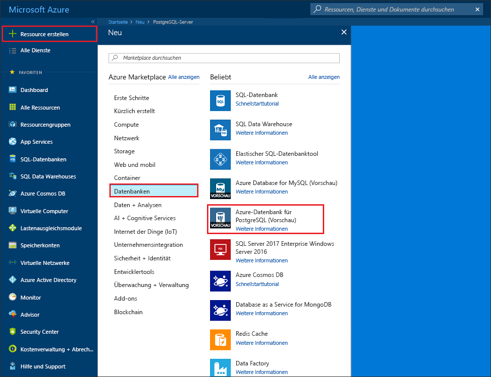
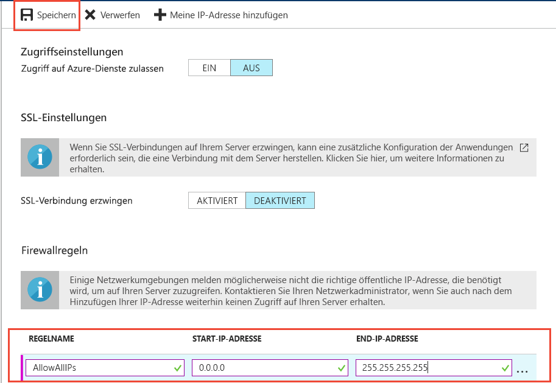

# <a name="tutorial-design-an-azure-database-for-postgresql-using-the-azure-portal"></a>Tutorial: Entwerfen einer Azure Database for PostgreSQL-Instanz mithilfe des Azure-Portals

Azure-Datenbank für PostgreSQL ist ein verwalteter Dienst, mit dem Sie hochverfügbare PostgreSQL-Datenbanken in der Cloud ausführen, verwalten und skalieren können. Mit dem Azure-Portal können Sie mühelos Ihren Server verwalten und eine Datenbank entwerfen.

In diesem Tutorial verwenden Sie das Azure-Portal, um Folgendes zu lernen:
> [!div class="checklist"]
> * Erstellen einer Azure-Datenbank für PostgreSQL-Server
> * Konfigurieren der Serverfirewall
> * Erstellen einer Datenbank mit dem Hilfsprogramm [**psql**](https://www.postgresql.org/docs/9.6/static/app-psql.html)
> * Laden von Beispieldaten
> * Abfragen von Daten
> * Aktualisieren von Daten
> * Wiederherstellen von Daten

## <a name="prerequisites"></a>Voraussetzungen
Wenn Sie kein Azure-Abonnement besitzen, können Sie ein [kostenloses Konto](https://azure.microsoft.com/free/) erstellen, bevor Sie beginnen.

## <a name="log-in-to-the-azure-portal"></a>Anmelden beim Azure-Portal
Melden Sie sich beim [Azure-Portal](https://portal.azure.com)an.

## <a name="create-an-azure-database-for-postgresql"></a>Erstellen einer Azure-Datenbank für PostgreSQL

Eine Azure-Datenbank für PostgreSQL-Server wird mit einer definierten Gruppe von [Compute- und Speicherressourcen](./concepts-compute-unit-and-storage.md) erstellt. Der Server wird in einer [Azure-Ressourcengruppe](../azure-resource-manager/resource-group-overview.md) erstellt.

Führen Sie die folgenden Schritte aus, um eine Azure-Datenbank für PostgreSQL-Server zu erstellen:
1.  Klicken Sie im Azure-Portal links oben auf **Ressource erstellen**.
2.  Wählen Sie auf der Seite **Neu** die Option **Datenbanken** und dann auf der Seite **Datenbanken** die Option **Azure-Datenbank für PostgreSQL** aus.
  

3.  Geben Sie im Formular für den neuen Server folgende Informationen an:

    

    - Servername: **mydemoserver** (Der Name eines Servers wird dem DNS-Namen zugeordnet und muss deshalb global eindeutig sein.) 
    - Abonnement: Wenn Sie über mehrere Abonnements verfügen, wählen Sie das entsprechende Abonnement aus, in dem die Ressource vorhanden ist oder in Rechnung gestellt wird.
    - Ressourcengruppe: **myresourcegroup**
    - Serveradministrator-Anmeldename und ein Kennwort Ihrer Wahl
    - Speicherort
    - PostgreSQL-Version

   > [!IMPORTANT]
   > Der hier angegebene Benutzername und das Kennwort für den Serveradministrator sind erforderlich, um später in diesem Tutorial die Anmeldung am Server und bei den zugehörigen Datenbanken auszuführen. Behalten Sie diese Angaben im Kopf, oder notieren Sie sie zur späteren Verwendung.

4.  Klicken Sie auf **Tarif**, um den Tarif für Ihren neuen Server anzugeben. Wählen Sie für dieses Tutorial Folgendes aus: **Universell**, Computegeneration **Gen 4**, zwei **vCores**, 5 GB **Speicher** und eine **Aufbewahrungszeit für Sicherung** von sieben Tagen. Wählen Sie für die Sicherungsredundanz die Option **Georedundant** aus, damit die automatischen Sicherungen Ihres Servers in geografisch redundantem Speicher gespeichert werden.
 

5.  Klicken Sie auf **OK**.

6.  Klicken Sie auf **Erstellen**, um den Server bereitzustellen. Die Bereitstellung dauert einige Minuten.

7.  Klicken Sie in der Symbolleiste auf **Benachrichtigungen**, um den Bereitstellungsprozess zu überwachen.
 

   > [!TIP]
   > Aktivieren Sie die Option **An Dashboard anheften**, um leichtes Nachverfolgen Ihrer Bereitstellungen zu ermöglichen.

   Standardmäßig wird die **postgres**-Datenbank unter dem Server erstellt. Die [postgres](https://www.postgresql.org/docs/9.6/static/app-initdb.html)-Datenbank ist eine Standarddatenbank für die Verwendung durch Benutzer, Hilfsprogramme und Drittanbieteranwendungen. 

## <a name="configure-a-server-level-firewall-rule"></a>Konfigurieren einer Firewallregel auf Serverebene

Der Azure Database for PostgreSQL-Dienst verwendet eine Firewall auf der Serverebene. Diese Firewall hindert standardmäßig alle externen Anwendungen und Tools daran, eine Verbindung mit dem Server und den Datenbanken auf dem Server herzustellen (sofern keine Firewallregel erstellt wird, um die Firewall für einen bestimmten Bereich von IP-Adressen zu öffnen). 

1.  Klicken Sie nach Abschluss der Bereitstellung im linken Menü auf **Alle Ressourcen**, und geben Sie den Namen **mydemoserver** ein, um nach dem neu erstellten Server zu suchen. Klicken Sie auf den im Suchergebnis aufgelisteten Servernamen. Die Seite **Übersicht** für Ihren Server wird geöffnet und enthält Optionen für die weitere Konfiguration.

   

2.  Wählen Sie auf der Serverseite die Option **Verbindungssicherheit** aus. 

3.  Klicken Sie in das Textfeld unter **Regelname**, und fügen Sie eine neue Firewallregel hinzu, um den IP-Adressbereich auf die Whitelist für die Konnektivität zu setzen. Für dieses Tutorial lassen wir durch Eingabe von **Regelname = AllowAllIps**, **Start-IP = 0.0.0.0** und **End-IP = 255.255.255.255** alle IP-Adressen zu und klicken dann auf **Speichern**. Sie können eine bestimmte Firewallregel festlegen, die einen kleineren Bereich von IP-Adressen abdeckt, mit denen Verbindungen aus dem Netzwerk hergestellt werden können.

   

4.  Klicken Sie auf **Speichern** und dann auf **X**, um die Seite **Verbindungssicherheit** zu schließen.

   > [!NOTE]
   > Der Azure-PostgreSQL-Server kommuniziert über Port 5432. Wenn Sie versuchen, eine Verbindung aus einem Unternehmensnetzwerk heraus herzustellen, wird der ausgehende Datenverkehr über Port 5432 von der Firewall Ihres Netzwerks unter Umständen nicht zugelassen. In diesem Fall können Sie nur dann eine Verbindung mit Ihrem Azure SQL-Datenbankserver herstellen, wenn Ihre IT-Abteilung Port 5432 öffnet.
   >

## <a name="get-the-connection-information"></a>Abrufen der Verbindungsinformationen

Als Sie den Azure Database for PostgreSQL-Server erstellt haben, wurde auch die Standarddatenbank **postgres** erstellt. Zum Herstellen einer Verbindung mit dem Datenbankserver müssen Sie Hostinformationen und Anmeldeinformationen für den Zugriff angeben.

1. Klicken Sie im Azure-Portal im linken Menü auf **Alle Ressourcen**, und suchen Sie nach dem Server, den Sie gerade erstellt haben.

   

2. Klicken Sie auf den Servernamen **mydemoserver**.

3. Wählen Sie die Seite **Übersicht** des Servers aus. Notieren Sie sich den **Servernamen** und den **Anmeldenamen des Serveradministrators**.

   


## <a name="connect-to-postgresql-database-using-psql-in-cloud-shell"></a>Herstellen einer Verbindung mit der PostgreSQL-Datenbank mithilfe von psql in Cloud Shell

Stellen Sie jetzt mit dem Befehlszeilen-Hilfsprogramm [psql](https://www.postgresql.org/docs/9.6/static/app-psql.html) eine Verbindung mit dem Azure Database for PostgreSQL-Server her. 
1. Starten Sie die Azure Cloud Shell über das Terminalsymbol im oberen Navigationsbereich.

   

2. Die Azure Cloud Shell wird in Ihrem Browser geöffnet, sodass Sie Bash-Befehle eingeben können.

   

3. Stellen Sie an der Cloud Shell-Eingabeaufforderung mit den psql-Befehlen eine Verbindung mit Ihrem Azure-Datenbank für PostgreSQL-Server her. Das folgende Format wird verwendet, um mit dem Hilfsprogramm [psql](https://www.postgresql.org/docs/9.6/static/app-psql.html) eine Verbindung mit einer Azure-Datenbank für PostgreSQL-Server herzustellen:
   ```bash
   psql --host=<myserver> --port=<port> --username=<server admin login> --dbname=<database name>
   ```

   Mit dem folgenden Befehl wird beispielsweise mit den Zugriffsanmeldeinformationen eine Verbindung mit der Standarddatenbank **postgres** auf Ihrem PostgreSQL-Server **mydemoserver.postgres.database.azure.com** hergestellt. Geben Sie Ihr Serveradministrator-Kennwort ein, wenn Sie dazu aufgefordert werden.

   ```bash
   psql --host=mydemoserver.postgres.database.azure.com --port=5432 --username=myadmin@mydemoserver --dbname=postgres
   ```

## <a name="create-a-new-database"></a>Erstellen einer neuen Datenbank
Sobald Sie mit dem Server verbunden sind, erstellen Sie eine leere Datenbank an der Eingabeaufforderung.
```bash
CREATE DATABASE mypgsqldb;
```

Führen Sie an der Eingabeaufforderung den folgenden Befehl zum Wechseln der Verbindung zur neu erstellten Datenbank **mypgsqldb** aus.
```bash
\c mypgsqldb
```
## <a name="create-tables-in-the-database"></a>Erstellen von Tabellen in der Datenbank
Da Sie nun wissen, wie Sie eine Verbindung mit Azure Database for PostgreSQL herstellen, können Sie einige grundlegende Aufgaben ausführen:

Zunächst erstellen Sie eine Tabelle und füllen sie mit einigen Daten auf. Erstellen Sie nun mit dem folgenden SQL-Code eine Tabelle, die Bestandsinformationen nachverfolgt:
```sql
CREATE TABLE inventory (
    id serial PRIMARY KEY, 
    name VARCHAR(50), 
    quantity INTEGER
);
```

Um die neu erstellte Tabelle in der Liste der Tabellen anzuzeigen, geben Sie Folgendes ein:
```sql
\dt
```

## <a name="load-data-into-the-tables"></a>Laden von Daten in die Tabellen
Jetzt können Sie Daten in die Tabelle einfügen. Führen Sie im geöffneten Eingabeaufforderungsfenster die folgende Abfrage zum Einfügen einiger Datenzeilen aus.
```sql
INSERT INTO inventory (id, name, quantity) VALUES (1, 'banana', 150); 
INSERT INTO inventory (id, name, quantity) VALUES (2, 'orange', 154);
```

Die Bestandstabelle, die Sie zuvor erstellt haben, enthält nun zwei Zeilen mit Beispieldaten.

## <a name="query-and-update-the-data-in-the-tables"></a>Abfragen und Aktualisieren der Daten in den Tabellen
Führen Sie die folgende Abfrage aus, um Informationen aus der Bestandsdatenbanktabelle abzurufen. 
```sql
SELECT * FROM inventory;
```

Sie können die Daten in der Tabelle auch aktualisieren.
```sql
UPDATE inventory SET quantity = 200 WHERE name = 'banana';
```

Die aktualisierten Werte werden angezeigt, wenn Sie die Daten abrufen.
```sql
SELECT * FROM inventory;
```

## <a name="restore-data-to-a-previous-point-in-time"></a>Wiederherstellung des Zustands der Daten zu einem früheren Zeitpunkt
Stellen Sie sich vor, Sie haben versehentlich diese Tabelle gelöscht. Dies ist eine Situation, in der Sie die Datenbank nicht einfach wiederherstellen können. Mit Azure Database for PostgreSQL können Sie eine beliebige Zeitpunktsicherung Ihres Servers (abhängig vom konfigurierten Aufbewahrungszeitraum für Sicherungen) auf einem neuen Server wiederherstellen. Sie können diesen neuen Server zur Wiederherstellung gelöschter Daten verwenden. Mithilfe der folgenden Schritte wird der Server **mydemoserver** zu einem Zeitpunkt wiederhergestellt, der vor dem Hinzufügen der Bestandstabelle liegt.

1.  Klicken Sie auf der Seite **Übersicht** von Azure Database for PostgreSQL für Ihren Server auf der Symbolleiste auf **Wiederherstellen**. Die Seite **Wiederherstellen** wird geöffnet.

   

2.  Geben Sie im Formular **Wiederherstellen** die erforderlichen Informationen ein:

   

   - **Wiederherstellungspunkt**: Wählen Sie einen Zeitpunkt vor der Änderung des Servers aus.
   - **Zielserver**: Geben Sie einen neuen Servernamen für die Wiederherstellung ein.
   - **Speicherort**: Sie können die Region nicht auswählen. Standardmäßig ist dieser Wert mit dem Quellserver identisch.
   - **Tarif**: Sie können diesen Wert beim Wiederherstellen eines Servers nicht ändern. Er ist mit dem Wert für den Quellserver identisch. 
3.  Klicken Sie auf **OK**, um den [Server zu einem Zeitpunkt wiederherzustellen](./howto-restore-server-portal.md), der vor dem Löschen der Tabelle liegt. Beim Wiederherstellen eines Servers im Zustand eines anderen Zeitpunkts wird ein Duplikat des ursprünglichen Servers im Zustand des von Ihnen angegebenen Zeitpunkts als neuer Server erstellt – vorausgesetzt, dieser Zeitpunkt liegt innerhalb des Aufbewahrungszeitraums für Ihren [Tarif](./concepts-pricing-tiers.md).

## <a name="next-steps"></a>Nächste Schritte
In diesem Tutorial haben Sie gelernt, wie Sie das Azure-Portal und andere Hilfsprogramme für Folgendes verwenden:
> [!div class="checklist"]
> * Erstellen einer Azure-Datenbank für PostgreSQL-Server
> * Konfigurieren der Serverfirewall
> * Erstellen einer Datenbank mit dem Hilfsprogramm [**psql**](https://www.postgresql.org/docs/9.6/static/app-psql.html)
> * Laden von Beispieldaten
> * Abfragen von Daten
> * Aktualisieren von Daten
> * Wiederherstellen von Daten

Wenn Sie im Anschluss erfahren möchten, wie Sie Azure CLI verwenden, um ähnliche Aufgaben auszuführen, können Sie dieses Tutorial nutzen: [Entwerfen Ihrer ersten Azure Database for PostgreSQL mithilfe von Azure CLI](tutorial-design-database-using-azure-cli.md).
