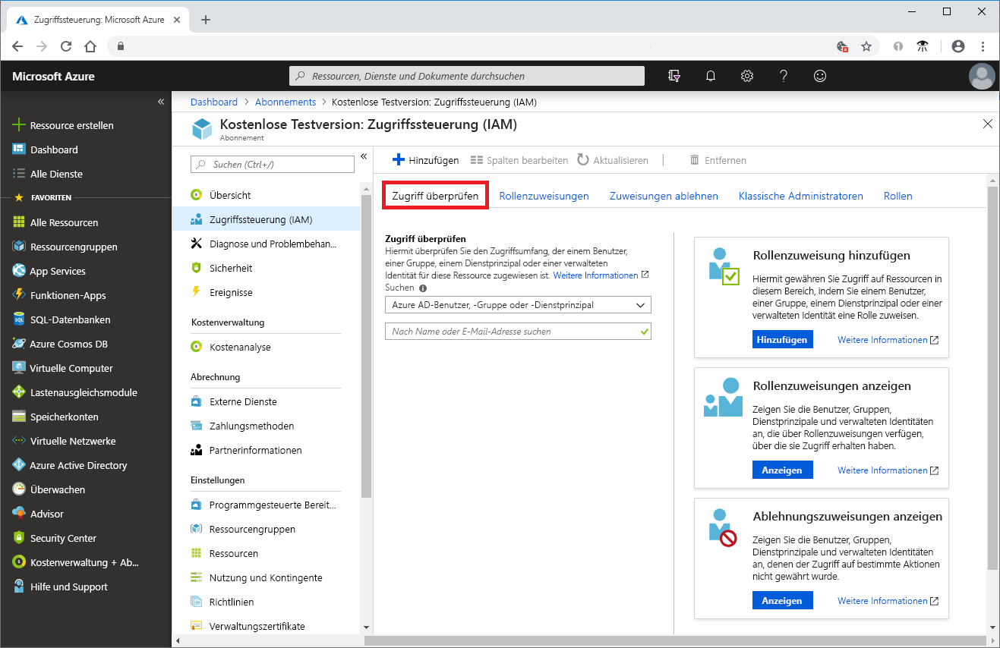
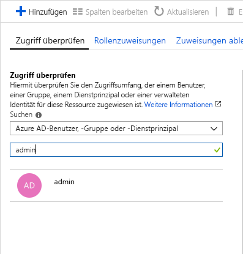

# Schnellstart: Anzeigen der zugewiesenen Rollen von Benutzern mit dem Azure-Portal

Sie können das Blatt **Zugriffssteuerung (IAM)** in [Rollenbasierte Zugriffssteuerung (RBAC)](overview.md) verwenden, um die Rollenzuweisungen für mehrere Benutzer, Gruppen, Dienstprinzipale und verwaltete Identitäten anzuzeigen. In einigen Fällen kann es aber sein, dass Sie nur schnell Rollenzuweisungen für einzelne Benutzer, Gruppen, Dienstprinzipale oder verwaltete Identitäten anzeigen möchten. Die einfachste Möglichkeit ist hierbei die Verwendung der Funktion **Zugriff überprüfen** im Azure-Portal.

## Anzeigen von Rollenzuweisungen

Führen Sie diese Schritte aus, um die Rollenzuweisungen für einzelne Benutzer, Gruppen, Dienstprinzipale oder verwaltete Identitäten auf Abonnementebene anzuzeigen.

1. Klicken Sie im Azure-Portal auf **Alle Dienste** und anschließend auf **Abonnements**.

1. Klicken Sie auf Ihr Abonnement.

1. Klicken Sie auf **Zugriffssteuerung (IAM)**.

1. Klicken Sie auf die Registerkarte **Zugriff überprüfen**.

    

1. Wählen Sie in der Liste **Finden** den Typ des Sicherheitsprinzipals aus, für den Sie den Zugriff überprüfen möchten.

1. Geben Sie in das Suchfeld eine Zeichenfolge ein, nach der das Verzeichnis durchsucht werden soll. Sie können nach Anzeigenamen, E-Mail-Adressen oder Objektbezeichnern suchen.

    

1. Klicken Sie auf den Sicherheitsprinzipal, um den Bereich **Zuweisungen** zu öffnen.

    

    In diesem Bereich werden die Rollen angezeigt, die dem ausgewählten Sicherheitsprinzipal für den Bereich zugewiesen sind. Wenn Ablehnungszuweisungen für diesen Bereich oder an diesen Bereich vererbte Ablehnungszuweisungen vorhanden sind, werden diese angezeigt.

## Nächste Schritte

> [!div class="nextstepaction"]
> [Tutorial: Gewähren des Zugriffs für einen Benutzer mithilfe von RBAC und Azure-Portal](quickstart-assign-role-user-portal.md)
