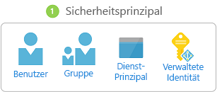
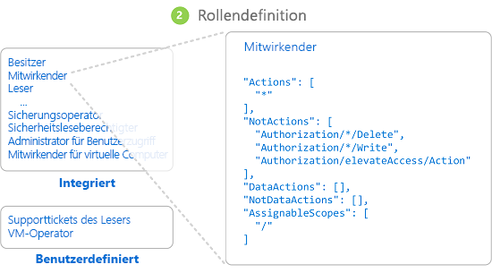
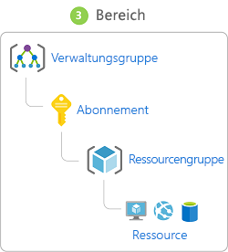
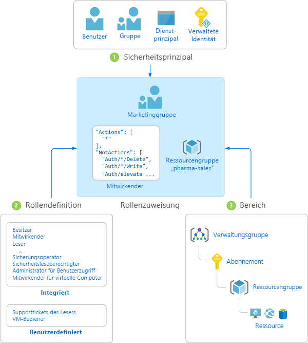
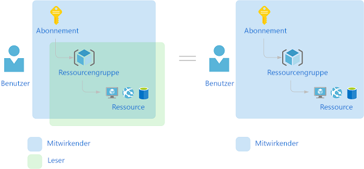

# Was ist die rollenbasierte Zugriffssteuerung (Role-Based Access Control, RBAC) für Azure-Ressourcen?

Die Zugriffsverwaltung für Cloudressourcen ist eine wichtige Funktion für jede Organisation, die die Cloud nutzt. Mit der rollenbasierten Zugriffssteuerung (Role-Based Access Control, RBAC) können Sie verwalten, welche Benutzer Zugriff auf Azure-Ressourcen haben, welche Aktionen für diese Ressourcen ausgeführt werden können und auf welche Bereiche die Benutzer zugreifen können.

RBAC ist ein Autorisierungssystem, das auf [Azure Resource Manager](../azure-resource-manager/resource-group-overview.md) basiert und eine präzise Verwaltung des Zugriffs auf Azure-Ressourcen ermöglicht.

## Welche Möglichkeiten bietet RBAC?

Hier sind einige Beispiele für die Verwendungsmöglichkeiten von RBAC:

- Ein Benutzer kann virtuelle Computer in einem Abonnement verwalten, während ein anderer Benutzer virtuelle Netzwerke verwalten kann
- Eine DBA-Gruppe kann SQL-Datenbanken in einem Abonnement verwalten
- Ein Benutzer kann sämtliche Ressourcen in einer Ressourcengruppe verwalten, wie z.B. virtuelle Computer, Websites und Subnetze
- Eine Anwendung kann auf sämtliche Ressourcen in einer Ressourcengruppe zugreifen

## Bewährte Methode für die Verwendung von RBAC

Mithilfe von RBAC können Sie Aufgaben in Ihrem Team verteilen und Benutzern nur den Zugriff gewähren, den sie zur Ausführung ihrer Aufgaben benötigen. Anstatt allen uneingeschränkte Berechtigungen in Ihrem Azure-Abonnement oder Ihren Ressourcen zu gewähren, können Sie die Berechtigungen auf bestimmte Aktionen in einem bestimmten Bereich beschränken.

Bei der Planung Ihrer Strategie für die Zugriffssteuerung hat es sich bewährt, Benutzern die geringsten Rechte zum Ausführen ihrer Aufgaben zu erteilen. Das folgende Diagramm zeigt ein vorgeschlagenes Muster für die Verwendung von RBAC.

## Funktionsweise von RBAC

Sie können den Zugriff auf Ressourcen mit RBAC steuern, indem Sie Rollenzuweisungen erstellen. Dies ist ein wesentliches Konzept, das zur Durchsetzung von Berechtigungen verwendet wird. Eine Rollenzuweisung besteht aus drei Elementen: Sicherheitsprinzipal, Rollendefinition und Bereich.

### Sicherheitsprinzipal

Ein *Sicherheitsprinzipal* ist ein Objekt, das einen Benutzer, eine Gruppe, einen Dienstprinzipal oder eine verwaltete Identität darstellt, der bzw. die Zugriff auf Azure-Ressourcen anfordert.

- Benutzer: eine Person, die über ein Profil in Azure Active Directory verfügt. Sie können auch bei anderen Mandanten Rollen zu Benutzern zuweisen. Weitere Informationen zu Benutzern in anderen Organisationen finden Sie unter [Azure Active Directory B2B](../active-directory/b2b/what-is-b2b.md).
- Gruppe: eine Reihe von Benutzern, die in Azure Active Directory erstellt wurden. Wenn Sie einer Gruppe eine Rolle zuweisen, verfügen alle Benutzer in dieser Gruppe über diese Rolle. 
- Dienstprinzipal: eine Sicherheitsidentität, die von Anwendungen oder Diensten für den Zugriff auf bestimmte Azure-Ressourcen verwendet wird. Sie können sich diesen als *Benutzeridentität* (Benutzername und Kennwort oder Zertifikat) für eine Anwendung vorstellen.
- Verwaltete Identität: Eine Identität in Azure Active Directory, die automatisch von Azure verwaltet wird. In der Regel verwenden Sie [verwaltete Identitäten](../active-directory/managed-identities-azure-resources/overview.md) bei der Entwicklung von Cloudanwendungen, um die Anmeldeinformationen für die Authentifizierung bei Azure-Diensten zu verwalten.

### Rollendefinition

Eine *Rollendefinition* ist eine Sammlung von Berechtigungen. Gelegentlich wird sie auch einfach als *Rolle* bezeichnet. Eine Rollendefinition listet die ausführbaren Vorgänge wie etwa Lesen, Schreiben und Löschen auf. Rollen können auf allgemeiner Ebene erteilt werden (z.B. Benutzer) oder spezifisch sein (z.B. Leser virtueller Computer).

Azure umfasst mehrere [integrierte Rollen](built-in-roles.md), die Sie verwenden können. Im Folgenden werden vier grundlegende integrierte Rollen aufgeführt. Die ersten drei Rollen gelten für alle Ressourcentypen.

- [Besitzer](built-in-roles.md#owner) verfügen über vollständigen Zugriff auf alle Ressourcen, einschließlich des Rechts, den Zugriff an andere Personen zu delegieren.
- [Mitwirkende](built-in-roles.md#contributor) können alle Arten von Azure-Ressourcen erstellen und verwalten, aber keinen anderen Personen Zugriff gewähren.
- [Leser](built-in-roles.md#reader) können vorhandene Azure-Ressourcen anzeigen.
- Mit einem [Benutzerzugriffsadministrator](built-in-roles.md#user-access-administrator) können Sie den Benutzerzugriff auf Azure-Ressourcen verwalten.

Die verbleibenden integrierten Rollen ermöglichen die Verwaltung bestimmter Azure-Ressourcen. Mit der Rolle [Mitwirkender von virtuellen Computern](built-in-roles.md#virtual-machine-contributor) können Benutzer beispielsweise virtuelle Computer erstellen und verwalten. Sollten die integrierten Rollen den individuellen Ansprüchen Ihrer Organisation nicht genügen, können Sie Ihre eigenen [benutzerdefinierten Rollen für Azure-Ressourcen](custom-roles.md) erstellen.

Mit Datenvorgängen in Azure können Sie Zugriff auf Daten in einem Objekt erteilen. Wenn ein Benutzer z.B. über Lesezugriff auf Daten in einem Speicherkonto verfügt, kann er die Blobs in diesem Speicherkonto lesen. Weitere Informationen finden Sie unter [Grundlegendes zu Rollendefinitionen für Azure-Ressourcen](role-definitions.md).

### `Scope`

Ein *Bereich* ist der für den Zugriff geltende Ressourcensatz. Wenn Sie eine Rolle zuweisen, können Sie die zulässigen Aktionen durch das Definieren eines Bereichs weiter einschränken. Dies ist hilfreich, wenn Sie einem Benutzer die Rolle [Mitwirkender von Websites](built-in-roles.md#website-contributor) zuweisen möchten, jedoch nur für eine Ressourcengruppe.

In Azure können Sie auf mehreren Ebenen einen Bereich angeben: [Verwaltungsgruppe](../governance/management-groups/overview.md), Abonnement, Ressourcengruppe oder Ressource. Bereiche sind in einer Beziehung zwischen über- und untergeordneten Elementen strukturiert.

Wenn Sie den Zugriff in einem übergeordneten Bereich gewähren, werden diese Berechtigungen an den untergeordneten Bereich vererbt. Beispiel:

- Wenn Sie die Rolle [Besitzer](built-in-roles.md#owner) einem Benutzer im Bereich der Verwaltungsgruppe zuweisen, kann dieser Benutzer alles in allen Abonnements in der Verwaltungsgruppe verwalten.
- Wenn Sie einer Rolle im Abonnementkontext die Rolle [Leser](built-in-roles.md#reader) zuweisen, können die Mitglieder dieser Gruppe alle Ressourcengruppen und Ressourcen im Abonnement anzeigen.
- Wenn Sie einer Anwendung im Ressourcengruppenkontext die Rolle [Mitwirkender](built-in-roles.md#contributor) zuweisen, kann diese Ressourcen aller Typen in dieser Ressourcengruppe verwalten, jedoch keine anderen Ressourcengruppen des Abonnements.

### Rollenzuweisungen

Eine *Rollenzuweisung* ist der Prozess, in dem eine Rollendefinition zum Zweck der Zugriffserteilung in einem bestimmten Bereich an einen Benutzer, eine Gruppe, einen Dienstprinzipal oder eine verwaltete Identität gebunden wird. Der Zugriff wird durch Erstellen einer Rollenzuweisung erteilt und durch Entfernen einer Rollenzuweisung widerrufen.

Das folgende Diagramm zeigt ein Beispiel für eine Rollenzuweisung. In diesem Beispiel wurde der Gruppe „Marketing“ die Rolle [Mitwirkender](built-in-roles.md#contributor) für die Ressourcengruppe „Pharmavertrieb“ zugewiesen. Dies bedeutet, dass Benutzer in der Gruppe „Marketing“ in der Ressourcengruppe „Pharmavertrieb“ eine beliebige Azure-Ressource erstellen oder verwalten können. Benutzer der Gruppe „Marketing“ haben keinen Zugriff auf Ressourcen außerhalb der Ressourcengruppe „Pharmavertrieb“, sofern ihnen keine weitere Rolle zugewiesen wurde.

Sie können über das Azure-Portal, die Azure-Befehlszeilenschnittstelle, Azure PowerShell, Azure SDKs oder REST-APIs Rollenzuweisungen erstellen. Sie können in jedem Abonnement bis zu **2000** Rollenzuweisungen und **500** Rollenzuweisungen in jeder Verwaltungsgruppe festlegen. Um Rollenzuweisungen erstellen und entfernen zu können, benötigen Sie die Berechtigung `Microsoft.Authorization/roleAssignments/*`. Diese Berechtigung wird über die Rolle [Besitzer](built-in-roles.md#owner) oder [Benutzerzugriffsadministrator](built-in-roles.md#user-access-administrator) erteilt.

## Mehrere Rollenzuweisungen

Was geschieht bei mehreren überlappenden Rollenzuweisungen? RBAC ist ein additives Modell. Die hinzugefügten Rollenzuweisungen stellen daher Ihre effektiven Berechtigungen dar. Sehen Sie sich das folgende Beispiel an, in dem einem Benutzer die Rolle „Mitwirkender“ im Abonnementbereich und die Rolle „Leser“ für eine Ressourcengruppe zugewiesen wird. Das Hinzufügen der Berechtigungen vom Typ „Mitwirkender“ und der Berechtigungen vom Typ „Leser“ stellt effektiv die Rolle „Mitwirkender“ für die Ressourcengruppe dar. Daher hat die Zuweisung der Rolle „Leser“ in diesem Fall keine Auswirkung.

## Ablehnungszuweisungen

Früher war RBAC ein Modell, in dem es nur Zulassungen und keine Ablehnungen gab, jetzt unterstützt RBAC jedoch auch Ablehnungszuweisungen auf eingeschränkte Weise. Ähnlich wie eine Rollenzuweisung verknüpft eine *Ablehnungszuweisung* in einem bestimmten Bereich einen Satz von Aktionen mit einem Benutzer, einer Gruppe, einem Dienstprinzipal oder einer verwalteten Identität, um den Zugriff zu verweigern. In einer Rollenzuweisung wird einen Satz von Aktionen definiert, die *zulässig* sind, während in einer Ablehnungszuweisung eine Reihe von Aktionen definiert wird, die *nicht zulässig* sind. Das heißt, Ablehnungszuweisungen blockieren Aktionen für bestimmte Benutzer, auch wenn diese durch eine Rollenzuweisung Zugriff erhalten. Ablehnungszuweisungen haben Vorrang vor Rollenzuweisungen. Weitere Informationen finden Sie unter [Verstehen von Ablehnungszuweisungen für Azure-Ressourcen](deny-assignments.md).

## Ermitteln des Benutzerzugriffs auf eine Ressource durch RBAC

Im Folgenden finden Sie die allgemeinen Schritte, über die RBAC ermittelt, ob Sie Zugriff auf eine Ressource auf der Verwaltungsebene haben. Es ist hilfreich, dies zu verstehen, wenn Sie versuchen, ein Zugriffsproblem zu behandeln.

1. Ein Benutzer (oder Dienstprinzipal) erhält ein Token für Azure Resource Manager.

    Das Token enthält die Gruppenmitgliedschaften des Benutzers (einschließlich transitiver Gruppenmitgliedschaften).

1. Der Benutzer führt einen REST-API-Aufruf an Azure Resource Manager mit dem angefügten Token durch.

1. Azure Resource Manager ruft alle Rollenzuweisungen und Ablehnungszuweisungen ab, die die Ressource, für die die Aktion ausgeführt wird, betreffen.

1. Azure Resource Manager begrenzt die Rollenzuweisungen, die diesen Benutzer oder seine Gruppe betreffen, und ermittelt, welche Rollen der Benutzer für diese Ressource besitzt.

1. Azure Resource Manager ermittelt, ob die Aktion im API-Aufruf in den Rollen, die der Benutzer für diese Ressource besitzt, enthalten ist.

1. Wenn der Benutzer keine Rolle mit der Aktion als angefordertem Bereich besitzt, wird kein Zugriff gewährt. Andernfalls überprüft Azure Resource Manager, ob eine Ablehnungszuweisung zutrifft.

1. Wenn eine Ablehnungszuweisung zutrifft, wird der Zugriff blockiert. Andernfalls wird der Zugriff gewährt.

## Lizenzanforderungen

[!INCLUDE [Azure AD free license](../../includes/active-directory-free-license.md)]

## Nächste Schritte

- [Schnellstart: Anzeigen der zugewiesenen Rollen von Benutzern mit dem Azure-Portal](check-access.md)
- [Verwalten des Zugriffs auf Azure-Ressourcen mit RBAC und dem Azure-Portal](role-assignments-portal.md)
- [Grundlegendes zu den verschiedenen Rollen in Azure](rbac-and-directory-admin-roles.md)
- [Enterprise Cloud-Einführung: Ressourcenzugriffsverwaltung in Azure](/azure/architecture/cloud-adoption/governance/resource-consistency/azure-resource-access)
