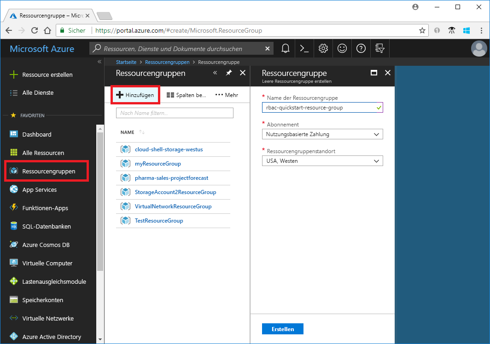
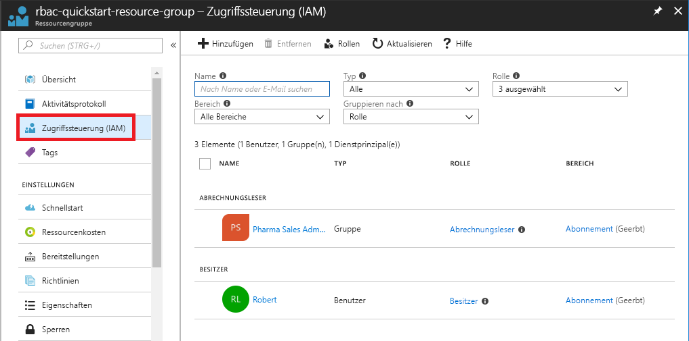
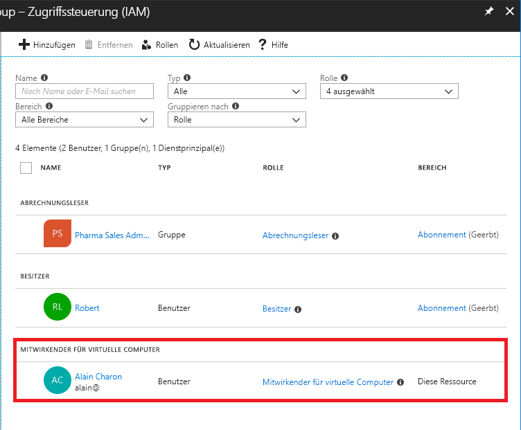

# Tutorial: Gewähren des Zugriffs auf Azure-Ressourcen für einen Benutzer mit RBAC und dem Azure-Portal

Der Zugriff auf Azure-Ressourcen wird mithilfe der [rollenbasierten Zugriffssteuerung (RBAC)](overview.md) verwaltet. In diesem Tutorial gewähren Sie einem Benutzer Zugriff, um virtuelle Computer in einer Ressourcengruppe zu erstellen und zu verwalten.

In diesem Tutorial lernen Sie Folgendes:

> [!div class="checklist"]
> * Gewähren des Zugriffs für einen Benutzer im Ressourcengruppenbereich
> * Zugriff entfernen

Wenn Sie kein Azure-Abonnement besitzen, können Sie ein [kostenloses Konto](https://azure.microsoft.com/free/?WT.mc_id=A261C142F) erstellen, bevor Sie beginnen.

## Anmelden bei Azure

Melden Sie sich unter http://portal.azure.com beim Azure-Portal an.

## Erstellen einer Ressourcengruppe

1. Klicken Sie in der Navigationsliste auf **Ressourcengruppen**.

1. Klicken Sie auf **Hinzufügen**, um das Blatt **Ressourcengruppe** zu öffnen.

   

1. Geben Sie für **Ressourcengruppenname** die Zeichenfolge **rbac-resource-group** ein.

1. Wählen Sie ein Abonnement und einen Standort aus.

1. Klicken Sie auf **Erstellen** , um die Ressourcengruppe zu erstellen.

1. Klicken Sie auf **Aktualisieren**, um die Liste der Ressourcengruppen zu aktualisieren.

   Die neue Ressourcengruppe wird in der Liste Ihrer Ressourcengruppen angezeigt.

   

## Gewähren von Zugriff

In RBAC erstellen Sie zum Gewähren des Zugriffs eine Rollenzuweisung.

1. Klicken Sie in der Liste der **Ressourcengruppen** auf die neue Ressourcengruppe **rbac-resource-group**.

1. Klicken Sie auf **Zugriffssteuerung (IAM)**.

1. Klicken Sie auf die Registerkarte **Rollenzuweisungen**, um die aktuelle Liste mit den Rollenzuweisungen anzuzeigen.

   

1. Klicken Sie auf **Hinzufügen** > **Rollenzuweisung hinzufügen**, um den Bereich „Rollenzuweisung hinzufügen“ zu öffnen.

   Wenn Sie keine Berechtigungen zum Zuweisen von Rollen haben, ist die Option „Rollenzuweisung hinzufügen“ deaktiviert.

   

   

1. Wählen Sie in der Dropdownliste **Rolle** die Rolle **Mitwirkender für virtuelle Computer** aus.

1. Wählen Sie in der Liste **Auswählen** sich selbst oder einen anderen Benutzer aus.

1. Klicken Sie auf **Speichern**, um die Rollenzuweisung zu erstellen.

   Nach einigen Augenblicken wird dem Benutzer die Rolle „Mitwirkender für virtuelle Computer“ im Bereich der Ressourcengruppe „rbac-resource-group“ zugewiesen.

   

## Zugriff entfernen

In RBAC entfernen Sie eine Rollenzuweisung, um den Zugriff zu entfernen.

1. Fügen Sie in der Liste der Rollenzuweisungen ein Häkchen neben dem Benutzer mit der Rolle „Mitwirkender für virtuelle Computer“ hinzu.

1. Klicken Sie auf **Entfernen**.

   

1. Klicken Sie in der angezeigten Meldung zum Entfernen der Rollenzuweisung auf **Ja**.

## Bereinigen

1. Klicken Sie in der Navigationsliste auf **Ressourcengruppen**.

1. Klicken Sie auf **rbac-resource-group**, um die Ressourcengruppe zu öffnen.

1. Klicken Sie auf **Ressourcengruppe löschen**, um die Ressourcengruppe zu löschen.

   

1. Geben Sie auf dem Blatt **Löschvorgang bestätigen**  den Namen der Ressourcengruppe ein: **rbac-resource-group**.

1. Klicken Sie auf **Löschen**, um die Ressourcengruppe zu löschen.

## Nächste Schritte

> [!div class="nextstepaction"]
> [Tutorial: Gewähren des Zugriffs auf Azure-Ressourcen für einen Benutzer mit RBAC und Azure PowerShell](tutorial-role-assignments-user-powershell.md)

