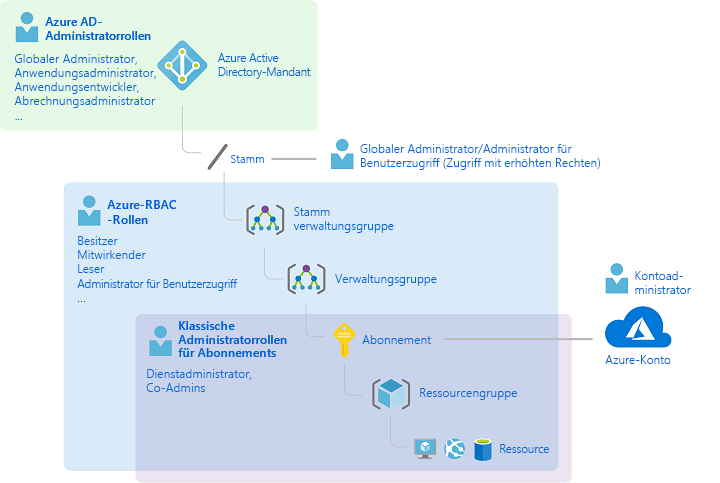
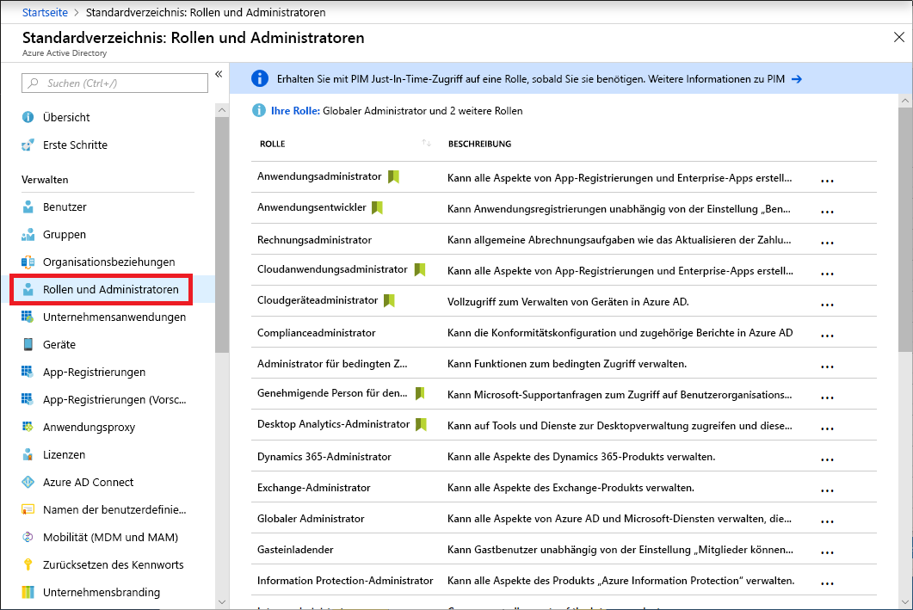
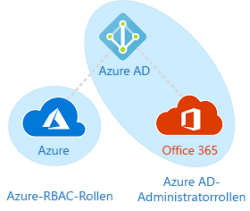

# Administratorrollen für klassische Abonnements, Azure RBAC-Rollen und Azure AD-Administratorrollen

Wenn Azure neu für Sie ist, kann es schwierig sein, alle unterschiedlichen Rollen in Azure zu verstehen. In diesem Artikel werden die folgenden Rollen und ihre Verwendung beschrieben:
- Administrator für klassisches Abonnement
- Rollenbasierte Zugriffssteuerung in Azure
- Azure AD-Administrator (Azure Active Directory)

## Rollenbeziehungen

Es ist hilfreich, sich mit dem Entwicklungsverlauf auszukennen, um die Rollen in Azure besser zu verstehen. Bei der ersten Veröffentlichung von Azure wurde der Zugriff auf Ressourcen mit nur drei Administratorrollen verwaltet: Kontoadministrator, Dienstadministrator und Co-Administrator. Später wurde die rollenbasierte Zugriffssteuerung (Role-Based Access Control, RBAC) für Azure-Ressourcen hinzugefügt. Die rollenbasierte Zugriffssteuerung in Azure ist ein neueres Autorisierungssystem, mit dem eine präzise Verwaltung des Zugriffs auf Azure-Ressourcen ermöglicht wird. RBAC umfasst viele integrierte Rollen, kann in unterschiedlichen Bereichen zugewiesen werden und ermöglicht es Ihnen, Ihre eigenen benutzerdefinierten Rollen zu erstellen. Für die Verwaltung der Ressourcen in Azure AD, z.B. Benutzer, Gruppen und Domänen, gibt es mehrere Azure AD-Administratorrollen.

Das folgende Diagramm enthält eine allgemeine Darstellung zur Beziehung der Rollen „Administrator für klassisches Abonnement“, „Azure RBAC“ und „Azure AD-Administrator“.

## Administrator für klassisches Abonnement

Kontoadministrator, Dienstadministrator und Co-Administrator sind die drei Rollen für „Administrator für klassisches Abonnement“ in Azure. Administratoren für klassische Abonnements verfügen über Vollzugriff auf das Azure-Abonnement. Sie können Ressourcen über das Azure-Portal, Azure Resource Manager-APIs und APIs des klassischen Azure-Bereitstellungsmodells verwalten. Das Konto, das zum Registrieren für Azure verwendet wird, wird automatisch sowohl als Kontoadministrator als auch als Dienstadministrator eingerichtet. Anschließend können zusätzliche Co-Administratoren hinzugefügt werden. Der Dienstadministrator und die Co-Administratoren haben gleichwertigen Zugriff wie Benutzer, denen für den Abonnementbereich die Rolle „Besitzer“ (eine Azure RBAC-Rolle) zugewiesen wurde. In der folgenden Tabelle sind die Unterschiede zwischen diesen drei Rollen für Administratoren für klassische Abonnements beschrieben.

| Administrator für klassisches Abonnement | Begrenzung | Berechtigungen | Notizen |
| --- | --- | --- | --- |
| Kontoadministrator | 1 pro Azure-Konto | <ul><li>Zugreifen auf das [Azure-Kontocenter](https://account.azure.com/Subscriptions)</li><li>Verwalten aller Abonnements in einem Konto</li><li>Erstellen neuer Abonnements</li><li>Kündigen von Abonnements</li><li>Ändern der Abrechnung für ein Abonnement</li><li>Ändern des Dienstadministrators</li></ul> | Vom Konzept her der für die Abrechnung zuständige Besitzer des Abonnements. Der Kontoadministrator kann nicht auf das Azure-Portal zugreifen. |
| Dienstadministrator | 1 pro Azure-Abonnement | <ul><li>Verwalten von Diensten im [Azure-Portal](https://portal.azure.com)</li><li>Zuweisen von Benutzern zur Rolle „CO-Administrator“</li></ul> | Standardmäßig ist der Kontoadministrator für ein neues Abonnement gleichzeitig auch der Dienstadministrator. Der Dienstadministrator verfügt über gleichwertigen Zugriff wie ein Benutzer, dem für den Abonnementbereich die Rolle „Besitzer“ zugewiesen ist. Der Dienstadministrator hat Vollzugriff auf das Azure-Portal. |
| Co-Administrator | 200 pro Abonnement | <ul><li>Gleiche Zugriffsrechte wie der Dienstadministrator, aber kann die Zuordnung von Abonnements zu Azure-Verzeichnissen nicht ändern</li><li>Zuweisen von Benutzern zur Rolle „Co-Administrator“, aber kann den Dienstadministrator nicht ändern</li></ul> | Der Co-Administrator verfügt über gleichwertigen Zugriff wie ein Benutzer, dem für den Abonnementbereich die Rolle „Besitzer“ zugewiesen ist. |

Im Azure-Portal können Sie sehen, welche Benutzer als Kontoadministrator und Dienstadministrator zugewiesen sind, indem Sie die Eigenschaften Ihres Abonnements anzeigen.

Informationen dazu, wie Sie Administratoren für klassische Abonnements hinzufügen oder ändern, finden Sie in der Dokumentation zur Azure-Abrechnung unter [Hinzufügen oder Ändern von Azure-Abonnementadministratoren](../billing/billing-add-change-azure-subscription-administrator.md).

### Azure-Konto und Azure-Abonnements

Ein Azure-Konto stellt eine Abrechnungsbeziehung dar. Ein Azure-Konto umfasst eine Benutzeridentität, mindestens ein Azure-Abonnement und verschiedene zugeordnete Azure-Ressourcen. Die Person, die das Konto erstellt, ist der Kontoadministrator für alle Abonnements, die unter diesem Konto erstellt werden. Diese Person ist auch der Standard-Dienstadministrator für das Abonnement.

Mit Azure-Abonnements können Sie den Zugriff auf Azure-Ressourcen organisieren. Mit diesen Abonnements können Sie darüber hinaus steuern, wie die Ressourcennutzung gemeldet, abgerechnet und bezahlt wird. Jedes Abonnement kann in Bezug auf Abrechnung und Zahlung unterschiedlich eingerichtet sein, sodass Sie je nach Büro, Abteilung, Projekt usw. verschiedene Abonnements und verschiedene Pläne haben. Jeder Dienst gehört zu einem Abonnement, und die Abonnement-ID kann für programmgesteuerte Vorgänge erforderlich sein.

Konten und Abonnements werden im [Azure-Kontocenter](https://account.azure.com/Subscriptions) verwaltet.
## Azure RBAC-Rollen

Die rollenbasierte Zugriffssteuerung in Azure (Azure RBAC) ist ein Autorisierungssystem, das auf [Azure Resource Manager](../azure-resource-manager/resource-group-overview.md) basiert und eine präzise Verwaltung des Zugriffs auf Azure-Ressourcen, z.B. Compute und Speicher, ermöglicht. Azure RBAC umfasst mehr als 70 integrierte Rollen. Es gibt vier grundlegende RBAC-Rollen. Die ersten drei Rollen gelten für alle Ressourcentypen:

| Azure RBAC-Rolle | Berechtigungen | Notizen |
| --- | --- | --- |
| [Besitzer](built-in-roles.md#owner) | <ul><li>Vollzugriff auf alle Ressourcen</li><li>Delegieren des Zugriffs an andere Personen</li></ul> | Dem Dienstadministrator und den Co-Administratoren wird die Rolle „Besitzer“ für den Abonnementbereich zugewiesen Gilt für alle Ressourcentypen. |
| [Mitwirkender](built-in-roles.md#contributor) | <ul><li>Erstellen und Verwalten aller Arten von Azure-Ressourcen</li><li>Kann keinen Zugriff für andere Personen gewähren</li></ul> | Gilt für alle Ressourcentypen. |
| [Leser](built-in-roles.md#reader) | <ul><li>Anzeigen von Azure-Ressourcen</li></ul> | Gilt für alle Ressourcentypen. |
| [Benutzerzugriffsadministrator](built-in-roles.md#user-access-administrator) | <ul><li>Verwalten des Benutzerzugriffs auf Azure-Ressourcen</li></ul> |  |

Die verbleibenden integrierten Rollen ermöglichen die Verwaltung von bestimmten Azure-Ressourcen. Mit der Rolle [Mitwirkender von virtuellen Computern](built-in-roles.md#virtual-machine-contributor) können Benutzer beispielsweise virtuelle Computer erstellen und verwalten. Eine Liste mit allen integrierten Rollen finden Sie unter [Integrierte Rollen](built-in-roles.md).

Nur das Azure-Portal und die Azure Resource Manager-APIs unterstützen RBAC. Benutzer, Gruppen und Anwendungen, denen RBAC-Rollen zugewiesen sind, können die [APIs des klassischen Azure-Bereitstellungsmodells](../azure-resource-manager/resource-manager-deployment-model.md) nicht verwenden.

Im Azure-Portal werden Rollenzuweisungen, für die RBAC genutzt wird, auf dem Blatt **Zugriffssteuerung (IAM)** angezeigt. Dieses Blatt ist im gesamten Portal zu finden, z.B. unter Abonnements, Ressourcengruppen und verschiedenen Ressourcen.

Wenn Sie auf die Option **Rollen** klicken, wird die Liste mit den integrierten und benutzerdefinierten Rollen angezeigt.

## Azure AD-Administratorrollen

Azure AD-Administratorrollen werden verwendet, um Azure AD-Ressourcen in einem Verzeichnis zu verwalten, z.B. Erstellen oder Bearbeiten von Benutzern, Zuweisen von Administratorrollen für andere Personen, Zurücksetzen von Benutzerkennwörtern, Verwalten von Benutzerlizenzen und Verwalten von Domänen. In der folgenden Tabelle sind einige der wichtigeren Azure AD-Administratorrollen beschrieben.

| Rolle „Azure AD-Administrator“ | Berechtigungen | Notizen |
| --- | --- | --- |
| [Globaler Administrator](../active-directory/users-groups-roles/directory-assign-admin-roles.md#company-administrator) | <ul><li>Verwalten des Zugriffs auf alle administrativen Features in Azure Active Directory und auf Dienste, die im Verbund mit Azure Active Directory genutzt werden</li><li>Zuweisen von Administratorrollen für andere Personen</li><li>Zurücksetzen des Kennworts für alle Benutzer und alle anderen Administratoren</li></ul> | Die Person, die die Anmeldung für den Azure Active Directory-Mandanten vornimmt, wird zu einem globalen Administrator. |
| [Benutzeradministrator](../active-directory/users-groups-roles/directory-assign-admin-roles.md#user-account-administrator) | <ul><li>Erstellen und Verwalten aller Aspekte von Benutzern und Gruppen</li><li>Verwalten von Supporttickets</li><li>Überwachen der Dienstintegrität</li><li>Ändern von Kennwörtern für Benutzer, Helpdeskadministratoren und andere Benutzeradministratoren</li></ul> |  |
| [Rechnungsadministrator](../active-directory/users-groups-roles/directory-assign-admin-roles.md#billing-administrator) | <ul><li>Tätigen von Einkäufen</li><li>Verwalten von Abonnements</li><li>Verwalten von Supporttickets</li><li>Überwachen der Dienstintegrität</li></ul> |  |

Eine Liste mit allen Azure AD-Administratorrollen finden Sie unter [Zuweisen von Administratorrollen in Azure Active Directory](/azure/active-directory/active-directory-assign-admin-roles-azure-portal).

Im Azure-Portal können Sie die Liste mit den Azure AD-Administratorrollen auf dem Blatt **Rollen und Administratoren** anzeigen.

## Unterschiede zwischen Azure RBAC-Rollen und Azure AD-Administratorrollen

Grob gesehen werden mit Azure RBAC-Rollen Berechtigungen zum Verwalten von Azure-Ressourcen gesteuert, während mit Azure AD-Administratorrollen Berechtigungen zum Verwalten von Azure Active Directory-Ressourcen gesteuert werden. Die folgende Tabelle enthält einen Vergleich einiger Unterschiede.

| Azure RBAC-Rollen | Azure AD-Administratorrollen |
| --- | --- |
| Verwalten des Zugriffs auf Azure-Ressourcen | Verwalten des Zugriffs auf Azure Active Directory-Ressourcen |
| Unterstützt benutzerdefinierte Rollen | Kann Ihre eigenen Rollen nicht erstellen |
| Bereich kann auf mehreren Ebenen angegeben werden (Verwaltungsgruppe, Abonnement, Ressourcengruppe, Ressource) | Bereich befindet sich auf Mandantenebene |
| Zugriff auf Rolleninformationen ist per Azure-Portal, Azure CLI, Azure PowerShell, Azure Resource Manager-Vorlagen, REST-API möglich | Zugriff auf Rolleninformationen ist per Azure-Verwaltungsportal, Office 365-Verwaltungsportal, Microsoft Graph, Azure AD PowerShell möglich |

### Gibt es Überschneidungen zwischen Azure RBAC-Rollen und Azure AD-Administratorrollen?

Standardmäßig wird mit Azure RBAC-Rollen und Azure AD-Administratorrollen nicht der gesamte Azure- bzw. Azure AD-Bereich abgedeckt. Aber wenn ein globaler Administrator den Zugriff erweitert, indem er im Azure-Portal den Switch **Der globale Administrator kann Azure-Abonnements und Verwaltungsgruppen verwalten** auswählt, wird dem globalen Administrator die Rolle [Benutzerzugriffsadministrator](built-in-roles.md#user-access-administrator) (eine RBAC-Rolle) für alle Abonnements eines bestimmten Mandanten gewährt. Die Rolle „Benutzerzugriffsadministrator“ ermöglicht es dem Benutzer, anderen Benutzern Zugriff auf Azure-Ressourcen zu gewähren. Dieser Switch kann hilfreich sein, um wieder Zugriff auf das Abonnement zu erlangen. Weitere Informationen finden Sie unter [Erhöhen der Zugriffsrechte für einen globalen Administrator in Azure Active Directory](elevate-access-global-admin.md).

Mit mehreren Azure AD-Administratorrollen sind Azure AD und Microsoft Office 365 abgedeckt, z.B. bei den Rollen „Globaler Administrator“ und „Benutzeradministrator“. Wenn Sie beispielsweise Mitglied der Rolle „Globaler Administrator“ sind, verfügen Sie über globale Administratorfunktionen in Azure AD und Office 365, z.B. Vornehmen von Änderungen an Microsoft Exchange und Microsoft SharePoint. Standardmäßig hat der globale Administrator aber keinen Zugriff auf Azure-Ressourcen.

## Nächste Schritte

- [Was ist die rollenbasierte Zugriffssteuerung (RBAC)?](overview.md)
- [Zuweisen von Administratorrollen in Azure Active Directory](/azure/active-directory/active-directory-assign-admin-roles-azure-portal)
- [Hinzufügen oder Ändern von Azure-Abonnementadministratoren](/azure/billing/billing-add-change-azure-subscription-administrator)
