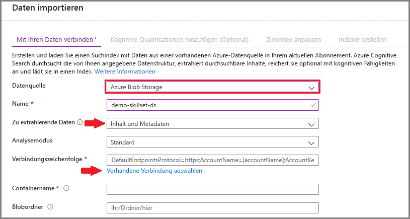
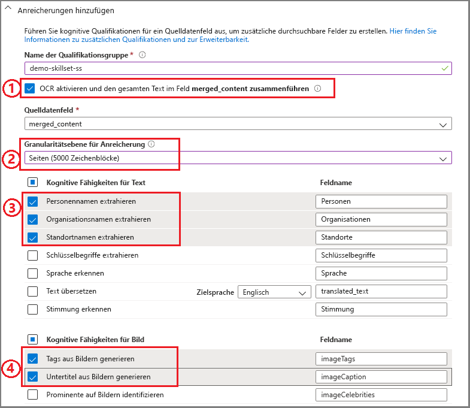
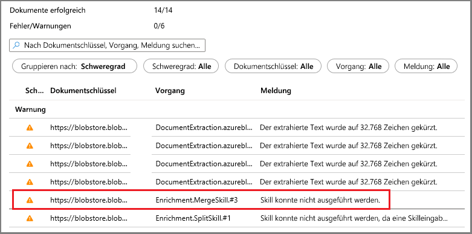
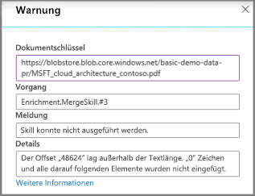
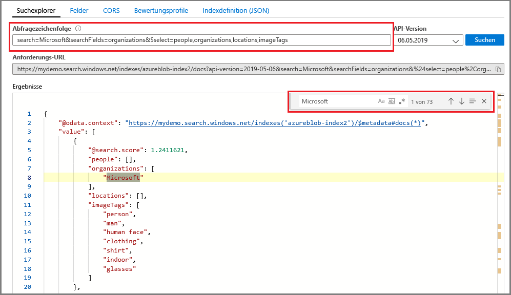

# Schnellstart: Erstellen eines kognitiven Skillsets für Azure Cognitive Search über das Azure-Portal

Ein Skillset ist ein KI-Feature, das Informationen und die Struktur aus umfangreichen, undifferenzierten Text- oder Bilddateien extrahiert und sie indizierbar und für Volltext-Suchabfragen in Azure Cognitive Search durchsuchbar macht. 

In dieser Schnellstartanleitung werden Dienste und Daten in der Azure-Cloud miteinander kombiniert, um ein Skillset zu erstellen. Nach Abschluss der Einrichtung wird im Portal der **Datenimport-Assistent** ausgeführt, um alles miteinander zu verknüpfen. Am Ende verfügen Sie über einen durchsuchbaren Index mit Daten, die mittels KI-Verarbeitung erstellt wurden und im Portal mithilfe des [Suchexplorers](search-explorer.md) abgefragt werden können.

Wenn Sie kein Azure-Abonnement besitzen, können Sie ein [kostenloses Konto](https://azure.microsoft.com/free/?WT.mc_id=A261C142F) erstellen, bevor Sie beginnen.

## Erstellen von Diensten und Laden von Daten

In dieser Schnellstartanleitung werden Azure Cognitive Search, [Azure Blob Storage](https://docs.microsoft.com/azure/storage/blobs/) und [Azure Cognitive Services](https://azure.microsoft.com/services/cognitive-services/) für die KI verwendet. 

Aufgrund der geringen Workloadgröße wird Cognitive Services im Hintergrund genutzt und bietet eine kostenlose Verarbeitung von bis zu 20 Transaktionen. Für solch kleine Datasets können Sie das Erstellen oder Anfügen einer Cognitive Services-Ressource überspringen.

1. [Laden Sie die Beispieldaten herunter](https://1drv.ms/f/s!As7Oy81M_gVPa-LCb5lC_3hbS-4), die aus einem kleinen Satz Dateien verschiedener Typen bestehen. Entzippen Sie die Dateien.

1. [Erstellen Sie ein Azure Storage-Konto](https://docs.microsoft.com/azure/storage/common/storage-quickstart-create-account?tabs=azure-portal), oder [suchen Sie nach einem vorhandenen Konto](https://ms.portal.azure.com/#blade/HubsExtension/BrowseResourceBlade/resourceType/Microsoft.Storage%2storageAccounts/). 

   Es muss sich in der gleichen Region wie Azure Cognitive Search befinden, um Bandbreitengebühren zu vermeiden. 
   
   Wählen Sie den Kontotyp „StorageV2 (allgemein, Version 2)“ aus, wenn Sie später auch das Wissensspeicher-Feature (in einer anderen exemplarischen Vorgehensweise) ausprobieren möchten. Andernfalls können Sie einen beliebigen Typ auswählen.

1. Öffnen Sie die Seiten für Blobdienste, und erstellen Sie einen Container. Sie können die standardmäßige öffentliche Zugriffsebene verwenden. 

1. Klicken Sie im Container auf **Hochladen**, um die im ersten Schritt heruntergeladenen Beispieldateien hochzuladen. Ihnen steht ein breites Spektrum an Inhaltstypen zur Verfügung – einschließlich Bild- und Anwendungsdateien, die in ihrem nativen Format nicht für die Volltextsuche geeignet sind.

   

1. [Erstellen Sie einen Azure Cognitive Search-Dienst](search-create-service-portal.md), oder [suchen Sie nach einem vorhandenen Dienst](https://ms.portal.azure.com/#blade/HubsExtension/BrowseResourceBlade/resourceType/Microsoft.Search%2FsearchServices). Für diesen Schnellstart können Sie einen kostenlosen Dienst verwenden.

Nun können Sie zum Datenimport-Assistenten wechseln.

## Ausführen des Datenimport-Assistenten

Klicken Sie auf der Übersichtsseite des Suchdiensts auf der Befehlsleiste auf **Daten importieren**, um in vier Schritten die kognitive Anreicherung einzurichten.

  

### Schritt 1: Erstellen einer Datenquelle

1. Wählen Sie unter **Verbindung mit Ihren Daten herstellen** die Option **Azure Blob Storage** sowie das erstellte Storage-Konto und den erstellten Container aus. Geben Sie der Datenquelle einen Namen, und verwenden Sie für alles andere die Standardwerte. 

   

    Wechseln Sie zur nächsten Seite.

### Schritt 2: Hinzufügen von kognitiven Qualifikationen

Konfigurieren Sie als nächstes die KI-Anreicherung, um OCR, Bildanalyse und Verarbeitung in natürlicher Sprache aufzurufen. 

1. In dieser Schnellstartanleitung verwenden wir die Cognitive Services-Ressource vom Typ **Free**. Die Beispieldaten umfassen 14 Dateien. Das kostenlose Kontingent von 20 Transaktionen für Cognitive Services ist somit für diese Schnellstartanleitung ausreichend. 

   

1. Erweitern Sie **Anreicherungen hinzufügen**, und wählen Sie vier Auswahlmöglichkeiten. 

   Aktivieren Sie OCR, um der Assistentenseite Bildanalysequalifikationen hinzuzufügen.

   Legen Sie die Granularität auf Seiten fest, um Text in kleinere Blöcke aufzuteilen. Mehrere Textqualifikationen sind auf Eingaben von 5 KB beschränkt.

   Wählen Sie die Entitätserkennung (Personen, Organisationen, Orte) und Bildanalysequalifikationen aus.

   

   Wechseln Sie zur nächsten Seite.

### Schritt 3: Konfigurieren des Indexes

Ein Index enthält Ihre durchsuchbaren Inhalte, und der **Datenimport-Assistent** kann in der Regel die Datenquelle untersuchen und das Schema für Sie erstellen. Überprüfen Sie in diesem Schritt das generierte Schema, und überarbeiten Sie ggf. die Einstellungen. Im Anschluss sehen Sie das für das Blobdataset der Demo erstellte Standardschema.

Für diesen Schnellstart legt der Assistent sinnvolle Standardwerte fest:  

+ Standardfelder basieren auf Eigenschaften für vorhandene Blobs und neue Felder, um die Anreicherungsausgabe enthalten zu können (z. B. `people`, `organizations`, `locations`). Datentypen werden aus Metadaten und Datenstichproben abgeleitet.

+ Der Standarddokumentschlüssel ist *metadata_storage_path* (da dieses Feld eindeutige Werte enthält).

+ Standardattribute sind **Abrufbar** und **Durchsuchbar**. **Durchsuchbar** ermöglicht die Volltextsuche in einem Feld. **Abrufbar** bedeutet, dass Feldwerte in Ergebnissen zurückgegeben werden können. Der Assistent geht davon aus, dass diese Felder abrufbar und durchsuchbar sein sollen, da Sie sie über eine Qualifikationsgruppe erstellt haben.

  

Beachten Sie, dass das Attribut **Abrufbar** für das Feld `content` durchgestrichen und mit einem Fragezeichen versehen ist. Bei textlastigen Blobdokumenten enthält das Feld `content` den Großteil der Datei, der mehrere tausende Zeilen umfassen kann. Ein solches Feld ist in den Suchergebnissen unpraktisch und sollte für diese Demo ausgeschlossen werden. 

Wenn Sie jedoch Dateiinhalte an Clientcode übergeben müssen, stellen Sie sicher, dass **Abrufbar** ausgewählt bleibt. Entfernen Sie andernfalls ggf. dieses Attribut für `content`, wenn die extrahierten Elemente (z. B. `people`, `organizations`, `locations` usw.) ausreichen.

Die Markierung eines Felds als **abrufbar** bedeutet nicht, dass das Feld in den Suchergebnissen vorhanden sein *muss*. Sie können die Zusammenstellung der Suchergebnisse präzise steuern und mit dem Abfrageparameter **$select** angeben, welche Felder enthalten sein sollen. Bei textlastigen Feldern wie `content` können Sie mit dem Parameter **$select** verwaltbare Suchergebnisse für die menschlichen Benutzer Ihrer Anwendung bereitstellen und gleichzeitig sicherstellen, dass Clientcode über das Attribut **Abrufbar** Zugriff auf alle erforderlichen Informationen hat.
  
Wechseln Sie zur nächsten Seite.

### Schritt 4: Konfigurieren des Indexers

Der Indexer ist eine allgemeine Ressource, die den Indizierungsvorgang antreibt. Er gibt den Datenquellennamen, einen Zielindex und die Häufigkeit der Ausführung an. Der **Datenimport-Assistent** erstellt mehrere Objekte, und eines davon ist immer ein Indexer, den Sie wiederholt ausführen können.

1. Auf der Seite **Indexer** können Sie den Standardnamen übernehmen und auf die Zeitplanoption **Einmal** klicken, um ihn sofort auszuführen. 

   

1. Klicken Sie auf **Senden**, um den Indexer zu erstellen und gleichzeitig auszuführen.

## Überwachen des Status

Die Indizierung kognitiver Qualifikationen dauert länger als die übliche textbasierte Indizierung. Dies gilt insbesondere für OCR und Bildanalyse. Navigieren Sie zum Überwachen des Fortschritts zur Übersichtsseite, und klicken Sie in der Mitte der Seite auf **Indexer**.

  

Warnungen sind hinsichtlich der umfangreichen Spanne von Inhaltstypen normal. Einige Inhaltstypen sind für bestimmte Qualifikationen ungültig, und auf niedrigeren Ebenen treten üblicherweise [Indexergrenzwerte](search-limits-quotas-capacity.md#indexer-limits) auf. Beispielsweise treten im Free-Tarif Benachrichtigungen über Kürzungen auf den Indexergrenzwert von 32.000 Zeichen auf. Bei Ausführung dieser Demo auf einer höheren Ebene würden viele Kürzungswarnungen wegfallen.

Um Warnungen oder Fehler zu überprüfen, klicken Sie in der Liste „Indexer“ auf den Status „Warnung“, um die Seite „Ausführungsverlauf“ zu öffnen.

Klicken Sie auf dieser Seite erneut auf den Status „Warnung“, um die Liste der Warnungen anzuzeigen, die der unten gezeigten ähneln. 

  

Wenn Sie auf eine bestimmte Statuszeile klicken, werden Details angezeigt. Diese Warnung besagt, dass die Zusammenführung nach Erreichen eines maximalen Schwellenwerts beendet wurde (diese spezielle PDF-Datei ist groß).

  

## Abfragen im Suchexplorer

Nachdem ein Index erstellt wurde, können Sie Abfragen ausführen, um Ergebnisse zu erhalten. Verwenden Sie im Portal den **Suchexplorer** für diese Aufgabe. 

1. Klicken Sie auf der Dashboardseite des Suchdiensts auf der Befehlsleiste auf **Suchexplorer**.

1. Wählen Sie oben **Index ändern** aus, um den von Ihnen erstellten Index auszuwählen.

1. Geben Sie eine Suchzeichenfolge ein, um den Index abzufragen, z.B. `search=Microsoft&$select=people,organizations,locations,imageTags`.

Die Ergebnisse werden im JSON-Format zurückgegeben, was sehr ausführlich und schwierig zu lesen sein kann, insbesondere bei langen Dokumenten, die aus Azure-Blobs stammen. Einige Tipps für die Suche in diesem Tool umfassen die folgenden Techniken:

+ Fügen Sie `$select` an, um festzulegen, welche Felder in die Ergebnisse aufgenommen werden sollen. 
+ Suchen Sie mit STRG+F im JSON-Code nach bestimmten Eigenschaften oder Begriffen.

Bei Abfragezeichenfolgen wird die Groß-/Kleinschreibung beachtet. Wenn Sie also eine Meldung „Unbekanntes Feld“ erhalten, überprüfen Sie **Felder** oder **Indexdefinition (JSON)** , um Name und Schreibweise zu überprüfen. 

  

## Wesentliche Punkte

Sie haben nun Ihr erstes Skillset erstellt und sich mit wichtigen Konzepten vertraut gemacht, die für die Erstellung von Prototypen für eine angereicherte Suchlösung mit Ihren eigenen Daten hilfreich sind.

Einige wichtige Konzepte, von denen wir hoffen, dass Sie sie verinnerlicht haben, schließen die Abhängigkeit von Azure-Datenquellen ein. Ein Skillset ist an einen Indexer gebunden, und Indexer sind Azure- und quellenspezifisch. Dieser Schnellstart verwendet Azure Blob Storage, jedoch sind auch andere Azure-Datenquellen möglich. Weitere Informationen finden Sie unter [Indexer in Azure Cognitive Search](search-indexer-overview.md). 

Ein weiteres wichtiges Konzept ist, dass Skills mit Inhaltstypen arbeiten und bei der Arbeit mit heterogenen Inhalten einige Eingaben übersprungen werden. Außerdem können große Dateien oder Felder die Indexergrenzwerte ihrer Dienstebene überschreiten. Es ist normal, dass Warnungen angezeigt werden, wenn diese Ereignisse auftreten. 

Die Ausgabe wird an einen Suchindex weitergeleitet, und es gibt eine Zuordnung zwischen Name-Wert-Paaren, die im Zuge der Indizierung erstellt wurden, und einzelnen Feldern in Ihrem Index. Intern richtet das Portal [Anmerkungen](cognitive-search-concept-annotations-syntax.md) ein und definiert eine [Qualifikationsgruppe](cognitive-search-defining-skillset.md), um die Reihenfolge der Vorgänge und den allgemeinen Ablauf festzulegen. Diese Schritte sind im Portal ausgeblendet, werden aber wichtig, wenn Sie selbst mit der Erstellung von Code beginnen.

Außerdem haben Sie gelernt, dass Sie Inhalte durch Abfragen des Index überprüfen können. Azure Cognitive Search stellt letztendlich einen durchsuchbaren Index bereit, den Sie entweder mit der [einfachen](https://docs.microsoft.com/rest/api/searchservice/simple-query-syntax-in-azure-search) oder mit der [vollständig erweiterten Abfragesyntax](https://docs.microsoft.com/rest/api/searchservice/lucene-query-syntax-in-azure-search) abfragen können. Ein Index, der angereicherte Felder enthält, ist wie jeder andere. Wenn Sie standardmäßige oder [benutzerdefinierte Analysetools](search-analyzers.md), [Bewertungsprofile](https://docs.microsoft.com/rest/api/searchservice/add-scoring-profiles-to-a-search-index), [Synonyme](search-synonyms.md), [facettierte Filter](search-filters-facets.md), die geografische Suche oder andere Azure Cognitive Search-Features einbeziehen möchten, stehen Ihnen alle Wege offen.

## Bereinigen von Ressourcen

Wenn Sie in Ihrem eigenen Abonnement arbeiten, sollten Sie sich am Ende eines Projekts überlegen, ob Sie die erstellten Ressourcen noch benötigen. Ressourcen, die weiterhin ausgeführt werden, können Sie Geld kosten. Sie können entweder einzelne Ressourcen oder aber die Ressourcengruppe löschen, um den gesamten Ressourcensatz zu entfernen.

Ressourcen können im Portal über den Link **Alle Ressourcen** oder **Ressourcengruppen** im linken Navigationsbereich gesucht und verwaltet werden.

Denken Sie bei Verwendung eines kostenlosen Diensts an die Beschränkung auf maximal drei Indizes, Indexer und Datenquellen. Sie können einzelne Elemente über das Portal löschen, um unter dem Limit zu bleiben. 

## Nächste Schritte

Skillsets können über das Portal, per .NET SDK oder per REST-API erstellt werden. Probieren Sie bei Interesse die REST-API mit Postman und weiteren Beispieldaten aus.

> [!div class="nextstepaction"]
> [Tutorial: Extrahieren von Text und Struktur aus JSON-Blobs in Azure mit REST-APIs (Azure Cognitive Search)](cognitive-search-tutorial-blob.md)

> [!Tip]
> Wenn Sie diese Übung wiederholen oder eine andere exemplarische Vorgehensweise für die KI-Anreicherung ausprobieren möchten, löschen Sie den Indexer im Portal. Durch Löschen des Indexers wird der Zähler für kostenlose Transaktionen pro Tag für die Cognitive Services-Verarbeitung auf Null zurückgesetzt.