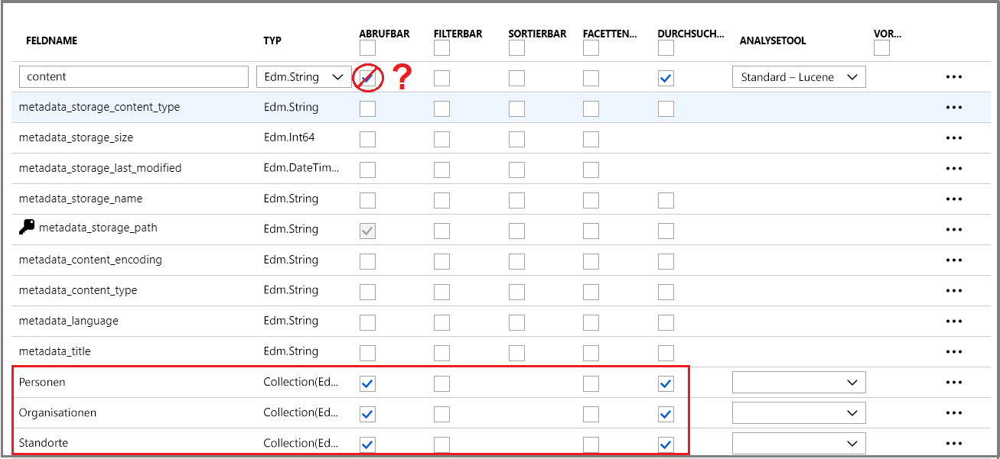
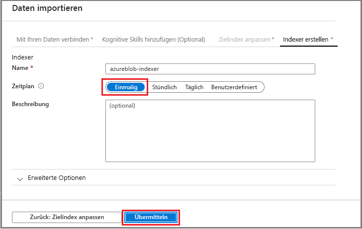

# Schnellstart: Erstellen einer KI-basierten Indizierungspipeline unter Verwendung kognitiver Qualifikationen in Azure Search

Azure Search wird in [Cognitive Services](https://azure.microsoft.com/services/cognitive-services/) integriert, um einer Azure Search-Indizierungspipeline Qualifikationen zur Extrahierung von Daten, zur Verarbeitung von natürlicher Sprache (Natural Language Processing, NLP) und zur Bildverarbeitung hinzuzufügen und nicht durchsuchbare oder unstrukturierte Inhalte dadurch besser durchsuchbar zu machen. 

Viele Cognitive Services-Ressourcen können an einen Indizierungsprozess angefügt werden. Hierzu zählen beispielsweise [OCR](cognitive-search-skill-ocr.md), [Sprachenerkennung](cognitive-search-skill-language-detection.md) und [Entitätserkennung](cognitive-search-skill-entity-recognition.md). Mithilfe der KI-Algorithmen von Cognitive Services wird nach Mustern, Funktionen und Merkmalen in den Quelldaten gesucht, und es werden Strukturen und Textinhalte zurückgegeben, die in Lösungen für die Volltextsuche basierend auf Azure Search verwendet werden können.

In dieser Schnellstartanleitung erstellen Sie Ihre erste Anreicherungspipeline im [Azure-Portal](https://portal.azure.com), bevor Sie auch nur eine Zeile Code schreiben:

> [!div class="checklist"]
> * Beginnen Sie mit Beispieldaten in Azure Blob Storage
> * Konfigurieren Sie den [**Datenimport-Assistenten**](search-import-data-portal.md) für kognitive Indizierung und Anreicherung 
> * Führen Sie den Assistenten aus (eine Entitäts-Qualifikation erkennt Personen, Orte und Organisationen)
> * Verwenden Sie den [**Suchexplorer**](search-explorer.md), um die angereicherten Daten abzufragen

In dieser Schnellstartanleitung wird der kostenlose Dienst verwendet. Die Anzahl kostenloser Transaktionen ist allerdings auf 20 Dokumente pro Tag beschränkt. Falls Sie diesen Schnellstart mehrmals pro Tag ausführen möchten, verwenden Sie einen kleineren Dateisatz, um mehr Ausführungen zu ermöglichen.

> [!NOTE]
> Wenn Sie den Umfang erweitern, indem Sie die Verarbeitungsfrequenz erhöhen oder weitere Dokumente oder KI-Algorithmen hinzufügen, müssen Sie [eine kostenpflichtige Cognitive Services-Ressource anfügen](cognitive-search-attach-cognitive-services.md). Gebühren fallen beim Aufrufen von APIs in Cognitive Services sowie für die Bildextraktion im Rahmen der Dokumentaufschlüsselungsphase in Azure Search an. Für die Textextraktion aus Dokumenten fallen keine Gebühren an.
>
> Die Ausführung integrierter Qualifikationen wird nach dem bestehenden [nutzungsbasierten Preis für Cognitive Services](https://azure.microsoft.com/pricing/details/cognitive-services/) berechnet. Die Preise für die Bildextraktion werden auf der [Preisseite von Azure Search](https://go.microsoft.com/fwlink/?linkid=2042400) beschrieben.

Wenn Sie kein Azure-Abonnement besitzen, können Sie ein [kostenloses Konto](https://azure.microsoft.com/free/?WT.mc_id=A261C142F) erstellen, bevor Sie beginnen.

## Voraussetzungen

[Erstellen Sie einen Azure Search-Dienst](search-create-service-portal.md), oder suchen Sie in Ihrem aktuellen Abonnement [nach einem vorhandenen Dienst](https://ms.portal.azure.com/#blade/HubsExtension/BrowseResourceBlade/resourceType/Microsoft.Search%2FsearchServices). Für diesen Schnellstart können Sie einen kostenlosen Dienst verwenden.

[Cognitive Services](https://azure.microsoft.com/services/cognitive-services/) stellt die KI bereit. In dieser Schnellstartanleitung wird erläutert, wie Sie diese Ressourcen beim Angeben der Pipeline inline hinzufügen. Es müssen keine Konten vorab eingerichtet werden.

Azure-Dienste sind erforderlich, um die Eingaben für die Indizierungspipeline bereitzustellen. Sie können eine beliebige, von [Azure Search-Indexern](search-indexer-overview.md) unterstützte Datenquelle verwenden. Einzige Ausnahme ist Azure Table Storage, da diese Lösung nicht für die KI-basierte Indizierung unterstützt wird. In dieser Schnellstartanleitung wird [Azure Blob Storage](https://azure.microsoft.com/services/storage/blobs/) als Container für Quelldatendateien verwendet. 

### Einrichten des Azure Blob-Diensts und Laden von Beispieldaten

1. [Laden Sie die Beispieldaten herunter](https://1drv.ms/f/s!As7Oy81M_gVPa-LCb5lC_3hbS-4), die aus einem kleinen Satz Dateien verschiedener Typen bestehen. 

1. [Registrieren Sie sich für Azure Blob Storage](https://docs.microsoft.com/azure/storage/common/storage-quickstart-create-account?tabs=azure-portal), erstellen Sie ein Speicherkonto, öffnen Sie die Seiten für Blob-Dienste, und erstellen Sie einen Container.  Erstellen Sie das Speicherkonto in der gleichen Region wie Azure Search.

1. Klicken Sie im von Ihnen erstellten Container auf **Hochladen**, um die in einem vorherigen Schritt heruntergeladenen Beispieldateien hochzuladen.

   

## Erstellen der Anreicherungspipeline

Kehren Sie zur Dashboardseite des Azure Search-Diensts zurück, und klicken Sie auf der Befehlsleiste auf **Daten importieren**, um die kognitive Anreicherung in vier Schritten einzurichten.

  

### Schritt 1: Erstellen einer Datenquelle

Wählen Sie unter **Verbindung mit Ihren Daten herstellen** die Option **Azure Blob Storage** sowie das erstellte Konto und den erstellten Container aus. Geben Sie der Datenquelle einen Namen, und verwenden Sie für alles andere die Standardwerte. 

  

Wechseln Sie zur nächsten Seite.

  

### Schritt 2: Hinzufügen von kognitiven Qualifikationen

Fügen Sie als nächstes der Indizierungspipeline Anreicherungsschritte hinzu. Wenn Sie über keine Cognitive Services-Ressource verfügen, können Sie sich für eine kostenlose Version registrieren, die Ihnen täglich 20 Transaktionen bietet. Die Beispieldaten umfassen 14 Dateien, sodass Ihr tägliches Kontingent zumeist aufgebraucht ist, sobald Sie diesen Assistenten ausführen.

1. Erweitern Sie **Cognitive Services-Instanz anfügen**, um Optionen für Ressourcen für Cognitive Services-APIs anzuzeigen. In diesem Tutorial können Sie die Ressource **Free** verwenden.

   

2. Erweitern Sie **Anreicherungen hinzufügen**, und wählen Sie Qualifikationen aus, die eine Verarbeitung natürlicher Sprache ausführen. Wählen Sie für diesen Schnellstart Entitätserkennung für Personen, Organisationen und Orte aus.

   

   Das Portal bietet integrierte Qualifikationen für die OCR-Verarbeitung und Textanalyse. Im Portal arbeitet eine Qualifikationsgruppe auf einem einzelnen Quellfeld. Das sieht vielleicht nach einer sehr bescheidenen Zielsetzung aus, aber im Fall von Azure-Blobs enthält das Feld `content` den größten Teil des Blob-Dokuments (beispielsweise ein Word-Dokument oder einen PowerPoint-Foliensatz). Daher stellt dieses Feld die ideale Eingabe dar, da sich hier alle Inhalte eines Blobs finden.

3. Wechseln Sie zur nächsten Seite.

   

> [!NOTE]
> Qualifikationen für die Verarbeitung natürlicher Sprache arbeiten auf Textinhalten im Beispieldatenset. Da die OCR-Option nicht ausgewählt wurde, werden die JPEG- und PNG-Dateien im Beispieldatenset im Rahmen dieses Schnellstarts nicht verarbeitet. 

### Schritt 3: Konfigurieren des Index

Der Assistent kann in der Regel einen Standardindex ableiten. In diesem Schritt können Sie das generierte Indexschema anzeigen und ggf. Einstellungen überarbeiten. Unten sehen Sie den für das Blobdataset der Demo erstellten Standardindex.

Für diesen Schnellstart legt der Assistent sinnvolle Standardwerte fest: 

+ Basierend auf dem Datenquellentyp lautet der Standardname *azureblob-index*. 

+ Standardfelder basieren auf dem ursprünglichen Quelldatenfeld (`content`) sowie den von der kognitiven Pipeline erstellten Ausgabefeldern (`people`, `organizations` und `locations`). Standarddatentypen werden aus Metadaten und Datenstichproben abgeleitet.

+ Der Standardschlüssel ist *metadata_storage_path* (dieses Feld enthält eindeutige Werte).

+ Standardattribute sind für diese Felder **abrufbar** und **durchsuchbar**. **Durchsuchbar** gibt an, dass ein Feld durchsucht werden kann. **Abrufbar** bedeutet, dass es in Ergebnissen zurückgegeben werden kann. Der Assistent geht davon aus, dass diese Felder abrufbar und durchsuchbar sein sollen, da Sie sie über eine Qualifikationsgruppe erstellt haben.

  

Beachten Sie, dass das Attribut **Abrufbar** für das Feld `content` durchgestrichen und mit einem Fragezeichen versehen ist. Bei textlastigen Blobdokumenten enthält das Feld `content` den Großteil der Datei, der mehrere tausende Zeilen umfassen kann. Wenn Sie Dateiinhalte an Clientcode übergeben müssen, stellen Sie sicher, dass **Abrufbar** ausgewählt bleibt. Entfernen Sie andernfalls ggf. dieses Attribut für `content`, wenn die extrahierten Elemente (`people`, `organizations` und `locations`) für Ihre Zwecke ausreichend sind.

Die Markierung eines Felds als **abrufbar** bedeutet nicht, dass das Feld in den Suchergebnissen vorhanden sein *muss*. Sie können die Zusammenstellung der Suchergebnisse präzise steuern und mit dem Abfrageparameter **$select** angeben, welche Felder enthalten sein sollen. Bei textlastigen Feldern wie `content` können Sie mit dem Parameter **$select** verwaltbare Suchergebnisse für die menschlichen Benutzer Ihrer Anwendung bereitstellen und gleichzeitig sicherstellen, dass Clientcode über das Attribut **Abrufbar** Zugriff auf alle erforderlichen Informationen hat.
  
Wechseln Sie zur nächsten Seite.

  

### Schritt 4: Konfigurieren des Indexers

Der Indexer ist eine allgemeine Ressource, die den Indizierungsvorgang antreibt. Er gibt den Datenquellennamen, einen Zielindex und die Häufigkeit der Ausführung an. Das Endergebnis des **Datenimport**-Assistenten ist immer ein Indexer, der separat ausgeführt werden kann.

Auf der Seite **Indexer** können Sie den Standardnamen übernehmen und die Zeitplanoption **Einmal ausführen** zur sofortigen Ausführung verwenden. 

  

Klicken Sie auf **Senden**, um den Indexer zu erstellen und gleichzeitig auszuführen.

## Überwachen der Indizierung

Anreicherungsschritte nehmen mehr Zeit in Anspruch als das übliche textbasierte Indizieren. Der Assistent sollte die Liste „Indexer“ auf der Übersichtsseite öffnen, damit Sie den Status nachverfolgen können. Zur eigenen Navigation wechseln Sie zur Seite „Übersicht“, und klicken Sie auf **Indexer**.

Die Warnung wird angezeigt, da JPG- und PNG-Dateien Bilddateien sind und die OCR-Qualifikation bei dieser Pipeline ausgelassen wurde. Sie finden auch Benachrichtigungen über Kürzungen. Azure Search beschränkt die Extraktion auf 32.000 Zeichen für den Free-Tarif.

  

Indizierung und Anreicherung können zeitaufwändig sein, was der Grund dafür ist, dass wir fürs erste Kennenlernen kleinere Datensets empfehlen. 

## Abfragen im Suchexplorer

Nach der Erstellung eines Index können Sie Abfragen senden, um Dokumente aus dem Index zurückzugeben. Verwenden Sie im Portal den **Suchexplorer**, um Abfragen auszuführen und Ergebnisse anzuzeigen. 

1. Klicken Sie auf der Dashboardseite des Suchdiensts auf der Befehlsleiste auf **Suchexplorer**.

1. Wählen Sie oben **Index ändern** aus, um den von Ihnen erstellten Index auszuwählen.

1. Geben Sie eine Suchzeichenfolge ein, um den Index abzufragen, z.B. `search=Microsoft&searchFields=organizations`.

Die Ergebnisse werden in JSON zurückgegeben, was sehr ausführlich und schwierig zu lesen sein kann, insbesondere bei langen Dokumenten, die aus Azure-Blobs stammen. Wenn Sie die Ergebnisse nicht komfortabel durchsuchen können, verwenden Sie STRG-F, um in Dokumenten zu suchen. Bei dieser Abfrage können Sie im JSON-Code nach bestimmten Begriffen suchen. 

STRG-F kann Ihnen darüber hinaus helfen, zu ermitteln, wie viele Dokumente sich in einem bestimmten Resultset befinden. Für Azure-Blobs wählt das Portal „metadata_storage_path“ als Schlüssel aus, das jeder Wert für das Dokument eindeutig ist. Suchen Sie mithilfe von STRG-F nach „metadata_storage_path“, um die Anzahl der Dokumente zu erhalten. 

  

## Wesentliche Punkte

Sie haben jetzt Ihre erste Übung mit kognitiv angereicherter Indizierung abgeschlossen. Der Zweck dieses Schnellstarts bestand darin, Ihnen wichtige Konzepte vorzustellen und Sie praktisch durch den Assistenten zu führen, damit Sie schnell einen Prototypen einer kognitiven Suchlösung für Ihre eigenen Daten erstellen können.

Einige wichtige Konzepte, von denen wir hoffen, dass Sie sie verinnerlicht haben, schließen die Abhängigkeit von Azure-Datenquellen ein. Die Anreicherung der kognitiven Suche ist an Indexer gebunden, und Indexer sind Azure- und quellenspezifisch. Dieser Schnellstart verwendet Azure Blob Storage, jedoch sind auch andere Azure-Datenquellen möglich. Weitere Informationen finden Sie unter [Indexer in Azure Search](search-indexer-overview.md).

Ein anderes wichtiges Konzept ist, dass Qualifikationen auf Eingabefeldern arbeiten. Im Portal müssen Sie ein einzelnes Quellfeld für alle Qualifikationen auswählen. Im Code können andere Felder oder die Ausgabe einer Upstreamqualifikation als Eingaben dienen.

 Eingaben für eine Qualifikation werden einem Ausgabefeld in einem Index zugeordnet. Intern richtet das Portal [Anmerkungen](cognitive-search-concept-annotations-syntax.md) ein und definiert eine [Qualifikationsgruppe](cognitive-search-defining-skillset.md), um die Reihenfolge der Vorgänge und den allgemeinen Ablauf festzulegen. Diese Schritte sind im Portal ausgeblendet, werden aber wichtig, wenn Sie selbst mit der Erstellung von Code beginnen.

Schließlich haben Sie gelernt, dass das Anzeigen von Ergebnissen durch Abfragen des Index erreicht wird. Was Azure Search bereitstellt, ist ein durchsuchbarer Index, den Sie entweder mit der [einfachen](https://docs.microsoft.com/rest/api/searchservice/simple-query-syntax-in-azure-search) oder mit der [vollständig erweiterten Abfragesyntax](https://docs.microsoft.com/rest/api/searchservice/lucene-query-syntax-in-azure-search) abfragen können. Ein Index, der angereicherte Felder enthält, ist wie jeder andere. Wenn Sie Standard- oder [benutzerdefinierte Analysetools](search-analyzers.md), [Bewertungsprofile](https://docs.microsoft.com/rest/api/searchservice/add-scoring-profiles-to-a-search-index), [Synonyme](search-synonyms.md), [facettierte Filter](search-filters-facets.md), geografische Suche oder andere Funktionen von Azure Search einbeziehen möchten, stehen Ihnen alle Wege offen.

## Bereinigen

Wenn Sie in Ihrem eigenen Abonnement arbeiten, sollten Sie sich am Ende eines Projekts überlegen, ob Sie die erstellten Ressourcen noch benötigen. Ressourcen, die weiterhin ausgeführt werden, können Sie Geld kosten. Sie können Ressourcen entweder einzeln löschen oder aber die Ressourcengruppe löschen, um den gesamten Ressourcensatz zu löschen.

Ressourcen können im Portal über den Link **Alle Ressourcen** oder **Ressourcengruppen** im linken Navigationsbereich gesucht und verwaltet werden.

Denken Sie bei Verwendung eines kostenlosen Diensts an die Beschränkung auf maximal drei Indizes, Indexer und Datenquellen. Sie können einzelne Elemente über das Portal löschen, um unterhalb des Limits zu bleiben. 

## Nächste Schritte

Experimentieren Sie je nach Art der Bereitstellung der Cognitive Services-Ressource mit Indizierung und Anreicherung, indem Sie den Assistenten mit verschiedenen Qualifikationen und Quelldatenfeldern erneut ausführen. Um diese Schritte zu wiederholen, löschen Sie den Index und den Indexer, und erstellen Sie den Indexer mit einer neuen Mischung von Optionen neu.

+ Wählen Sie unter **Übersicht** > **Indizes** den von Ihnen erstellten Index aus, und klicken Sie dann auf **Löschen**.

+ Doppelklicken Sie unter **Übersicht** auf die Kachel **Indexer**. Suchen Sie den von Ihnen erstellten Indexer, und löschen Sie ihn.

Alternativ können Sie die erstellten Beispieldaten und Dienste wiederverwenden und im nächsten Tutorial lernen, wie Sie diese Aufgaben programmgesteuert erledigen. 

> [!div class="nextstepaction"]
> [Tutorial: Erlernen der REST-APIs für kognitive Suche](cognitive-search-tutorial-blob.md)
