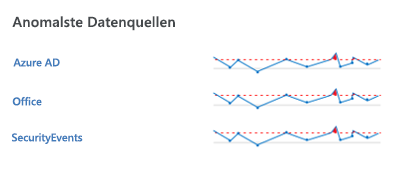
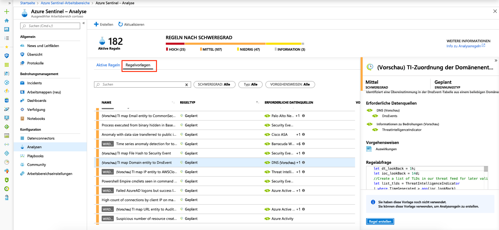

# Schnellstart: Erste Schritte mit Azure Sentinel

In diesem Schnellstart erfahren Sie, wie Sie die Vorgänge in Ihrer Umgebung mit Azure Sentinel schnell anzeigen und überwachen können. Nachdem Sie Ihre Datenquellen mit Azure Sentinel verbunden haben, stehen Ihnen sofort Datenvisualisierungen und -analysen zur Verfügung, die Informationen zu allen Vorgängen in Ihren verbundenen Datenquellen liefern. Azure Sentinel bietet Ihnen Arbeitsmappen mit den leistungsstarken Funktionen der bereits in Azure verfügbaren Tools sowie integrierte Tabellen und Diagramme mit Analysen für Ihre Protokolle und Abfragen. Sie können integrierte Arbeitsmappen verwenden, mühelos eine komplett neue Arbeitsmappe erstellen oder auf der Grundlage einer vorhandenen Arbeitsmappe eine eigene Arbeitsmappe erstellen. 

## Visualisierung

Bevor Sie die Vorgänge in Ihrer Umgebung visualisieren und analysieren, sollten Sie zunächst einen Blick auf das Übersichtsdashboard werfen, um eine Vorstellung vom Sicherheitsstatus Ihrer Organisation zu bekommen. Sie können auf jedes Element auf diesen Kacheln klicken, um Detailinformationen zu den zugehörigen Rohdaten anzuzeigen. Um Fehlinformationen zu reduzieren und die Anzahl von Warnungen zu minimieren, die Sie überprüfen und untersuchen müssen, korreliert Azure Sentinel Warnungen mithilfe einer Zusammenführungstechnik zu Incidents. **Incidents** sind Gruppen von verwandten Warnungen, die zusammen einen handlungsrelevanten Incident bilden, den Sie untersuchen und beheben können.

- Wählen Sie im Azure-Portal Azure Sentinel und anschließend den Arbeitsbereich aus, den Sie überwachen möchten.

  

- Auf der Symbolleiste am oberen Rand des Fensters werden die Anzahl von Ereignissen im ausgewählten Zeitraum und ein Vergleich mit den vorherigen 24 Stunden angezeigt. Der Symbolleiste können Sie entnehmen, welche Warnungen für diese Ereignisse ausgelöst wurden (die kleine Zahl stellt die Veränderung in den letzten 24 Stunden dar) und wie viele dieser Ereignisse offen, in Bearbeitung und geschlossen sind. Vergewissern Sie sich in dieser Ansicht, dass keine deutliche Zu- oder Abnahme der Anzahl von Ereignissen vorliegt. Im Fall einer Abnahme meldet eine Verbindung möglicherweise keine Daten mehr an Azure Sentinel. Eine Zunahme kann ein Anzeichen für eine verdächtige Aktivität sein. Überprüfen Sie, ob neue Warnungen vorhanden sind.

   

Der Hauptteil der Übersichtsseite bietet auf einen Blick Aufschluss über den Sicherheitsstatus Ihres Arbeitsbereichs:

- **Events and alerts over time** (Ereignisse und Warnungen im Zeitverlauf): Listet die Anzahl von Ereignissen und Warnungen auf, die aufgrund dieser Ereignisse erstellt wurden. Wenn Sie eine ungewöhnliche Spitze bemerken, sollten entsprechende Warnungen angezeigt werden. Falls aufgrund ungewöhnlicher Aktivitäten eine Spitze in der Anzahl von Ereignissen vorliegt, aber keine Warnungen angezeigt werden, kann dies Anlass zur Sorge sein.

- **Potential malicious events** (Potenziell schädliche Ereignisse): Wenn Datenverkehr aus bekanntermaßen schädlichen Quellen erkannt wird, zeigt Azure Sentinel Warnungen auf der Karte an. Orange steht für eingehenden Datenverkehr: Jemand versucht, über eine bekanntermaßen schädliche IP-Adresse auf Ihre Organisation zuzugreifen. Wenn ausgehende Aktivität (rot) angezeigt wird, bedeutet dies, dass Daten aus Ihrem Netzwerk außerhalb Ihrer Organisation zu einer bekanntermaßen schädlichen IP-Adresse gestreamt werden.

   

- **Recent incidents** (Aktuelle Incidents): Hier können Sie Ihre aktuellen Incidents, deren Schweregrad und die Anzahl von Warnungen im Zusammenhang mit dem Incident einsehen. Wenn Sie eine plötzliche Spitze bei einem bestimmten Warnungstyp feststellen, kann dies auf einen aktiven Angriff hinweisen. Bei einem plötzlichen Spitzenwert von 20 Pass-the-Hash-Ereignissen von Azure ATP ist es beispielsweise möglich, dass gerade ein Angriffsversuch stattfindet.

- **Data source anomalies** (Datenquellenanomalien): Die Datenanalysten von Microsoft haben Modelle erstellt, die die Daten aus Ihren Datenquellen ständig auf Anomalien durchsuchen. Wenn keine Anomalien vorliegen, wird nichts angezeigt. Wenn Anomalien erkannt werden, sollten Sie sie genau untersuchen, um herauszufinden, was passiert ist. Klicken Sie beispielsweise auf die Spitze in der Azure-Aktivität. Sie können auf **Diagramm** klicken, um zu überprüfen, wann die Spitze aufgetreten ist, und anschließend zum Ermitteln der Ursache nach Aktivitäten in diesem Zeitraum filtern.

   

## Verwenden integrierter Arbeitsmappen

Integrierte Arbeitsmappen stellen integrierte Daten aus Ihren verbundenen Datenquellen bereit, mit deren Hilfe Sie die in diesen Diensten generierten Ereignisse untersuchen können. Die integrierten Arbeitsmappen umfassen die Azure-ID, Azure-Aktivitätsereignisse und Daten von lokalen Systemen, bei denen es sich um Daten aus „Windows-Ereignisse“ von Servern, Warnungen von Erstanbieterlösungen und Daten von Drittanbieterlösungen handeln kann, die auf Windows-Ereignissen basieren (einschließlich Protokolle zum Firewalldatenverkehr, Office 365 und unsichere Protokolle). Die Arbeitsmappen basieren auf Azure Monitor-Arbeitsmappen, um Ihnen erweiterte Anpassungsmöglichkeiten und Flexibilität beim Entwerfen Ihrer eigenen Arbeitsmappe zu bieten. Weitere Informationen finden Sie unter [Arbeitsmappen](../azure-monitor/app/usage-workbooks.md).

1. Wählen Sie unter **Einstellungen** die Option **Arbeitsmappen** aus. Unter **Installiert** werden alle installierten Arbeitsmappen angezeigt. Unter **Alle** wird der gesamte Katalog integrierter Arbeitsmappen angezeigt, die zur Installation verfügbar sind. 
2. Suchen Sie nach einer bestimmten Arbeitsmappe, um die ganze Liste und die Beschreibung des Funktionsumfangs der einzelnen Arbeitsmappen anzuzeigen. 
3. Sofern Sie Azure AD verwenden, empfehlen wir, zur Verwendung von Azure Sentinel mindestens die folgenden Arbeitsmappen zu installieren:
   - **Azure AD**: Verwenden Sie eines oder beide der folgenden Dashboards:
       - Das Dashboard **Azure AD sign-ins** (Azure AD-Anmeldungen) analysiert Anmeldungen im Zeitverlauf, um Anomalien zu ermitteln. In dieser Arbeitsmappe werden fehlgeschlagene Anmeldungen nach Anwendungen, Geräten und Orten sortiert angezeigt, sodass Sie auf einen Blick sehen können, ob etwas Ungewöhnliches geschieht. Achten Sie besonders auf mehrmals fehlgeschlagene Anmeldungen. 
       - Das Dashboard **Azure AD audit logs** (Azure AD-Überwachungsprotokolle) analysiert Administratoraktivitäten, z. B. Änderungen der Benutzer (Hinzufügen, Entfernen usw.), die Erstellung von Gruppen und andere Änderungen.  

   - Fügen Sie eine Arbeitsmappe für die Firewall hinzu. Fügen Sie beispielsweise die Palo Alto-Arbeitsmappe hinzu. Die Arbeitsmappe analysiert Ihren Firewalldatenverkehr, zeigt Korrelationen zwischen Ihren Firewalldaten und Bedrohungsereignissen auf und hebt verdächtige Ereignisse entitätsübergreifend hervor. Arbeitsmappen liefern Ihnen Informationen zu Trends in Ihrem Datenverkehr und ermöglichen Ihnen das Anzeigen von Detailinformationen sowie das Filtern der Ergebnisse. 

      

Sie können die Arbeitsmappen anpassen, indem Sie die  der Hauptabfrage bearbeiten. Sie können auf die Schaltfläche  klicken, um [zu Log Analytics zu wechseln und die Abfrage dort zu bearbeiten](../azure-monitor/log-query/get-started-portal.md). Sie können auch auf die Schaltfläche mit den Auslassungspunkten (...) klicken und **Kacheldaten anpassen** auswählen, um den Filter für die Hauptzeit zu bearbeiten oder bestimmte Kacheln aus dem Dashboard zu entfernen.

Weitere Informationen zum Verwenden von Abfragen finden Sie unter [Tutorial: Visualisieren von Daten in Log Analytics](../azure-monitor/learn/tutorial-logs-dashboards.md).

### Hinzufügen einer neuen Kachel

Wenn Sie eine neue Kachel hinzufügen möchten, können Sie sie einer vorhandenen Arbeitsmappe hinzufügen (einer von Ihnen erstellten Arbeitsmappe oder einer integrierten Azure Sentinel-Arbeitsmappe). 
1. Erstellen Sie in Log Analytics eine Kachel, indem Sie den Anweisungen in [Tutorial: Erstellen und Freigeben von Dashboards von Log Analytics-Daten](../azure-monitor/learn/tutorial-logs-dashboards.md) folgen. 
2. Nachdem die Kachel erstellt wurde, wählen Sie unter **Anheften** die Arbeitsmappe aus, in der die Kachel angezeigt werden soll.

## Neue Arbeitsmappen erstellen
Sie können eine komplett neue Arbeitsmappe erstellen oder eine integrierte Arbeitsmappe als Grundlage für die neue Arbeitsmappe verwenden.

1. Zum Erstellen einer komplett neuen Arbeitsmappe wählen Sie **Arbeitsmappen** aus, und klicken Sie dann auf **+Neue Arbeitsmappe**.
2. Wählen Sie das Abonnement aus, in dem Sie die Arbeitsmappe erstellen, und geben Sie einen beschreibenden Namen ein. Jede Arbeitsmappe ist eine normale Azure-Ressource. Sie können ihr Rollen zuweisen (rollenbasierte Zugriffssteuerung; Role-Based Access Control, RBAC), um die zugriffsberechtigten Benutzer festzulegen und einzuschränken. 
3. Damit die Arbeitsmappe in Ihren Arbeitsmappen angezeigt wird und Visualisierungen angeheftet werden können, müssen Sie sie freigeben. Klicken Sie auf **Freigeben** und dann auf **Benutzer verwalten**. 
 
1. Verwenden Sie die Optionen **Zugriff überprüfen** und **Rollenzuweisungen** wie bei jeder anderen Azure-Ressource. Weitere Informationen finden Sie unter [Freigeben von Azure-Arbeitsmappe mithilfe der rollenbasierten Zugriffssteuerung](../azure-portal/azure-portal-dashboard-share-access.md).

## Beispiele für neue Arbeitsmappen

Mit der folgenden Beispielabfrage können Sie Datenverkehrstrends über mehrere Wochen hinweg vergleichen. Sie können den Gerätehersteller und die Datenquelle, für den bzw. die Sie die Abfrage ausführen, ganz einfach ändern. In diesem Beispiel wird „SecurityEvent“ von Windows verwendet. Sie können die Abfrage ändern, um sie für eine beliebige andere Firewall für „AzureActivity“ oder „CommonSecurityLog“ auszuführen.

     |where DeviceVendor = = "Palo Alto Networks":
      // week over week query
      SecurityEvent
      | where TimeGenerated > ago(14d)
      | summarize count() by bin(TimeGenerated, 1d)
      | extend Week = iff(TimeGenerated>ago(7d), "This Week", "Last Week"), TimeGenerated = iff(TimeGenerated>ago(7d), TimeGenerated, TimeGenerated + 7d)

Möglicherweise möchten Sie eine Abfrage erstellen, die Daten aus mehreren Quellen umfasst. Sie können eine Abfrage erstellen, die in Azure Active Directory-Überwachungsprotokollen nach neu erstellten Benutzern sucht und dann in Ihren Azure-Protokollen überprüft, ob der jeweilige Benutzer innerhalb von 24 Stunden nach der Erstellung begonnen hat, Änderungen an Rollenzuweisungen vorzunehmen. Eine solche verdächtige Aktivität würde in diesem Dashboard angezeigt werden:

    AuditLogs
    | where OperationName == "Add user"
    | project AddedTime = TimeGenerated, user = tostring(TargetResources[0].userPrincipalName)
    | join (AzureActivity
    | where OperationName == "Create role assignment"
    | project OperationName, RoleAssignmentTime = TimeGenerated, user = Caller) on user
    | project-away user1

Sie können basierend auf der Rolle der Person, die die Daten anzeigt, und den gesuchten Daten verschiedene Arbeitsmappen erstellen. Sie können beispielsweise eine Arbeitsmappe für Ihren Netzwerkadministrator erstellen, die Firewalldaten enthält. Sie können Arbeitsmappen auch basierend auf der Häufigkeit erstellen, mit der Sie sie anzeigen möchten. Während Ihnen bei manchen Daten eine tägliche Überprüfung genügt, möchten Sie andere vielleicht stündlich einsehen (beispielsweise Ihre Azure AD-Anmeldungen, um einmal pro Stunde nach Anomalien zu suchen). 

## Erstellen neuer Erkennungen

Erstellen Sie Erkennungen für die [Datenquellen, die Sie mit Azure Sentinel verbunden haben](connect-data-sources.md), um Bedrohungen in Ihrer Organisation zu untersuchen.

Nutzen Sie beim Erstellen einer neuen Erkennung die von Microsoft-Sicherheitsexperten entwickelten integrierten Erkennungen, die auf die verbundenen Datenquellen zugeschnitten sind.

Zum Anzeigen aller Standarderkennungen wechseln Sie zu **Analytics** und dann zu  **Regelvorlagen**. Diese Registerkarte enthält alle integrierten Azure Sentinel-Regeln.

   

Weitere Informationen zum Abrufen von Standarderkennungen finden Sie unter [Tutorial: Abrufen integrierter Analysen](tutorial-detect-threats-built-in.md).
 
## Nächste Schritte
In diesem Schnellstart wurden die ersten Schritte mit Azure Sentinel erläutert. Fahren Sie mit dem Tutorial zum [Erkennen von Bedrohungen](tutorial-detect-threats-built-in.md) fort.
> [!div class="nextstepaction"]
> [Erstellen Sie benutzerdefinierte Regeln zur Bedrohungserkennung](tutorial-detect-threats-custom.md), um die auf Bedrohungen zu automatisieren.

