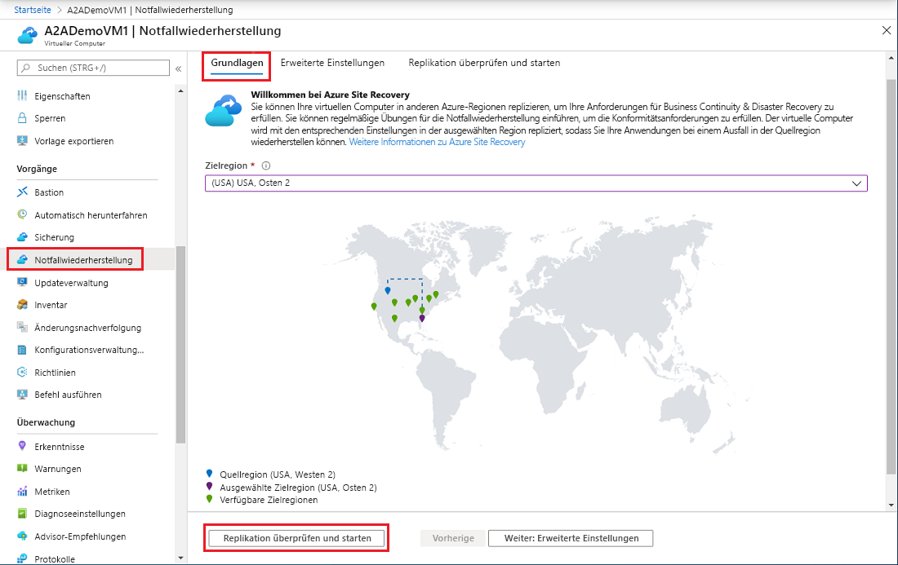
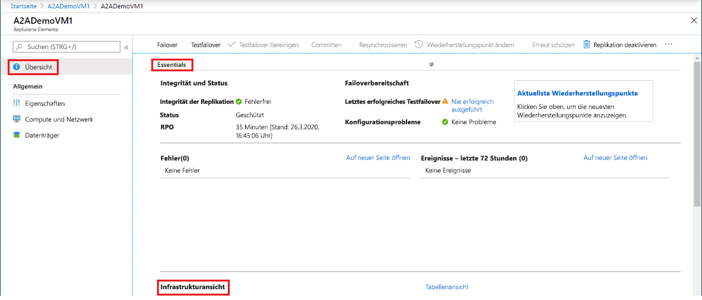

# Einrichten der Notfallwiederherstellung in einer sekundären Azure-Region für einen virtuellen Azure-Computer 

Der Dienst [Azure Site Recovery](site-recovery-overview.md) unterstützt Ihre Strategien für Geschäftskontinuität und Notfallwiederherstellung, indem die Verfügbarkeit Ihrer Geschäftsanwendungen bei geplanten und ungeplanten Ausfällen gewährleistet wird. Site Recovery verwaltet und koordiniert die Notfallwiederherstellung von lokalen Computern sowie virtuellen Azure-Computern (VMs), einschließlich Replikation, Failover und Wiederherstellung.

Dieser Schnellstart beschreibt, wie eine Azure-VM in eine andere Azure-Region repliziert wird.

Wenn Sie kein Azure-Abonnement besitzen, können Sie ein [kostenloses Konto](https://azure.microsoft.com/free/?WT.mc_id=A261C142F) erstellen, bevor Sie beginnen.

> [!NOTE]
> In diesem Artikel wird für einen neuen Benutzer die Azure Site Recovery-Benutzeroberfläche mit den Standardoptionen und dem geringen Anpassungsaufwand beschrieben. Wenn Sie mehr zu den unterschiedlichen Einstellungen erfahren möchten, die angepasst werden können, hilft Ihnen das [Tutorial zur Aktivierung der Replikation für virtuelle Azure-Computer](azure-to-azure-tutorial-enable-replication.md) weiter.

## Anmelden an Azure

Melden Sie sich unter http://portal.azure.com beim Azure-Portal an.

## Aktivieren der Replikation für die Azure-VM

1. Klicken Sie im Azure-Portal auf **Virtuelle Computer**, und wählen Sie die VM aus, die Sie replizieren möchten.
2. Klicken Sie in den **Vorgängen** auf **Notfallwiederherstellung**.
3. Wählen Sie unter **Configure disaster recovery** (Notfallwiederherstellung konfigurieren) > **Zielregion** die Zielregion aus, in die Sie replizieren möchten.
4. Akzeptieren Sie für diesen Schnellstart die anderen Standardeinstellungen.
5. Klicken Sie auf **Replikation aktivieren**. Dadurch wird ein Auftrag gestartet, um die Replikation der VM zu aktivieren.

    

## Überprüfen der Einstellungen

Nach Abschluss des Replikationsauftrags können Sie den Replikationsstatus überprüfen, die Replikationseinstellungen ändern und die Bereitstellung testen.

1. Klicken Sie im VM-Menü auf **Notfallwiederherstellung**.
2. Sie können die Replikationsintegrität, die erstellten Wiederherstellungspunkte und die Quell- und Zielregionen auf der Karte überprüfen.

   

## Bereinigen von Ressourcen

Die Replikation der VM in der primären Region wird beendet, wenn Sie die Replikation der VM deaktivieren:

- Die Quellreplikationseinstellungen werden automatisch bereinigt. Beachten Sie, dass die im Rahmen der Replikation installierte Site Recovery-Erweiterung nicht entfernt wird und manuell gelöscht werden muss. 
- Die Site Recovery-Abrechnung für die VM wird auch beendet.

Beenden Sie die Replikation wie folgt:

1. Wählen Sie den virtuellen Computer aus.
2. Klicken Sie unter **Notfallwiederherstellung** auf **Replikation deaktivieren**.

   

## Nächste Schritte

In diesem Schnellstart haben Sie eine einzelne VM in eine sekundäre Region repliziert. Sie können jetzt weitere Optionen erkunden und versuchen, eine Gruppe von virtuellen Azure-Computern mit einem Wiederherstellungsplan zu replizieren.

> [!div class="nextstepaction"]
> [Konfigurieren der Notfallwiederherstellung für Azure-VMs](azure-to-azure-tutorial-enable-replication.md)
