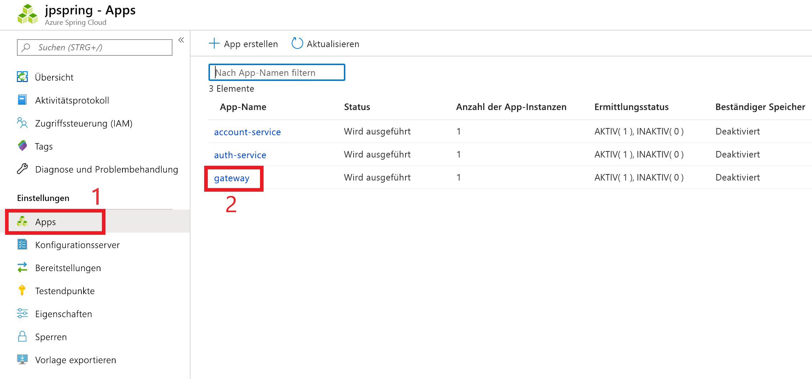
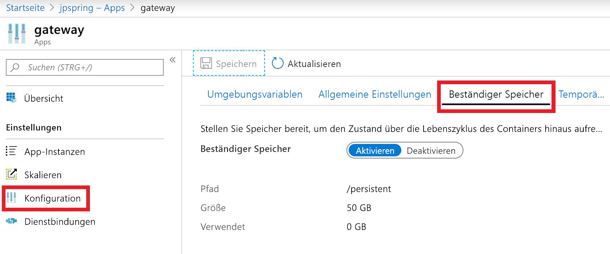

# <a name="how-to-use-persistent-storage-in-azure-spring-cloud"></a>Verwenden von beständigem Speicher in Azure Spring Cloud

Azure Spring Cloud bietet zwei Arten von Speicher für Ihre Anwendung: beständigen und temporären Speicher.  Azure Spring Cloud aktiviert standardmäßig temporären Speicher für jede Anwendungsinstanz. Der temporäre Speicher ist auf 5 GB beschränkt, und der standardmäßige Einbindungspfad lautet: `/tmp`.

> [!WARNING]
> Durch das Neustarten einer Anwendungsinstanz wird der zugehörige temporäre Speicher dauerhaft gelöscht.

Der beständige Speicher ist ein von Azure verwalteter Dateifreigabecontainer, der pro Anwendung zugeordnet wird. Im beständigen Speicher gespeicherte Daten werden für alle Instanzen der Anwendung freigegeben. Eine Azure Spring Cloud-Dienstinstanz kann maximal zehn Anwendungen mit aktiviertem beständigen Speicher enthalten. Jeder Anwendung werden 50 GB an beständigem Speicher zugeordnet. Der Standardeinbindungspfad für beständigen Speicher lautet `/persistent`.

> [!WARNING]
> Durch die *Deaktivierung* des beständigen Speichers wird die Zuordnung des Speichers für diese Anwendung aufgehoben.  Alle Daten in diesem Speicherkonto gehen verloren. 

## <a name="enable-persistent-storage-using-the-azure-portal"></a>Aktivieren des beständigen Speichers mithilfe des Azure-Portals

1. Wählen Sie auf dem Startbildschirm Ihres Azure-Portals **Alle Ressourcen** aus.

     >

1. Suchen Sie die Azure Spring Cloud-Ressource, die beständigen Speicher benötigt, und wählen Sie sie aus.  In diesem Beispiel heißt die Anwendung *jpspring*.

    > 

1. Wählen Sie unter der Überschrift **Einstellungen** die Option **Apps** aus.

1. Ihre Spring Cloud-Dienste werden in der Tabelle angezeigt.  Wählen Sie den Dienst aus, dem Sie beständigen Speicher hinzufügen möchten.  In diesem Beispiel wählen wir unseren **Gateway**-Dienst aus.

    > 

1. Wählen Sie auf dem Blatt „Konfiguration“ des Dienstes die Option **Konfiguration** aus.

1. Wählen Sie die Registerkarte **Beständiger Speicher**, und aktivieren Sie den beständigen Speicher.

    > 

Wenn der beständige Speicher aktiviert ist, werden Größe und Pfad auf dieser Seite angezeigt.

## <a name="use-the-azure-cli-to-modify-persistent-storage"></a>Verwenden Sie die Azure-Befehlszeilenschnittstelle, um den beständigen Speicher zu ändern.

Installieren Sie bei Bedarf die Spring Cloud-Erweiterung für die Azure-Befehlszeilenschnittstelle:

```azurecli
az extension add --name spring-cloud
```

Erstellen Sie eine App mit aktiviertem persistenten Datenträger:
 
```azurecli
az spring-cloud app create -n <app> -g <resource-group> -s <service-name> --enable-persistent-storage true
```

Aktivieren Sie beständigen Speicher in einer vorhandenen App:

```azurecli
az spring-cloud app update -n <app> -g <resource-group> -s <service-name> --enable-persistent-storage true
``` 

Deaktivieren Sie beständigen Speicher in einer vorhandenen App:

> [!WARNING]
> Durch die Deaktivierung des beständigen Speichers wird die Zuordnung des Speichers für diese Anwendung aufgehoben, sodass alle dort gespeicherten Daten dauerhaft verloren gehen. 

```azurecli
az spring-cloud app update -n <app> -g <resource-group> -s <service-name> --enable-persistent-storage false
```

## <a name="next-steps"></a>Nächste Schritte

Erfahren Sie mehr über [Anwendungs- und Dienstkontingente](spring-cloud-quotas.md) oder das [manuelle Skalieren Ihrer Anwendung](spring-cloud-tutorial-scale-manual.md).