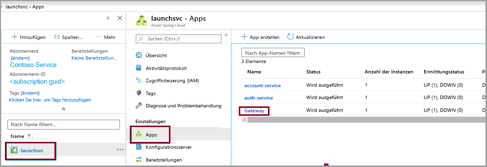

# <a name="quickstart-launch-a-java-spring-application-using-the-azure-cli"></a>Schnellstart: Starten einer Java Spring-Anwendung mit der Azure CLI

Azure Spring Cloud ermöglicht Ihnen die einfache Ausführung einer Spring Boot-basierten Microserviceanwendung in Azure.

In dieser Schnellstartanleitung erfahren Sie, wie Sie eine vorhandene Java Spring Cloud-Anwendung in Azure bereitstellen. Anschließend können Sie die Anwendung weiterhin über die Azure CLI verwalten oder zur Verwendung des Azure-Portals wechseln.

In dieser Schnellstartanleitung wird Folgendes vermittelt:

> [!div class="checklist"]
> * Bereitstellen einer Dienstinstanz
> * Festlegen eines Konfigurationsservers für eine Instanz
> * Lokales Erstellen einer Microserviceanwendung
> * Bereitstellen der einzelnen Microservices
> * Zuweisen eines öffentlichen Endpunkts für Ihre Anwendung

## <a name="prerequisites"></a>Voraussetzungen

>[!Note]
> Azure Spring Cloud wird zurzeit als Public Preview angeboten. Angebote der Public Preview ermöglichen Kunden das Experimentieren mit neuen Funktionen vor der offiziellen Veröffentlichung.  Funktionen und Dienste in der Public Preview sind nicht zur Verwendung in der Produktion bestimmt.  Weitere Informationen zur Unterstützung während der Vorschauphase finden Sie in den [häufig gestellten Fragen](https://azure.microsoft.com/support/faq/). Sie können auch eine [Supportanfrage](https://docs.microsoft.com/azure/azure-supportability/how-to-create-azure-support-request) einreichen, um weitere Informationen zu erhalten.

>[!TIP]
> Azure Cloud Shell ist eine kostenlose interaktive Shell, mit der Sie die Schritte in diesem Artikel ausführen können.  Sie verfügt über allgemeine vorinstallierte Azure-Tools, u. a. die aktuellen Versionen von Git, JDK, Maven und der Azure-Befehlszeilenschnittstelle. Wenn Sie bei Ihrem Azure-Abonnement angemeldet sind, starten Sie [Azure Cloud Shell](https://shell.azure.com) über shell.azure.com.  Weitere Informationen zu Azure Cloud Shell finden Sie in der [Dokumentation](../cloud-shell/overview.md).

So führen Sie diesen Schnellstart durch:

1. [Installation von Git](https://git-scm.com/)
2. [Installation von JDK 8](https://docs.microsoft.com/java/azure/jdk/?view=azure-java-stable)
3. [Installation von Maven 3.0 oder höher](https://maven.apache.org/download.cgi)
4. [Installation der Azure CLI, Version 2.0.67 oder höher](https://docs.microsoft.com/cli/azure/install-azure-cli?view=azure-cli-latest)
5. [Registrierung für ein Azure-Abonnement](https://azure.microsoft.com/free/)

## <a name="install-the-azure-cli-extension"></a>Installieren der Erweiterung für die Azure-Befehlszeilenschnittstelle

Führen Sie den folgenden Befehl aus, um die Azure Spring Cloud-Erweiterung für die Azure CLI zu installieren:

```azurecli
az extension add --name spring-cloud
```

## <a name="provision-a-service-instance-on-the-azure-cli"></a>Bereitstellen einer Dienstinstanz über die Azure CLI

1. Melden Sie sich bei der Azure-Befehlszeilenschnittstelle an, und wählen Sie Ihr aktives Abonnement aus. Vergewissern Sie sich, dass Sie das aktive Abonnement auswählen, das in der Whitelist für Azure Spring Cloud enthalten ist.

    ```azurecli
        az login
        az account list -o table
        az account set --subscription
    ```

2. Bereiten Sie einen Namen für Ihren Azure Spring Cloud-Dienst vor.  Der Name muss zwischen 4 und 32 Zeichen lang sein und darf nur Kleinbuchstaben, Ziffern und Bindestriche enthalten.  Das erste Zeichen des Dienstnamens muss ein Buchstabe und das letzte Zeichen entweder ein Buchstabe oder eine Ziffer sein.

3. Erstellen Sie eine Ressourcengruppe, die Ihren Azure Spring Cloud-Dienst enthält.

    ```azurecli
        az group create --location eastus --name <resource group name>
    ```
    Erfahren Sie mehr über [Azure-Ressourcengruppen](../azure-resource-manager/management/overview.md).

4. Öffnen Sie ein Fenster der Azure-Befehlszeilenschnittstelle, und führen Sie die folgenden Befehle aus, um eine Instanz von Azure Spring Cloud bereitzustellen.

    ```azurecli
        az spring-cloud create -n <service name> -g <resource group name>
    ```

    Die Bereitstellung der Dienstinstanz dauert etwa fünf Minuten.

5. Legen Sie den Standardnamen für die Ressourcengruppe und den Clusternamen mithilfe der folgenden Befehle fest:

    ```azurecli
        az configure --defaults group=<service group name>
        az configure --defaults spring-cloud=<service instance name>
    ```

## <a name="setup-your-configuration-server"></a>Einrichten des Konfigurationsservers

Aktualisieren Sie den Konfigurationsserver mit dem Speicherort des Git-Repositorys für Ihr Projekt:

```git
az spring-cloud config-server git set -n <your-service-name> --uri https://github.com/Azure-Samples/piggymetrics --label config
```

## <a name="build-the-microservices-applications-locally"></a>Lokales Erstellen der Microserviceanwendungen

1. Erstellen Sie einen neuen Ordner, und klonen Sie das Beispiel-App-Repository in Ihrem Azure Cloud-Konto.  

    ```azurecli
        mkdir source-code
        git clone https://github.com/Azure-Samples/piggymetrics
    ```

2. Ändern Sie das Verzeichnis, und erstellen Sie das Projekt.

    ```azurecli
        cd piggymetrics
        mvn clean package -D skipTests
    ```

Die Kompilierung des Projekts dauert etwa fünf Minuten.  Nach Abschluss des Vorgangs sollten die entsprechenden Ordner einzelne JAR-Dateien für jeden Dienst enthalten.

## <a name="create-the-microservices"></a>Erstellen der Microservices

Erstellen Sie mithilfe der im vorherigen Schritt erstellten JAR-Dateien Spring Cloud-Microservices. Sie erstellen drei Microservices: **gateway**, **auth-service** und **account-service**.

```azurecli
az spring-cloud app create --name gateway
az spring-cloud app create --name auth-service
az spring-cloud app create --name account-service
```

## <a name="deploy-applications-and-set-environment-variables"></a>Bereitstellen von Anwendungen und Festlegen von Umgebungsvariablen

Die Anwendungen müssen tatsächlich in Azure bereitgestellt werden. Verwenden Sie die folgenden Befehle, um alle drei Anwendungen bereitzustellen:

```azurecli
az spring-cloud app deploy -n gateway --jar-path ./gateway/target/gateway.jar
az spring-cloud app deploy -n account-service --jar-path ./account-service/target/account-service.jar
az spring-cloud app deploy -n auth-service --jar-path ./auth-service/target/auth-service.jar
```

## <a name="assign-public-endpoint-to-gateway"></a>Zuweisen eines öffentlichen Endpunkts zum Gateway

Wir benötigen eine Methode, um über einen Webbrowser auf die Anwendung zugreifen zu können. Unsere Gatewayanwendung benötigt einen öffentlichen Endpunkt, der mit dem folgenden Befehl zugewiesen werden kann:

```azurecli
az spring-cloud app update -n gateway --is-public true
```

Fragen Sie schließlich die öffentliche IP-Adresse der Anwendung **gateway** ab, damit Sie überprüfen können, ob die Anwendung ausgeführt wird:

```azurecli
az spring-cloud app show --name gateway | grep url
```

Navigieren Sie zu der URL, die mit dem vorherigen Befehl zurückgegeben wurde, um die PiggyMetrics-Anwendung auszuführen.
    

Sie können auch im Azure-Portal navigieren, um die URL zu suchen. 
1. Navigieren Sie zum Dienst.
1. Wählen Sie **Apps** aus.
1. Wählen Sie **Gateway** aus.

    
1. Die URL finden Sie auf der **Gateway-Übersichtsseite**. 

## <a name="next-steps"></a>Nächste Schritte

In dieser Schnellstartanleitung haben Sie eine Spring Cloud-Anwendung über die Azure CLI bereitgestellt.  Weitere Informationen zu Azure Spring Cloud finden Sie im Tutorial zum Vorbereiten Ihrer App für die Bereitstellung.

> [!div class="nextstepaction"]
> [Vorbereiten der Azure Spring Cloud-Anwendung für die Bereitstellung](spring-cloud-tutorial-prepare-app-deployment.md)

Weitere Beispiele finden Sie auf GitHub: [Azure Spring Cloud-Beispiele](https://github.com/Azure-Samples/Azure-Spring-Cloud-Samples/tree/master/service-binding-cosmosdb-sql).
