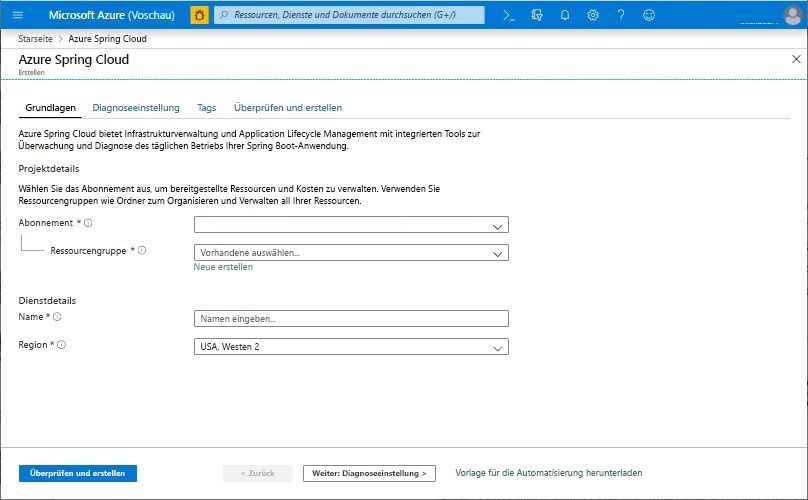

# <a name="quickstart-launch-an-azure-spring-cloud-app-using-the-maven-plug-in"></a>Schnellstart: Starten einer Azure Spring Cloud-App mithilfe des Maven-Plug-Ins

Mit dem Maven-Plug-In von Azure Spring Cloud können Sie ganz einfach Ihre Azure Spring Cloud-Anwendungen erstellen und aktualisieren. Sie können Anwendungen in Ihrem vorhandenen Azure Spring Cloud-Dienst bereitstellen, indem Sie eine Konfiguration vordefinieren. In diesem Artikel wird eine Beispielanwendung namens PiggyMetrics verwendet, um dieses Feature zu veranschaulichen.

In dieser Schnellstartanleitung wird Folgendes vermittelt:

> [!div class="checklist"]
> * Bereitstellen einer Dienstinstanz
> * Einrichten eines Konfigurationsservers für eine Instanz
> * Lokales Klonen und Erstellen einer Microserviceanwendung
> * Bereitstellen der einzelnen Microservices
> * Zuweisen eines öffentlichen Endpunkts für Ihre Anwendung

>[!Note]
> Azure Spring Cloud wird zurzeit als Public Preview angeboten. Angebote der Public Preview ermöglichen Kunden das Experimentieren mit neuen Funktionen vor der offiziellen Veröffentlichung.  Funktionen und Dienste in der Public Preview sind nicht zur Verwendung in der Produktion bestimmt.  Weitere Informationen zur Unterstützung während der Vorschauphase finden Sie in den [häufig gestellten Fragen](https://azure.microsoft.com/support/faq/). Sie können auch eine [Supportanfrage](https://docs.microsoft.com/azure/azure-supportability/how-to-create-azure-support-request) einreichen, um weitere Informationen zu erhalten.


>[!TIP]
> Azure Cloud Shell ist eine kostenlose interaktive Shell, mit der Sie die Befehle in diesem Artikel ausführen können. Sie verfügt über allgemeine vorinstallierte Azure-Tools, u. a. die aktuellen Versionen von Git, Java Development Kit (JDK), Maven und der Azure-Befehlszeilenschnittstelle. Wenn Sie bei Ihrem Azure-Abonnement angemeldet sind, starten Sie [Azure Cloud Shell](https://shell.azure.com). Weitere Informationen finden Sie in der [Übersicht über Azure Cloud Shell](../cloud-shell/overview.md).

So führen Sie diesen Schnellstart durch:

1. [Git installieren](https://git-scm.com/).
2. [Installation von JDK 8](https://docs.microsoft.com/java/azure/jdk/?view=azure-java-stable)
3. [Installation von Maven 3.0 oder höher](https://maven.apache.org/download.cgi)
4. [Registrieren für eine kostenlose Azure-Testversion](https://azure.microsoft.com/free/)

## <a name="provision-a-service-instance-on-the-azure-portal"></a>Bereitstellen einer Dienstinstanz im Azure-Portal

1. Öffnen Sie in einem Webbrowser [diesen Link zu Azure Spring Cloud im Azure-Portal](https://ms.portal.azure.com/#create/Microsoft.AppPlatform), und melden Sie sich bei Ihrem Konto an.

1. Geben Sie **Projektdetails** für die Beispielanwendung wie folgt an:

    1. Wählen Sie das **Abonnement** aus, dem die Anwendung zugeordnet werden soll.
    1. Wählen Sie eine Ressourcengruppe für die Anwendung aus, oder erstellen Sie eine. Es wird empfohlen, eine neue Ressourcengruppe zu erstellen.  Das folgende Beispiel zeigt eine neue Ressourcengruppe mit dem Namen `myspringservice`.
    1. Geben Sie einen Namen für den neuen Azure Spring Cloud-Dienst an.  Der Name muss zwischen 4 und 32 Zeichen lang sein und darf nur Kleinbuchstaben, Ziffern und Bindestriche enthalten. Das erste Zeichen des Dienstnamens muss ein Buchstabe und das letzte Zeichen entweder ein Buchstabe oder eine Ziffer sein.  Der Dienst im Beispiel unten hat den Namen `contosospringcloud`.
    1. Wählen Sie in den bereitgestellten Optionen einen Standort für die Anwendung aus.  In diesem Beispiel wählen wir `East US` aus.
    1. Wählen Sie **Bewerten + erstellen** aus, um eine Zusammenfassung Ihres neuen Diensts anzuzeigen.  Wenn alles korrekt ist, wählen Sie **Erstellen** aus.

    > [!div class="mx-imgBorder"]
    > 

Die Bereitstellung des Diensts dauert etwa fünf Minuten. Wählen Sie nach der Bereitstellung des Diensts **Zu Ressource wechseln** aus. Die Seite **Übersicht** für die Dienstinstanz wird angezeigt.

## <a name="set-up-your-configuration-server"></a>Einrichten Ihres Konfigurationsservers

1. Wählen Sie auf der Seite **Übersicht** die Option **Konfigurationsserver** aus.
1. Legen Sie im Abschnitt **Standardrepository** den Wert für **URI** auf **https://github.com/Azure-Samples/piggymetrics** und **Bezeichnung** auf **Konfiguration** fest, und wählen Sie **Anwenden** aus, um Ihre Änderungen zu speichern.

    > [!div class="mx-imgBorder"]
    > 

## <a name="clone-and-build-the-sample-application-repository"></a>Klonen und Erstellen des Beispielanwendungsrepositorys

1. Starten Sie [Azure Cloud Shell](https://shell.azure.com).

1. Führen Sie den folgenden Befehl aus, um das Git-Repository zu klonen:

    ```azurecli
    git clone https://github.com/Azure-Samples/PiggyMetrics
    ```
  
1. Führen Sie den folgenden Befehl aus, um das Verzeichnis zu ändern und das Projekt zu erstellen:

    ```azurecli
    cd piggymetrics
    mvn clean package -DskipTests
    ```

## <a name="generate-configurations-and-deploy-to-the-azure-spring-cloud"></a>Generieren von Konfigurationen und Bereitstellen in Azure Spring Cloud

1. Generieren Sie Konfigurationen, indem Sie den folgenden Befehl im Stammverzeichnis von PiggyMetrics mit dem übergeordneten POM ausführen:

    ```azurecli
    mvn com.microsoft.azure:azure-spring-cloud-maven-plugin:1.0.0:config
    ```

    a. Wählen Sie die Module `gateway`, `auth-service` und `account-service` aus.

    b. Wählen Sie Ihr Abonnement und den Azure Spring Cloud-Dienstcluster aus.

    c. Geben Sie in der Liste der angegebenen Projekte die Zahl für `gateway` ein, um öffentlichen Zugriff zu gewähren.
    
    d. Bestätigen Sie die Konfiguration.

1. Das POM enthält jetzt die Plug-In-Abhängigkeiten und -Konfigurationen. Stellen Sie die Apps mit dem folgenden Befehl bereit:

   ```azurecli
   mvn azure-spring-cloud:deploy
   ```

1. Nach Abschluss der Bereitstellung können Sie mit der URL aus der Ausgabe des vorherigen Befehls auf PiggyMetrics zugreifen.

## <a name="next-steps"></a>Nächste Schritte

In dieser Schnellstartanleitung haben Sie eine Spring Cloud-Anwendung aus einem Maven-Repository bereitgestellt. Weitere Informationen zu Azure Spring Cloud finden Sie im Tutorial zum Vorbereiten Ihrer App für die Bereitstellung.

> [!div class="nextstepaction"]
> [Vorbereiten Ihrer Azure Spring Cloud-Anwendung für die Bereitstellung](spring-cloud-tutorial-prepare-app-deployment.md)
> [Weitere Informationen zu Maven-Plug-Ins für Azure](https://github.com/microsoft/azure-maven-plugin)
