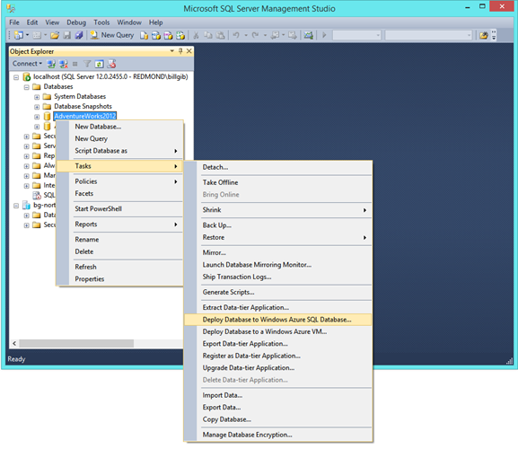
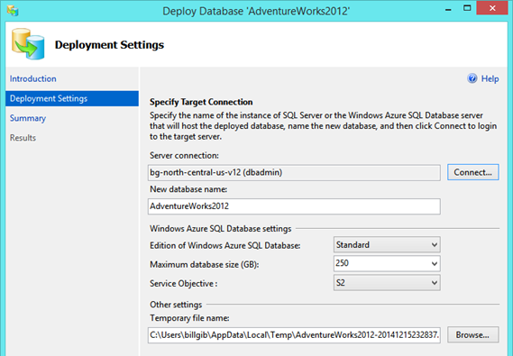
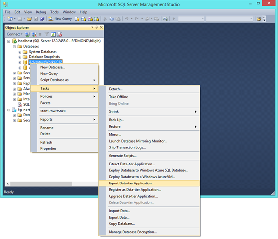
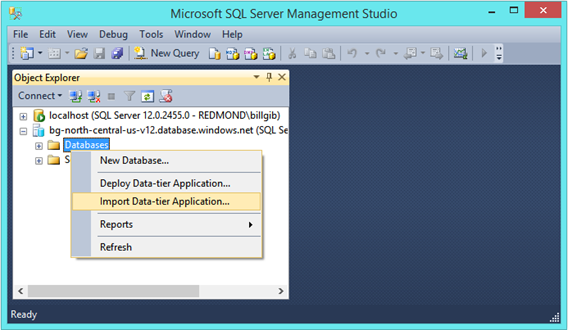

<properties
   pageTitle="Migrieren zu einer SQL-Datenbank mithilfe von SSMS"
   description="Microsoft Azure SQL-Datenbank, SQL-Datenbank migrieren, Migrieren mithilfe von SSMS"
   services="sql-database"
   documentationCenter=""
   authors="pehteh"
   manager="jeffreyg"
   editor="monicar"/>

<tags
   ms.service="sql-database"
   ms.devlang="NA"
   ms.topic="article"
   ms.tgt_pltfrm="NA"
   ms.workload="data-management"
   ms.date="04/14/2015"
   ms.author="pehteh"/>

#Migrieren einer kompatiblen Datenbank mit SSMS 

Wenn ein Datenbankschema bereits mit der Azure SQL-Datenbank kompatibel ist, geht die Migration einfach vonstatten. Da keine Transformation erforderlich ist, erfordert die Migration nur, dass die Datenbank in Azure importiert wird. Dies kann in einem einzigen Schritt mit SSMS durch "Bereitstellen" der Datenbank in der Azure SQL-Datenbank oder als zweistufiger Prozess durch den Export einer BACPAC-Datei mit anschließendem Importieren auf einem Azure SQL-Datenbankserver zum Erstellen einer neuen Datenbank erfolgen.

Sie können die exportierte BACPAC-Datei in den Azure-Speicher hochladen und über das Portal importieren. Durch eine Ausführung des Imports in der Cloud wird die Wartezeit beim Importschritt verringert, was wiederum die Leistung und Zuverlässigkeit der Migration mit großen Datenbanken verbessert.

Bei einer direkten Bereitstellung aus SSMS werden immer sowohl Schema als auch Daten bereitgestellt, während beim Export und Import immer das Schema bereitgestellt und dann eine Option angeboten wird, Daten aus allen Tabellen oder einem Teil der Tabellen bereitzustellen. Bei beiden Bereitstellungsmethoden, aus SSMS oder per Export mit anschließendem Import aus SSMS (oder später aus dem Portal), kommt die gleiche DAC-Technologie zum Einsatz, und das Ergebnis ist identisch.

Diese Option dient auch als letzter Schritt in Option 3 zum Migrieren der Datenbanken nach der Aktualisierung für die Kompatibilität mit der Azure SQL-Datenbank.

##Verwenden von SSMS zum Bereitstellen der Azure SQL-Datenbank
1.	Stellen Sie wie unter "Erstellen des Zielservers für die migrierte Datenbank" beschrieben einen Server mithilfe des Azure-Portals bereit.
2. Suchen Sie die Quelldatenbank im SSMS-Objekt-Explorer, und führen Sie die Aufgabe **Bereitstellen einer Datenbank in Windows Azure SQL-Datenbank** aus.

	

3.	Konfigurieren Sie im Bereitstellungs-Assistenten die Verbindung mit dem Azure SQL-Datenbank-Zielserver, der in einem anderen Schritt bereitgestellt wurde.
4.	Geben Sie den **Namen** für die Datenbank ein, und legen Sie die **Edition** (Dienstebene) sowie die Leistungsstufe **Service Objective** fest. Weitere Informationen zum Konfigurieren dieser Einstellungen finden Sie unter "Auswählen einer Datenbank-Leistungsebene bzw. eines Tarifs für die Migration". 

	

5.	Schließen Sie den Assistenten ab, um die Migration der Datenbank auszuführen. Je nach Größe und Komplexität der Datenbankbereitstellung kann dies wenige Minuten bis viele Stunden dauern. Wenn Fehler der Form auftreten, dass das Datenbankschema nicht kompatibel mit der SQL-Datenbank ist, muss eine andere Option verwendet werden.
##Verwenden von SSMS zum Exportieren einer BACPAC-Datei mit anschließendem Importieren in die SQL-Datenbank
Der Bereitstellungsprozess kann in zwei Schritte unterteilt werden: Export und Import. Im ersten Schritt wird eine BACPAC-Datei erstellt, die dann als Eingabe im zweiten Schritt verwendet wird.

1.	Stellen Sie wie unter "Erstellen des Zielservers für die migrierte Datenbank" beschrieben einen Server mithilfe des aktuellen SQL-Datenbankupdates bereit.
2.	Suchen Sie die Quelldatenbank im SSMS-Objekt-Explorer, und wählen Sie die Aufgabe **Bereitstellen einer Datenbank für Windows Azure SQL-Datenbank** aus.

	

3. Konfigurieren Sie im Export-Assistenten die entsprechenden Einstellungen, um die BACPAC-Datei lokal zu speichern. Die exportierte BACPAC-Datei enthält immer das vollständige Datenbankschema und standardmäßig die Daten aus allen Tabellen. Verwenden Sie die Registerkarte "Erweitert", wenn Sie Daten aus einigen oder allen Tabellen ausschließen möchten. Sie können z. B. nur die Daten für Verweistabellen exportieren.
	>[AZURE.NOTE]Hinweis: Sobald das Azure-Verwaltungsportal den Import in Azure unterstützt, können Sie auswählen, dass die exportierte BACPAC-Datei in Azure-Speicher gespeichert und der Import in der Cloud ausgeführt wird.

	

4.	Sobald die BACPAC-Datei erstellt wurde, stellen Sie eine Verbindung mit dem Server her, den Sie in Schritt 1 erstellt haben. Klicken Sie mit der rechten Maustaste auf den Ordner "Datenbanken", und wählen Sie "Datenebenenanwendung importieren" aus.

	

5.	Wählen Sie im Assistenten zum Importieren die BACPAC-Datei aus, die Sie gerade exportiert haben, um die neue Datenbank in der Azure SQL-Datenbank zu erstellen.

	

6.	Geben Sie den Namen für die Datenbank ein, und legen Sie die Edition (Dienstebene) sowie das Dienstziel (Leistungsstufe) fest.
	 
7.	Schließen Sie den Assistenten zum Importieren der BACPAC-Datei ab, und erstellen Sie die Datenbank in der Azure SQL-Datenbank.

	
 
##Alternativen
Sie können auch das Befehlszeilen-Dienstprogramm "sqlpackage.exe" zum Bereitstellen der Datenbank oder zum Importieren bzw. Exportieren einer BACPAC-Datei verwenden. "sqlpackage.exe" verwendet die gleiche DAC-Technologie wie SSMS, sodass das Ergebnis identisch ist. Weitere Informationen finden Sie [hier](https://msdn.microsoft.com/library/hh550080.aspx).

<!---HONumber=58-->