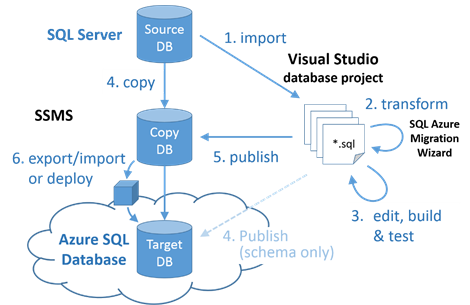
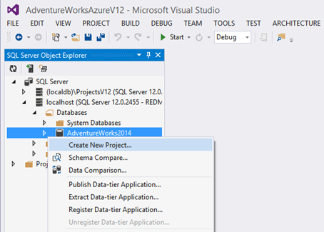
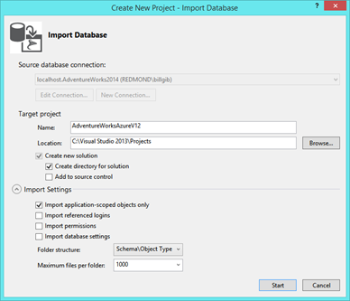
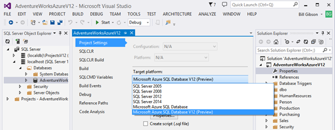
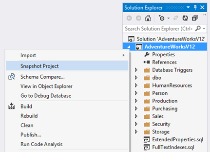
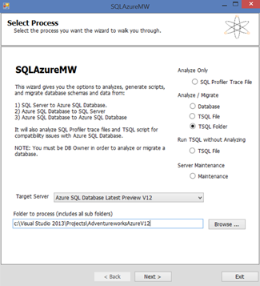
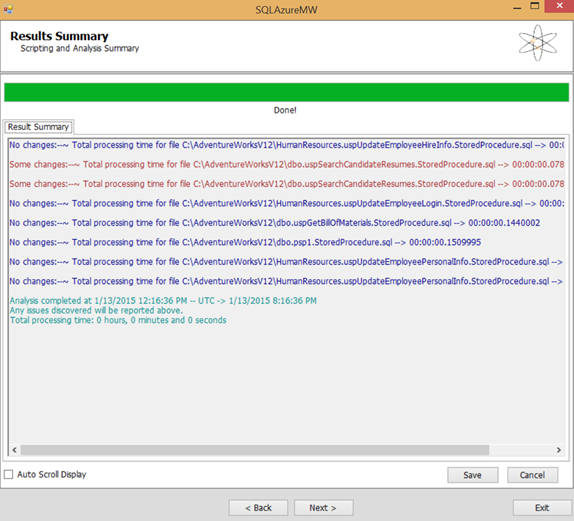

<properties 
   pageTitle="Migration mithilfe von Visual Studio und SSDT" 
   description="Microsoft Azure SQL-Datenbank, Datenbankmigration, Datenbank importieren, Datenbank exportieren, Migrations-Assistent" 
   services="sql-database" 
   documentationCenter="" 
   authors="pehteh" 
   manager="jeffreyg" 
   editor="monicar"/>

<tags
   ms.service="sql-database"
   ms.devlang="NA"
   ms.topic="article"
   ms.tgt_pltfrm="NA"
   ms.workload="data-management" 
   ms.date="04/14/2015"
   ms.author="pehteh"/>

#Lokales Aktualisieren einer Datenbank und Bereitstellen in Azure SQL-Datenbank

Verwenden Sie diese Option bei der Migration einer Datenbank in eine Azure SQL-Datenbank der Version 12, wenn Schemaänderungen erforderlich sind, die nicht mit dem SQL Azure-Migrations-Assistenten (SAMW) durchgeführt werden können. Dies ist der Fall, wenn die Datenbank SQL Server-Funktionen verwendet, die nicht oder noch nicht in Azure SQL-Datenbanken unterstützt werden. Bei dieser Option wird Visual Studio zunächst verwendet, um ein Datenbankprojekt aus der Quelldatenbank zu erstellen. Die Zielplattform für das Projekt wird dann auf Azure SQL-Datenbank V12 festgelegt, und das Projekt wird erstellt, um mögliche Kompatibilitätsprobleme zu ermitteln. SAMW kann viele, jedoch nicht alle Kompatibilitätsprobleme beheben und wird somit als erster Schritt zur Verarbeitung aller Skripts in den Projekten verwendet. Die Verwendung von SAMW ist optional, wird jedoch dringend empfohlen. Beim Erstellen des Projekts nach der Verarbeitung der Skriptdateien mit SAMW werden verbleibende Probleme erkannt, die dann manuell mithilfe von T-SQL-Bearbeitungs-Tools in Visual Studio gelöst werden müssen. Nachdem das Projekt erfolgreich erstellt wird, erfolgt eine Veröffentlichung des Schemas zurück in eine Kopie (empfohlen) der Quelldatenbank, um das Schema und die Daten lokal zu aktualisieren. Die aktualisierte Datenbank wird daraufhin entweder direkt oder durch Exportieren und Importieren einer BACPAC-Datei mit den in Option 1 beschriebenen Techniken in Azure bereitgestellt.
 
Da diese Option die lokale Aktualisierung des Datenbankschemas vor der Bereitstellung in Azure umfasst, wird dringend empfohlen, dies auf einer Kopie der Datenbank auszuführen. Das Visual Studio-Schemavergleichstool kann verwendet werden, um den vollständigen Satz von Änderungen zu überprüfen, die vor dem Veröffentlichen des Projekts auf die Datenbank angewendet werden.

Die Verwendung des SQL Azure-Migrations-Assistenten (SAMW) ist optional, wird jedoch empfohlen. SAMW erkennt Kompatibilitätsprobleme innerhalb des Hauptteils der Funktionen sowie in gespeicherten Prozeduren und Triggern, die auf andere Weise bis zur Bereitstellung nicht erkannt werden. Wenn eine ausschließliche Schemabereitstellung erforderlich ist, kann das aktualisierte Schema direkt aus Visual Studio in der Azure SQL-Datenbank veröffentlicht werden.

## Schritte bei der Migration

1.	Öffnen Sie den **Objekt-Explorer von SQL Server** in Visual Studio. Verwenden Sie **SQL Server hinzufügen**, um eine Verbindung mit der SQL Server-Instanz herzustellen, die die zu migrierende Datenbank enthält. Suchen Sie die Datenbank im Explorer, klicken Sie mit der rechten Maustaste darauf, und wählen Sie **Neues Projekt erstellen...** aus. 

2.	Legen Sie die Importeinstellungen auf **Import application-scoped objects only** fest. Deaktivieren Sie die Optionen zum Importieren der Anmeldungsverweise, Berechtigungen und Datenbankeinstellungen.

3.	Klicken Sie auf **Starten**, um die Datenbank zu importieren und das Projekt zu erstellen, das eine T-SQL-Skriptdatei für jedes Objekt in der Datenbank enthält. Die Skriptdateien werden in Ordnern innerhalb des Projekts geschachtelt.

4.	Klicken Sie in Visual Studio im Projektmappen-Explorer mit der rechten Maustaste auf das Datenbankprojekt, und wählen Sie "Eigenschaften" aus. Dadurch wird die Seite **Projekteinstellungen** geöffnet, auf der Sie die Zielplattform auf "Microsoft Azure SQL Database V12" festlegen.

5.	Optional: Klicken Sie mit der rechten Maustaste auf das Projekt, und wählen Sie **Erstellen** aus, um das Projekt zu erstellen. (Dies ist zu diesem Zeitpunkt nicht unbedingt erforderlich, Sie erhalten dadurch jedoch einen Überblick über die Anzahl der Anwendungskompatibilitätsprobleme im Projekt und die Effektivität der folgenden Schritte.)

6.	Optional: Klicken Sie mit der rechten Maustaste auf das Projekt, und wählen Sie **Snapshot Project** aus. Durch die Aufzeichnung einer Momentaufnahme zu Beginn und möglicherweise auch in späteren Phasen bei der Transformation können Sie das Schemavergleichstool in jeder Phase für Vergleiche nutzen.

 – Durch die Erstellung von Momentaufnahmen des Projekts wird eine DACPAC-Datei mit Zeitstempel erstellt, die das vollständige Schema des Projekts enthält. Sie können den Dateinamen ändern, um anzuzeigen, in welcher Phase des Prozesses diese Momentaufnahme erstellt wurde. 

7.	Verarbeiten Sie die importierten Skriptdateien mit dem SQL Azure-Migrations-Assistenten (SAMW). Verwenden Sie die Ordneroption, und wählen Sie den Stammordner des Projekts aus. 

8.	Der Assistent verarbeitet jede Skriptdatei in diesem Ordner und allen Unterordnern. Auf der nächsten Seite wird eine Zusammenfassung der Ergebnisse angezeigt. 
9.	Klicken Sie auf "Weiter", um eine zusammenfassende Liste der Dateien anzuzeigen, die geändert wurden. 

>Beachten Sie, dass temporäre Kopien der ursprünglichen Dateien vor der Verarbeitung und der betroffenen Dateien nach der Verarbeitung an den oben auf der Seite angegebenen Speicherorten erstellt werden.

10.	Klicken Sie im Bestätigungsdialogfeld auf "Überschreiben" und "OK", um die ursprünglichen Dateien mit den geänderten Dateien zu überschreiben. Beachten Sie, dass nur die Dateien, die tatsächlich geändert wurden, überschrieben werden.
11.	Optional. Verwenden Sie einen Schemavergleich, um das Projekt mit einer früheren Momentaufnahme oder der ursprünglichen Datenbank zu vergleichen, sodass Sie die vom Assistenten vorgenommenen Änderungen nachvollziehen können. Sie sollten zu diesem Zeitpunkt eine weitere Momentaufnahme erstellen. 

12.	Erstellen Sie das Projekt erneut (siehe vorherigen Schritt), um die verbleibenden Fehler zu ermitteln.

13.	Arbeiten Sie sich systematisch durch die Fehler, um jedes Problem zu beheben. Bewerten Sie die Auswirkungen der einzelnen Änderungen auf Anwendungen, die die Datenbank verwenden.

14.	Wenn alle Fehler in der Datenbank behoben wurden, klicken Sie mit der rechten Maustaste auf das Projekt, und wählen Sie **Veröffentlichen** aus, um die Datenbank als Kopie der Quelldatenbank zu erstellen und zu veröffentlichen. (Es wird dringend empfohlen, zumindest zu Beginn eine Kopie zu verwenden.) Das Ziel dieses Schritts ist es, die Quell-Datenbankschemas zu aktualisieren und die sich daraus ergebenden Änderungen an Daten in der Datenbank vorzunehmen.
- Vor der Veröffentlichung sollten Sie in Abhängigkeit von der Quell-SQL Server-Version die Zielplattform für das Projekt zum Aktivieren der Bereitstellung zurücksetzen. Wenn Sie eine ältere SQL Server-Datenbank migrieren, dürfen Sie keine Features in das Projekt einführen,die nicht vom Quell-SQL Server unterstützt werden, es sei denn, Sie migrieren zuerst die Datenbank in eine neuere Version von SQL Server. 
- Sie müssen den Veröffentlichungsschritt zum Aktivieren der entsprechenden Veröffentlichungsoptionen konfigurieren. Wenn Sie beispielsweise nicht unterstützte Objekte im Projekt gelöscht oder auskommentiert haben, müssen diese aus der Datenbank gelöscht werden, sodass Sie die Veröffentlichung zum Löschen von Daten in der Zieldatenbank zulassen müssen. 
- Bei geplanten wiederholten Veröffentlichungen 

15.	Stellen Sie die kopierte Datenbank für die Azure SQL-Datenbank mit den in Option 1 beschriebenen Techniken bereit.

## Überprüfen der Migration

Nach Abschluss der Migration empfiehlt es sich, das Schema in der migrierten Datenbank mit dem Schema in der Quelldatenbank zu vergleichen, um sich mit den Änderungen vertraut zu machen und sicherzustellen, dass diese Ihren Erwartungen entsprechen und keine Probleme beim Migrieren von Anwendungen in die neue Datenbank verursachen. Sie können das Schemavergleichstool aus den SQL Server-Tools in Visual Studio zum Durchführen des Vergleichs verwenden. Sie können die Datenbank in Azure SQL-Datenbank mit der ursprünglichen SQL Server-Datenbank oder einer Momentaufnahme vergleichen, die beim ersten Importieren der Datenbank in das Projekt erstellt wurde.

1.	Stellen Sie eine Verbindung mit dem Server in der Azure SQL-Datenbank her, die die migrierte Datenbank enthält, und suchen Sie die Datenbank. 

2.	Klicken Sie mit der rechten Maustaste auf die Datenbank, und wählen Sie **Schemavergleich...** aus. Dadurch wird auf der linken Seite ein neuer Schemavergleich mit der Azure-Datenbank als Quelle geöffnet. Verwenden Sie die Dropdownliste "Ziel auswählen" auf der rechten Seite, um die Zieldatenbank oder die Momentaufnahmedatei für den Vergleich auszuwählen.

3.	Klicken Sie, wenn Quelle und Ziel ausgewählt sind, auf "Vergleichen", um den Vergleich auszulösen. Das Laden des Schemas aus einer komplexen Datenbank in der Azure SQL-Datenbank kann eine beträchtliche Zeit dauern. Das Laden des Schemas und die Ausführung anderer Metadatenaufgaben auf einer Azure SQL-Datenbank geht mit einem höheren Tarif schneller.

4.	Überprüfen Sie die Unterschiede, wenn der Vergleich abgeschlossen ist. Sie sollten grundsätzlich keine Änderungen an einem Schema anwenden, sofern Sie keine Beanstandungen haben.

Im Schemavergleich unten wird die Adventure Works 2014-Datenbank in Azure SQL-Datenbank V12 auf der linken Seite als transformiert und vom Migrations-Assistenten von SQL Azure migriert dargestellt und mit der Quelldatenbank in SQL Server auf der rechten Seite verglichen.

<!---HONumber=58-->