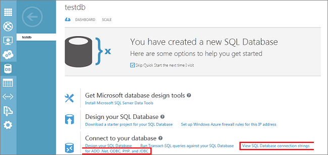

<properties linkid="develop-php-sql-database" urlDisplayName="SQL Database" pageTitle="How to use SQL Database (PHP) - Azure feature guides" metaKeywords="Azure SQL Database PHP, SQL Database PHP" description="Learn how to create and connect to an Azure SQL Database from PHP." metaCanonical="" services="sql-database" documentationCenter="PHP" title="How to Access Azure SQL Database from PHP" authors="waltpo" solutions="" manager="bjsmith" editor="mollybos" videoId="" scriptId="" />

Zugreifen auf Azure SQL-Datenbank aus PHP
=========================================

In diesem Leitfaden werden die Grundlagen der Verwendung von Azure SQL-Datenbank aus PHP erläutert. Die Beispiele sind in PHP geschrieben. Die behandelten Szenarien umfassen das **Erstellen einer SQL-Datenbank** und das **Herstellen einer Verbindung zu einer SQL-Datenbank**. Dieser Leitfaden beschreibt das Erstellen einer SQL-Datenbank im [Verwaltungsportal](https://manage.windowsazure.com). Informationen zum Durchführen dieser Aufgaben im Produktionsportal finden Sie unter [Getting Started with PHP and SQL Database](http://blogs.msdn.com/b/brian_swan/archive/2010/02/12/getting-started-with-php-and-sql-azure.aspx) (Erste Schritte mit PHP und SQL-Datenbank, in englischer Sprache). Weitere Informationen finden Sie im Abschnitt [Nächste Schritte](#NextSteps).

Was ist Azure SQL-Datenbank?
----------------------------

Azure SQL-Datenbank bietet ein Verwaltungssystem für relationale Datenbanken für Azure und basiert auf SQL Server-Technologie. Mit SQL-Datenbank können Sie relationale Datenbanklösungen für die Cloud bereitstellen und implementieren, und Sie profitieren von einem verteilten Datencenter, das Verfügbarkeit, Skalierbarkeit und Sicherheit für Unternehmen mit den Vorteilen von integriertem Datenschutz und Selbstreparatur bietet.

Inhaltsverzeichnis
------------------

-   [Konzepte](#Concepts)
-   [Gewusst wie: Einrichten Ihrer Umgebung](#Setup)
-   [Gewusst wie: Erstellen einer SQL-Datenbank](#CreateServer)
-   [Gewusst wie: Abrufen von SQL-Datenbank-Verbindungsinformationen](#ConnectionInfo)
-   [Gewusst wie: Herstellen einer Verbindung zu einer SQL-Datenbankinstanz](#Connect)
-   [Nächste Schritte](#NextSteps)

Konzepte
--------

Da Azure SQL-Datenbank auf SQL Server-Technologien basiert, erfolgt der Zugriff auf SQL-Datenbank aus PHP ganz ähnlich wie der Zugriff auf SQL Server aus PHP. Sie können eine Anwendung lokal (mit SQL Server) entwickeln und dann eine Verbindung zu SQL-Datenbank herstellen, indem Sie lediglich die Verbindungszeichenfolge ändern. Es gibt jedoch einige Unterschiede zwischen SQL-Datenbank und SQL Server, die sich auf Ihre Anwendung auswirken können. Weitere Informationen finden Sie unter [Richtlinien für und Einschränkungen von Azure SQL-Datenbanken](http://msdn.microsoft.com/de-de/library/windowsazure/ff394102.aspx).

Der Zugriff auf SQL-Datenbank aus PHP sollte nach Möglichkeit unter Verwendung der [Microsoft-Treiber für PHP für SQL Server](http://www.microsoft.com/download/en/details.aspx?id=20098) erfolgen. (In den Beispielen dieses Artikels werden diese Treiber verwendet.) Die Microsoft-Treiber für PHP für SQL Server funktionieren nur unter Windows.

Gewusst wie: Einrichten Ihrer Umgebung
--------------------------------------

Für die Einrichtung der Entwicklungsumgebung wird die Verwendung des [Microsoft-Webplattform-Installer](http://go.microsoft.com/fwlink/?LinkId=253447) empfohlen. Mit dem Webplattform-Installer können Sie Elemente Ihrer Webentwicklungsplattform auswählen und diese automatisch installieren und konfigurieren. Wenn Sie den Webplattform-Installer herunterladen und WebMatrix, PHP für WebMatrix und SQL Server Express zur Installation auswählen, wird eine vollständige Entwicklungsumgebung für Sie eingerichtet.

Alternativ können Sie die Umgebung auch manuell einrichten:

-   Installieren Sie PHP, und konfigurieren Sie IIS: <http://php.net/manual/en/install.windows.iis7.php>.
-   Laden Sie SQL Server Express herunter, und installieren Sie es: <http://www.microsoft.com/en-us/download/details.aspx?id=29062>
-   Laden Sie die Microsoft-Treiber für PHP für SQL Server herunter, und installieren Sie sie: <http://php.net/manual/en/sqlsrv.requirements.php>.

Gewusst wie: Erstellen einer SQL-Datenbank
------------------------------------------

Führen Sie folgende Schritte durch, um eine Azure SQL-Datenbank zu erstellen:

1.  Melden Sie sich am [Verwaltungsportal](https://manage.windowsazure.com) an.
2.  Klicken Sie unten links im Portal auf **Neu**.

    

3.  Klicken Sie auf **DATA SERVICES**, **SQL DATABASE** und dann auf **CUSTOM CREATE**.

    

4.  Geben Sie im Feld **NAME** einen Namen für Ihre Datenbank ein, wählen Sie die **EDITION** (WEB oder BUSINESS), die **MAXIMALE GRÖSSE** für Ihre Datenbank, die **SORTIERUNG** und anschließend **Neuer SQL Datenbankserverr**. Klicken Sie unten im Dialogfeld auf den Pfeil. (Falls Sie zuvor bereits eine SQL-Datenbank erstellt haben, können Sie aus der Dropdownliste **Choose a server** einen vorhandenen Server auswählen.)

    

5.  Geben Sie einen Administratornamen und ein Kennwort ein (und bestätigen Sie das Kennwort), wählen Sie die Region aus, in der Ihre neue SQL-Datenbank erstellt wird, und aktivieren Sie das Kontrollkästchen `Allow Azure Services to access the server`.

    

Klicken Sie im Verwaltungsportal auf **SQL-Datenbanken**, um Server- und Datenbankinformationen anzuzeigen. Sie können dann auf **DATENBANKEN** oder **SERVER** klicken, um die entsprechenden Informationen anzuzeigen.

Gewusst wie: Abrufen von SQL-Datenbank-Verbindungsinformationen
---------------------------------------------------------------

Klicken Sie im Portal auf **SQL-DATENBANKEN** und dann auf den Namen der Datenbank, um SQL-Datenbank-Verbindungsinformationen abzurufen.

Klicken Sie anschließend auf **View SQL Database connection strings for ADO.NET, ODBC, PHP, and JDBC**.

Notieren Sie im PHP-Abschnitt des Ergebnisfensters die Werte für **SERVER**, **DATENBANK** und **BENUTZERNAME**. Ihr Kennwort ist das Kennwort, das Sie zum Erstellen der SQL-Datenbank verwendet haben.

Gewusst wie: Herstellen einer Verbindung zu einer SQL-Datenbankinstanz
----------------------------------------------------------------------

In den folgenden Beispielen wird gezeigt, wie Sie mit den Erweiterungen **SQLSRV** und **PDO\_SQLSRV** eine Verbindung zu einer SQL-Datenbank namens `testdb` herstellen. Sie benötigen die im vorstehenden Abschnitt abgerufenen Informationen. Ersetzen Sie `SERVER_ID` durch Ihre 10-stellige Server-ID (dies sind die ersten zehn Zeichen des im vorstehenden Abschnitt abgerufenen SERVER-Werts), und weisen Sie den Variablen `$user` und `$pwd` die entsprechenden Werte (Ihren Benutzernamen und Ihr Kennwort) zu.

##### SQLSRV

    $server = "tcp:<value of SERVER from section above>";
    $user = "<value of USERNAME from section above>"@SERVER_ID;
    $pwd = "password";
    $db = "testdb";

    $conn = sqlsrv_connect($server, array("UID"=>$user, "PWD"=>$pwd, "Database"=>$db));

    if($conn === false){
        die(print_r(sqlsrv_errors()));
    }

##### PDO\_SQLSRV

    $server = "tcp:<value of SERVER from section above>";
    $user = "<value of USERNAME from section above>"@SERVER_ID;
    $pwd = "password";
    $db = "testdb";

    try{
        $conn = new PDO( "sqlsrv:Server= $server ; Database = $db ", $user, $pwd);
        $conn->setAttribute( PDO::ATTR_ERRMODE, PDO::ERRMODE_EXCEPTION );
    }
    catch(Exception $e){
        die(print_r($e));
    }

Nächste Schritte
----------------

Wie bereits erwähnt, ähnelt die Verwendung von SQL-Datenbank sehr der Verwendung von SQL Server. Nachdem Sie eine Verbindung zu einer SQL-Datenbank hergestellt haben (wie oben beschrieben), können Sie die **SQLSRV**- oder **PDO\_SQLSRV**-API zum Einfügen, Abrufen, Aktualisieren und Löschen von Daten verwenden. Informationen zur **SQLSRV**- und **PDO\_SQLSRV**-API finden Sie in der[Dokumentation für Microsoft-Treiber für PHP für SQL Server](http://msdn.microsoft.com/de-de/library/dd638075(SQL.10).aspx). Es gibt jedoch einige Unterschiede zwischen SQL-Datenbank und SQL Server, die sich auf Ihre Anwendung auswirken können. Weitere Informationen finden Sie unter [Richtlinien für und Einschränkungen von Azure SQL-Datenbanken](http://msdn.microsoft.com/de-de/library/windowsazure/ff394102.aspx).

Ein Beispiel, das die Verwendung von SQL-Datenbank mit PHP auf Azure zeigt, ist auf https://github.com/WindowsAzure/azure-sdk-for-php-samples/tree/master/tasklist-mysql verfügbar.

[download-drivers]: http://www.microsoft.com/download/en/details.aspx?id=20098
[limitations]: http://msdn.microsoft.com/de-de/library/windowsazure/ff394102.aspx
[odbc-php]: http://www.php.net/odbc
[manual-config]: http://php.net/manual/en/install.windows.iis7.php
[install-drivers]: http://php.net/manual/en/sqlsrv.requirements.php
[driver-docs]: http://msdn.microsoft.com/de-de/library/dd638075(SQL.10).aspx
[access-php-odbc]: http://social.technet.microsoft.com/wiki/contents/articles/accessing-sql-azure-from-php.aspx
[install-sql-express]: http://www.microsoft.com/en-us/download/details.aspx?id=29062
[preview-portal]: https://manage.windowsazure.com
[prod-portal-instructions]: http://blogs.msdn.com/b/brian_swan/archive/2010/02/12/getting-started-with-php-and-sql-azure.aspx
[new-website]: ./media/sql-database-php-how-to-use-sql-database/plus-new.png
[custom-create]: ./media/sql-database-php-how-to-use-sql-database/create_custom_sql_db-2.png
[database-settings]: ./media/sql-database-php-how-to-use-sql-database/new-sql-db.png
[create-server]: ./media/sql-database-php-how-to-use-sql-database/db-server-settings.png
[sql-dbs-servers]: ./media/sql-database-php-how-to-use-sql-database/sql-dbs-portal.png
[wpi-installer]: http://go.microsoft.com/fwlink/?LinkId=253447
[go-to-db-info]: ./media/sql-database-php-how-to-use-sql-database/go-to-db-info.png
[show-connection-string]: ./media/sql-database-php-how-to-use-sql-database/show-connection-string-2.png

