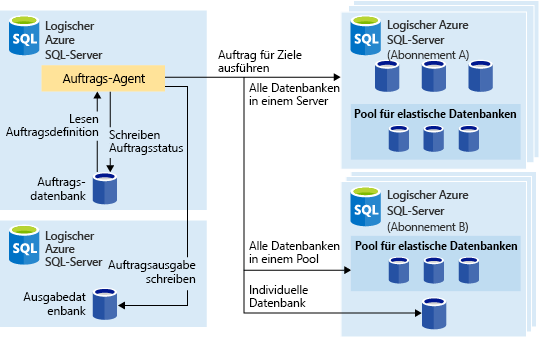
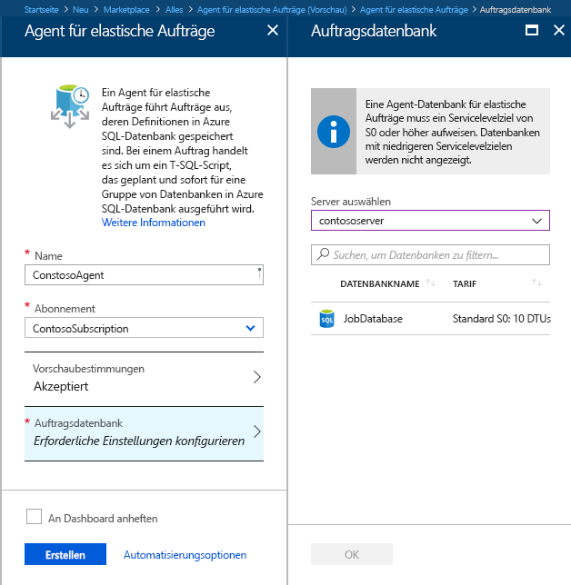
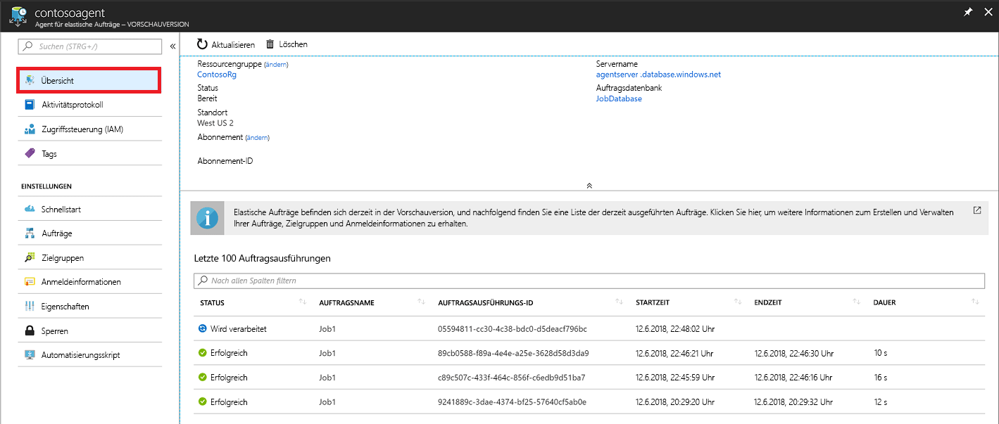
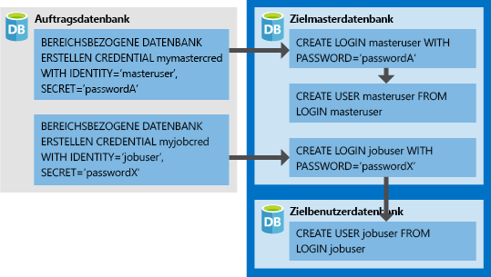

# <a name="manage-groups-of-databases-with-elastic-database-jobs"></a>Verwalten von Datenbankgruppen mithilfe von Aufträgen für die elastische Datenbank

Mit **Aufträgen für die elastische Datenbank** können Sie einzelne oder mehrere T-SQL-Skripts parallel für eine große Anzahl von Datenbanken ausführen – entweder gemäß einem Zeitplan oder nach Bedarf.

**Führen Sie Aufträge für eine beliebige Kombination von Datenbanken aus:** für einzelne oder mehrere individuelle Datenbanken, für alle Datenbanken auf einem Server, für alle Datenbanken in einem Pool für elastische Datenbanken oder für eine Shardzuordnung – und zusätzlich mit der Flexibilität, spezifische Datenbanken ein- oder ausschließen zu können. **Aufträge können für mehrere Server, für mehrere Pools und sogar für Datenbanken aus anderen Abonnements ausgeführt werden.** Server und Pools werden zur Laufzeit dynamisch aufgezählt, sodass Aufträge für alle Datenbanken ausgeführt werden, die zum Zeitpunkt der Ausführung in der Zielgruppe vorhanden sind.

Die folgende Abbildung zeigt einen Auftrags-Agent, der Aufträge für die verschiedenen Arten von Zielgruppen ausführt:




## <a name="why-use-elastic-jobs"></a>Gründe für die Verwendung elastischer Aufträge

### <a name="manage-many-databases"></a>Verwalten zahlreicher Datenbanken

- Planung administrativer Aufgaben, sodass diese beispielsweise an jedem Werktag oder nach Geschäftsschluss ausgeführt werden.
- Bereitstellung von Schemaänderungen, Anmeldeinformationsverwaltung, Leistungsdatensammlung oder Telemetrieerfassung für Mandanten (Kunden). Aktualisierung von Referenzdaten (Informationen für alle Datenbanken).
- Neuerstellung von Indizes zum Verbessern der Abfrageleistung. Konfiguration von Aufträgen, sodass diese für eine gesamte Sammlung von Datenbanken auf wiederkehrender Basis ausgeführt werden (etwa in Zeiten mit geringer Auslastung).
- Sammlung von Abfrageergebnissen aus einer Menge von Datenbanken in einer zentralen Tabelle auf fortlaufender Grundlage. Leistungsabfragen können fortlaufend ausgeführt werden und für die Auslösung der Ausführung weiterer Aufgaben konfiguriert werden.

### <a name="collect-data-for-reporting"></a>Sammeln von Berichtsdaten

- Aggregation von Daten aus einer Sammlung von Azure SQL-Datenbanken in einer einzelnen Zieltabelle.
- Ausführung von Abfragen zur Datenverarbeitung mit längerer Laufzeit für eine große Anzahl von Datenbanken, z.B. bei der Sammlung von Kundentelemetrie. Die Ergebnisse werden zur weiteren Analyse in einer einzelnen Zieltabelle gesammelt.

### <a name="reduce-overhead"></a>Verringern des Aufwands

- Normalerweise müssen Sie unabhängige Verbindungen mit jeder einzelnen Datenbank herstellen, um Transact-SQL-Anweisungen oder andere Verwaltungsaufgaben auszuführen. Ein Auftrag nimmt Ihnen die Anmeldung bei den einzelnen Datenbanken in der Zielgruppe ab. Zudem können Sie Transact-SQL-Skripts zur Ausführung für eine Gruppe von Azure SQL-Datenbanken definieren, verwalten und speichern.

### <a name="accounting"></a>Buchhaltung

- Aufträge protokollieren den Ausführungsstatus für die einzelnen Datenbanken. Außerdem werden Vorgänge automatisch wiederholt, wenn Fehler auftreten.

### <a name="flexibility"></a>Flexibilität

- Definition benutzerdefinierter Gruppen von Azure SQL-Datenbanken sowie von Zeitplänen für die Auftragsausführung.


## <a name="elastic-job-components"></a>Komponenten für elastische Aufträge

|Komponente  | Beschreibung (Weitere Details finden Sie im Anschluss an die Tabelle.) |
|---------|---------|
|[**Agent für elastische Aufträge**](#elastic-job-agent) |  Der Azure-Ressource, die Sie zum Ausführen und Verwalten von Aufträgen erstellen.   |
|[**Auftragsdatenbank**](#job-database)    |    Eine Azure SQL-Datenbank, in der der Auftrags-Agent auftragsbezogene Daten, Auftragsdefinitionen und Ähnliches speichert.      |
|[**Zielgruppe**](#target-group)      |  Die Gruppe von Servern, Pools, Datenbanken und Shardzuordnungen, für die ein Auftrag ausgeführt werden soll.       |
|[**Auftrag**](#job)  |  Ein Auftrag ist eine Arbeitseinheit mit mindestens einem [Auftragsschritt](#job-step). Auftragsschritte geben das auszuführende T-SQL-Skript sowie andere für die Skriptausführung erforderliche Details an.  |


### <a name="elastic-job-agent"></a>Agent für elastische Aufträge

Bei einem Agent für elastische Aufträge handelt es sich um die Azure-Ressource zum Erstellen, Ausführen und Verwalten von Aufträgen. Der Agent für elastische Aufträge ist eine Azure-Ressource, die über das Portal erstellt wird. ([PowerShell](elastic-jobs-powershell.md) und REST werden ebenfalls unterstützt.) 

Zum Erstellen eines **Agents für elastische Aufträge** muss eine SQL­-Datenbank vorhanden sein. Der Agent konfiguriert die vorhandene Datenbank als [*Auftragsdatenbank*](#job-database).

Der Agent für elastische Aufträge ist kostenlos. Die Auftragsdatenbank wird zum Tarif für SQL-Datenbanken abgerechnet.

### <a name="job-database"></a>Auftragsdatenbank

Die *Auftragsdatenbank* dient zum Definieren von Aufträgen sowie zum Nachverfolgen des Status und Verlaufs von Auftragsausführungen. Darüber hinaus wird die *Auftragsdatenbank* auch zum Speichern von Agent-Metadaten, Protokollen, Ergebnissen und Auftragsdefinitionen verwendet und enthält außerdem zahlreiche praktische gespeicherte Prozeduren sowie andere Datenbankobjekte zum Erstellen, Ausführen und Verwalten von Aufträgen mit T-SQL.

Für die aktuelle Vorschauversion muss eine Azure SQL-Datenbank (S0 oder höher) vorhanden sein, um einen Agent für elastische Aufträge erstellen zu können.

Die *Auftragsdatenbank* muss nicht neu, aber eine bereinigte, leere Datenbank der Dienstebene S0 oder höher sein. Für die *Auftragsdatenbank* wird zwar die Dienstebene S1 oder höher empfohlen, ausschlaggebend sind jedoch die Leistungsanforderungen Ihrer Aufträge (sprich: die Anzahl von Auftragsschritten sowie Anzahl und Intervall der Auftragswiederholungen). Ein Beispiel: Für einen Auftrags-Agent, der nur wenige Aufträge pro Stunde ausführt, ist eine S0-Datenbank ggf. ausreichend. Für einen Auftrag, der im Minutentakt ausgeführt wird, empfiehlt sich dagegen unter Umständen eine höhere Dienstebene.


#### <a name="job-database-permissions"></a>Berechtigungen für die Auftragsdatenbank

Im Zuge der Erstellung des Auftrags-Agents werden in der *Auftragsdatenbank* ein Schema, Tabellen und eine Rolle namens *jobs_reader* erstellt. Die Rolle wird mit folgenden Berechtigung erstellt und soll Administratoren eine präzisere Zugriffssteuerung für die Auftragsüberwachung ermöglichen:


|Rollenname  |Berechtigungen des Schemas „jobs“  |Berechtigungen des Schemas „jobs_internal“  |
|---------|---------|---------|
|**jobs_reader**     |    SELECT     |    Keine     |

> [!IMPORTANT]
> Bedenken Sie die Auswirkungen auf die Sicherheit, bevor Sie Datenbankadministratorzugriff auf die *Auftragsdatenbank* gewähren. Ein böswilliger Benutzer mit Berechtigungen zum Erstellen oder Bearbeiten von Aufträgen kann theoretisch einen Auftrag erstellen oder bearbeiten, der unter Verwendung gespeicherter Anmeldeinformationen eine Verbindung mit einer Datenbank herstellt, die der Kontrolle des böswilligen Benutzers unterliegt. Auf diese Weise kann der böswillige Benutzer dann das Kennwort der Anmeldeinformationen ermitteln.


### <a name="target-group"></a>Zielgruppe

Eine *Zielgruppe* definiert die Gruppe von Datenbanken, für die ein Auftragsschritt ausgeführt wird. Eine Zielgruppe kann eine beliebige Anzahl und Kombination der folgenden Optionen enthalten:

- **Azure SQL Server:** Bei Angabe eines Servers werden alle Datenbanken, die sich zum Zeitpunkt der Auftragsausführung auf dem Server befinden, in die Gruppe einbezogen. Damit die Gruppe vor der Auftragsausführung aufgezählt und aktualisiert werden kann, müssen die Anmeldeinformationen für die Masterdatenbank angegeben werden.
- **Pool für elastische Datenbanken:** Bei Angabe eines Pools für elastische Datenbanken werden alle Datenbanken, die sich zum Zeitpunkt der Auftragsausführung in dem Pool für elastische Datenbanken befinden, in die Gruppe einbezogen. Genau wie bei einem Server müssen die Anmeldeinformationen für die Masterdatenbank angegeben werden, damit die Gruppe vor der Auftragsausführung aktualisiert werden kann.
- **Einzelne Datenbank:** Geben Sie eine oder mehrere einzelne Datenbanken an, die in die Gruppe einbezogen werden sollen.
- **Shardzuordnung:** Datenbanken einer Shardzuordnung.

> [!TIP]
> Die Gruppe von Datenbanken in Zielgruppen mit Servern oder Pools wird dank *dynamischer Enumeration* zum Zeitpunkt der Auftragsausführung neu ausgewertet. Die dynamische Enumeration stellt sicher, dass **Aufträge für alle Datenbanken ausgeführt werden, die zum Zeitpunkt der Auftragsausführung auf dem Server oder im Pool vorhanden sind**. Das erneute Auswerten der Datenbankliste zur Laufzeit ist besonders hilfreich in Szenarios mit häufig wechselnder Pool- oder Servermitgliedschaft.


Pools und einzelne Datenbanken können in die Gruppe eingeschlossen oder aus der Gruppe ausgeschlossen werden. Dadurch können Sie eine Zielgruppe mit einer beliebigen Kombination von Datenbanken erstellen. So können Sie beispielsweise einer Zielgruppe einen Server hinzufügen, aber bestimmte Datenbanken aus einem Pool für elastische Datenbanken (oder den gesamten Pool) ausschließen.

Eine Zielgruppe kann Datenbanken aus mehreren Abonnements und aus mehreren Regionen enthalten. Im Vergleich zu Ausführungen in der gleichen Region ist bei regionsübergreifenden Ausführungen mit höheren Wartezeiten zu rechnen.


### <a name="job"></a>Auftrag

Ein *Auftrag* ist eine Arbeitseinheit, die gemäß einem Zeitplan oder als einmaliger Auftrag ausgeführt wird. Ein Auftrag enthält mindestens einen *Auftragsschritt*.

#### <a name="job-step"></a>Auftragsschritt

Jeder Auftragsschritt gibt ein auszuführendes T-SQL-Skript, mindestens eine Zielgruppe für die T-SQL-Skriptausführung sowie die Anmeldeinformationen an, die der Auftrags-Agent für die Verbindungsherstellung mit der Zieldatenbank benötigt. Jeder Auftragsschritt verfügt über anpassbare Timeout- und Wiederholungsrichtlinien und kann optional mit Ausgabeparametern versehen werden.

#### <a name="job-output"></a>Auftragsausgabe

Das Ergebnis der Auftragsschritte wird für jede Zieldatenbank detailliert erfasst, und als Ziel für die Skriptausgabe kann eine Tabelle angegeben werden. Sie können eine Datenbank angeben, in der alle von einem Auftrag zurückgegebenen Daten gespeichert werden.

#### <a name="job-history"></a>Auftragsverlauf

Der Auftragsausführungsverlauf wird in der *Auftragsdatenbank* gespeichert. Daten des Ausführungsverlaufs, die älter als 45 Tage sind, werden durch einen Systembereinigungsauftrag bereinigt. Wenn Sie Verlaufsdaten löschen möchten, die noch keine 45 Tage alt sind, rufen Sie die gespeicherte Prozedur **sp_purge_history** in der *Auftragsdatenbank* auf.

## <a name="workflow-to-create-configure-and-manage-jobs"></a>Workflow zum Erstellen, Konfigurieren und Verwalten von Aufträgen

### <a name="create-and-configure-the-agent"></a>Erstellen und Konfigurieren des Agents

1. Erstellen Sie eine leere SQL-Datenbank (S0 oder höher), oder geben Sie eine entsprechende Datenbank an. Sie wird bei der Erstellung des Agents für elastische Aufträge als *Auftragsdatenbank* verwendet.
2. Erstellen Sie einen Agent für elastische Aufträge (entweder über das [Portal](https://portal.azure.com/#create/Microsoft.SQLElasticJobAgent) oder mithilfe von [PowerShell](elastic-jobs-powershell.md#create-the-elastic-job-agent)).

   

### <a name="create-run-and-manage-jobs"></a>Erstellen, Ausführen und Verwalten von Aufträgen

1. Erstellen Sie mithilfe von [PowerShell](elastic-jobs-powershell.md#create-job-credentials-so-that-jobs-can-execute-scripts-on-its-targets) oder [T-SQL](elastic-jobs-tsql.md#create-a-credential-for-job-execution) Anmeldeinformationen für die Auftragsausführung in der *Auftragsdatenbank*.
2. Definieren Sie mithilfe von [PowerShell](elastic-jobs-powershell.md#define-the-target-databases-you-want-to-run-the-job-against) oder [T-SQL](elastic-jobs-tsql.md#create-a-target-group-servers) die Zielgruppe (also die Datenbanken, für die der Auftrag ausgeführt werden soll).
3. Erstellen Sie in jeder Datenbank, für die der Auftrag ausgeführt wird, Anmeldeinformationen für den Auftrags-Agent, indem Sie [jeder Datenbank in der Gruppe den Benutzer (oder die Rolle) hinzufügen](https://docs.microsoft.com/azure/sql-database/sql-database-control-access). Ein Beispiel finden Sie im [PowerShell-Tutorial](elastic-jobs-powershell.md#create-job-credentials-so-that-jobs-can-execute-scripts-on-its-targets).
4. Erstellen Sie mithilfe von [PowerShell](elastic-jobs-powershell.md#create-a-job) oder [T-SQL](elastic-jobs-tsql.md#deploy-new-schema-to-many-databases) einen Auftrag.
5. Fügen Sie mithilfe von [PowerShell](elastic-jobs-powershell.md#create-a-job-step) oder [T-SQL](elastic-jobs-tsql.md#deploy-new-schema-to-many-databases) Auftragsschritte hinzu.
6. Führen Sie mithilfe von [PowerShell](elastic-jobs-powershell.md#run-the-job) oder [T-SQL](elastic-jobs-tsql.md#begin-ad-hoc-execution-of-a-job) einen Auftrag aus.
7. Überwachen Sie den Status der Auftragsausführung über das Portal oder mithilfe von [PowerShell](elastic-jobs-powershell.md#monitor-status-of-job-executions) oder [T-SQL](elastic-jobs-tsql.md#monitor-job-execution-status).

   

## <a name="credentials-for-running-jobs"></a>Anmeldeinformationen zum Ausführen von Aufträgen

Aufträge verwenden [datenbankweit gültige Anmeldeinformationen](/sql/t-sql/statements/create-database-scoped-credential-transact-sql), um bei der Ausführung eine Verbindung mit den in der Zielgruppe angegebenen Datenbanken herzustellen. Wenn eine Zielgruppe Server oder Pools enthält, wird unter Verwendung dieser datenbankweit gültigen Anmeldeinformationen eine Verbindung mit der Masterdatenbank hergestellt, um die verfügbaren Datenbanken aufzuzählen.

Die Einrichtung geeigneter Anmeldeinformationen für die Auftragsausführung kann etwas verwirrend sein. Berücksichtigen Sie daher folgende Punkte:

- Die datenbankweit gültigen Anmeldeinformationen müssen in der *Auftragsdatenbank* erstellt werden.
- **Für eine erfolgreiche Auftragsausführung müssen alle Zieldatenbanken über eine Anmeldung mit [ausreichenden Berechtigungen](https://docs.microsoft.com/sql/relational-databases/security/permissions-database-engine) verfügen** („jobuser“ im Diagramm weiter unten).
- Die Anmeldeinformationen werden üblicherweise auftragsübergreifend verwendet. Die Kennwörter der Anmeldeinformationen sind außerdem verschlüsselt und vor Benutzern geschützt, die nur Lesezugriff auf Auftragsobjekte haben.

Die folgende Abbildung veranschaulicht das Konzept geeigneter Anmeldeinformationen und ist für die Einrichtung hilfreich. **Nicht vergessen: Der Benutzer muss in jeder Datenbank (alle Datenbanken vom Typ *target user db*) erstellt werden, für die der Auftrag ausgeführt werden soll.**



## <a name="security-best-practices"></a>Bewährte Methoden für die Sicherheit

Im Anschluss finden Sie einige Best Practices für die Verwendung von elastischen Aufträgen:

- Schränken Sie die Nutzung der APIs auf einen vertrauenswürdigen Personenkreis ein.
- Anmeldeinformationen sollten immer nur mit den für die Ausführung von Auftragsschritten erforderlichen Mindestberechtigungen ausgestattet sein. Weitere Informationen finden Sie unter [Autorisierung und Berechtigungen in SQL Server](https://docs.microsoft.com/dotnet/framework/data/adonet/sql/authorization-and-permissions-in-sql-server).
- Wenn der Zielgruppe ein Server und/oder Pool angehört, sollten Sie unbedingt separate Anmeldeinformationen mit Rechten zum Anzeigen/Auflisten der Datenbanken für die Masterdatenbank erstellen, um die Datenbanklisten der Server und/oder Pools vor der Auftragsausführung zu erweitern.


## <a name="agent-performance-capacity-and-limitations"></a>Leistung, Kapazität und Einschränkungen des Agents

Elastische Aufträge benötigen nur sehr wenig Computeressourcen, während sie auf den Abschluss von Aufträgen mit langer Ausführungszeit warten.

Die Compute- und Leistungsanforderungen, die der Agent an die *Auftragsdatenbank* stellt, hängen von der Größe der Zielgruppe mit den Datenbanken und der gewünschten Ausführungszeit für einen Auftrag (Anzahl gleichzeitiger Worker) ab: je mehr Ziele und je höher die Anzahl von Aufträgen, desto höher die Computeanforderungen.

Die Vorschauversion ist aktuell auf 100 gleichzeitige Aufträge beschränkt.

### <a name="prevent-jobs-from-reducing-target-database-performance"></a>Verhindern einer Leistungsbeeinträchtigung für die Zieldatenbank durch Aufträge

Die Anzahl von Datenbanken, für die ein Auftrag gleichzeitig ausgeführt werden kann, kann beschränkt werden, um sicherzustellen, dass es beim Ausführen von Aufträgen für Datenbanken in einem elastischen SQL-Pool nicht zu einer Überlastung der Ressourcen kommt.

##  <a name="differences-between-elastic-jobs-and-sql-server-agent"></a>Unterschiede zwischen elastischen Aufträgen und dem SQL Server-Agent

In diesem Abschnitt möchten wir auf einige Unterschiede zwischen dem SQL Server-Agent (lokal und als Komponente einer verwalteten SQL-Datenbank-Instanz verfügbar) und dem Azure SQL-Datenbank-Agent für elastische Aufträge (jetzt für SQL-Datenbank und SQL Data Warehouse verfügbar) hinweisen.


|  |Elastische Aufträge  |SQL Server-Agent |
|---------|---------|---------|
|Umfang     |  Beliebige Anzahl von Azure SQL-Datenbanken und/oder Data Warehouses in der gleichen Azure-Cloud wie der Auftrags-Agent. Ziele können sich auf unterschiedlichen logischen Servern, in unterschiedlichen Abonnements und/oder in unterschiedlichen Regionen befinden. <br><br>Zielgruppen können einzelne Datenbanken/Data Warehouses oder alle Datenbanken auf einem Server, in einem Pool oder in einer Shardzuordnung (dynamisch zur Auftragslaufzeit aufgezählt) enthalten. | Beliebige einzelne Datenbank in der gleichen SQL Server-Instanz wie der SQL-Agent. |
|Unterstützte APIs und Tools     |  Portal, PowerShell, T-SQL, Azure Resource Manager      |   T-SQL, SQL Server Management Studio (SSMS)     |


## <a name="best-practices-for-creating-jobs"></a>Best Practices für die Auftragserstellung

### <a name="idempotent-scripts"></a>Idempotente Skripts
Die T-SQL-Skripts eines Auftrags müssen [idempotent](https://en.wikipedia.org/wiki/Idempotence) sein. **Idempotent** bedeutet, dass die erneute Ausführung eines bereits erfolgreich ausgeführten Skripts zum gleichen Ergebnis führt. Es kann vorkommen, dass ein Skript aufgrund von vorübergehenden Netzwerkproblemen nicht erfolgreich ausgeführt wird. In diesem Fall führt der Auftrag automatisch eine bestimmte Anzahl von Wiederholungsversuchen für das Skript aus. Ein idempotentes Skript führt auch bei mehrmaliger erfolgreicher Ausführung zum gleichen Ergebnis.

Vor dem Erstellen eines Objekts empfiehlt es sich, zu überprüfen, ob es bereits vorhanden ist.


```sql
IF NOT EXIST (some_object)
    -- Create the object
    -- If it exists, drop the object before recreating it.
```

Analog dazu muss auch ein Skript erfolgreich ausgeführt werden können, indem logische Tests durchgeführt werden und angemessen auf die vorgefundenen Bedingungen reagiert wird.


## <a name="next-steps"></a>Nächste Schritte

- [Erstellen und Verwalten von elastischen Aufträgen mithilfe von PowerShell](elastic-jobs-powershell.md)
- [Erstellen und Verwalten von Aufträgen für die elastische Datenbank mithilfe von Transact-SQL (T-SQL)](elastic-jobs-tsql.md)