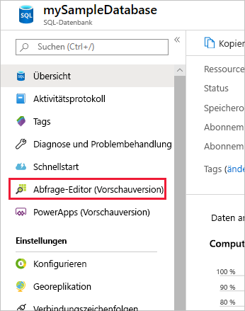
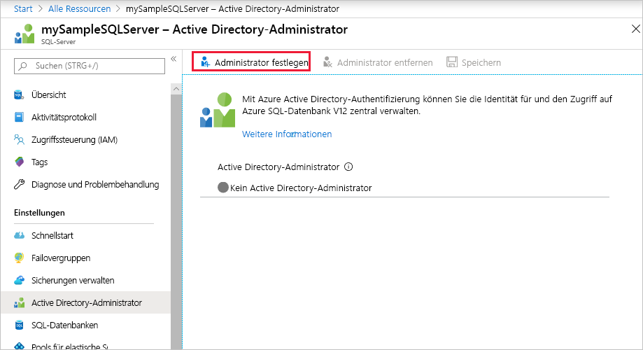

# <a name="quickstart-use-the-azure-portals-sql-query-editor-to-connect-and-query-data"></a>Schnellstart: Verwenden des SQL-Abfrage-Editors im Azure-Portal zum Verbinden und Abfragen von Daten

Der SQL-Abfrage-Editor ist ein Browsertool im Azure-Portal, über den einfach SQL-Abfragen für Ihre Azure SQL-Datenbank- oder Azure SQL Data Warehouse-Instanz ausgeführt werden können. In dieser Schnellstartanleitung verwenden Sie den Abfrage-Editor zum Herstellen einer Verbindung mit einer SQL-Datenbank und führen anschließend Transact-SQL-Anweisungen aus, um Daten abzufragen, einzufügen, zu aktualisieren und zu löschen.

## <a name="prerequisites"></a>Voraussetzungen

Für dieses Tutorial benötigen Sie Folgendes:

- Eine Azure SQL-Datenbank. In den folgenden Schnellstartanleitungen erfahren Sie jeweils, wie Sie eine Datenbank in Azure SQL-Datenbank erstellen und anschließend konfigurieren:

  || Einzeldatenbank |
  |:--- |:--- |
  | Erstellen| [Portal](sql-database-single-database-get-started.md) | 
  || [BEFEHLSZEILENSCHNITTSTELLE (CLI)](scripts/sql-database-create-and-configure-database-cli.md) | 
  || [PowerShell](scripts/sql-database-create-and-configure-database-powershell.md) | 
  | Konfigurieren | [IP-Firewallregel auf Serverebene](sql-database-server-level-firewall-rule.md)| 
  |||

> [!NOTE]
> Stellen Sie sicher, dass die Option **Zugriff auf Azure-Dienste erlauben** in den SQL Server-Firewalleinstellungen auf **EIN** festgelegt ist. Mit dieser Option erhält der SQL-Abfrage-Editor Zugriff auf Ihre Datenbanken und Data Warehouses.

## <a name="sign-in-the-azure-portal"></a>Anmelden beim Azure-Portal

Melden Sie sich beim [Azure-Portal](https://portal.azure.com/) an.

## <a name="connect-using-sql-authentication"></a>Herstellen einer Verbindung per SQL-Authentifizierung

1. Wählen Sie im Menü auf der linken Seite **SQL-Datenbanken** und anschließend **mySampleDatabase** aus.

2. Suchen Sie im linken Menü nach **Abfrage-Editor (Vorschau)**, und wählen Sie die Option aus. Die Seite **Anmeldung** wird angezeigt.

    

3. Wählen Sie im Dropdownmenü **Autorisierungstyp** die Option **SQL Server-Authentifizierung** aus, und geben Sie die Benutzer-ID und das Kennwort des Serveradministratorkontos ein, das zum Erstellen der Datenbank verwendet wurde.

     

4. Klicken Sie auf **OK**.


## <a name="connect-using-azure-active-directory"></a>Herstellen einer Verbindung mit Azure Active Directory

Wenn Sie einen Active Directory-Administrator (AD) konfigurieren, können Sie eine einzelne Identität verwenden, um sich beim Azure-Portal und bei Ihrer SQL-Datenbank anzumelden. Führen Sie die unten beschriebenen Schritte aus, um einen AD-Administrator für Ihren SQL-Server zu konfigurieren.

> [!NOTE]
> * E-Mail-Konten (etwa „outlook.com“, „gmail.com“, „yahoo.com“ usw.) werden noch nicht als AD-Administratoren unterstützt. Stellen Sie sicher, dass Sie einen Benutzer auswählen, der entweder nativ in Azure AD erstellt oder in einen Azure AD-Verbund eingefügt wurde.
> * Die Azure AD-Administratoranmeldung funktioniert nicht bei Konten, für die die zweistufige Authentifizierung aktiviert ist.

1. Wählen Sie im linken Menü **Alle Ressourcen** und anschließend Ihren SQL-Server aus.

2. Wählen Sie im Menü **Einstellungen** Ihres SQL-Servers die Option **Active Directory-Administrator**.

3. Wählen Sie auf der Symbolleiste der AD-Administratorseite **Administrator festlegen** aus, und legen Sie dann den Benutzer oder die Gruppe als AD-Administrator fest.

    

4. Wählen Sie auf der Symbolleiste der AD-Administratorseite **Speichern** aus.

5. Navigieren Sie zur Datenbank **mySampleDatabase**, und wählen Sie im linken Menü **Abfrage-Editor (Vorschau)** aus. Die Seite **Anmeldung** wird angezeigt. Falls Sie ein AD-Administrator sind, wird auf der rechten Seite unterhalb von **Active Directory single sign-on** (Active Directory-SSO) eine Meldung mit dem Hinweis angezeigt, dass Sie angemeldet wurden. 
   
6. Klicken Sie auf **OK**.


## <a name="view-data"></a>Anzeigen von Daten

1. Geben Sie nach der Authentifizierung im Abfrage-Editor die folgende SQL-Abfrage ein, um die Top 20 der Produkte nach Kategorie abzurufen.

   ```sql
    SELECT TOP 20 pc.Name as CategoryName, p.name as ProductName
    FROM SalesLT.ProductCategory pc
    JOIN SalesLT.Product p
    ON pc.productcategoryid = p.productcategoryid;
   ```

2. Wählen Sie auf der Symbolleiste **Ausführen** aus, und sehen Sie sich dann die Ausgabe im Bereich **Ergebnisse** an.


## <a name="insert-data"></a>Einfügen von Daten

Führen Sie die folgende [INSERT](https://msdn.microsoft.com/library/ms174335.aspx)-Transact-SQL-Anweisung aus, um in der Tabelle `SalesLT.Product` ein neues Produkt hinzuzufügen.

1. Ersetzen Sie die vorherige Abfrage durch diese.

   ```sql
   INSERT INTO [SalesLT].[Product]
           ( [Name]
           , [ProductNumber]
           , [Color]
           , [ProductCategoryID]
           , [StandardCost]
           , [ListPrice]
           , [SellStartDate]
           )
     VALUES
           ('myNewProduct'
           ,123456789
           ,'NewColor'
           ,1
           ,100
           ,100
           ,GETDATE() );
   ```


2. Wählen Sie **Ausführen**, um eine neue Zeile in die Tabelle `Product` einzufügen. Im Bereich **Nachrichten** wird folgende Meldung angezeigt: **Abfrage erfolgreich: Betroffene Zeilen: 1**.


## <a name="update-data"></a>Aktualisieren von Daten

Führen Sie die folgende [UPDATE](https://msdn.microsoft.com/library/ms177523.aspx)-Transact-SQL-Anweisung aus, um Ihr neues Produkt zu ändern.

1. Ersetzen Sie die vorherige Abfrage durch diese.

   ```sql
   UPDATE [SalesLT].[Product]
   SET [ListPrice] = 125
   WHERE Name = 'myNewProduct';
   ```

2. Wählen Sie **Ausführen**, um die angegebene Zeile in der Tabelle `Product` zu aktualisieren. Im Bereich **Nachrichten** wird folgende Meldung angezeigt: **Abfrage erfolgreich: Betroffene Zeilen: 1**.

## <a name="delete-data"></a>Löschen von Daten

Führen Sie die folgende [DELETE](https://msdn.microsoft.com/library/ms189835.aspx)-Transact-SQL-Anweisung aus, um das neue Produkt zu entfernen.

1. Ersetzen Sie die vorherige Abfrage durch diese:

   ```sql
   DELETE FROM [SalesLT].[Product]
   WHERE Name = 'myNewProduct';
   ```

2. Wählen Sie **Ausführen**, um die angegebene Zeile in der Tabelle `Product` zu löschen. Im Bereich **Nachrichten** wird folgende Meldung angezeigt: **Abfrage erfolgreich: Betroffene Zeilen: 1**.


## <a name="query-editor-considerations"></a>Aspekte des Abfrage-Editors

Bei der Verwendung des Abfrage-Editors sind ein paar Dinge zu beachten:

* Sie können den Abfrage-Editor nicht verwenden, um SQL Server-Datenbanken in einem virtuellen Netzwerk abzufragen.

* Durch Drücken von F5 wird die Seite des Abfrage-Editors aktualisiert, und aktuell bearbeitete Abfragen gehen verloren.

* Das Herstellen einer Verbindung mit der `master`-Datenbank wird vom Abfrage-Editor nicht unterstützt.

* Bei der Abfrageausführung gilt ein Timeout von fünf Minuten.

* Der Abfrage-Editor unterstützt für geografische Datentypen nur die zylindrische Projektion.

* Für Datenbanktabellen und -sichten ist keine IntelliSense-Unterstützung vorhanden. Der Editor unterstützt aber das automatische Vervollständigen von Namen, die bereits eingegeben wurden.


## <a name="next-steps"></a>Nächste Schritte

Weitere Informationen zur Unterstützung von Transact-SQL in Azure SQL-Datenbanken finden Sie unter [Auflösen von Transact-SQL-Unterschieden während der Migration zur SQL-Datenbank](sql-database-transact-sql-information.md).
