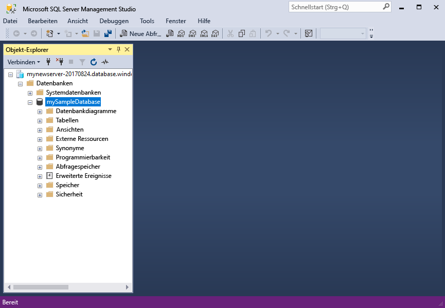
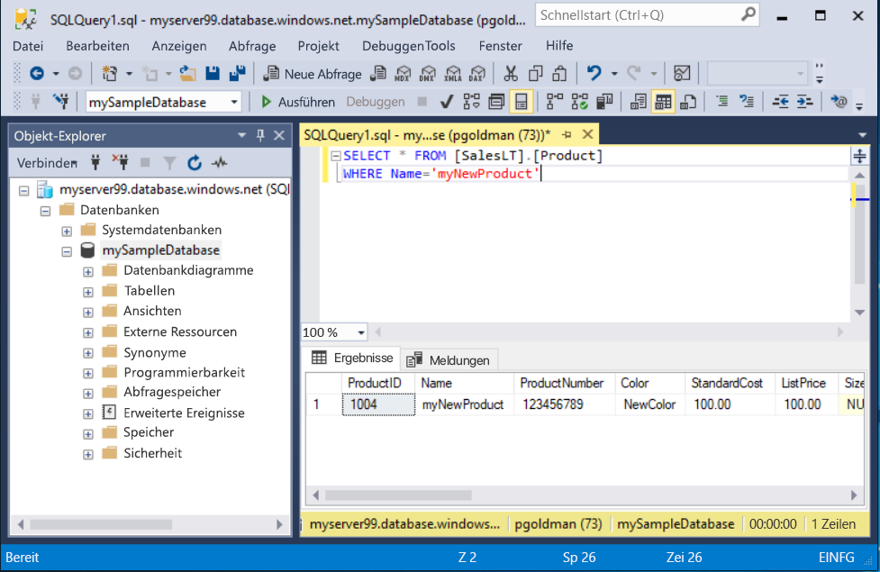

# <a name="quickstart-use-sql-server-management-studio-to-connect-and-query-an-azure-sql-database"></a>Schnellstart: Verwenden von SQL Server Management Studio zum Herstellen der Verbindung mit einer Instanz von Azure SQL-Datenbank und deren Abfrage

In dieser Schnellstartanleitung erfahren Sie, wie Sie mithilfe von SQL Server Management Studio (SSMS) eine Verbindung mit einer Azure SQL-Datenbank herstellen und einige Abfragen ausführen.

## <a name="prerequisites"></a>Voraussetzungen

Für diese Schnellstartanleitung ist Folgendes erforderlich:

- [SQL Server Management Studio (SSMS)](/sql/ssms/download-sql-server-management-studio-ssms/).
- Die AdventureWorksLT-Beispieldatenbank. Sollten Sie eine Arbeitskopie der AdventureWorksLT-Datenbank benötigen, gehen Sie wie unter [Schnellstart: Erstellen einer Einzeldatenbank in Azure SQL-Datenbank über das Azure-Portal, PowerShell und Azure CLI](sql-database-single-database-get-started.md) beschrieben vor, um eine zu erstellen.
    - Die Skripts in diesem Artikel wurden für die AdventureWorksLT-Datenbank geschrieben. Bei Verwendung einer verwalteten Instanz müssen Sie entweder die Adventure Works-Datenbank in eine Instanzdatenbank importieren oder die Skripts in diesem Artikel zur Verwendung der Wide World Importers-Datenbank anpassen.

Wenn Sie einfach nur einige Ad-hoc-Abfragen ohne SSMS-Installation ausführen möchten, verwenden Sie die Anleitung [Schnellstart: Abfragen einer SQL-Datenbank mithilfe des Abfrage-Editors im Azure-Portal](sql-database-connect-query-portal.md).

## <a name="get-sql-server-connection-information"></a>Abrufen von SQL Server-Verbindungsinformationen

Rufen Sie die Verbindungsinformationen ab, die Sie zum Herstellen einer Verbindung mit Ihrer Datenbank benötigen. Für diese Schnellstartanleitung benötigen Sie den vollqualifizierten Server- oder Hostnamen, den Datenbanknamen und die Anmeldeinformationen.

1. Melden Sie sich beim [Azure-Portal](https://portal.azure.com/) an.

2. Navigieren Sie zu der **SQL-Datenbank** oder **verwalteten SQL-Instanz**, die Sie abfragen möchten.

3. Kopieren Sie auf der Seite **Übersicht** den vollqualifizierten Servernamen. Er befindet sich neben **Servername** (Einzeldatenbank) oder neben **Host** (verwaltete Instanz). Der vollqualifizierte Name sieht wie folgt aus: *<Servername>.database.windows.net* (mit Ihrem tatsächlichen Servernamen anstelle von „<Servername>“).

## <a name="connect-to-your-database"></a>Verbinden mit der Datenbank

Stellen Sie in SSMS eine Verbindung mit Ihrem Azure SQL-Datenbank-Server her.

> [!IMPORTANT]
> Ein Azure SQL-Datenbank-Server überwacht Port 1433. Um von hinter einer Unternehmensfirewall eine Verbindung mit einem SQL-Datenbank-Server herzustellen, muss dieser Port der Firewall geöffnet sein.

1. Öffnen Sie SSMS.

2. Das Dialogfeld **Mit Server verbinden** wird angezeigt. Geben Sie Folgendes ein:

   | Einstellung      | Vorgeschlagener Wert    | BESCHREIBUNG |
   | ------------ | ------------------ | ----------- |
   | **Servertyp** | Datenbank-Engine | Erforderlicher Wert. |
   | **Servername** | Der vollqualifizierte Servername | Etwa: **servername.database.windows.net**. |
   | **Authentifizierung** | SQL Server-Authentifizierung | In diesem Tutorial wird die SQL-Authentifizierung verwendet. |
   | **Anmeldung** | Benutzer-ID des Serveradministratorkontos | Die Benutzer-ID des Serveradministratorkontos, das zum Erstellen des Servers verwendet wird. |
   | **Kennwort** | Kennwort des Serveradministratorkontos | Das zum Erstellen des Servers verwendete Kennwort des Serveradministratorkontos. |
   ||||

     

3. Wählen Sie im Dialogfeld **Mit Server verbinden** **Optionen** aus. Wählen Sie im Dropdownmenü **Mit Datenbank verbinden** **mySampleDatabase** aus. Im Rahmen der unter [Voraussetzungen](#prerequisites) angegebenen Schnellstartanleitung wird eine AdventureWorksLT-Datenbank namens „mySampleDatabase“ erstellt. Sollte Ihre Arbeitskopie der AdventureWorks-Datenbank einen anderen Namen haben als „mySampleDatabase“, wählen Sie stattdessen den anderen Namen aus.

     

4. Wählen Sie **Verbinden**. Die Objekt-Explorer-Fenster wird geöffnet.

5. Erweitern Sie zum Anzeigen der Objekte der Datenbank **Datenbanken** und anschließend Ihren Datenbankknoten.

     

## <a name="query-data"></a>Daten abfragen

Führen Sie diesen [SELECT](https://msdn.microsoft.com/library/ms189499.aspx)-Transact-SQL-Code aus, um die 20 wichtigsten Produkte nach Kategorie abzufragen.

1. Klicken Sie im Objekt-Explorer mit der rechten Maustaste auf **mySampleDatabase**, und wählen Sie **Neue Abfrage** aus. Ein neues Abfragefenster mit einer Verbindung mit Ihrer Datenbank wird geöffnet.

2. Fügen Sie im Abfragefenster die folgende SQL-Abfrage ein:

   ```sql
   SELECT pc.Name as CategoryName, p.name as ProductName
   FROM [SalesLT].[ProductCategory] pc
   JOIN [SalesLT].[Product] p
   ON pc.productcategoryid = p.productcategoryid;
   ```

3. Wählen Sie auf der Symbolleiste **Ausführen** aus, um die Abfrage auszuführen und Daten aus den Tabellen `Product` und `ProductCategory` abzurufen.

    

### <a name="insert-data"></a>Einfügen von Daten

Führen Sie diesen [INSERT](https://msdn.microsoft.com/library/ms174335.aspx)-Transact-SQL-Code aus, um in der Tabelle `SalesLT.Product` ein neues Produkt zu erstellen.

1. Ersetzen Sie die vorherige Abfrage durch diese.

   ```sql
   INSERT INTO [SalesLT].[Product]
           ( [Name]
           , [ProductNumber]
           , [Color]
           , [ProductCategoryID]
           , [StandardCost]
           , [ListPrice]
           , [SellStartDate] )
     VALUES
           ('myNewProduct'
           ,123456789
           ,'NewColor'
           ,1
           ,100
           ,100
           ,GETDATE() );
   ```

2. Wählen Sie die Option **Ausführen**, um in der Tabelle `Product` eine neue Zeile einzufügen. Im Bereich **Nachrichten** wird **(1 Zeile betroffen)** angezeigt.

#### <a name="view-the-result"></a>Anzeigen des Ergebnisses

1. Ersetzen Sie die vorherige Abfrage durch diese.

   ```sql
   SELECT * FROM [SalesLT].[Product]
   WHERE Name='myNewProduct'
   ```

2. Wählen Sie **Execute**(Ausführen). Das folgende Ergebnis wird angezeigt:

   

### <a name="update-data"></a>Aktualisieren von Daten

Führen Sie diesen [UPDATE](https://msdn.microsoft.com/library/ms177523.aspx)-Transact-SQL-Code aus, um Ihr neues Produkt zu ändern.

1. Ersetzen Sie die vorherige Abfrage durch diese, die den neuen, zuvor erstellten Datensatz zurückgibt:

   ```sql
   UPDATE [SalesLT].[Product]
   SET [ListPrice] = 125
   WHERE Name = 'myNewProduct';
   ```

2. Wählen Sie **Ausführen**, um die angegebene Zeile in der Tabelle `Product` zu aktualisieren. Im Bereich **Nachrichten** wird **(1 Zeile betroffen)** angezeigt.

### <a name="delete-data"></a>Löschen von Daten

Führen Sie diesen [DELETE](https://msdn.microsoft.com/library/ms189835.aspx)-Transact-SQL-Code aus, um Ihr neues Produkt zu entfernen.

1. Ersetzen Sie die vorherige Abfrage durch diese.

   ```sql
   DELETE FROM [SalesLT].[Product]
   WHERE Name = 'myNewProduct';
   ```

2. Wählen Sie **Ausführen**, um die angegebene Zeile in der Tabelle `Product` zu löschen. Im Bereich **Nachrichten** wird **(1 Zeile betroffen)** angezeigt.

## <a name="next-steps"></a>Nächste Schritte

- Informationen zu SSMS finden Sie unter [SQL Server Management Studio](https://msdn.microsoft.com/library/ms174173.aspx).
- Informationen zum Herstellen einer Verbindung sowie zum Abfragen mithilfe des Azure-Portals finden Sie unter [Verbinden und Abfragen mit dem SQL-Abfrage-Editor des Azure-Portals](sql-database-connect-query-portal.md).
- Informationen zum Herstellen einer Verbindung mit Visual Studio finden Sie unter [Verbinden und Abfragen mit Visual Studio Code](sql-database-connect-query-vscode.md).
- Informationen zum Herstellen einer Verbindung und Senden von Abfragen mit .NET finden Sie unter [Verbinden und Abfragen mit .NET](sql-database-connect-query-dotnet.md).
- Informationen zum Herstellen einer Verbindung und Senden von Abfragen mit PHP finden Sie unter [Verbinden und Abfragen mit PHP](sql-database-connect-query-php.md).
- Informationen zum Herstellen einer Verbindung und Senden von Abfragen mit Node.js finden Sie unter [Verbinden und Abfragen mit Node.js](sql-database-connect-query-nodejs.md).
- Informationen zum Herstellen einer Verbindung und Senden von Abfragen mit Java finden Sie unter [Verbinden und Abfragen mit Java](sql-database-connect-query-java.md).
- Informationen zum Herstellen einer Verbindung und Senden von Abfragen mit Python finden Sie unter [Verbinden und Abfragen mit Python](sql-database-connect-query-python.md).
- Informationen zum Herstellen einer Verbindung und Senden von Abfragen mit Ruby finden Sie unter [Verbinden und Abfragen mit Ruby](sql-database-connect-query-ruby.md).
