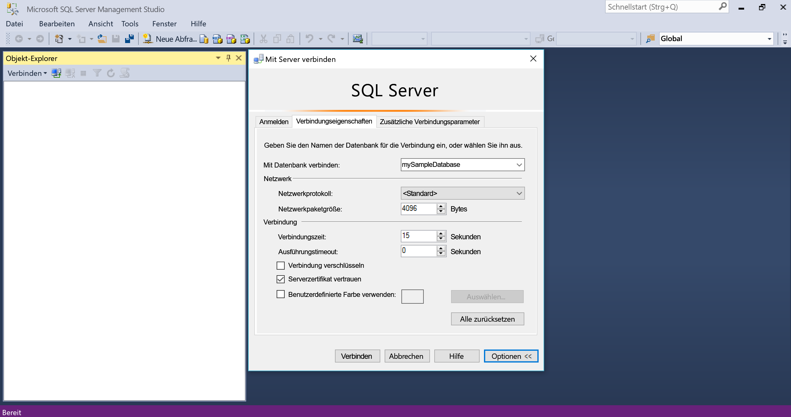

# <a name="quickstart-use-sql-server-management-studio-to-connect-and-query-an-azure-sql-database"></a>Schnellstart: Verwenden von SQL Server Management Studio zum Herstellen der Verbindung mit einer Instanz von Azure SQL-Datenbank und deren Abfrage

Sie können [SQL Server Management Studio][ssms-install-latest-84g] (SSMS) für die Verwaltung beliebiger SQL-Infrastrukturen verwenden – von SQL Server bis SQL-Datenbank für Microsoft Windows. Dieser Schnellstart zeigt Ihnen, wie Sie SSMS zum Herstellen einer Verbindung mit einer Instanz von Azure SQL-Datenbank verwenden und anschließend Transact-SQL-Anweisungen ausführen, um Daten in der Datenbank abzufragen, zu aktualisieren oder zu löschen bzw. in diese einzufügen. 

## <a name="prerequisites"></a>Voraussetzungen

Für dieses Tutorial benötigen Sie Folgendes:

[!INCLUDE [prerequisites-create-db](../../includes/sql-database-connect-query-prerequisites-create-db-includes.md)]

* Eine konfigurierte Firewallregel auf Serverebene. Weitere Informationen finden Sie unter [Erstellen einer Firewallregel auf Serverebene](sql-database-get-started-portal-firewall.md).

#### <a name="install-the-latest-ssms"></a>Installieren der neuesten Version von SSMS

Bevor Sie beginnen, stellen Sie sicher, dass Sie die neueste Version von [SSMS][ssms-install-latest-84g] installiert haben. 

## <a name="sql-server-connection-information"></a>SQL Server-Verbindungsinformationen

[!INCLUDE [prerequisites-server-connection-info](../../includes/sql-database-connect-query-prerequisites-server-connection-info-includes.md)]

## <a name="connect-to-your-database"></a>Verbinden mit der Datenbank

Stellen Sie in SMSS eine Verbindung mit Ihrer Azure SQL-Datenbankserverinstanz her. 

> [!IMPORTANT]
> Ein logischer Azure SQL-Datenbankserver lauscht auf Port 1433. Um von hinter einer Unternehmensfirewall eine Verbindung mit einem logischen Server herzustellen, muss dieser Port der Firewall geöffnet sein.
>

1. Öffnen Sie SSMS. Das Dialogfeld **Mit Server verbinden** wird angezeigt.

2. Geben Sie Folgendes ein:

   | Einstellung      | Empfohlener Wert    | BESCHREIBUNG | 
   | ------------ | ------------------ | ----------- | 
   | **Servertyp** | Datenbank-Engine | Erforderlicher Wert. |
   | **Servername** | Der vollqualifizierte Servername | Der Name sollte etwa wie folgt lauten: **mynewserver20170313.database.windows.net**. |
   | **Authentifizierung** | SQL Server-Authentifizierung | In diesem Tutorial wird SQL-Authentifizierung verwendet. |
   | **Anmeldung** | Benutzer-ID des Serveradministratorkontos | Die Benutzer-ID des Serveradministratorkontos, das zum Erstellen des Servers verwendet wird. |
   | **Kennwort** | Kennwort des Serveradministratorkontos | Das zum Erstellen des Servers verwendete Kennwort des Serveradministratorkontos. |
   ||||

     

3. Wählen Sie im Dialogfeld **Mit Server verbinden** **Optionen** aus. Wählen Sie im Dropdownmenü **Mit Datenbank verbinden** **mySampleDatabase** aus.

     

4. Wählen Sie **Verbinden**aus. Die Objekt-Explorer-Fenster wird geöffnet. 

5. Erweitern Sie zum Anzeigen der Objekte der Datenbank **Datenbanken** und dann **mySampleDatabase**.

     

## <a name="query-data"></a>Abfragen von Daten

Verwenden Sie den folgenden [SELECT](https://msdn.microsoft.com/library/ms189499.aspx)-Transact-SQL-Code, um die 20 wichtigsten Produkte nach Kategorie abzufragen.

1. Klicken Sie im Objekt-Explorer mit der rechten Maustaste auf **mySampleDatabase**, und wählen Sie **Neue Abfrage** aus. Ein leeres Abfragefenster mit einer Verbindung mit Ihrer Datenbank wird geöffnet.

1. Fügen Sie diese SQL-Abfrage in das Abfragefenster ein.

   ```sql
   SELECT pc.Name as CategoryName, p.name as ProductName
   FROM [SalesLT].[ProductCategory] pc
   JOIN [SalesLT].[Product] p
   ON pc.productcategoryid = p.productcategoryid;
   ```

3. Wählen Sie auf der Symbolleiste **Ausführen** aus, um Daten aus den Tabellen `Product` und `ProductCategory` abzurufen.

    

## <a name="insert-data"></a>Einfügen von Daten

Verwenden Sie den folgenden [INSERT](https://msdn.microsoft.com/library/ms174335.aspx)-Transact-SQL-Code zum Erstellen eines neuen Produkts in der Tabelle `SalesLT.Product`.

1. Ersetzen Sie die vorherige Abfrage durch diese.

   ```sql
   INSERT INTO [SalesLT].[Product]
           ( [Name]
           , [ProductNumber]
           , [Color]
           , [ProductCategoryID]
           , [StandardCost]
           , [ListPrice]
           , [SellStartDate] )
     VALUES
           ('myNewProduct'
           ,123456789
           ,'NewColor'
           ,1
           ,100
           ,100
           ,GETDATE() );
   ```

2. Wählen Sie **Ausführen** aus, um eine neue Zeile in die Tabelle „Product“ einzufügen. Im Bereich **Nachrichten** wird **(1 Zeile betroffen)** angezeigt.

## <a name="view-the-result"></a>Anzeigen des Ergebnisses

1. Ersetzen Sie die vorherige Abfrage durch diese.

   ```sql
   SELECT * FROM [SalesLT].[Product] 
   WHERE Name='myNewProduct' 

2. Select **Execute**. The following result appears. 

   

 
## Update data

Use the following [UPDATE](https://msdn.microsoft.com/library/ms177523.aspx) Transact-SQL code to modify the new product you just added.

1. Replace the previous query with this one.

   ```sql
   UPDATE [SalesLT].[Product]
   SET [ListPrice] = 125
   WHERE Name = 'myNewProduct';
   ```

2. Wählen Sie **Ausführen** aus, um die angegebene Zeile in der Tabelle „Product“ zu aktualisieren. Im Bereich **Nachrichten** wird **(1 Zeile betroffen)** angezeigt.

## <a name="delete-data"></a>Löschen von Daten

Verwenden Sie den folgenden [DELETE](https://msdn.microsoft.com/library/ms189835.aspx)-Transact-SQL-Code, um das neue, zuvor von Ihnen hinzugefügte Produkt zu entfernen.

1. Ersetzen Sie die vorherige Abfrage durch diese.

   ```sql
   DELETE FROM [SalesLT].[Product]
   WHERE Name = 'myNewProduct';
   ```

2. Wählen Sie **Ausführen** aus, um die angegebene Zeile in der Tabelle „Product“ zu löschen. Im Bereich **Nachrichten** wird **(1 Zeile betroffen)** angezeigt.

## <a name="next-steps"></a>Nächste Schritte

- Informationen zu SSMS finden Sie unter [SQL Server Management Studio](https://msdn.microsoft.com/library/ms174173.aspx).
- Informationen zum Herstellen einer Verbindung sowie zum Abfragen mithilfe des Azure-Portals finden Sie unter [Verbinden und Abfragen mit dem SQL-Abfrage-Editor des Azure-Portals](sql-database-connect-query-portal.md).
- Informationen zum Herstellen einer Verbindung mit Visual Studio finden Sie unter [Verbinden und Abfragen mit Visual Studio Code](sql-database-connect-query-vscode.md).
- Informationen zum Herstellen einer Verbindung und Senden von Abfragen mit .NET finden Sie unter [Verbinden und Abfragen mit .NET](sql-database-connect-query-dotnet.md).
- Informationen zum Herstellen einer Verbindung und Senden von Abfragen mit PHP finden Sie unter [Verbinden und Abfragen mit PHP](sql-database-connect-query-php.md).
- Informationen zum Herstellen einer Verbindung und Senden von Abfragen mit Node.js finden Sie unter [Verbinden und Abfragen mit Node.js](sql-database-connect-query-nodejs.md).
- Informationen zum Herstellen einer Verbindung und Senden von Abfragen mit Java finden Sie unter [Verbinden und Abfragen mit Java](sql-database-connect-query-java.md).
- Informationen zum Herstellen einer Verbindung und Senden von Abfragen mit Python finden Sie unter [Verbinden und Abfragen mit Python](sql-database-connect-query-python.md).
- Informationen zum Herstellen einer Verbindung und Senden von Abfragen mit Ruby finden Sie unter [Verbinden und Abfragen mit Ruby](sql-database-connect-query-ruby.md).


<!-- Article link references. -->

[ssms-install-latest-84g]: https://docs.microsoft.com/sql/ssms/sql-server-management-studio-ssms

