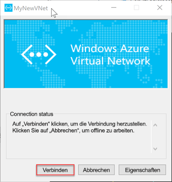

# <a name="quickstart-configure-a-point-to-site-connection-to-an-azure-sql-database-managed-instance-from-on-premises"></a>Schnellstart: Konfigurieren einer Point-to-Site-Verbindung von einem lokalen Computer mit einer verwalteten Azure SQL-Datenbank-Instanz

In dieser Schnellstartanleitung wird gezeigt, wie Sie von einem lokalen Clientcomputer eine Verbindung zu einer verwalteten Azure SQL-Datenbank-Instanz herstellen und dazu [SQL Server Management Studio](https://docs.microsoft.com/sql/ssms/sql-server-management-studio-ssms) (SSMS) und eine Point-to-Site-Verbindung verwenden. Weitere Informationen zu Point-to-Site-Verbindungen finden Sie unter [Informationen zu P2S-VPN](../vpn-gateway/point-to-site-about.md).

## <a name="prerequisites"></a>Voraussetzungen

In dieser Schnellstartanleitung gilt Folgendes:

- Als Ausgangspunkt werden die in [Erstellen einer verwalteten Instanz](sql-database-managed-instance-get-started.md) erstellten Ressourcen verwendet.
- Erforderlich sind PowerShell 5.1 und Azure PowerShell 1.4.0 oder höher auf Ihrem lokalen Clientcomputer. Sehen Sie sich ggf. die Anweisungen zum [Installieren des Azure PowerShell-Moduls](https://docs.microsoft.com/powershell/azure/install-az-ps#install-the-azure-powershell-module) an.
- Die neueste Version von [SQL Server Management Studio](https://docs.microsoft.com/sql/ssms/sql-server-management-studio-ssms) (SSMS) ist auf Ihrem lokalen Clientcomputer erforderlich.

## <a name="attach-a-vpn-gateway-to-your-managed-instance-virtual-network"></a>Anfügen eines VPN-Gateways an Ihr virtuelles Netzwerk mit einer verwalteten Instanz

1. Öffnen Sie PowerShell auf Ihrem lokalen Clientcomputer.

2. Kopieren Sie dieses PowerShell-Skript. Mit diesem Skript wird ein VPN Gateway an das virtuelle Netzwerk mit der verwalteten Instanz, die Sie in der Schnellstartanleitung [Erstellen einer verwalteten Instanz](sql-database-managed-instance-get-started.md) erstellt haben, angefügt. Das Skript bewirkt Folgendes:

   - Erstellen und Installieren von Zertifikaten auf dem Clientcomputer
   - Berechnen des Subnetz-IP-Adressbereichs für den zukünftigen VPN Gateway
   - Erstellen von „GatewaySubnet“
   - Bereitstellen der Azure Resource Manager-Vorlage zum Anfügen des VPN Gateway an das VPN-Subnetz

     ```powershell
     $scriptUrlBase = 'https://raw.githubusercontent.com/Microsoft/sql-server-samples/master/samples/manage/azure-sql-db-managed-instance/attach-vpn-gateway'

     $parameters = @{
       subscriptionId = '<subscriptionId>'
       resourceGroupName = '<resourceGroupName>'
       virtualNetworkName = '<virtualNetworkName>'
       certificateNamePrefix  = '<certificateNamePrefix>'
       }

     Invoke-Command -ScriptBlock ([Scriptblock]::Create((iwr ($scriptUrlBase+'/attachVPNGatewayAz.ps1?t='+ [DateTime]::Now.Ticks)).Content)) -ArgumentList $parameters, $scriptUrlBase
     ```

     > [!IMPORTANT]
     > Um in PowerShell anstelle des Azure-Moduls das Azure Resource Manager-Modul zu verwenden, verwenden Sie statt des Cmdlets `attachVPNGatewayAz.ps1` das Cmdlet `attachVPNGateway.ps1`.

3. Fügen Sie das Skript in Ihr PowerShell-Fenster ein, und geben Sie die erforderlichen Parameter an. Die Werte für `<subscriptionId>`, `<resourceGroup>` und `<virtualNetworkName>` sollten den Werten entsprechen, die in der Schnellstartanleitung [Erstellen einer verwalteten Instanz](sql-database-managed-instance-get-started.md) verwendet wurden. Der Wert für `<certificateNamePrefix>` kann eine Zeichenfolge Ihrer Wahl sein.

4. Führen Sie das PowerShell-Skript aus.

> [!IMPORTANT]
> Setzen Sie den Vorgang nicht fort, bis das PowerShell-Skript abgeschlossen ist.

## <a name="create-a-vpn-connection-to-your-managed-instance"></a>Erstellen einer VPN-Verbindung zu Ihrer verwalteten Instanz

1. Melden Sie sich beim [Azure-Portal](https://portal.azure.com/) an.
2. Öffnen Sie die Ressourcengruppe, in der Sie den Gateway für das virtuelle Netzwerk erstellt haben, und öffnen Sie die Gatewayressource für das virtuelle Netzwerk.
3. Klicken Sie auf **Punkt-zu-Standort-Konfiguration** und dann auf **VPN-Client herunterladen**.

      
4. Extrahieren Sie auf Ihrem lokalen Clientcomputer die Dateien aus der ZIP-Datei, und öffnen Sie dann den Ordner mit den extrahierten Dateien.
5. Öffnen Sie den Ordner **WindowsAmd64** und dann die Datei **VpnClientSetupAmd64.exe**.
6. Wenn Sie die Nachricht **Windows hat Ihren PC geschützt** erhalten, klicken Sie auf **Weitere Informationen** und dann auf **Trotzdem ausführen**.

    \
7. Klicken Sie im Dialogfeld für die Benutzerkontensteuerung auf **Ja**, um den Vorgang fortzusetzen.
8. Klicken Sie in dem Dialogfeld, das auf Ihr virtuelles Netzwerk verweist, auf **Ja**, um den VPN-Client für Ihr virtuelles Netzwerk zu installieren.

## <a name="connect-to-the-vpn-connection"></a>Verbinden mit der VPN-Verbindung

1. Wechseln Sie auf Ihrem lokalen Clientcomputer unter **Netzwerk und Internet** zu **VPN**, und wählen Sie das virtuelle Netzwerk Ihrer verwalteten Instanz aus, um eine Verbindung zu diesem virtuellen Netzwerk herzustellen. In der folgenden Abbildung heißt das virtuelle Netzwerk**MyNewVNet**.

      
2. Wählen Sie **Verbinden**aus.
3. Klicken Sie im Dialogfeld auf **Verbinden**.

      
4. Klicken Sie in der Eingabeaufforderung, die besagt, dass der Verbindungs-Manager zum Aktualisieren Ihrer Routingtabelle erhöhte Rechte benötigt, auf **Weiter**.
5. Klicken Sie im Dialogfeld für die Benutzerkontensteuerung auf **Ja**, um den Vorgang fortzusetzen.

   Sie haben eine VPN-Verbindung zum virtuellen Netzwerk Ihrer verwalteten Instanz hergestellt.

      

## <a name="use-ssms-to-connect-to-the-managed-instance"></a>Verwenden von SSMS zum Verbinden mit der verwalteten Instanz

1. Öffnen Sie auf dem lokalen Clientcomputer SQL Server Management Studio (SSMS).
2. Geben Sie im Dialogfeld **Mit Server verbinden** den vollqualifizierten **Hostnamen** für Ihre verwaltete Instanz in das Feld **Servername** ein.
3. Wählen Sie **SQL Server-Authentifizierung** aus, geben Sie Ihren Benutzernamen und Ihr Kennwort ein, und wählen Sie anschließend **Verbinden** aus.

      

Nachdem die Verbindung hergestellt wurde, können Sie Ihre System- und Benutzerdatenbanken im Knoten „Datenbanken“ anzeigen. Sie können auch verschiedene Objekte in den Knoten für Sicherheit, Serverobjekte, Replikation, Verwaltung, SQL Server-Agent und XEvent-Profilerstellung anzeigen.

## <a name="next-steps"></a>Nächste Schritte

- Eine Schnellstartanleitung, die zeigt, wie Sie eine Verbindung von einem virtuellen Azure-Computer herstellen, finden Sie unter [Konfigurieren einer Point-to-Site-Verbindung](sql-database-managed-instance-configure-p2s.md).
- Eine Übersicht über die Verbindungsoptionen für Anwendungen finden Sie unter [Herstellen einer Verbindung zwischen einer Anwendung und einer verwalteten Azure SQL-Datenbank-Instanz](sql-database-managed-instance-connect-app.md).
- Zur Wiederherstellung einer vorhandenen SQL Server-Datenbank aus einer lokalen Instanz in eine verwaltete Instanz können Sie entweder [Azure Database Migration Service (DMS) für die Migration](../dms/tutorial-sql-server-to-managed-instance.md) oder den [T-SQL-Befehl „RESTORE“](sql-database-managed-instance-get-started-restore.md) zum Wiederherstellen aus einer Datenbanksicherungsdatei verwenden.
