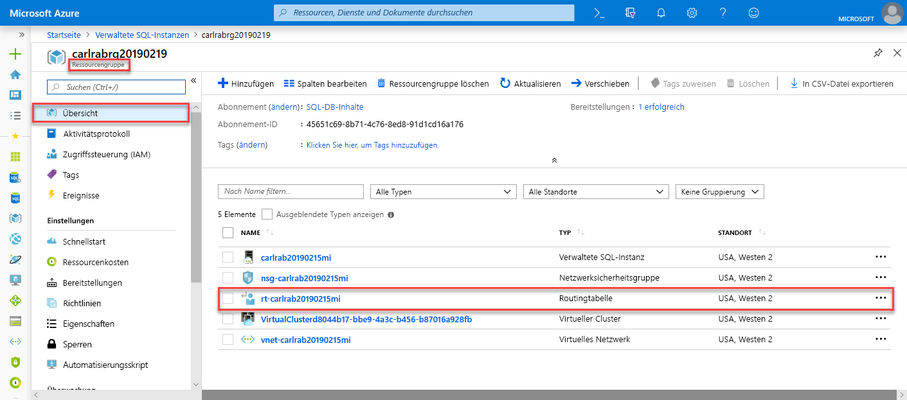
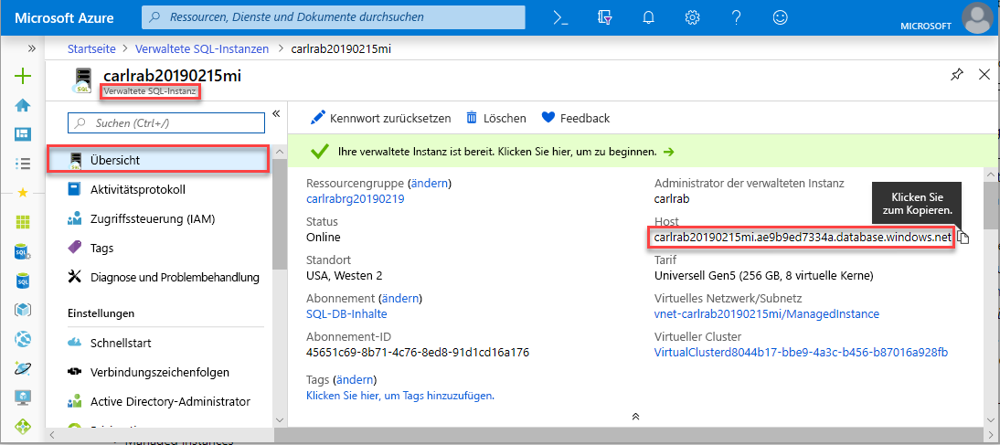

# Schnellstart: Erstellen einer verwalteten Azure SQL-Datenbank-Instanz

In dieser Schnellstartanleitung wird Schritt für Schritt beschrieben, wie Sie eine [verwaltete Azure SQL-Datenbank-Instanz](sql-database-managed-instance.md) im Azure-Portal erstellen.

> [!IMPORTANT]
> Informationen zu Einschränkungen finden Sie unter [unterstützte Regionen](sql-database-managed-instance-resource-limits.md#supported-regions) und [unterstützte Abonnementtypen](sql-database-managed-instance-resource-limits.md#supported-subscription-types).

## Melden Sie sich auf dem Azure-Portal an.

Melden Sie sich beim [Azure-Portal](https://portal.azure.com/) an.

## Erstellen einer verwalteten Instanz

Die folgenden Schritte zeigen, wie Sie eine verwaltete Instanz erstellen.

1. Klicken Sie im Azure-Portal links oben auf **Ressource erstellen**.
2. Suchen Sie nach **Verwaltete Instanz**, und wählen Sie dann **Verwaltete Azure SQL-Datenbank-Instanz**.
3. Klicken Sie auf **Erstellen**.

   

4. Füllen Sie das Formular für die **Verwaltete SQL-Instanz** mit den geforderten Informationen aus, indem Sie die Angaben in der folgenden Tabelle verwenden:

   | Einstellung| Empfohlener Wert | BESCHREIBUNG |
   | ------ | --------------- | ----------- |
   | **Abonnement** | Ihr Abonnement | Ein Abonnement mit der Berechtigung zum Erstellen neuer Ressourcen |
   |**Name der verwalteten Instanz**|Ein gültiger Name|Gültige Namen finden Sie unter [Benennungskonventionen](https://docs.microsoft.com/azure/architecture/best-practices/naming-conventions).|
   |**Administratoranmeldung für verwaltete Instanz**|Beliebiger gültiger Benutzername|Gültige Namen finden Sie unter [Benennungskonventionen](https://docs.microsoft.com/azure/architecture/best-practices/naming-conventions). Verwenden Sie nicht „serveradmin“. Hierbei handelt es sich um eine reservierte Rolle auf Serverebene.|
   |**Kennwort**|Ein gültiges Kennwort|Das Kennwort muss mindestens 16 Zeichen lang sein und die [definierten Anforderungen an die Komplexität](../virtual-machines/windows/faq.md#what-are-the-password-requirements-when-creating-a-vm) erfüllen.|
   |**Zeitzone**|Die Zeitzone, die von Ihrer verwalteten Instanz beobachtet werden soll|Weitere Informationen finden Sie unter [Zeitzonen](sql-database-managed-instance-timezone.md).|
   |**Collation**|Die Sortierung, die Sie für Ihre verwaltete Instanz verwenden möchten|Wenn Sie Datenbanken von SQL Server migrieren, überprüfen Sie die Quellsortierung mit `SELECT SERVERPROPERTY(N'Collation')`, und verwenden Sie diesen Wert. Informationen zu Sortierungen finden Sie unter [Festlegen oder Ändern der Serversortierung](https://docs.microsoft.com/sql/relational-databases/collations/set-or-change-the-server-collation).|
   |**Standort**|Der Standort, an dem Sie die verwaltete Instanz erstellen möchten|Informationen zu Regionen finden Sie unter [Azure-Regionen](https://azure.microsoft.com/regions/).|
   |**Virtuelles Netzwerk**|Wählen Sie entweder **Neues virtuelles Netzwerk erstellen** oder ein gültiges virtuelles Netzwerk und ein Subnetz aus.| Wenn ein Netzwerk/Subnetz nicht verfügbar ist, muss es [modifiziert werden, um die Netzwerkanforderungen zu erfüllen](sql-database-managed-instance-configure-vnet-subnet.md), bevor Sie es als Ziel für die neue verwaltete Instanz auswählen. Informationen zu den Anforderungen für das Konfigurieren der Netzwerkumgebung für eine verwaltete Instanz finden Sie unter [Verbindungsarchitektur der verwalteten Azure SQL-Datenbank-Instanz](sql-database-managed-instance-connectivity-architecture.md). |
   |**Ressourcengruppe**|Eine neue oder vorhandene Ressourcengruppe|Gültige Ressourcengruppennamen finden Sie unter [Naming rules and restrictions](https://docs.microsoft.com/azure/architecture/best-practices/naming-conventions) (Benennungsregeln und Einschränkungen).|

   

5. Wenn Sie die verwaltete Instanz als sekundäre Instanzfailovergruppe verwenden möchten, wählen Sie den Auftragsabschluss aus, und geben Sie die verwaltete Instanz „DnsAzurePartner“ an. Dieses Feature befindet sich in der Vorschauphase und ist nicht im zugehörigen Screenshot zu sehen.
6. Wählen Sie **Tarif** aus, um die Größe der Compute- und Speicherressourcen festzulegen und die Tarifoptionen zu prüfen. Der Tarif „Universell“ mit 32 GB Arbeitsspeicher und 16 V-Kernen ist der Standardwert.
7. Verwenden Sie die Schieberegler oder Textfelder, um die Speichermenge und die Anzahl von virtuellen Kernen anzugeben.
8. Wählen Sie nach Abschluss des Vorgangs **Übernehmen** aus, um Ihre Auswahl zu speichern.  
9. Wählen Sie **Erstellen**, um die verwaltete Instanz bereitzustellen.
10. Wählen Sie das Symbol **Benachrichtigungen**, um den Status der Bereitstellung anzuzeigen.

    

11. Wählen Sie **Die Bereitstellung wird ausgeführt.**, um das Fenster für die verwaltete Instanz zu öffnen und den Bereitstellungsstatus weiter zu verfolgen.

> [!IMPORTANT]
> Für die erste Instanz in einem Subnetz ist die Bereitstellungsdauer normalerweise deutlich länger als bei den nachfolgenden Instanzen. Brechen Sie den Bereitstellungsvorgang nicht ab, weil er länger als erwartet dauert. Das Erstellen der zweiten verwalteten Instanz im Subnetz dauert nur einige Minuten.

## Überprüfen der Ressourcen und Abrufen des vollqualifizierten Servernamens

Nachdem die Bereitstellung erfolgreich abgeschlossen wurde, überprüfen Sie die erstellten Ressourcen, und rufen Sie den vollqualifizierten Servernamen für die Verwendung in späteren Schnellstartanleitungen ab.

1. Öffnen Sie die Ressourcengruppe für Ihre verwaltete Instanz, und zeigen Sie die Ressourcen an, die in der Schnellstartanleitung [Erstellen einer verwalteten Instanz](#create-a-managed-instance) erstellt wurden.

   

2. Wählen Sie die Routingtabelle aus, um die Tabelle mit den benutzerdefinierten Routen anzuzeigen, die für Sie erstellt wurde.

   

3. Sehen Sie sich in der Routingtabelle die Einträge für das Leiten von Datenverkehr aus dem bzw. im virtuellen Netzwerk der verwalteten Instanz an. Wenn Sie Ihre Routentabelle manuell erstellen oder konfigurieren, müssen Sie darauf achten, dass Sie diese Einträge in der Routingtabelle erstellen.

   

4. Wechseln Sie zurück zur Ressourcengruppe, und wählen Sie die Netzwerksicherheitsgruppe aus, um die Sicherheitsregeln anzuzeigen.

   

5. Überprüfen Sie die Eingangs- und Ausgangssicherheitsregeln.

   

6. Wechseln Sie zurück zur Ressourcengruppe, und wählen Sie Ihre verwaltete Instanz aus.

   

7. Suchen Sie auf der Registerkarte **Übersicht** nach der Eigenschaft **Host**, und kopieren Sie die vollqualifizierte Hostadresse für die verwaltete Instanz zur Verwendung in der nächsten Schnellstartanleitung.

   

   Der Name lautet etwa wie folgt: **Name_Ihres_Computers.a1b2c3d4e5f6.database.windows.net**.

## Nächste Schritte

- Informationen zum Verbinden mit einer verwalteten Instanz finden Sie wie folgt:
  - Eine Übersicht über die Verbindungsoptionen für Anwendungen finden Sie unter [Herstellen einer Verbindung zwischen einer Anwendung und einer verwalteten Azure SQL-Datenbank-Instanz](sql-database-managed-instance-connect-app.md).
  - Eine Schnellstartanleitung, die zeigt, wie Sie eine Verbindung von einem virtuellen Azure-Computer zu einer verwalteten Instanz herstellen, finden Sie unter [Konfigurieren einer Verbindung zu einem virtuellen Azure-Computer](sql-database-managed-instance-configure-vm.md).
  - Eine Schnellstartanleitung, die zeigt, wie Sie von einem lokalen Clientcomputer über eine Point-to-Site-Verbindung eine Verbindung mit einer verwalteten Instanz herstellen, finden Sie unter [Konfigurieren einer Point-to-Site-Verbindung](sql-database-managed-instance-configure-p2s.md).
- Zur Wiederherstellung einer vorhandenen SQL Server-Datenbank von einer lokalen in eine verwaltete Instanz können Sie entweder [Azure Database Migration Service (DMS) für die Migration](../dms/tutorial-sql-server-to-managed-instance.md) oder den [T-SQL-Befehl „RESTORE“](sql-database-managed-instance-get-started-restore.md) verwenden, um die Wiederherstellung von einer Datenbanksicherungsdatei durchzuführen.
- Informationen zur erweiterten Überwachung der Datenbankleistung verwalteter Instanzen mit integrierten Problembehandlungsfunktionen finden Sie unter [Überwachen von Azure SQL-Datenbank mithilfe von Azure SQL-Analyse (Vorschauversion)](../azure-monitor/insights/azure-sql.md).
