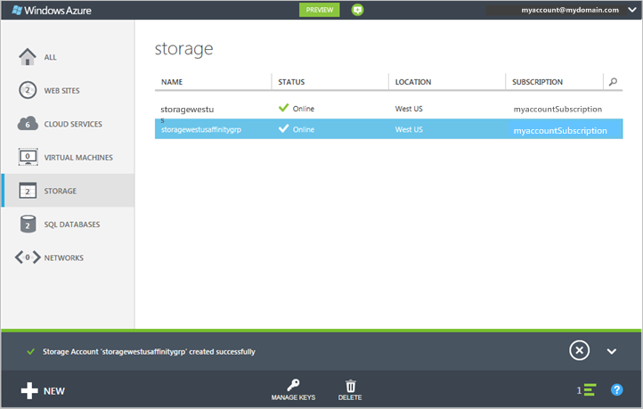

<properties urlDisplayName="How to create" pageTitle="Erstellen eines Speicherkontos | Azure" metaKeywords="" description="Learn how to create a storage account in the Azure management portal." metaCanonical="" services="storage" documentationCenter="" title="How To Create a Storage Account" solutions="" authors="tamram" manager="adinah" editor="cgronlun" />

<tags ms.service="storage" ms.workload="storage" ms.tgt_pltfrm="na" ms.devlang="na" ms.topic="article" ms.date="01/01/1900" ms.author="tamram" />

<h1>Erstellen eines Speicherkontos</h1>

Um Dateien und Daten in den Blob-, Tabellen-, Warteschlangen- und Dateidiensten in Azure speichern zu können, müssen Sie ein Speicherkonto in der gewünschten geografischen Region erstellen. Dieses Thema beschreibt die Erstellung eines Speicherkontos im Azure Verwaltungsportal.

Weitere Informationen zu Kapazität und Durchsatz von Speicherkonten finden Sie unter [Skalierbarkeits- und Leistungsziele für Azure-Speicher](http://msdn.microsoft.com/de-de/library/dn249410.aspx).

> [WACOM.NOTE] Für einen virtuellen Azure-Computer wird automatisch ein Speicherkonto am Speicherort der Bereitstellung erstellt, sofern Sie dort nicht bereits über ein Speicherkonto verfügen. Der Name des Speicherkontos basiert auf dem Namen des virtuellen Computers.

##Inhaltsverzeichnis##

* [Gewusst wie: Speicherkonto erstellen](#create)
* [Nächste Schritte](#next)

<h2>Gewusst wie: Speicherkonto erstellen</h2>

1. Melden Sie sich beim [Verwaltungsportal](https://manage.windowsazure.com) an.

2. Klicken Sie auf **Neu erstellen**, auf **Speicher** und dann auf **Schnellerfassung**.

	

3. Geben Sie unter **URL** einen Unterdomänennamen zur Verwendung in der Speicherkonto-URL ein. Sie werden den Speicherort des Objekts an den Endpunkt anhängen, um auf ein Objekt im Speicher zuzugreifen. Eine URL zum Zugreifen auf ein Blob wäre beispielsweise http://*myaccount*.blob.core.windows.net/*mycontainer*/*myblob*.

4. Wählen Sie unter **Region/Affinitätsgruppe** eine Region oder Affinitätsgruppe für den Speicher aus.  Wählen Sie eine Affinitätsgruppe statt einer Region, wenn Ihre Speicherdienste im selben Datacenter vorhanden sein sollen, wie die anderen Azure-Dienste, die Sie verwenden. Dadurch wird möglicherweise die Leistung verbessert, und es fallen keine Kosten für Ausgangsverkehr an.

	> [WACOM.NOTE]  Um eine Affinitätsgruppe zu erstellen, öffnen Sie den Bereich <b>Einstellungen</b> im Verwaltungsportal, klicken auf <b>Affinitätsgruppen</b> und anschließend entweder auf <b>Affinitätsgruppe hinzufügen</b> oder auf die Schaltfläche <b>Hinzufügen</b>. Sie können Affinitätsgruppen auch mithilfe der Azure Service Management-API erstellen und verwalten. Weitere Informationen erhalten Sie unter <a href="http://msdn.microsoft.com/de-de/library/windowsazure/ee460798.aspx">Operations on Affinity Groups</a> (Vorgänge zu Affinitätsgruppen, in englischer Sprache).

5. Wenn Sie mehr als ein Azure-Abonnement besitzen, wird das Feld **Abonnement** angezeigt. Geben Sie unter **Abonnement** das Azure-Abonnement ein, das Sie mit dem Speicherkonto verwenden möchten. Sie können bis zu fünf Speicherkontos für ein Abonnement erstellen.

6. Wählen Sie unter **Replikation** die gewünschte Replikationsebene für Ihr Speicherkonto aus.

	[WACOM.INCLUDE [storage-replication-options](../includes/storage-replication-options.md)]

6. Klicken Sie auf **Speicherkonto erstellen**.

	Die Erstellung Ihres Speicherkontos kann einige Minuten in Anspruch nehmen. Sie können die Benachrichtigungen unten im Portal überwachen, um den Status zu überprüfen. Nachdem das Speicherkonto erstellt wurde, hat Ihr neues Speicherkonto den Status **Online** und kann verwendet werden. 

	

<h2>Nächste Schritte</h2>

- Weitere Informationen über den Azure-Speicher finden Sie in der entsprechenden Dokumentation auf [azure.com](http://azure.microsoft.com/de-de/documentation/services/storage/) und auf [MSDN](http://msdn.microsoft.com/de-de/library/gg433040.aspx). 

- Besuchen Sie den [Blog des Azure-Speicherteams](http://blogs.msdn.com/b/windowsazurestorage/).

