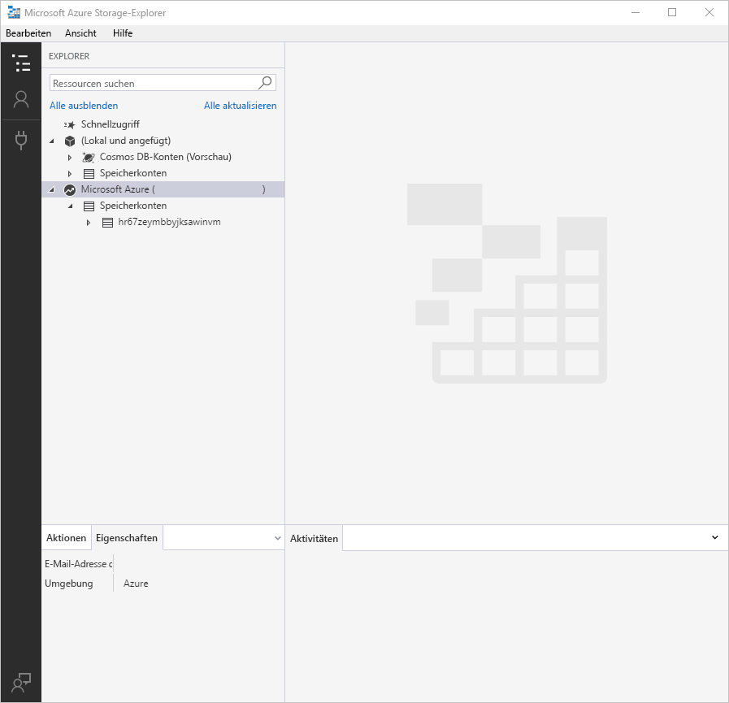

# Verwenden von Azure Storage-Explorer zum Verwalten von Daten in einem Azure Data Lake Storage Gen2-Konto

In diesem Schnellstart erfahren Sie, wie Sie [Azure Storage-Explorer](https://azure.microsoft.com/features/storage-explorer/) verwenden, um einen Verzeichnis und ein Blob zu erstellen. Als Nächstes erfahren Sie, wie Sie den Blob auf Ihren lokalen Computer herunterladen, und wie Sie alle Blobs in einem Verzeichnis anzeigen. Außerdem erfahren Sie, wie Sie eine Momentaufnahme eines Blobs erstellen, Zugriffsrichtlinien für ein Verzeichnis verwalten und eine SAS (Shared Access Signature) erstellen.

## Voraussetzungen

[!INCLUDE [storage-quickstart-prereq-include](../../../includes/storage-quickstart-prereq-include.md)]

Diese Schnellstartanleitung setzt voraus, dass Sie Azure Storage-Explorer installiert haben. Informationen zum Installieren von Azure Storage-Explorer für Windows, Macintosh oder Linux finden Sie unter [Azure Storage-Explorer](https://azure.microsoft.com/features/storage-explorer/).

## Anmelden bei Storage-Explorer

Nach dem ersten Start wird das Fenster **Microsoft Azure Storage-Explorer – Verbinden** angezeigt. Obwohl der Storage-Explorer mehrere Möglichkeiten zur Verbindung mit Speicherkonten bietet, wird derzeit nur eine Möglichkeit zur Verwaltung von ACLs unterstützt.

|Aufgabe|Zweck|
|---|---|
|Hinzufügen eines Azure-Kontos | Führt die Umleitung auf die Anmeldeseite Ihrer Organisation durch, um Sie für Azure zu authentifizieren. Dies ist derzeit die einzige unterstützte Authentifizierungsmethode, wenn Sie ACLs verwalten und festlegen möchten. |

Wählen Sie **Azure-Konto hinzufügen**, und klicken Sie auf **Anmelden...** . Befolgen Sie die Anweisungen auf dem Bildschirm, um sich an Ihrem Azure-Konto anzumelden.

Nach Abschluss des Verbindungsvorgangs wird Azure Storage-Explorer geladen, und die Registerkarte **Explorer** wird angezeigt. So erhalten Sie einen Einblick in Ihre gesamten Azure Storage-Konten und in den lokalen Speicher, der über den [Azure-Speicheremulator](../common/storage-use-emulator.md?toc=%2fazure%2fstorage%2fblobs%2ftoc.json), [Cosmos DB](../../cosmos-db/storage-explorer.md?toc=%2fazure%2fstorage%2fblobs%2ftoc.json)-Konten oder [Azure Stack](/azure-stack/user/azure-stack-storage-connect-se?toc=%2fazure%2fstorage%2fblobs%2ftoc.json)-Umgebungen konfiguriert wurde.

## Erstellen eines Dateisystems

Blobs werden immer in ein Verzeichnis hochgeladen. So können Sie Gruppen von Blobs wie Dateien in Ordnern auf Ihrem Computer organisieren.

Erweitern Sie das Speicherkonto, das Sie im vorherigen Schritt erstellt haben, um ein Verzeichnis zu erstellen. Wählen Sie **BLOB-Container**, klicken Sie mit der rechten Maustaste, und wählen Sie **BLOB-Container erstellen**. Geben Sie den Namen für Ihr Dateisystem ein. Drücken Sie nach Abschluss des Vorgangs die **EINGABETASTE**, um das Dateisystem zu erstellen. Nach der erfolgreichen Erstellung des BLOB-Containers wird er im Ordner **BLOB-Container** für das ausgewählte Speicherkonto angezeigt.

## Hochladen von Blobs in das Verzeichnis

Blobspeicher unterstützt Block-, Anfüge- und Seitenblobs. Seitenblobs sind VHD-Dateien, mit denen IaaS-VMs gesichert werden. Anfügeblobs dienen der Protokollierung und können z.B. verwendet werden, um beim Schreiben in eine Datei zusätzliche Daten hinzuzufügen. Die meisten Dateien, die im Blob Storage gespeichert werden, sind allerdings Blockblobs.

Wählen Sie im Menüband des Verzeichnisses die Option **Hochladen**. Bei diesem Vorgang besteht die Option, einen Ordner oder eine Datei hochzuladen.

Wählen Sie die Dateien oder den Ordner für den Upload aus. Wählen Sie den **BLOB-Typ** aus. Zulässige Optionen sind **Anfüge**-, **Seiten**- oder **Blockblobs**.

Wählen Sie **VHD-/VHDX-Dateien als Seitenblobs hochladen (empfohlen)** , falls Sie eine VHD- oder VHDX-Datei hochladen.

Geben Sie im Feld **In Ordner hochladen (optional)** den Namen eines Ordners ein, in dem die Dateien oder Ordner unter dem Verzeichnis gespeichert werden sollen. Wenn kein Ordner ausgewählt ist, werden die Dateien in den Ordner auf der Ebene direkt unterhalb des Verzeichnisses hochgeladen.

Wenn Sie **OK** wählen, werden die ausgewählten Dateien in die Warteschlange für den Upload eingereiht, und jede Datei wird hochgeladen. Nach Abschluss des Uploads werden die Ergebnisse im Fenster **Aktivitäten** angezeigt.

## Anzeigen von Blobs in einem Verzeichnis

Wählen Sie in der Anwendung **Azure Storage-Explorer** ein Verzeichnis unter einem Speicherkonto aus. Im Hauptbereich wird eine Liste mit den Blobs des ausgewählten Verzeichnisses angezeigt.

## Herunterladen von Blobs

Wählen Sie im Menüband bei ausgewähltem Blob die Option **Herunterladen**, um mit dem **Azure Storage-Explorer** Blobs herunterzuladen. Ein Dialogfeld für Dateien wird geöffnet, und Sie können einen Dateinamen eingeben. Wählen Sie **Speichern**, um mit dem Herunterladen eines Blobs an den lokalen Speicherort zu beginnen.

## Nächste Schritte

In diesem Schnellstart haben Sie gelernt, wie Sie mit **Azure Storage-Explorer** Dateien zwischen einem lokalen Datenträger und Azure Blob Storage übertragen. Um zu erfahren, wie Sie ACLs für Ihre Dateien und Verzeichnisse einrichten können, lesen Sie bitte unsere Anleitung zu diesem Thema.

> [!div class="nextstepaction"]
> [Gewusst wie: Festlegen von ACLs für Dateien und Verzeichnisse](data-lake-storage-how-to-set-permissions-storage-explorer.md)
