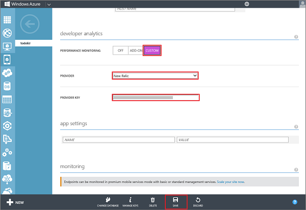

<properties linkid="mobile-services-monitor-new-relic" urlDisplayName="Use New Relic to monitor Mobile Services" pageTitle="Store server scripts in source control - Azure Mobile Services" metaKeywords="" description="Learn how to use the New Relic add-on to monitor your mobile service." metaCanonical="" disqusComments="1" umbracoNaviHide="0" documentationCenter="Mobile" title="Use New Relic to monitor Mobile Services" authors="" />

Verwenden von New Relic zum Überwachen von Mobile Services
==========================================================

Dieses Thema demonstriert das Konfigurieren des Drittanbieter-Add-ons New Relic für die Verwendung mit Azure Mobile Services, um eine erweiterte Überwachung Ihres mobilen Diensts bereitzustellen.

Dieses Lernprogramm führt Sie durch die folgenden Schritte:

1.  [Anmelden bei New Relic über den Azure Store](#sign-up).
2.  [Installieren des New Relic-Moduls](#install-module).
3.  [Aktivieren der New Relic-Entwickleranalyse für den mobilen Dienst](#enable-service).
4.  [Überwachen des mobilen Diensts im New Relic-Dashboard](#monitor).

Dieses Lernprogramm setzt voraus, dass Sie bereits einen mobilen Dienst aus einem der Lernprogramme [Erste Schritte mit Mobile Services](/de-de/develop/mobile/tutorials/get-started/) bzw. [Erste Schritte mit Daten](/de-de/develop/mobile/tutorials/get-started-with-data-dotnet) erstellt haben.

Anmelden bei New Relic über den Azure Store
-------------------------------------------

Der erste Schritt besteht im Kauf des New Relic-Diensts. Diese Lernprogramm demonstriert den Kauf dieses Diensts im Azure Store. Mobile Services unterstützt New Relic-Abonnements, die außerhalb des Azure Store erworben wurden.

1.  Melden Sie sich beim [Azure-Verwaltungsportal](https://manage.windowsazure.com) an.

2.  Klicken Sie im unteren Bereich des Verwaltungsportals auf **Neu**.

3.  Klicken Sie auf **Speichern**.

4.  Wählen Sie im Dialogfeld **Add-On auswählen** die Option **New Relic** aus, und klicken Sie auf **Weiter**.

5.  Wählen Sie im Dialogfeld **Add-On personalisieren** den gewünschten New Relic-Plan aus.

6.  Geben Sie den Namen ein, mit dem der New Relic-Dienst in Ihren Azure-Einstellungen angezeigt werden soll, oder wählen Sie den Standardwert **NewRelic** aus. Dieser Name muss in der Liste der abonnierten Azure Store-Elemente eindeutig sein.

7.  Wählen Sie einen Wert für die Region aus, z. B. **West US**.

8.  Klicken Sie auf **Weiter**.

9.  Prüfen Sie den Plan, die Preisinformationen sowie die rechtlichen Bedingungen im Dialogfeld **Kauf überprüfen**. Wenn Sie den Bedingungen zustimmen, klicken Sie auf **Kaufen**.

10. Nachdem Sie auf **Kaufen** geklickt haben, wird mit der Erstellung Ihres neuen New Relic-Kontos begonnen. Sie können den Status im Azure-Verwaltungsportal überwachen.

Installieren des New Relic-Moduls
---------------------------------

Nachdem Sie sich für den New Relic-Dienst angemeldet haben, müssen Sie das New Relic-Modul "Node.js" in Ihrem mobilen Dienst installieren. Um dieses Modul hochladen zu können, muss die Quellcodeverwaltung für Ihren mobilen Dienst aktiviert sein.

1.  Folgen Sie, falls noch nicht geschehen, den Schritten im Lernprogramm [Speichern von Serverskripts in der Quellcodeverwaltung](/de-de/develop/mobile/tutorials/store-scripts-in-source-control/), um die Quellcodeverwaltung für Ihren mobilen Dienst zu erstellen, das Repository zu klonen und den [Node Package Manager (NPM)](http://nodejs.org/) zu installieren.

2.  Öffnen Sie den Ordner `.\service` in Ihrem lokalen Git-Repository und führen Sie den folgenden Befehl in der Eingabeaufforderung aus:

         npm install newrelic

    NPM installiert das [New Relic-Modul](https://npmjs.org/package/newrelic) im Unterverzeichnis `\newrelic`.

3.  Öffnen Sie ein Git-Befehlszeilentool, zum Beispiel **GitBash** (Windows) oder **Bash** (Unix Shell), und geben Sie den folgenden Befehl an der Git-Eingabeaufforderung ein:

         $ git add .
         $ git commit -m "added newrelic module"
         $ git push origin master

    Auf diese Weise wird das neue `newrelic`-Modul in Ihren mobilen Dienst hochgeladen.

Danach aktivieren Sie die New Relic-Überwachung Ihres mobilen Diensts im [Verwaltungsportal](https://manage.windowsazure.com/).

Aktivieren der New Relic-Entwickleranalyse für den mobilen Dienst
-----------------------------------------------------------------

1.  Wählen Sie im [Verwaltungsportal](https://manage.windowsazure.com/) Ihren mobilen Dienst aus. Klicken Sie dann auf die Registerkarte **Konfigurieren**.

    

2.  Blättern Sie nach unten zu **Developer Analytics**, und führen Sie eine der folgenden Aktionen aus, je nachdem, wie Sie Ihr New Relic-Abonnement erworben haben:

    -   Kauf im Azure Store:

        Klicken Sie auf **Add-on**, wählen Sie das New Relic-Add-on in **Add-on auswählen** aus, und klicken Sie dann auf **Speichern**.

        

    -   Kauf direkt von New Relic:

        Klicken Sie auf **Benutzerdefiniert**, wählen Sie das New Relic-Add-on unter **Anbieter** aus, geben Sie Ihren Schlüssel ein, und klicken Sie dann auf **Speichern**.

        

        Den Schlüssel erhalten Sie im New Relic-Dashboard.

3.  Nach Abschluss der Registrierung wird ein neuer Wert unter **App-Einstellungen** angezeigt:

    

Überwachen des mobilen Diensts im New Relic-Dashboard
-----------------------------------------------------

1.  Führen Sie die Client-App aus, um Lese-, Erstellen-, Aktualisieren- und Löschanforderungen an Ihren mobilen Dienst zu erzeugen.

2.  Warten Sie einige Minuten, bis die Daten verarbeitet wurden, und wechseln Sie dann zum New Relic-Dashboard.

    Wenn Ihr New Relic-Abonnement als Add-on erworben wurde, wählen Sie es im [Verwaltungsportal](https://manage.windowsazure.com/) aus. Klicken Sie dann auf **Verwalten**.

3.  Klicken Sie in New Relic auf **Anwendungen** und dann auf Ihren mobilen Dienst.

    

4.  Klicken Sie auf **Web Transactions**, um Ihre aktuellen Anforderungen an Ihren mobilen Dienst anzuzeigen:

    

Nächste Schritte
----------------

-   Preisinformationen finden Sie auf der [New Relic-Seite im Azure Store](/en-us/gallery/store/new-relic/new-relic/).
-   Weitere Informationen zum Verwenden von New Relic erhalten Sie unter [Applications Overview](https://docs.newrelic.com/docs/applications-dashboards/applications-overview) in der New Relic-Dokumentation.

