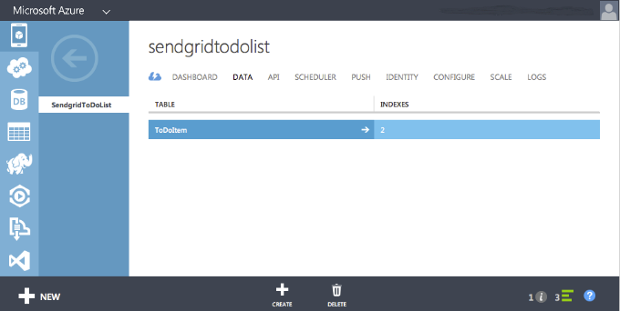

<properties linkid="develop-mobile-tutorials-send-email-with-sendgrid" urlDisplayName="Send Email Using SendGrid" pageTitle="Send email using SendGrid - Azure Mobile Services" metaKeywords="Azure SendGrid, SendGrid service, Azure emailing, mobile services email" description="Learn how to use the SendGrid service to send email from your Azure Mobile Services app." metaCanonical="" services="" documentationCenter="Mobile" title="Send email from Mobile Services with SendGrid" authors="" solutions="" manager="" editor="" />

Senden von E-Mails in Mobile Services mit SendGrid
==================================================

Dieses Thema beschreibt die Hinzufügung von E-Mail-Funktionen zu Ihrem mobilen Dienst. In diesem Lernprogramm fügen Sie serverseitige Skripts hinzu, um E-Mails mithilfe von SendGrid zu senden. Wenn dies abgeschlossen ist, sendet Ihr mobiler Dienst immer dann, wenn ein Datensatz eingefügt wird, eine E-Mail.

SendGrid ist ein [cloudbasierter E-Mail-Dienst](http://sendgrid.com/solutions), der zuverlässige [transaktionale E-Mail-Übermittlung](http://sendgrid.com/transactional-email), Skalierbarkeit und Echtzeitanalysen mit flexiblen APIs bietet, die die benutzerdefinierte Integration erleichtern. Weitere Informationen finden Sie unter &lt;http://sendgrid.com&gt;.

In diesem Lernprogramm werden die folgenden grundlegenden Schritte zur Aktivierung von E-Mail-Funktionen behandelt:

1.  [Erstellen eines SendGrid-Kontos](#sign-up)
2.  [Hinzufügen eines Skripts zum Senden von E-Mails](#add-script)
3.  [Einfügen von Daten zum Empfangen von E-Mails](#insert-data)

Dieses Lernprogramm baut auf dem Mobile Services-Schnellstart auf. Bevor Sie mit diesem Lernprogramm beginnen, müssen Sie zunächst [Erste Schritte mit Mobile Services](/en-us/develop/mobile/tutorials/get-started) abschließen.

Erstellen eines neuen KontosErstellen eines neuen SendGrid-Kontos
-----------------------------------------------------------------

[WACOM.INCLUDE [sendgrid-sign-up](../includes/sendgrid-sign-up.md)]

Registrieren eines SkriptsRegistrieren eines neuen Skripts zum Senden von E-Mails
---------------------------------------------------------------------------------

1.  Melden Sie sich beim [Azure-Verwaltungsportal](https://manage.windowsazure.com/) an, klicken Sie auf **Mobile Services** und dann auf Ihren mobilen Dienst.

2.  Klicken Sie im Verwaltungsportal auf die Registerkarte **Daten** und dann auf die Tabelle **TodoItem**.

    

3.  Klicken Sie unter **todoitem** auf die Registerkarte **Skript**, und wählen Sie **Einfügen** aus.

    

    Daraufhin wird die Funktion angezeigt, die aufgerufen wird, wenn etwas in die Tabelle **TodoItem** eingefügt wird.

4.  Ersetzen Sie die Einfügefunktion durch den folgenden Code:

         var SendGrid = require('sendgrid').SendGrid;
            
         function insert(item, user, request) {    
             request.execute({
                 success: function() {
                     // Nach dem Einfügen des Datensatzes die Antwort sofort an den Client senden
                     request.respond();
                     // E-Mail im Hintergrund senden
                     sendEmail(item);
                 }
             });

             function sendEmail(item) {
                 var sendgrid = new SendGrid('**username**', '**password**');       
                    
                 sendgrid.send({
                     to: '**email-address**',
                     from: '**from-address**',
                     subject: 'New to-do item',
                     text: 'A new to-do was added: ' + item.text
                 }, function(success, message) {
                     // Wenn das Senden der E-Mail fehlschlägt, als Fehler protokollieren, den wir dann untersuchen
                     if (!success) {
                         console.error(message);
                     }
                 });
             }
         }

5.  Ersetzen Sie die Platzhalter im Skript oben durch die korrekten Werte:

    -   ***username* und *password***: die Anmeldeinformationen aus dem Schritt [Erstellen eines SendGrid-Kontos](#sign-up).

    -   ***email-address***: die Adresse, an die die E-Mail gesendet wird. In einer tatsächlichen App können Sie E-Mail-Adressen mithilfe von Tabellen speichern und abrufen. Zum Testen der App können Sie einfach Ihre eigene E-Mail-Adresse verwenden.

    -   ***from-address***: die Adresse, von der aus die E-Mail gesendet wird. Verwenden Sie nach Möglichkeit eine Adresse aus einer registrierten Domäne, die zu Ihrer Organisation gehört.

    **Hinweis**

    Wenn Sie nicht über eine registrierte Domäne verfügen, können Sie stattdessen die Domäne Ihres mobilen Dienstes im Format **notifications@*your-mobile-service*.azure-mobile.net** verwenden. Allerdings werden Nachrichten, die an die Domäne Ihres mobilen Dienstes gesendet werden, ignoriert.

6.  Klicken Sie auf die Schaltfläche **Speichern**. Sie haben nun ein Skript so konfiguriert, dass jedes Mal, wenn ein Datensatz in die Tabelle **TodoItem** eingefügt wird, eine E-Mail gesendet wird.

Einfügen von TestdatenEinfügen von Testdaten zum Empfangen von E-Mails
----------------------------------------------------------------------

1.  Führen Sie im Client-App-Projekt die Schellstartanwendung aus.

    In diesem Thema wird die Windows Store-Version des Schnellstarts angezeigt.

2.  Geben Sie in der App einen Text in **Insert a TodoItem** ein, und klicken Sie dann auf **Speichern**.

    

3.  Sie erhalten eine E-Mail, die so aussieht wie in der Benachrichtigung unten.

    

    Herzlichen Glückwunsch! Sie haben Ihren mobilen Dienst erfolgreich für das Senden von E-Mails mithilfe von SendGrid konfiguriert.

Nächste Schritte
----------------

Nun, da Sie wissen, wie leicht die Verwendung des SendGrid-E-Mail-Dienstes mit Mobile Services ist, folgen Sie diesen Links, um mehr über SendGrid zu erfahren:

-   SendGrid-API-Dokumentation: &lt;http://docs.sendgrid.com/documentation/api/&gt;
-   Spezielles SendGrid-Angebot für Azure-Kunden: &lt;http://sendgrid.com/azure.html&gt;

