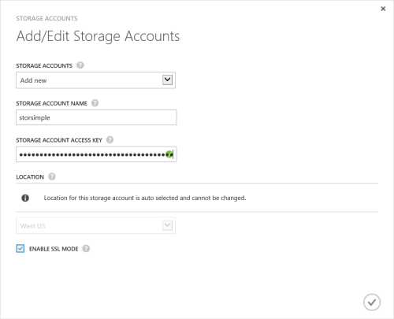
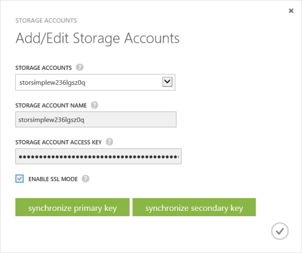

<properties 
   pageTitle="Verwalten von StorSimple-Speicherkonten"
   description="Beschreibt, wie Sie die Seite &quot;Konfigurieren&quot; zum Hinzufügen, Bearbeiten oder Löschen von Speicherkonten verwenden oder wie Sie die Sicherheitsschlüssel für ein Speicherkonto rotieren."
   services="storsimple"
   documentationCenter="NA"
   authors="SharS"
   manager="adinah"
   editor="tysonn" />
<tags 
   ms.service="storsimple"
   ms.devlang="NA"
   ms.topic="article"
   ms.tgt_pltfrm="NA"
   ms.workload="TBD"
   ms.date="04/27/2015"
   ms.author="v-sharos" />

#Verwalten von StorSimple-Speicherkonten

##Übersicht

Auf der Seite **Konfigurieren** werden globale Dienstparameter angezeigt, die im StorSimple-Manager-Dienst erstellt werden können. Diese Parameter können für alle mit dem Dienst verbundenen Geräte angewendet werden und umfassen Folgendes:

- Speicherkonten 
- Bandbreitenvorlagen 
- Zugriffssteuerungsdatensätze 

In diesem Lernprogramm wird erläutert, wie Sie die Seite **Konfigurieren** zum Hinzufügen, Bearbeiten oder Löschen von Speicherkonten verwenden oder wie Sie die Sicherheitsschlüssel für ein Speicherkonto rotieren.

 

Speicherkonten enthalten die Anmeldeinformationen, die das Gerät für den Zugriff auf das Speicherkonto mit dem Cloud-Dienstanbieter nutzt. Für Microsoft Azure-Speicherkonten sind dies die Anmeldeinformationen, wie z. B. Kontoname und primärer Zugriffsschlüssel.

Auf der Seite **Konfigurieren** werden alle Speicherkonten, die für das Abrechnungsabonnement erstellt werden, in einem Tabellenformat mit den folgenden Informationen angezeigt:

- **Name** – der eindeutige Name für das Konto, der bei dessen Erstellung zugewiesen wurde.
- **SSL enabled** – zeigt an, ob SSL aktiviert ist und die Kommunikation zwischen Gerät und Cloud über einen sicheren Kanal verläuft.
- **Used by** – die Anzahl der Datenträger, die das Speicherkonto verwenden.

Im Folgenden werden die häufigsten auf der Seite **Konfigurieren** ausgeführten Aufgaben im Zusammenhang mit Speicherkonten aufgeführt:

- Hinzufügen von Speicherkonten 
- Bearbeiten eines Speicherkontos 
- Löschen eines Speicherkontos 
- Schlüsselrotation für Speicherkonten 

##Speicherkontentypen

Es gibt drei Typen von Speicherkonten, die mit dem StorSimple-Gerät verwendet werden können.

- **Auto-generated storage accounts** – diese Art von Speicherkonto wird bei der ersten Erstellung des Dienstes automatisch generiert. Weitere Informationen über die Erstellung dieses Speicherkontos finden Sie unter "Schritt 1: Erstellen eines neuen Diensts" in [Bereitstellen des StorSimple-Geräts](storsimple-deployment-walkthrough.md). 
- **Storage accounts in the service subscription** – Azure-Speicherkonten, die demselben Abonnement zugeordnet sind wie der Dienst . Weitere Informationen zur Erstellung dieser Speicherkonten finden Sie unter [Informationen zu Azure-Speicherkonten](storage-create-storage-account.md). 
- **Storage accounts outside of the service subscription** – Azure-Speicherkonten, die nicht mit dem Dienst verknüpft sind und wahrscheinlich schon vorhanden waren, bevor der Dienst erstellt wurde.

##Hinzufügen von Speicherkonten

Sie können ein Speicherkonto hinzufügen, indem Sie einen eindeutigen Anzeigenamen und Anmeldeinformationen für den Zugriff angeben, die mit dem Speicherkonto (mit dem angegebenen Cloud-Dienstanbieter) verknüpft sind. Sie haben außerdem die Möglichkeit, den SSL-Modus (Secure Sockets Layer) zu aktivieren, um einen sicheren Kanal für die Netzwerkkommunikation zwischen dem Gerät und der Cloud zu erstellen.

Sie können mehrere Konten für einen Cloud-Dienstanbieter erstellen. Bedenken Sie jedoch, dass der Cloud-Dienstanbieter nach der Erstellung eines Speicherkontos nicht mehr geändert werden kann.

Während das Speicherkonto gespeichert wird, versucht der Dienst mit dem Cloud-Dienstanbieter zu kommunizieren. Die Anmelde- und Zugriffsinformationen, die Sie bereitgestellt haben, werden zu diesem Zeitpunkt authentifiziert. Ein Speicherkonto wird nur erstellt, wenn die Authentifizierung erfolgreich war. Wenn die Authentifizierung fehlschlägt, wird eine entsprechende Fehlermeldung angezeigt.

###So fügen Sie ein Speicherkonto hinzu

1. Wählen Sie auf der Startseite des StorSimple-Manager-Diensts Ihren Dienst aus, und doppelklicken Sie dann darauf. Damit gelangen Sie auf die Seite **Schnellstart**. 
2. Greifen Sie auf die Seite **Konfigurieren** zu.
3. Klicken Sie auf **Speicherkonto hinzufügen/bearbeiten**.
4. Gehen Sie im Dialogfeld **Speicherkonten hinzufügen/bearbeiten** folgendermaßen vor:
  1. Klicken Sie auf **Neues hinzufügen**.
  2. Geben Sie einen Namen für Ihr Speicherkonto an.
  3. Geben Sie den primären **Zugriffsschlüssel** für Ihr Microsoft Azure-Speicherkonto an.
  4. Aktivieren Sie das Kontrollkästchen **SSL-Modus aktivieren**, um einen sicheren Kanal für die Netzwerkkommunikation zwischen Ihrem Gerät und der Cloud zu erstellen. Deaktivieren Sie das Kontrollkästchen **SSL-Modus aktivieren** nur, wenn der Betrieb in einer privaten Cloud stattfindet.
  5. Klicken Sie auf das Häkchensymbol . Sie werden benachrichtigt, nachdem das Speicherkonto erfolgreich erstellt wurde.

    

5. Das neu erstellte Speicherkonto wird auf der Seite **Konfigurieren** unter **Speicherkonten** angezeigt. Klicken Sie auf **Speichern**, um das neu erstellte Speicherkonto zu speichern. Klicken Sie auf **OK**, wenn Sie zur Bestätigung aufgefordert werden.

##Bearbeiten eines Speicherkontos

Sie können ein Speicherkonto, das von einem Volumecontainer verwendet wird, bearbeiten. Wenn Sie ein Speicherkonto, das derzeit verwendet wird, bearbeiten, kann nur das Feld mit dem Zugriffsschlüssel für das Speicherkonto geändert werden. Sie können den neuen Speicherzugriffsschlüssel angeben und die aktualisierten Einstellungen speichern.

###So bearbeiten Sie ein Speicherkonto

1. Wählen Sie auf der Startseite des Diensts Ihren Dienst aus, doppelklicken Sie auf den Namen und klicken Sie dann auf **Konfigurieren**.

2. Klicken Sie auf **Speicherkonten hinzufügen/bearbeiten**.

3. Gehen Sie im Dialogfeld **Speicherkonten hinzufügen/bearbeiten** folgendermaßen vor:

  1. Wählen Sie in der Dropdownliste **Speicherkonten** ein vorhandenes Konto aus, das Sie ändern möchten. Dies kann auch Speicherkonten umfassen, die bei der ersten Erstellung des Diensts automatisch generiert wurden.
  2. Ändern Sie ggf. die Auswahl für **SSL-Modus aktivieren**.
  3. Sie können auch Rotation für Ihre Zugriffsschlüssel für Speicherkonten aktivieren. Weitere Informationen zur Schlüsselrotation finden Sie unter [Schlüsselrotation für Speicherkonten](#key-rotation-of-storage-accounts) .
  4. Klicken Sie auf das Häkchensymbol  zum Speichern der Einstellungen. Die Einstellungen werden auf der Seite **Konfigurieren** aktualisiert. Klicken Sie auf **Speichern** zum Speichern der aktualisierten Einstellungen.

    
  
##Löschen eines Speicherkontos

> [AZURE.IMPORTANT]Sie können ein Speicherkonto nur dann löschen, wenn es nicht von einem Volumecontainer verwendet wird. Wenn ein Speicherkonto von einem Volumecontainer verwendet wird, löschen Sie zunächst den Volumecontainer, und löschen Sie dann das zugehörige Speicherkonto.

###So löschen Sie ein Speicherkonto

1. Wählen Sie auf der Startseite des StorSimple-Manager-Diensts Ihren Dienst aus, doppelklicken Sie auf den Namen, und klicken Sie dann auf **Konfigurieren**.

2. Zeigen Sie in der tabellarischen Liste der Speicherkonten auf das Konto, das Sie löschen möchten.

3. Ein Löschsymbol (**x**) wird in der äußersten rechten Spalte für das Speicherkonto angezeigt. Klicken Sie auf das Symbol **x**, um die Anmeldeinformationen zu löschen.

4. Wenn Sie zur Bestätigung aufgefordert werden, klicken Sie auf **Ja**, um den Löschvorgang fortzusetzen. Die tabellarische Auflistung wird den Änderungen entsprechend aktualisiert.

##Schlüsselrotation für Speicherkonten

Aus Sicherheitsgründen wird in Rechenzentren oft Schlüsselrotation erfordert.

Jedes Microsoft Azure-Abonnement kann ein oder mehrere zugeordnete Speicherkonten haben. Der Zugriff auf diese Konten wird durch die Abonnement- und Zugriffsschlüssel für jedes Speicherkonto gesteuert.

Wenn Sie ein Speicherkonto erstellen, generiert Microsoft Azure zwei 512-Bit-Speicherzugriffsschlüssel, die für die Authentifizierung verwendet werden, wenn der Zugriff auf das Speicherkonto erfolgt. Durch das Bereitstellen von zwei Speicherzugriffsschlüsseln ermöglicht Microsoft Azure Ihnen das erneute Generieren der Schlüssel ohne Unterbrechung des Speicherdiensts oder Zugriff auf diesen Dienst. Der derzeit verwendete Schlüssel wird *primärer* Schlüssel genannt, und der Backupschlüssel wird *sekundärer* Schlüssel genannt. Einer dieser beiden Schlüssel muss angegeben werden, wenn Ihr Microsoft Azure StorSimple-Gerät auf den Cloud-Speicherdienstanbieter zugreift.

##Was ist Schlüsselrotation?

In der Regel verwenden Anwendungen nur einen der Schlüssel, um auf Daten zuzugreifen. Sie können die Anwendungen so konfigurieren, dass sie nach einem bestimmten Zeitraum zum zweiten Schlüssel wechseln. Nachdem die Anwendungen zum sekundären Schlüssel gewechselt sind, können Sie den ersten Schlüssel zurückziehen und einen neuen Schlüssel generieren. Mit den beiden Schlüsseln haben Ihre Anwendungen die Möglichkeit, ohne Ausfallzeiten auf die Daten zuzugreifen.

Die Speicherkontenschlüssel werden immer in verschlüsselter Form im Dienst gespeichert. Allerdings können diese über den StorSimple-Manager-Dienst zurückgesetzt werden. Der Dienst kann den primären und sekundären Schlüssel für alle Speicherkonten im selben Abonnement abrufen, einschließlich der im Speicherdienst erstellten Konten sowie der Standardspeicherkonten, die bei der ersten Erstellung des StorSimple-Manager-Diensts generiert wurden. Der StorSimple-Manager-Dienst ruft diese Schlüssel immer aus dem Verwaltungsportal ab und speichert sie dann in verschlüsselter Form.

##Rotationsworkflow

Ein Microsoft Azure-Administrator kann den primären oder sekundären Schlüssel durch direkten Zugriff auf das Speicherkonto (über den Microsoft Azure-Speicherdienst) erneut generieren oder ändern. Dem StorSimple-Manager-Dienst wird diese Änderung nicht automatisch angezeigt.

Um den StorSimple-Manager-Dienst über die Änderung zu informieren, müssen Sie auf den StorSimple-Manager-Dienst sowie auf das Speicherkonto zugreifen und anschließend (je nach geändertem Schlüssel) den primären oder sekundären Schlüssel synchronisieren. Der Dienst ruft dann den neuesten Schlüssel ab, verschlüsselt ihn und sendet ihn an das Gerät.

###So synchronisieren Sie Schlüssel für Speicherkonten im selben Abonnement wie der Dienst

1. Klicken Sie auf der Seite **Dienste** auf die Registerkarte **Konfigurieren**.

2. Klicken Sie auf **Speicherkonten hinzufügen/bearbeiten**.

3. Führen Sie im Dialogfeld folgende Schritte aus:

  1. Wählen Sie das Speicherkonto mit dem Schlüssel, den Sie synchronisieren möchten, aus. Die Speicherkontenschlüssel werden bei der Anzeige verschlüsselt.
  2. Sie müssen den zuvor im Microsoft Azure-Speicherdienst geänderten Schlüssel im StorSimple-Manager-Dienst aktualisieren. Wenn der primäre Zugriffsschlüssel geändert (erneut generiert) wurde, klicken Sie auf **synchronize secondary key**. Wenn der sekundäre Schlüssel geändert wurde, klicken Sie auf **synchronize secondary key**.

    

###So synchronisieren Sie Schlüssel für Speicherkonten, die nicht im Dienstabonnement enthalten sind

1. Klicken Sie auf der Seite **Dienste** auf die Registerkarte **Konfigurieren**.

2. Klicken Sie auf **Speicherkonten hinzufügen/bearbeiten**.

3. Führen Sie im Dialogfeld folgende Schritte aus:

  1. Wählen Sie das Speicherkonto mit dem Zugriffsschlüssel, den Sie aktualisieren möchten, aus.
  2. Sie müssen den Speicherzugriffsschlüssel im StorSimple-Manager-Dienst aktualisieren. In diesem Fall wird der Speicherzugriffsschlüssel angezeigt. Geben Sie den neuen Schlüssel im Feld **Storage Account Access Key** ein. 
  3. Speichern Sie die Änderungen. Der Speicherkonten-Zugriffsschlüssel sollte jetzt aktualisiert sein.

##Nächste Schritte

Erfahren Sie mehr über [StorSimple-Sicherheit](storsimple-security.md).
<!--HONumber=52-->
