# <a name="quickstart-create-an-azure-stream-analytics-cloud-job-in-visual-studio-code-preview"></a>Schnellstart: Erstellen eines Azure Stream Analytics-Cloudauftrags in Visual Studio Code (Vorschauversion)

In dieser Schnellstartanleitung wird gezeigt, wie Sie mithilfe der Azure Stream Analytics-Erweiterung für Visual Studio Code einen Stream Analytics-Auftrag erstellen und ausführen. Der Beispielauftrag liest Streamingdaten von einem IoT Hub-Gerät. Sie legen einen Auftrag fest, der bei Überschreitung von 27 Grad die Durchschnittstemperatur berechnet und die entsprechenden Ausgabeereignisse in eine neue Datei im Blobspeicher schreibt.

## <a name="before-you-begin"></a>Voraussetzungen

* Wenn Sie kein Azure-Abonnement besitzen, können Sie ein [kostenloses Konto](https://azure.microsoft.com/free/) erstellen.

* Melden Sie sich beim [Azure-Portal](https://portal.azure.com/) an.

* Installieren Sie [Visual Studio Code](https://code.visualstudio.com/).

## <a name="install-the-azure-stream-analytics-extension"></a>Installieren der Azure Stream Analytics-Erweiterung

1. Öffnen Sie Visual Studio Code.

2. Suchen Sie in **Erweiterungen** im linken Bereich nach **Stream Analytics**, und wählen Sie in der **Azure Stream Analytics**-Erweiterung **Installieren** aus.

3. Sobald die Erweiterung installiert ist, überprüfen Sie, ob **Azure Stream Analytics-Tools** unter **Aktivierte Erweiterungen** sichtbar ist.

   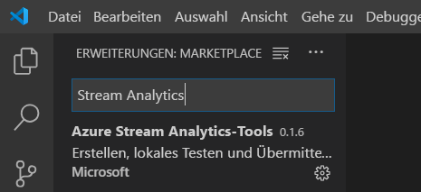

## <a name="activate-the-azure-stream-analytics-extension"></a>Aktivieren der Azure Stream Analytics-Erweiterung

1. Wählen Sie das **Azure**-Symbol auf der Aktivitätsleiste von VS Code aus. **Stream Analytics** wird in der Seitenleiste angezeigt. Wählen Sie unter **Stream Analytics** **Bei Azure anmelden** aus. 

   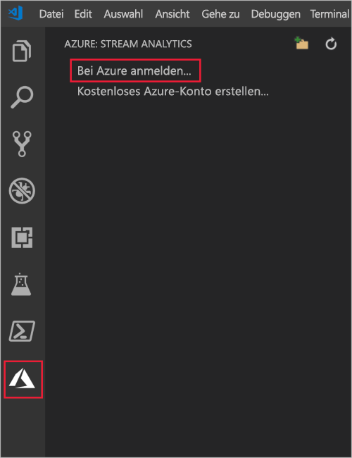

2. Wenn Sie angemeldet sind, wird der Name Ihres Azure-Kontos auf der Statusleiste in der linken unteren Ecke des VS Code-Fensters angezeigt.

> [!NOTE]
> Die Azure Stream Analytics-Tools führen die Anmeldung beim nächsten Mal automatisch durch, wenn Sie sich nicht abmelden. Wenn Ihr Konto über zweistufige Authentifizierung verfügt, empfehlen wir anstelle einer PIN die Verwendung der Telefonauthentifizierung.
> Wenn beim Auflisten von Ressourcen Probleme auftreten, lässt sich das meistens durch Abmelden und erneutes Anmelden beheben. Geben Sie zum Abmelden den Befehl `Azure: Sign Out` ein.

## <a name="prepare-the-input-data"></a>Vorbereiten der Eingabedaten

Vor dem Definieren des Stream Analytics-Auftrags sollten Sie die Daten vorbereiten, die später als Auftragseingabe konfiguriert werden. Führen Sie die folgenden Schritte aus, um die für den Auftrag erforderlichen Eingabedaten vorzubereiten:

1. Melden Sie sich beim [Azure-Portal](https://portal.azure.com/) an.

2. Wählen Sie **Ressource erstellen** > **Internet der Dinge (IoT)**  > **IoT Hub** aus.

3. Geben Sie im Bereich **IoT Hub** die folgenden Informationen ein:
   
   |**Einstellung**  |**Empfohlener Wert**  |**Beschreibung**  |
   |---------|---------|---------|
   |Subscription  | \<Ihr Abonnement\> |  Wählen Sie das gewünschte Azure-Abonnement aus. |
   |Resource group   |   asaquickstart-resourcegroup  |   Wählen Sie **Neu erstellen** aus, und geben Sie einen neuen Ressourcengruppennamen für Ihr Konto ein. |
   |Region  |  \<Die Region, die Ihren Benutzern am nächsten liegt\> | Wählen Sie einen geografischen Standort aus, an dem Sie Ihre IoT Hub-Instanz hosten können. Verwenden Sie den Standort, der Ihren Benutzern am nächsten ist. |
   |IoT Hub-Name  | MyASAIoTHub  |   Wählen Sie einen Namen für Ihre IoT Hub-Instanz aus.   |

   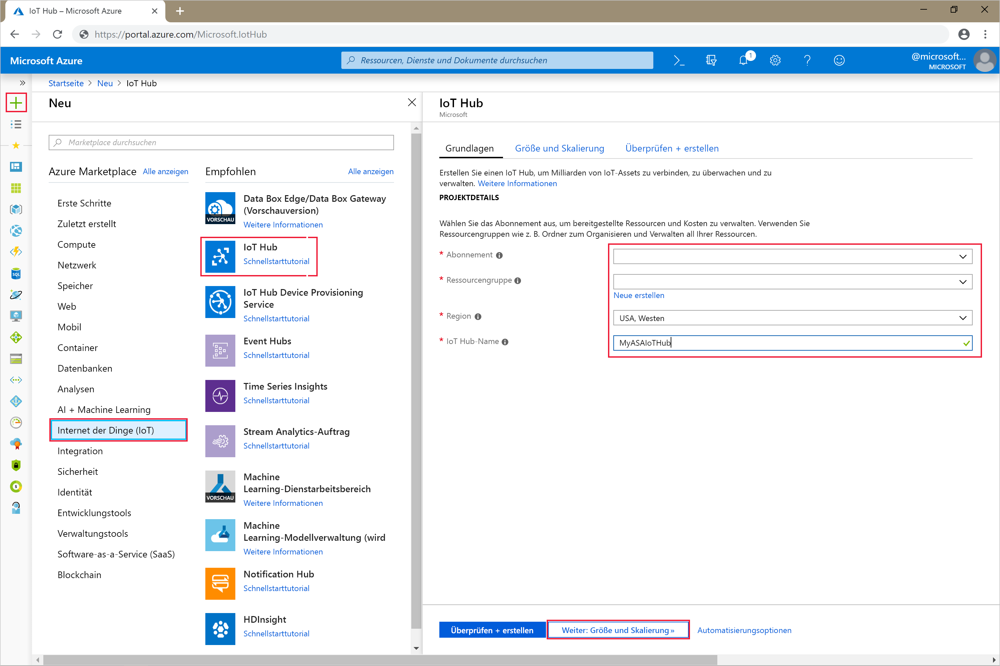

4. Klicken Sie auf **Weiter: Set size and scale** (Größe und Skalierung festlegen).

5. Wählen Sie eine Option für **Tarif und Skalierung** aus. Legen Sie für diese Schnellstartanleitung den Tarif **F1 – Free** fest, wenn er für Ihr Abonnement noch verfügbar ist. Falls der Tarif „Free“ nicht verfügbar ist, sollten Sie den niedrigsten verfügbaren Tarif wählen. Weitere Informationen finden Sie unter [IoT Hub – Preise](https://azure.microsoft.com/pricing/details/iot-hub/).

   

6. Klicken Sie auf **Überprüfen + erstellen**. Überprüfen Sie die Informationen zu IoT Hub, und klicken Sie auf **Erstellen**. Die Erstellung der IoT Hub-Instanz kann mehrere Minuten dauern. Sie können den Fortschritt im Bereich **Benachrichtigungen** überwachen.

7. Klicken Sie in Ihrem IoT Hub-Navigationsmenü unter **IoT-Geräte** auf **Hinzufügen**. Fügen Sie eine **Geräte-ID** hinzu, und klicken Sie auf **Speichern**.

   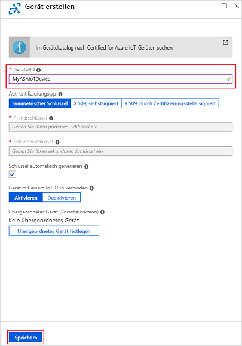

8. Öffnen Sie das Gerät nach der Erstellung in der Liste **IoT-Geräte**. Kopieren Sie **Verbindungszeichenfolge – Primärschlüssel** zur späteren Verwendung in einen Editor.

   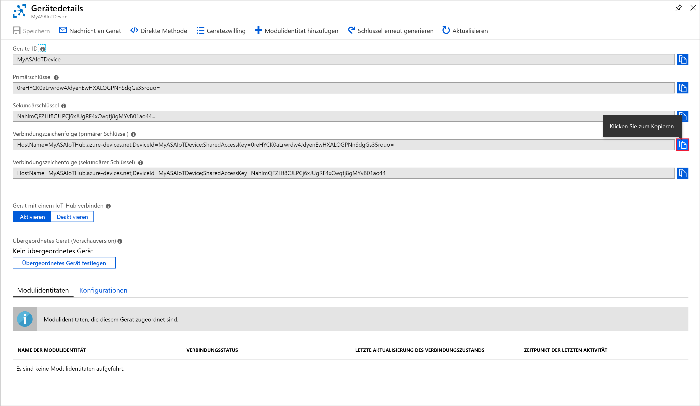

## <a name="create-blob-storage"></a>Erstellen eines Blobspeichers

1. Klicken Sie in der linken oberen Ecke des Azure-Portals auf **Ressource erstellen** > **Speicher** > **Speicherkonto**.

2. Geben Sie im Bereich **Speicherkonto erstellen** einen Speicherkontonamen, den Standort und die Ressourcengruppe ein. Wählen Sie den gleichen Standort und die gleiche Ressourcengruppe wie für die von Ihnen erstellte IoT Hub-Instanz. Klicken Sie dann zum Erstellen des Kontos auf **Überprüfen + erstellen**.

   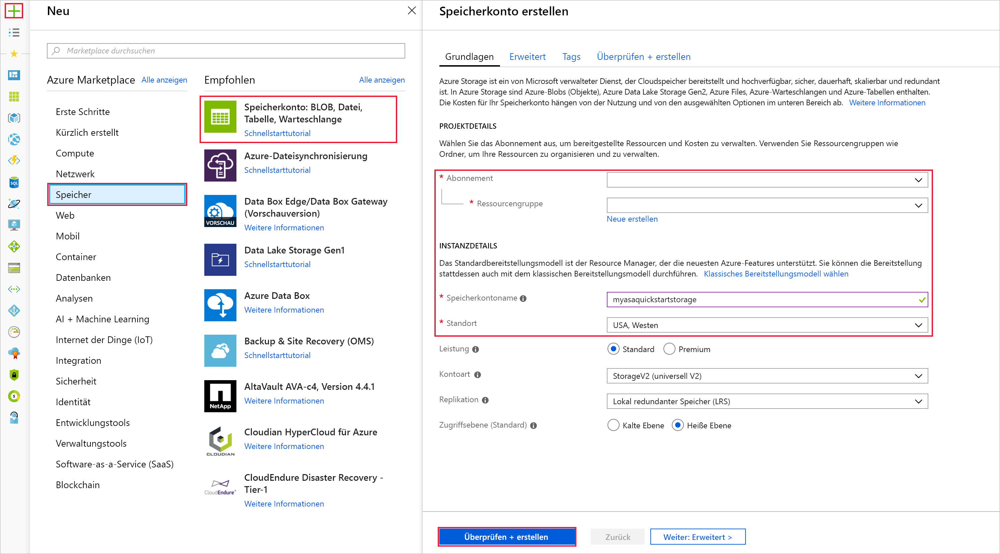

3. Wählen Sie nach der Erstellung des Speicherkontos im Bereich **Übersicht** die Kachel**Blobs** aus.

   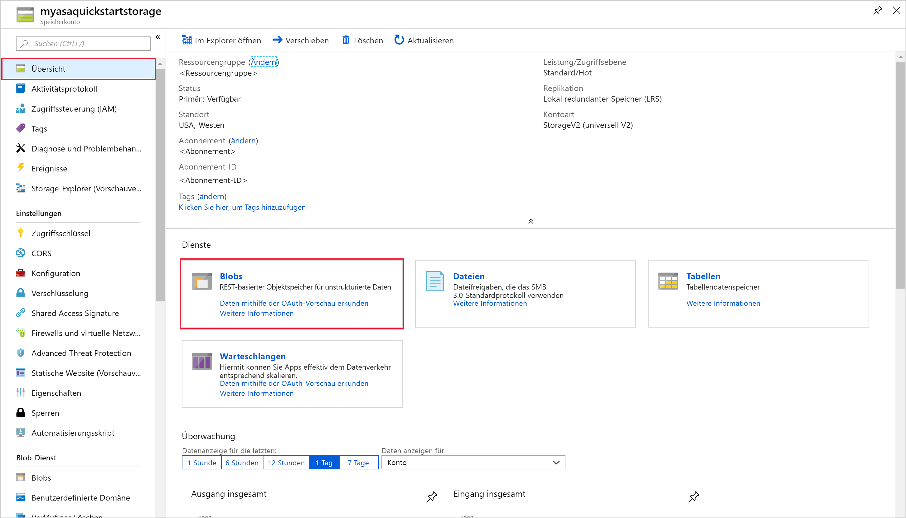

4. Wählen Sie auf der Seite **Blob-Dienst** die Option **Container** aus, und geben Sie einen Namen für Ihren Container (etwa *container1*) ein. Übernehmen Sie für **Öffentliche Zugriffsebene** die Option **Private (no anonymous access)** (Privat (kein anonymer Zugriff)), und wählen Sie **OK** aus.

   

## <a name="create-a-stream-analytics-project"></a>Erstellen eines Stream Analytics-Projekts

1. Drücken Sie in Visual Studio Code **STRG+UMSCHALT+P**, um die Befehlspalette zu öffnen. Geben Sie dann **ASA** ein, und wählen Sie **ASA: Neues Projekt erstellen** aus.

   

2. Geben Sie Ihren Projektnamen, z.B. **myASAproj** ein, und wählen Sie einen Ordner für Ihr Projekt aus.

    

3. Das neue Projekt wird Ihrem Arbeitsbereich hinzugefügt. Ein ASA-Projekt besteht aus dem Abfrageskript **(*.asaql)** , einer **JobConfig.json**-Datei und einer **asaproj.json**-Konfigurationsdatei.

   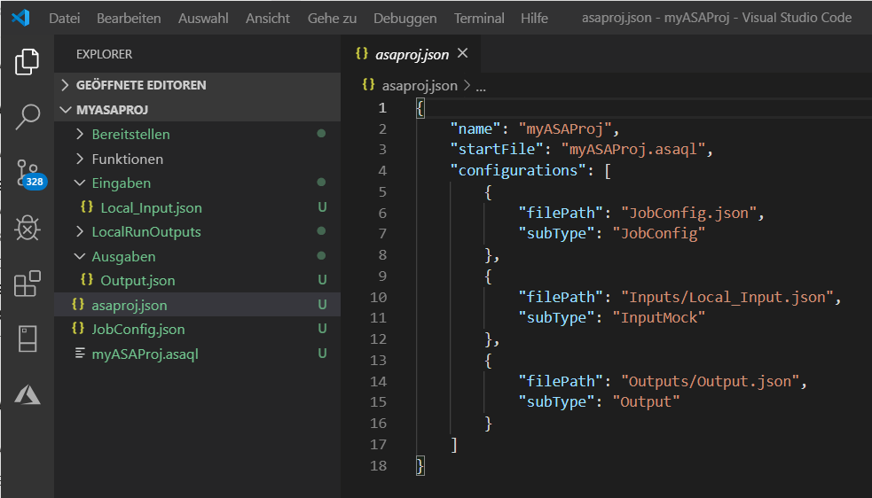

4. Die **asaproj.json**-Konfigurationsdatei enthält die Eingaben, Ausgaben und Auftragskonfigurationsdatei-Informationen, die für die Übermittlung des Stream Analytics-Auftrags an Azure erforderlich sind.

   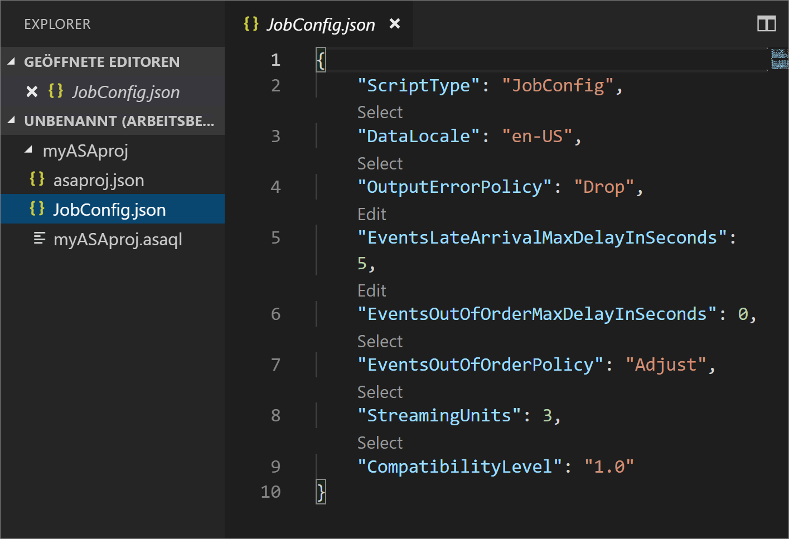

> [!Note]
> Beim Hinzufügen von Eingaben und Ausgaben aus der Befehlspalette werden die entsprechenden Pfade automatisch zu **asaproj.json** hinzugefügt. Wenn Sie Eingaben oder Ausgaben direkt auf einem Datenträger hinzufügen oder entfernen, müssen Sie sie manuell zu **asaproj.json** hinzufügen bzw. aus ihr entfernen. Sie können sich auch entscheiden, die Eingaben und Ausgaben an einem Ort zu versammeln und dann in verschiedenen Aufträgen auf sie verweisen, indem Sie in jeder **asaproj.json** die Pfade angeben.

## <a name="define-the-transformation-query"></a>Definieren der Transformationsabfrage

1. Öffnen Sie **myASAproj.asaql** aus Ihrem Projektordner.

2. Fügen Sie die folgende Abfrage hinzu:

   ```sql
   SELECT * 
   INTO Output
   FROM Input
   HAVING Temperature > 27
   ```
## <a name="test-with-sample-data"></a>Test mit Beispieldaten
Vor dem Ausführen der Abfrage in der Cloud können Sie die Abfrage mit lokalen Beispieldaten testen, um die Abfragelogik zu prüfen.

Befolgen Sie die Anweisungen in [Test mit Beispieldaten](vscode-local-run.md), um weitere Einzelheiten zu erhalten. 

 

## <a name="define-an-input"></a>Definieren einer Eingabe

1. Wählen Sie **STRG+UMSCHALT+P** aus, und die Befehlspalette zu öffnen, und geben Sie **ASA: Eingabe hinzufügen** ein.

   

2. Wählen Sie als Eingabetyp **IoT Hub** aus.

   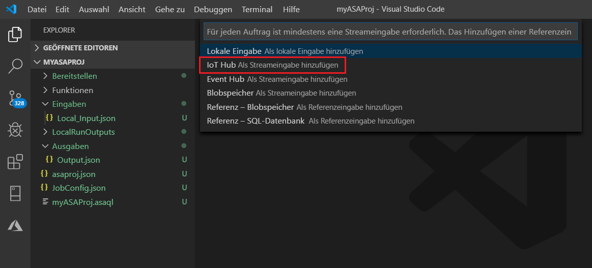

3. Wählen Sie das ASA-Abfrageskript aus, das die Eingabe verwenden soll. Es sollte automatisch mit dem Dateipfad zu **myASAproj.asaql** aufgefüllt werden.

   

4. Geben Sie als Namen der Eingabedatei **IotHub** ein.

5. Bearbeiten Sie **IoTHub.json** mit den folgenden Werten. Behalten Sie die Standardwerte für Felder bei, die unten nicht aufgeführt sind. Sie können CodeLens verwenden, um sich bei der Eingabe einer Zeichenfolge, der Auswahl aus einer Dropdownliste oder der direkten Änderungen von Text in der Datei unterstützen zu lassen.

   |Einstellung|Empfohlener Wert|BESCHREIBUNG|
   |-------|---------------|-----------|
   |NAME|Eingabe|Geben Sie einen Namen zur Identifizierung der Auftragseingabe ein.|
   |IotHubNamespace|MyASAIoTHub|Wählen Sie den Namen Ihrer IoT Hub-Instanz aus, oder geben Sie ihn ein. IoT Hub-Namen werden automatisch erkannt, wenn sie unter demselben Abonnement erstellt werden.|
   |SharedAccessPolicyName|iothubowner| |

   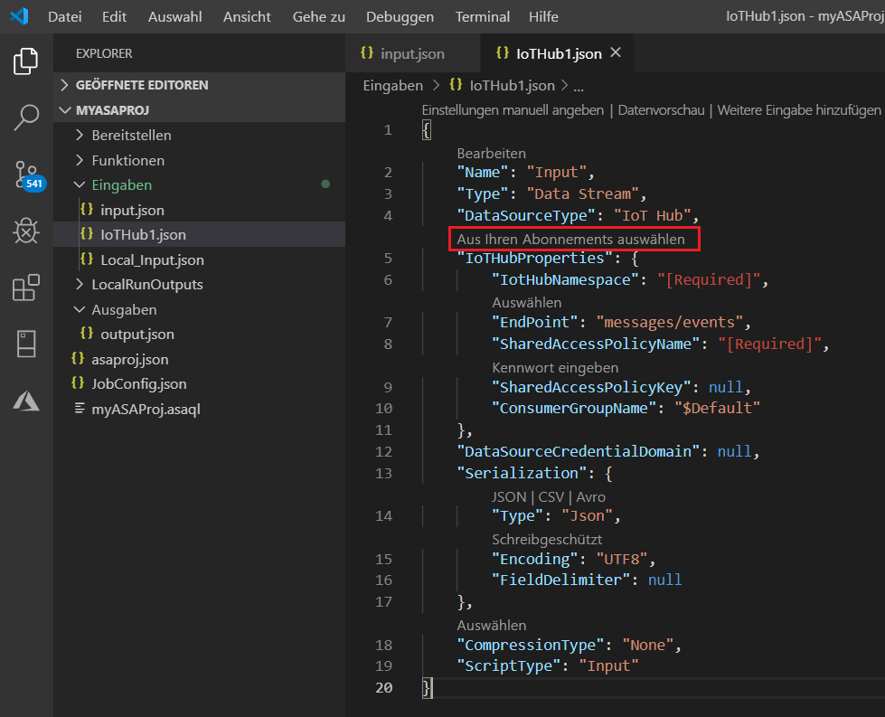


## <a name="define-an-output"></a>Definieren einer Ausgabe

1. Wählen Sie **STRG+UMSCHALT+P** aus, um die Befehlspalette zu öffnen. Geben Sie dann **ASA: Ausgabe hinzufügen** ein.

   

2. Wählen Sie als Senkentyp **Blob Storage** aus.

3. Wählen Sie das ASA-Abfrageskript aus, das diese Eingabe verwenden soll.

4. Geben Sie als Namen der Ausgabedatei **BlobStorage** ein.

5. Bearbeiten Sie **BlobStorage** mit den folgenden Werten. Behalten Sie die Standardwerte für Felder bei, die unten nicht aufgeführt sind. CodeLens unterstützt Sie beim Auswählen aus einer Dropdownliste oder beim Eingeben einer Zeichenfolge. 

   |Einstellung|Empfohlener Wert|BESCHREIBUNG|
   |-------|---------------|-----------|
   |NAME|Output| Geben Sie einen Namen ein, um die Ausgabe des Auftrags kenntlich zu machen.|
   |Speicherkonto|asaquickstartstorage|Wählen Sie den Namen Ihres Speicherkontos aus, oder geben Sie ihn ein. Speicherkontonamen werden automatisch erkannt, wenn sie im gleichen Abonnement erstellt werden.|
   |Container|container1|Wählen Sie den vorhandenen Container aus, den Sie in Ihrem Speicherkonto erstellt haben.|
   |Pfadmuster|output|Geben Sie den Namen eines Dateipfads ein, der innerhalb des Containers erstellt werden soll.|

 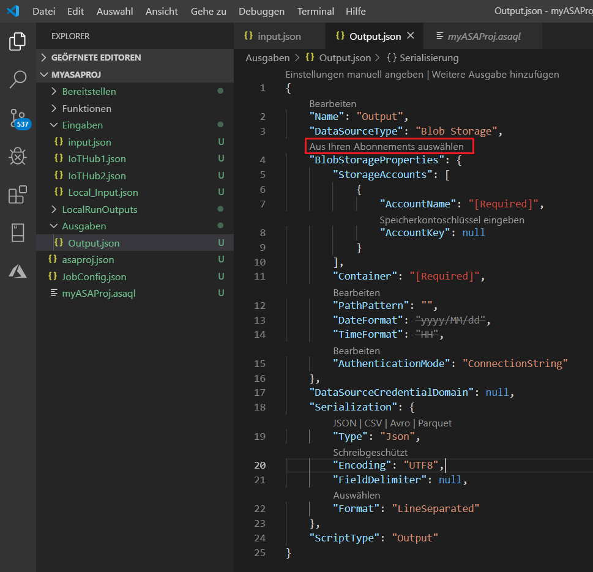

## <a name="compile-the-script"></a>Kompilieren des Skripts

Die Skriptkompilierung führt zwei Aktionen aus: Sie überprüft die Syntax und generiert die Azure Resource Manager-Vorlagen für die automatische Bereitstellung.

Es gibt zwei Möglichkeiten, die Skriptkompilierung auszulösen:

1. Wählen Sie das Skript im Arbeitsbereich aus, und lösen Sie dann in der Befehlspalette die Kompilierung aus. 

   

2. Klicken Sie mit der rechten Maustaste auf das Skript, und wählen Sie **ASA: Skript kompilieren** aus.

    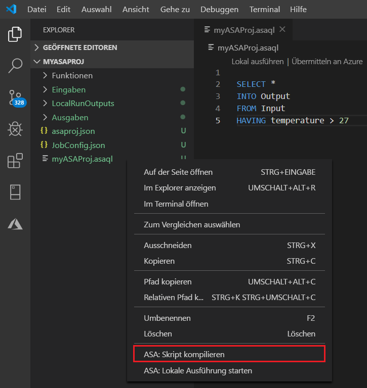

3. Nach der Kompilierung finden Sie die zwei generierten Azure Resource Manager-Vorlagen im Ordner **Deploy** (Bereitstellen) Ihres Projekts. Diese zwei Dateien werden für die automatische Bereitstellung verwendet.

    

## <a name="submit-a-stream-analytics-job-to-azure"></a>Übermitteln eines Stream Analytics-Auftrags an Azure

1. Wählen Sie im Skript-Editorfenster von Visual Studio Code **Select from your subscriptions** (Aus Ihren Abonnements auswählen) aus.

   

2. Wählen Sie in der Popupliste Ihr Abonnement aus.

3. Wählen Sie einen Auftrag aus**. Wählen Sie dann „Neuen Auftrag erstellen“ aus.

4. Geben Sie den Namen Ihres Auftrags **myASAjob** ein, und befolgen Sie dann die Anweisungen, um die Ressourcengruppe und den Speicherort auszuwählen.

5. Wählen Sie **An Azure übermitteln** aus. Die Protokolle finden Sie im Ausgabefenster. 

6. Wenn der Auftrag erstellt wurde, wird er im **Stream Analytics-Explorer** angezeigt.


## <a name="run-the-iot-simulator"></a>Ausführen des IoT-Simulators

1. Öffnen Sie den [Raspberry Pi Azure IoT Online Simulator](https://azure-samples.github.io/raspberry-pi-web-simulator/) über eine neue Browserregisterkarte oder ein neues Fenster.

2. Ersetzen Sie den Platzhalter in Zeile 15 durch die zuvor gespeicherte Verbindungszeichenfolge für das Azure IoT Hub-Gerät.

3. Klicken Sie auf **Ausführen**. In der Ausgabe sollten nun die Sensordaten und -nachrichten angezeigt werden, die an Ihre IoT Hub-Instanz gesendet werden.

   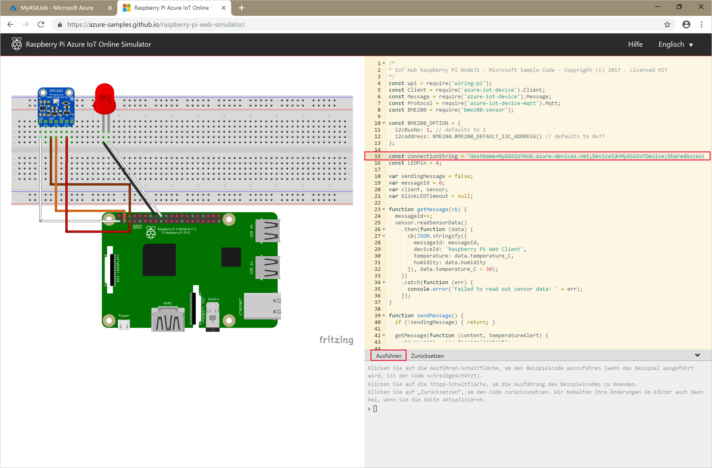

## <a name="start-the-stream-analytics-job-and-check-output"></a>Starten des Stream Analytics-Auftrags und Überprüfen der Ausgabe

1. Öffnen Sie den **Stream Analytics-Explorer** in Visual Studio Code, und suchen Sie Ihren Auftrag **myASAJob**.

2. Klicken Sie mit der rechten Maustaste auf den Namen des Auftrags. Wählen Sie dann im Kontextmenü **Start** aus.

   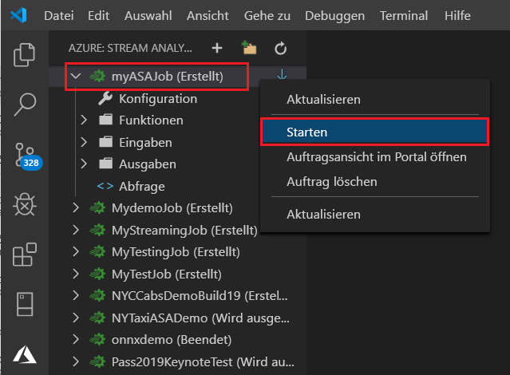

3. Wählen Sie im Popupfenster **Jetzt** aus, um den Auftrag zu starten.

4. Beachten Sie, dass sich der Auftragsstatus in **Wird ausgeführt** geändert hat. Klicken Sie mit der rechten Maustaste auf den Namen des Auftrags, und wählen Sie **Auftragsansicht im Portal öffnen** aus, um die Eingabe- und Ausgabeereignismetriken anzuzeigen. Diese Aktion kann einige Minuten dauern.

5. Um die Ergebnisse anzuzeigen, öffnen Sie den Blobspeicher in der Visual Studio Code-Erweiterung oder im Azure-Portal.

## <a name="clean-up-resources"></a>Bereinigen von Ressourcen

Löschen Sie die Ressourcengruppe, den Streamingauftrag und alle dazugehörigen Ressourcen, wenn Sie sie nicht mehr benötigen. Durch das Löschen des Auftrags verhindern Sie, dass Kosten für die vom Auftrag verbrauchten Streamingeinheiten anfallen. Wenn Sie den Auftrag in Zukunft verwenden möchten, können Sie ihn beenden und später bei Bedarf neu starten. Wenn Sie diesen Auftrag nicht weiter verwenden möchten, löschen Sie alle von diesem Schnellstart erstellten Ressourcen. Führen Sie dazu folgende Schritte aus:

1. Klicken Sie im Azure-Portal im Menü auf der linken Seite auf **Ressourcengruppen** und dann auf den Namen der erstellten Ressource.  

2. Klicken Sie auf der Seite mit Ihrer Ressourcengruppe auf **Löschen**, geben Sie im Textfeld den Namen der zu löschenden Ressource ein, und klicken Sie dann auf **Löschen**.

## <a name="next-steps"></a>Nächste Schritte

In dieser Schnellstartanleitung haben Sie einen einfachen Stream Analytics-Auftrag mit Visual Studio Code bereitgestellt. Sie können Stream Analytics-Aufträge auch mithilfe von [Azure-Portal](stream-analytics-quick-create-portal.md), [PowerShell](stream-analytics-quick-create-powershell.md) und Visual Studio (stream-analytics-quick-create-vs.md) bereitstellen. 

Informationen zu den Azure Stream Analytics-Tools für Visual Studio finden Sie im folgenden Artikel:

> [!div class="nextstepaction"]
> [Anzeigen von Azure Stream Analytics-Aufträgen mit Visual Studio](stream-analytics-vs-tools.md)
