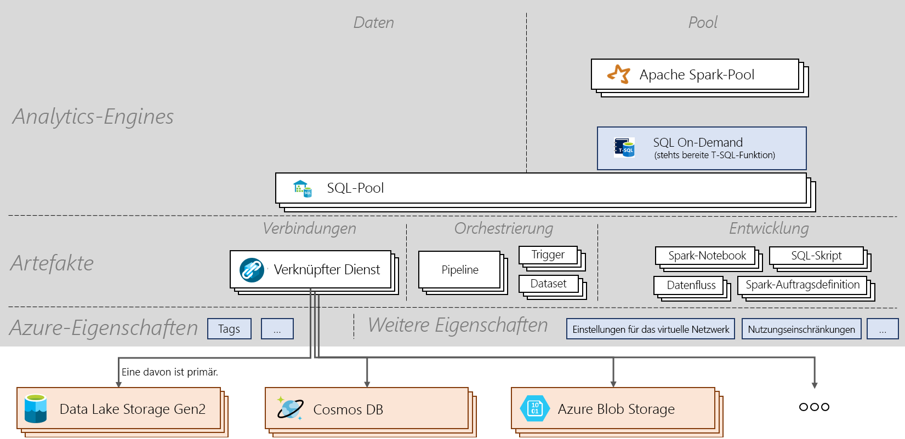

# Cheatsheet für Azure Synapse Analytics

[!INCLUDE [preview](includes/note-preview.md)]

Im Cheatsheet für Azure Synapse Analytics werden Schritt für Schritt die grundlegenden Konzepte des Diensts sowie wichtige Befehle erläutert. Dieser Artikel ist hilfreich für Neueinsteiger sowie für Benutzer, die sich für eine Zusammenfassung der wichtigsten Azure Synapse-Themen interessieren.

## Architektur

> [!div class="mx-imgBorder"]
>

## Konzepte
| Substantive und Verben                         | Funktionsbeschreibung       |
|:---                                 |:---                 |
| **Synapse-Arbeitsbereich (Vorschauversion)** | Eine sicherungsfähige Zusammenarbeitsgrenze für cloudbasierte Unternehmensanalysen in Azure. Ein Arbeitsbereich wird in einer bestimmten Region bereitgestellt und verfügt über ein zugeordnetes ADLS Gen2-Konto und Dateisystem (zum Speichern temporärer Daten). Ein Arbeitsbereich befindet sich unter einer Ressourcengruppe. |
| **Azure SQL-Analyse**   | Ermöglicht das Ausführen von Analysen mit Pools oder On-Demand-Funktionen.  |
| **SQL-Pool**   | In einem Arbeitsbereich können null bis n bereitgestellte SQL-Ressourcen mit entsprechenden Datenbanken bereitgestellt werden. Jeder SQL-Pool verfügt über eine zugeordnete Datenbank. Ein SQL-Pool kann manuell oder automatisch skaliert, angehalten und fortgesetzt werden. Ein SQL-Pool kann zwischen 100 DWU und 30.000 DWU skaliert werden.       |
| **SQL On-Demand (Vorschauversion)**   | Verteiltes, für große Datenmengen konzipiertes Datenverarbeitungssystem, mit dem Sie T-SQL-Abfragen für Daten in einem Data Lake ausführen können. Da es sich hierbei um ein serverloses System handelt, muss keine Infrastruktur verwaltet werden.       |
|**Apache Spark** | In einem Spark-Pool verwendete Spark-Runtime. Die aktuell unterstützte Version ist Spark 2.4 mit Python 3.6.1, Scala 2.11.12, .NET-Unterstützung für Apache Spark 0.5 und Delta Lake 0.3.  | 
| **Apache Spark-Pool (Vorschauversion)**  | In einem Arbeitsbereich können null bis n bereitgestellte Spark-Ressourcen mit entsprechenden Datenbanken bereitgestellt werden. Ein Spark-Pool kann automatisch angehalten, fortgesetzt und skaliert werden.  |
| **Spark-Anwendung**  |   Besteht aus einem Treiberprozess und einem Satz von Executorprozessen. Eine Spark-Anwendung wird in einem Spark-Pool ausgeführt.            |
| **Spark-Sitzung**  |   Einheitlicher Einstiegspunkt einer Spark-Anwendung. Ermöglicht die Interaktion mit den verschiedenen Funktionen von Spark sowie mit einer kleineren Anzahl von Konstrukten. Zum Ausführen eines Notebooks muss eine Sitzung erstellt werden. Eine Sitzung kann so konfiguriert werden, dass sie in einer bestimmten Anzahl von Executors mit einer bestimmten Größe ausgeführt wird. Eine Notebooksitzung ist standardmäßig für die Ausführung in zwei Executors mittlerer Größe konfiguriert. |
| **SQL-Anforderung**  |   Ein Vorgang – beispielsweise eine Abfrage, die über einen SQL-Pool oder über SQL On-Demand ausgeführt wird. |
|**Datenintegration**| Ermöglicht das Erfassen von Daten zwischen verschiedenen Quellen sowie das Orchestrieren von Aktivitäten, die innerhalb oder außerhalb eines Arbeitsbereichs ausgeführt werden.| 
|**Artefakte**| Konzept, das alle Objekte umfasst, die ein Benutzer zum Verwalten von Datenquellen bzw. zum Entwickeln, Orchestrieren und Visualisieren benötigt.|
|**Notebook**| Interaktive und reaktive Data Science- und Datentechnik-Schnittstelle mit Unterstützung von Scala, PySpark, C# und SparkSQL. |
|**Spark-Auftragsdefinition**|Schnittstelle zum Übermitteln eines Spark-Auftrags mithilfe einer Assembly-JAR-Datei, die den Code und die zugehörigen Abhängigkeiten enthält.|
|**Datenfluss**|  Vollständig visuelle Darstellung für Big Data-Transformationen ohne Programmieraufwand. Die gesamte Optimierung und Ausführung erfolgt serverlos. |
|**SQL-Skript**| Gruppe von gespeicherten SQL-Befehlen in einer Datei. Ein SQL-Skript kann eine oder mehrere SQL-Anweisungen enthalten. Es kann verwendet werden, um SQL-Anforderungen per SQL-Pool oder SQL On-Demand auszuführen.|
|**Pipeline**| Logische Gruppierung von Aktivitäten, die gemeinsam eine Aufgabe ausführen.|
|**Aktivität**| Definiert Aktionen, die für Daten ausgeführt werden sollen (beispielsweise Kopieren von Daten oder Ausführen eines Notebooks oder SQL-Skripts).|
|**Trigger**| Dient zum Ausführen einer Pipeline. Sie kann manuell oder automatisch ausgeführt werden (zeitplanbasiert, rollierendes Fenster oder ereignisbasiert).|
|**Verknüpfter Dienst**| Verbindungszeichenfolgen, mit denen die Verbindungsinformationen definiert werden, die erforderlich sind, damit vom Arbeitsbereich eine Verbindung mit externen Ressourcen hergestellt werden kann.|
|**Dataset**|  Benannte Ansicht von Daten, die einfach auf die Daten verweist, die in einer Aktivität als Ein- und Ausgabe verwendet werden sollen. Gehört zu einem verknüpften Dienst.|

## Nächste Schritte

- [Erstellen eines Arbeitsbereichs](quickstart-create-workspace.md)
- [Verwenden von Synapse Studio](quickstart-synapse-studio.md)
- [Erstellen eines SQL-Pools](quickstart-create-sql-pool.md)
- [Verwenden von SQL On-Demand](quickstart-sql-on-demand.md)
- [Erstellen eines Apache Spark-Pools](quickstart-create-apache-spark-pool.md)

