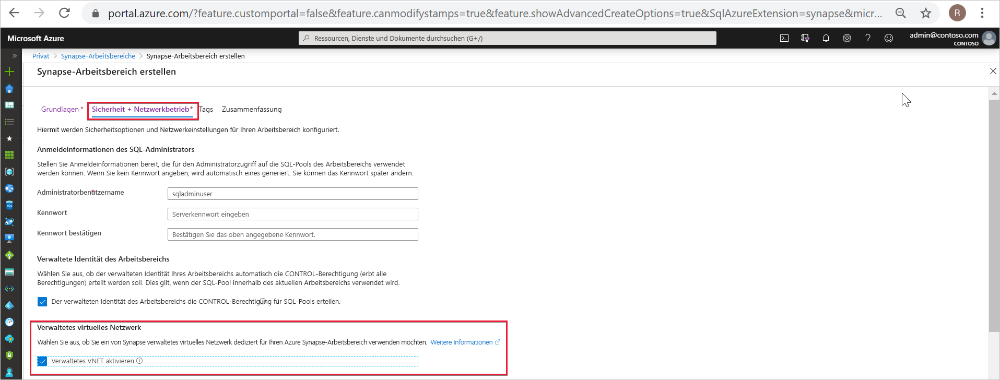
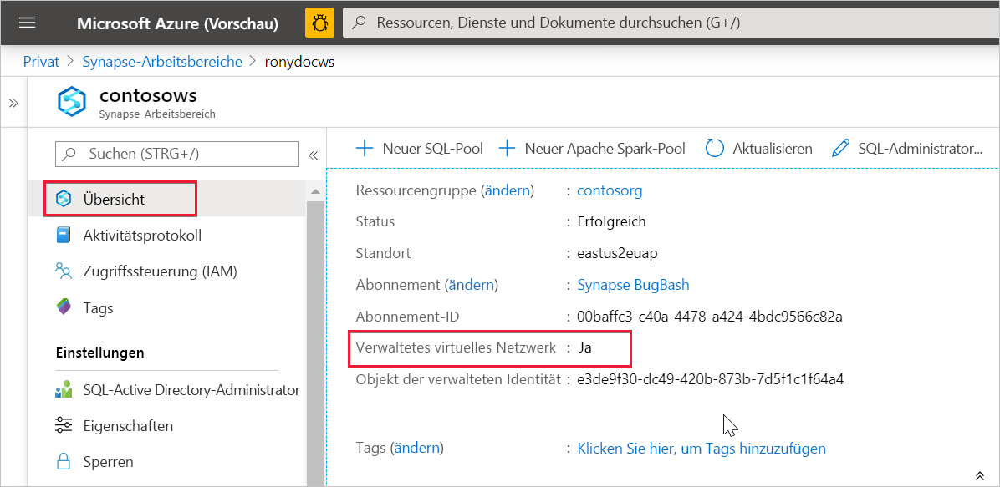

# Azure Synapse Analytics: verwaltetes virtuelles Netzwerk (Vorschauversion)

Dieser Artikel enthält Informationen zum verwalteten virtuellen Netzwerk in Azure Synapse Analytics.

## Verwaltetes Arbeitsbereichs-VNET

Bei der Erstellung Ihres Azure Synapse-Arbeitsbereichs können Sie ihn mit einem virtuellen Netzwerk (VNET) verknüpfen. Das mit Ihrem Arbeitsbereich verknüpfte VNET wird von Azure Synapse verwaltet. Dieses VNET wird als *Verwaltetes Arbeitsbereichs-VNET* bezeichnet.

Das verwaltete Arbeitsbereichs-VNET hat vier Vorteile:

- Mit einem verwalteten Arbeitsbereichs-VNET können Sie die VNET-Verwaltung an Azure Synapse auslagern.
- Sie müssen keine NSG-Eingangsregeln für Ihre eigenen VNETs konfigurieren, um eingehenden Azure Synapse-Verwaltungsdatenverkehr für Ihr VNET zuzulassen. Sind diese NSG-Regeln nicht korrekt konfiguriert, kommt es zu Dienstunterbrechungen für Kunden.
- Sie müssen für Lastspitzen kein Subnetz für Ihre Spark-Cluster erstellen.
- Das verwaltete Arbeitsbereichs-VNET schützt zusammen mit verwalteten privaten Endpunkten vor Datenexfiltration. In einem Arbeitsbereich, der mit einem verwalteten Arbeitsbereichs-VNET verknüpft ist, können nur verwaltete private Endpunkte erstellt werden.

Durch die Erstellung eines Arbeitsbereichs mit verknüpftem verwaltetem Arbeitsbereichs-VNET wird sichergestellt, dass der Arbeitsbereich im Netzwerk von anderen Arbeitsbereichen isoliert ist. Azure Synapse bietet in einem Arbeitsbereich verschiedene Analysefunktionen: Datenintegration, Apache Spark, SQL-Pool und SQL On-Demand.

Wenn Ihr Arbeitsbereich über ein verwaltetes Arbeitsbereichs-VNET verfügt, werden Datenintegrations- und Spark-Ressourcen darin bereitgestellt. Ein verwaltetes Arbeitsbereichs-VNET bietet für Spark-Aktivitäten auch eine Isolation auf Benutzerebene, da sich jeder Spark-Cluster in einem eigenen Subnetz befindet.

SQL-Pool und SQL On-Demand sind mehrinstanzenfähig und befinden sich daher außerhalb des verwalteten Arbeitsbereichs-VNET. Für die arbeitsbereichsinterne Kommunikation mit SQL-Pool und SQL On-Demand werden private Azure-Links verwendet. Diese privaten Links werden automatisch erstellt, wenn Sie einen Arbeitsbereich mit einem verknüpften verwalteten Arbeitsbereichs-VNET erstellen.

>[!IMPORTANT]
>Nachdem der Arbeitsbereich erstellt wurde, kann diese Arbeitsbereichskonfiguration nicht mehr geändert werden. So ist es beispielsweise nicht möglich, die Konfiguration eines Arbeitsbereichs, der mit keinem verwalteten Arbeitsbereichs-VNET verknüpft ist, zu ändern und ihn mit einem VNET zu verknüpfen. Analog dazu ist es nicht möglich, einen Arbeitsbereich mit verknüpftem verwalteten Arbeitsbereichs-VNET neu zu konfigurieren, um die Verknüpfung mit dem VNET aufzuheben.

## Erstellen eines Azure Synapse-Arbeitsbereichs mit einem verwalteten Arbeitsbereichs-VNET

Wenn Sie einen Azure Synapse-Arbeitsbereich mit verknüpftem verwaltetem Arbeitsbereichs-VNET erstellen möchten, wählen Sie im Azure-Portal die Registerkarte **Sicherheit + Netzwerkbetrieb** aus, und aktivieren Sie das Kontrollkästchen **Verwaltetes VNET aktivieren**.

Ist das Kontrollkästchen deaktiviert, wird Ihr Arbeitsbereich nicht mit einem VNET verknüpft.

>[!IMPORTANT]
>In einem Arbeitsbereich mit verwaltetem Arbeitsbereichs-VNET können nur private Links verwendet werden.

>[!NOTE]
>Der gesamte ausgehende Datenverkehr aus dem verwalteten Arbeitsbereichs-VNET wird in Zukunft blockiert. Es empfiehlt sich, Verbindungen mit allen Ihren Datenquellen unter Verwendung von verwalteten privaten Endpunkten herzustellen.

Wenn Sie überprüfen möchten, ob Ihr Azure Synapse-Arbeitsbereich mit einem verwalteten Arbeitsbereichs-VNET verknüpft ist, wählen Sie im Azure-Portal die Option **Übersicht** aus.

## Nächste Schritte

Erstellen Sie einen [Azure Synapse-Arbeitsbereich](../quickstart-create-workspace.md).

Informieren Sie sich ausführlicher über [verwaltete private Endpunkte](./synapse-workspace-managed-private-endpoints.md).

[Erstellen Sie verwaltete private Endpunkte für Ihre Datenquellen.](./how-to-create-managed-private-endpoints.md)
