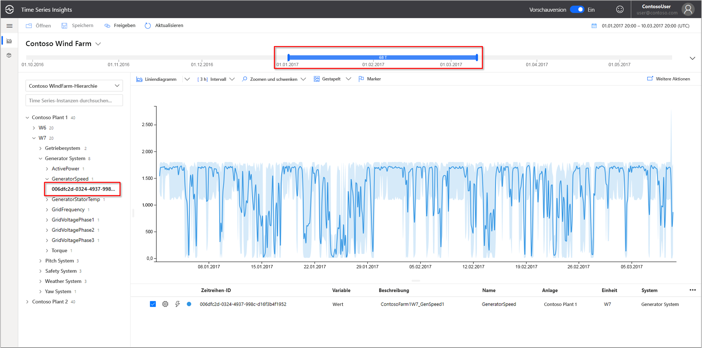
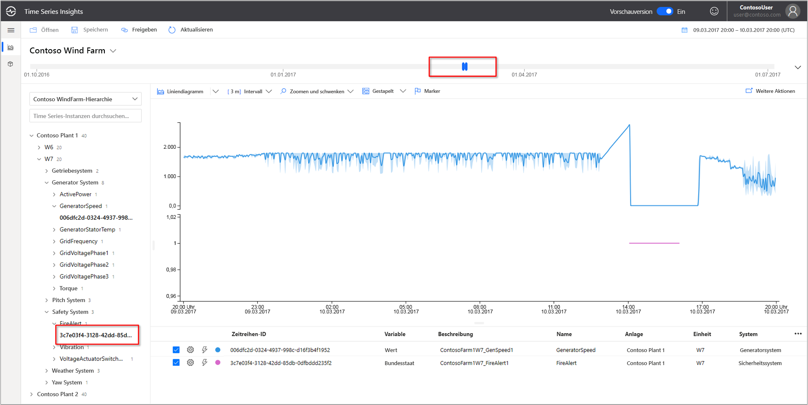
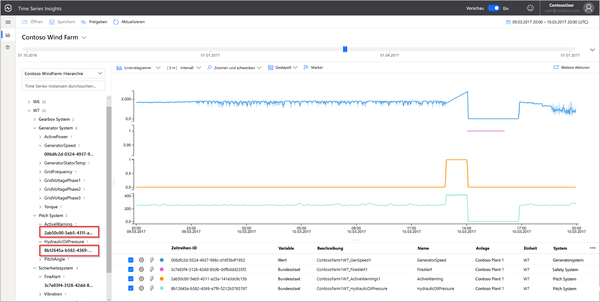
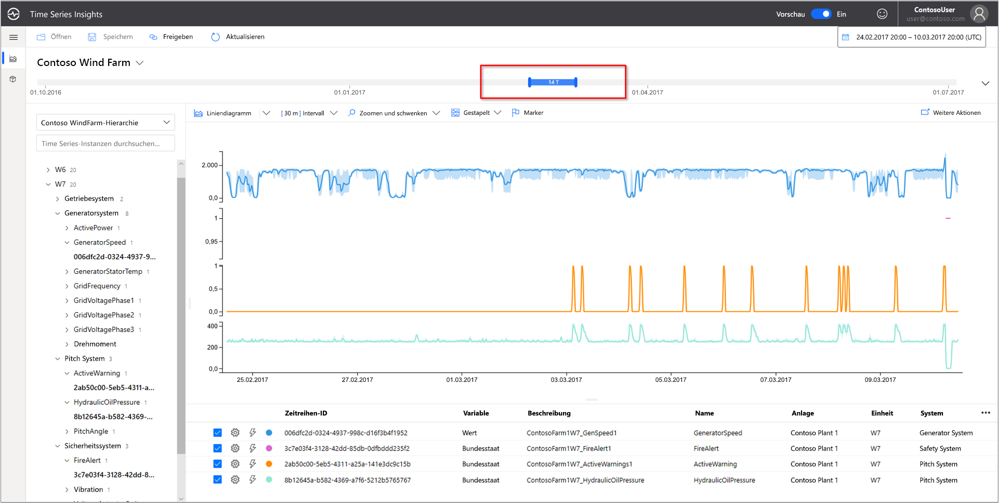
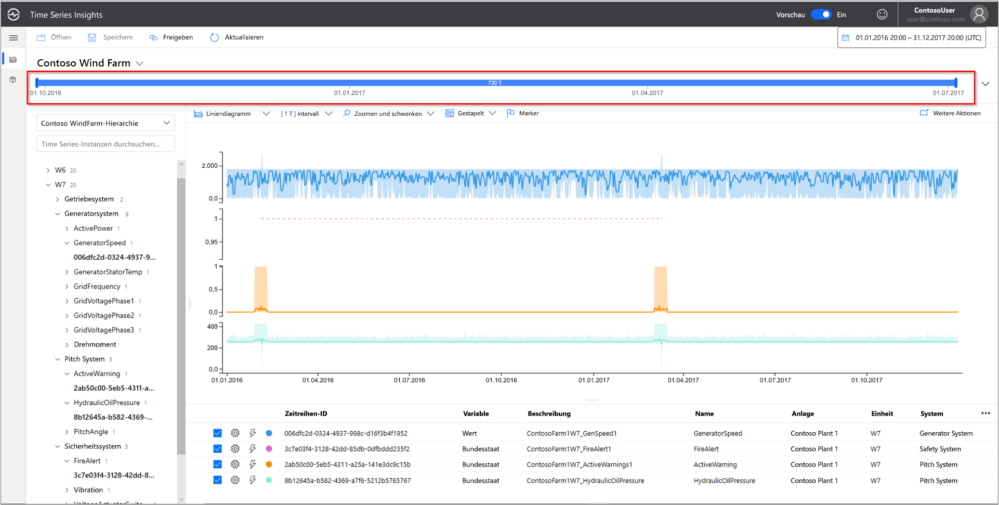
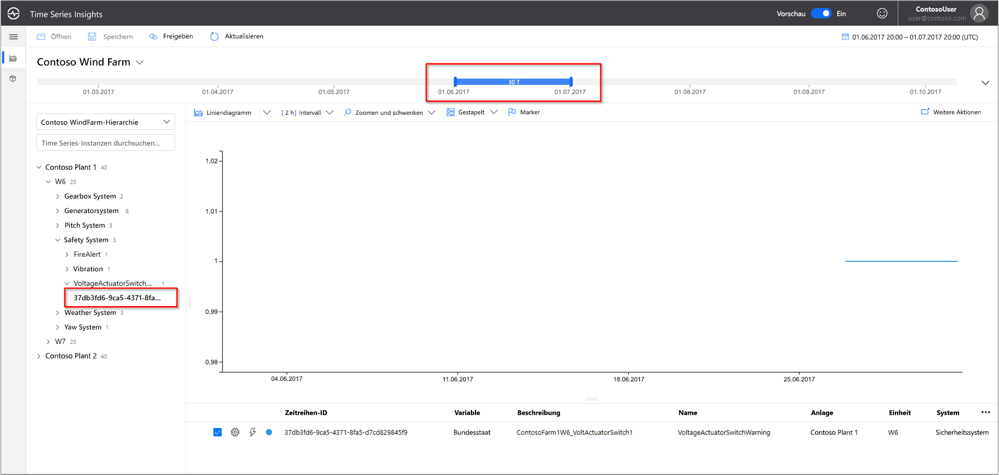
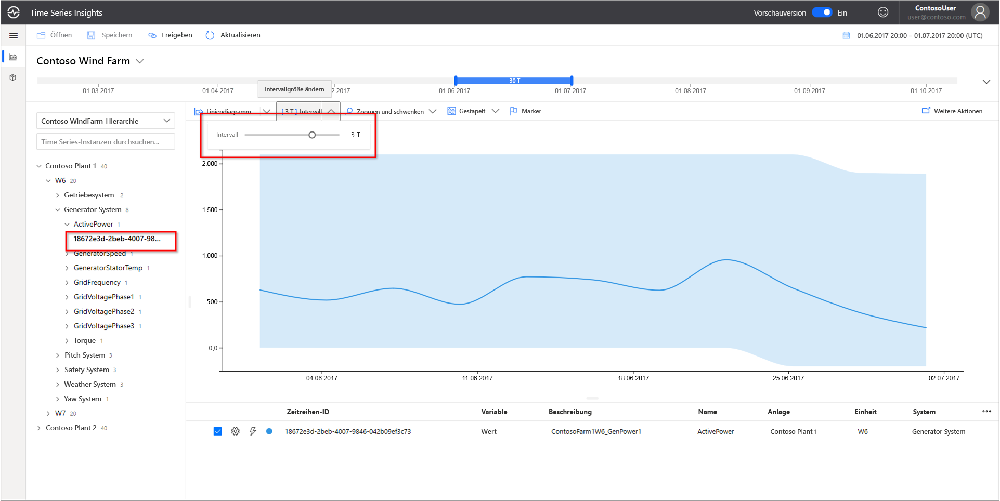
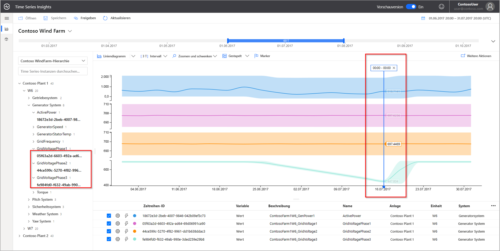

# Schnellstart: Erkunden der Azure Time Series Insights-Demoumgebung (Vorschauversion)

Dieser Schnellstart behandelt die ersten Schritte mit der Azure Time Series Insights-Umgebung (Vorschauversion). In der kostenlosen Demo sehen Sie die wichtigsten Funktionen, die in der Vorschauversion von Time Series Insights hinzugefügt wurden.

Die Demoumgebung der Vorschauversion enthält das Szenariounternehmen Contoso, das zwei Windparks mit jeweils 10 Turbinen betreibt. Jede Turbine verfügt über 20 Sensoren, die jede Minute Daten an Azure IoT Hub melden. Die Sensoren erfassen Informationen zu Witterungsbedingungen, Schaufelteilung und Gierposition sowie Generatorleistung, Getriebeverhalten und Sicherheitsüberwachung und zeichnen diese Daten auf.

In diesem Schnellstart lernen Sie die Verwendung von Time Series Insights kennen, um handlungsrelevante Erkenntnisse aus Contoso-Daten zu gewinnen. Sie führen außerdem eine kurze Ursachenanalyse durch, um kritische Ausfälle besser vorherzusagen und Wartungsarbeiten durchzuführen.

> [!IMPORTANT]
> Erstellen Sie ein  [kostenloses Azure-Konto](https://azure.microsoft.com/free/?ref=microsoft.com&utm_source=microsoft.com&utm_medium=docs&utm_campaign=visualstudio) , sofern nicht bereits geschehen.

## Erkunden des Time Series Insights-Explorers in einer Demoumgebung

Der Time Series Insights-Explorer (Vorschauversion) zeigt Verlaufsdaten und Ursachenanalysen. Erste Schritte:

1. Navigieren Sie zur Demoumgebung  [Contoso Wind Farm](https://insights.timeseries.azure.com/preview/samples).  

1. Melden Sie sich bei Aufforderung mit Ihren Azure-Anmeldeinformationen beim Time Series Insights-Explorer an.

## Arbeiten mit Verlaufsdaten

1. Sehen Sie sich die Windturbine **W7** in **Contoso Plant 1** an.  

   1. Ändern Sie den Anzeigebereich in **1/1/17 20:00:00.00 bis 3/10/17 20:00:00.00 (UTC)** .
   1. Wählen Sie den Sensor **Contoso Plant 1** > **W7** > **Generator System** > **GeneratorSpeed** aus. Überprüfen Sie anschließend die angezeigten Werte.

      

1. Vor Kurzem hat Contoso einen Brand in der Windturbine **W7** erkannt. Die Meinungen bezüglich der Brandursache gehen auseinander. In Time Series Insights ist erkennbar, dass während des Brands der Sensor für den Feueralarm aktiviert wurde.

   1. Ändern Sie den Anzeigebereich in **3/9/17 20:00:00.00 bis 3/10/17 20:00:00.00 (UTC)** .
   1. Wählen Sie den Sensor **Safety System** > **FireAlert** aus.

      

1. Überprüfen Sie andere Ereignisse um den Zeitpunkt des Brandes, um zu verstehen, was passiert ist. Sowohl der Öldruck als auch die aktiven Warnungen stiegen kurz vor dem Brand an.

   1. Wählen Sie **Pitch System** > **HydraulicOilPressure** aus.
   1. Wählen Sie **Pitch System** > **ActiveWarning** aus.

      

1. Die Sensoren für Öldruck und aktive Warnungen stiegen direkt vor dem Brand stark an. Erweitern Sie die angezeigte Zeitreihe, um weitere Anzeichen im Vorfeld des Brandes anzuzeigen. Die Werte für beide Sensoren schwankten im Laufe der Zeit. Die Schwankungen deuten auf ein anhaltendes und besorgniserregendes Muster hin.

    * Ändern Sie den Anzeigebereich in **2/24/17 20:00:00.00 bis 3/10/17 20:00:00.00 (UTC)** .

      

1. Eine Untersuchung der Verlaufsdaten aus zwei Jahren ergibt, dass es schon einmal einen Brand gab, bei dem die gleichen Sensorschwankungen aufgetreten sind.

    * Ändern Sie den Anzeigebereich in **1/1/16 bis 12/31/17** (alle Daten).

      

Mithilfe von Time Series Insights und Sensortelemetriedaten haben wir einen langfristigen Trend erkannt, der sich anhand der Verlaufsdaten zeigt. Mit diesen neuen Erkenntnissen haben wir folgende Möglichkeiten:

* Erklären, was tatsächlich passiert ist
* Beheben des Problems
* Implementieren besserer Warnbenachrichtigungssysteme.

## Analyse der Grundursache

1. Einige Szenarien erfordern eine anspruchsvolle Analyse, um Hinweise in Daten aufzudecken. Wählen Sie Windrad **W6** am **25.6.** aus.

    1. Ändern Sie den Anzeigebereich in **6/1/17 20:00:00.00 bis 7/1/17 20:00:00.00 (UTC)** .
    1. Wählen Sie dann **Contoso Plant 1** > **W6** > **Safety System** > **VoltageActuatorSwitchWarning** aus.

       

1. Mit der Warnung wird auf ein Problem mit der Spannung des Generators hingewiesen. Die Gesamtleistung des Generators liegt im aktuellen Intervall innerhalb normaler Parameter. Bei einer Erhöhung unseres Intervalls zeigt sich ein weiteres Muster. Es wird ein Rückgang angezeigt.

    1. Entfernen Sie den Sensor **VoltageActuatorSwitchWarning**.
    1. Wählen Sie **Generator System** > **ActivePower** aus.
    1. Ändern Sie das Intervall in **3d**.

       

1. Durch die Erweiterung des Zeitbereichs können wir feststellen, ob das Problem behoben wurde oder ob es weiterhin besteht.

    * Erweitern Sie die Zeitspanne auf 60 Tage.

      

1. Es können weitere Sensordatenpunkte hinzugefügt werden, um den Kontext zu erweitern. Je mehr Sensoren wir anzeigen, desto vollständiger ist unser Verständnis des Problems. Wir setzen einen Marker, um die tatsächlichen Werte anzuzeigen. 

    1. Wählen Sie **Generator System** und anschließend diese drei Sensoren aus: **GridVoltagePhase1**, **GridVoltagePhase2** und **GridVoltagePhase3**.
    1. Setzen Sie einen Marker für den letzten Datenpunkt im sichtbaren Bereich.

       

    Zwei der drei Spannungssensoren arbeiten vergleichbar und innerhalb normaler Parameter. Es sieht so aus, als wäre Sensor **GridVoltagePhase3** die Ursache.

1. Aufgrund der hinzugefügten stark kontextbezogenen Daten ist es noch wahrscheinlicher, dass der Rückgang in Phase 3 das Problem ist. Nun verfügen wir über einen guten Anhaltspunkt für die Ursache der Warnung. Wir können die Informationen zum Problem jetzt an unser Wartungsteam weitergeben.  

    * Ändern Sie die Anzeige, um für alle Sensoren unter **Generator System** denselben Diagrammmaßstab zu verwenden.

      

## Bereinigen von Ressourcen

Bereinigen Sie nach dem Schnellstart die von Ihnen erstellten Ressourcen:

1. Wählen Sie im [Azure-Portal](https://portal.azure.com) im Menü auf der linken Seite **Alle Ressourcen** aus, und suchen Sie Ihre Azure Time Series Insights-Ressourcengruppe.
1. Löschen Sie entweder die gesamte Ressourcengruppe (und alle darin enthaltenen Ressourcen), indem Sie auf **Löschen** klicken, oder entfernen Sie die Ressourcen einzeln.

## Nächste Schritte

Sie sind jetzt dazu bereit, Ihre eigene Time Series Insights-Umgebung (Vorschauversion) zu erstellen. Für den Einstieg:

> [!div class="nextstepaction"]
> [Plan your Time Series Insights Preview environment](time-series-insights-update-plan.md) (Planen Ihrer Time Series Insights-Umgebung (Vorschauversion))

Informationen zur Verwendung der Demoumgebung und ihrer Funktionen:

> [!div class="nextstepaction"]
> [Visualisieren von Daten in der Explorer Preview](time-series-insights-update-explorer.md)