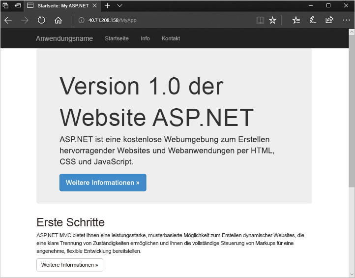

# <a name="quickstart-create-a-virtual-machine-scale-set-with-azure-powershell"></a>Schnellstart: Erstellen einer VM-Skalierungsgruppe mit Azure PowerShell
Mit einer VM-Skalierungsgruppe können Sie eine Gruppe identischer, automatisch skalierender virtueller Computer bereitstellen und verwalten. Sie können die Anzahl virtueller Computer in der Skalierungsgruppe manuell skalieren oder basierend auf der Ressourcennutzung, z.B. CPU-Auslastung, Speicherbedarf oder Netzwerkdatenverkehr, Regeln für die automatische Skalierung definieren. Daraufhin wird der Datenverkehr durch einen Azure-Lastenausgleich auf die VM-Instanzen in der Skalierungsgruppe verteilt. In dieser Schnellstartanleitung erstellen Sie eine VM-Skalierungsgruppe und stellen eine Beispielanwendung mit Azure PowerShell bereit.

Wenn Sie kein Azure-Abonnement besitzen, können Sie ein [kostenloses Konto](https://azure.microsoft.com/free/?WT.mc_id=A261C142F) erstellen, bevor Sie beginnen.

[!INCLUDE [cloud-shell-powershell.md](../../includes/cloud-shell-powershell.md)]

Wenn Sie PowerShell lokal installieren und nutzen möchten, müssen Sie für dieses Tutorial mindestens Version 6.0.0 des Azure PowerShell-Moduls verwenden. Führen Sie `Get-Module -ListAvailable AzureRM` aus, um die Version zu finden. Wenn Sie ein Upgrade ausführen müssen, finden Sie unter [Installieren des Azure PowerShell-Moduls](/powershell/azure/install-azurerm-ps) Informationen dazu. Wenn Sie PowerShell lokal ausführen, müssen Sie auch `Connect-AzureRmAccount` ausführen, um eine Verbindung mit Azure herzustellen.


## <a name="create-a-scale-set"></a>Erstellen einer Skalierungsgruppe
Erstellen Sie mit [New-AzureRmVmss](/powershell/module/azurerm.compute/new-azurermvmss) eine VM-Skalierungsgruppe. Im folgenden Beispiel wird eine Skalierungsgruppe mit dem Namen *myScaleSet* erstellt, für die das Plattformimage *Windows Server 2016 Datacenter* verwendet wird. Die Azure-Netzwerkressourcen für virtuelles Netzwerk, öffentliche IP-Adresse und Lastenausgleich werden automatisch erstellt. Geben Sie Ihre gewünschten Administratoranmeldeinformationen für die VM-Instanzen in der Skalierungsgruppe an, wenn Sie dazu aufgefordert werden:

```azurepowershell-interactive
New-AzureRmVmss `
  -ResourceGroupName "myResourceGroup" `
  -Location "EastUS" `
  -VMScaleSetName "myScaleSet" `
  -VirtualNetworkName "myVnet" `
  -SubnetName "mySubnet" `
  -PublicIpAddressName "myPublicIPAddress" `
  -LoadBalancerName "myLoadBalancer" `
  -UpgradePolicyMode "Automatic"
```

Die Erstellung und Konfiguration aller Ressourcen und virtuellen Computer der Skalierungsgruppe dauert einige Minuten.


## <a name="deploy-sample-application"></a>Bereitstellen der Beispielanwendung
Installieren Sie eine einfache Webanwendung, um Ihre Skalierungsgruppe zu testen. Die benutzerdefinierte Skripterweiterung von Azure wird zum Herunterladen und Ausführen eines Skripts verwendet, das IIS auf den VM-Instanzen installiert. Diese Erweiterung ist hilfreich bei der Konfiguration nach der Bereitstellung, bei der Softwareinstallation oder bei anderen Konfigurations-/Verwaltungsaufgaben. Weitere Informationen finden Sie unter [Übersicht über benutzerdefinierte Skripterweiterungen](../virtual-machines/windows/extensions-customscript.md).

Verwenden Sie die benutzerdefinierte Skripterweiterung, um einen einfachen IIS-Webserver zu installieren. Wenden Sie die benutzerdefinierte Skripterweiterung, mit der IIS installiert wird, wie folgt an:

```azurepowershell-interactive
# Define the script for your Custom Script Extension to run
$publicSettings = @{
    "fileUris" = (,"https://raw.githubusercontent.com/Azure-Samples/compute-automation-configurations/master/automate-iis.ps1");
    "commandToExecute" = "powershell -ExecutionPolicy Unrestricted -File automate-iis.ps1"
}

# Get information about the scale set
$vmss = Get-AzureRmVmss `
            -ResourceGroupName "myResourceGroup" `
            -VMScaleSetName "myScaleSet"

# Use Custom Script Extension to install IIS and configure basic website
Add-AzureRmVmssExtension -VirtualMachineScaleSet $vmss `
    -Name "customScript" `
    -Publisher "Microsoft.Compute" `
    -Type "CustomScriptExtension" `
    -TypeHandlerVersion 1.8 `
    -Setting $publicSettings

# Update the scale set and apply the Custom Script Extension to the VM instances
Update-AzureRmVmss `
    -ResourceGroupName "myResourceGroup" `
    -Name "myScaleSet" `
    -VirtualMachineScaleSet $vmss
```


## <a name="test-your-scale-set"></a>Testen Ihrer Skalierungsgruppe
Greifen Sie über einen Webbrowser auf die Beispielwebanwendung zu, um Ihre Skalierungsgruppe in Aktion zu sehen. Rufen Sie mit [Get-AzureRmPublicIpAddress](/powershell/module/azurerm.network/get-azurermpublicipaddress) die öffentliche IP-Adresse Ihres Lastenausgleichs ab. Im folgenden Beispiel wird die IP-Adresse abgerufen, die in der Ressourcengruppe *myResourceGroup* erstellt wurde:

```azurepowershell-interactive
Get-AzureRmPublicIpAddress -ResourceGroupName "myResourceGroup" | Select IpAddress
```

Geben Sie die öffentliche IP-Adresse des Lastenausgleichsmoduls in einen Webbrowser ein. Das Lastenausgleichsmodul verteilt den Datenverkehr auf eine Ihrer VM-Instanzen. Dies ist im folgenden Beispiel dargestellt:




## <a name="clean-up-resources"></a>Bereinigen von Ressourcen
Mit [Remove-AzureRmResourceGroup](/powershell/module/azurerm.resources/remove-azurermresourcegroup) können Sie die Ressourcengruppe, die Skalierungsgruppe und alle dazugehörigen Ressourcen entfernen, sofern diese nicht mehr benötigt werden. Der Parameter `-Force` bestätigt ohne eine zusätzliche Aufforderung, dass Sie die Ressourcen löschen möchten. Der Parameter `-AsJob` gibt die Steuerung an die Eingabeaufforderung zurück, ohne zu warten, bis der Vorgang abgeschlossen ist.

```azurepowershell-interactive
Remove-AzureRmResourceGroup -Name "myResourceGroup" -Force -AsJob
```


## <a name="next-steps"></a>Nächste Schritte
In dieser Schnellstartanleitung haben Sie eine einfache Skalierungsgruppe erstellt und die benutzerdefinierte Skripterweiterung verwendet, um einen einfachen IIS-Webserver auf den VM-Instanzen zu installieren. Im nächsten Tutorial erfahren Sie mehr über die Erstellung und Verwaltung von Azure-VM-Skalierungsgruppen.

> [!div class="nextstepaction"]
> [Erstellen und Verwalten von Azure-VM-Skalierungsgruppen](tutorial-create-and-manage-powershell.md)
