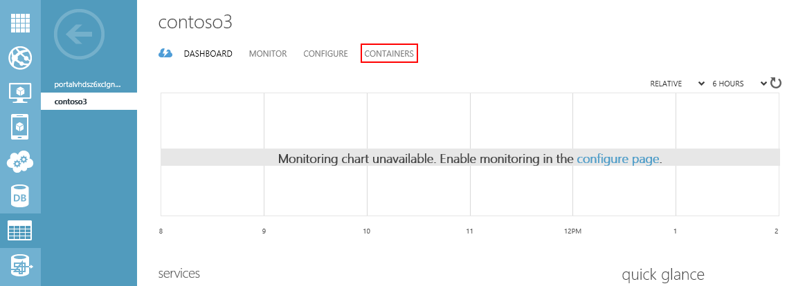
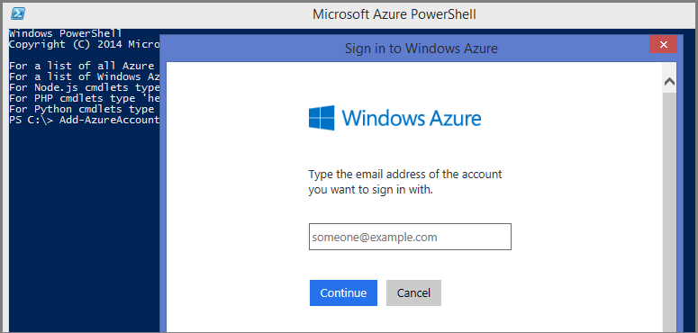

<properties 
	pageTitle="Erstellen und Hochladen einer Windows Server-VHD nach Azure" 
	description="Erfahren Sie, wie Sie eine virtuelle Festplatte (Virtual Hard Disk, VHD) mit dem Betriebssystem Windows Server in Azure erstellen und hochladen." 
	services="virtual-machines" 
	documentationCenter="" 
	authors="KBDAzure" 
	manager="timlt" 
	editor="tysonn"/>

<tags 
	ms.service="virtual-machines" 
	ms.workload="infrastructure-services" 
	ms.tgt_pltfrm="vm-windows" 
	ms.devlang="na" 
	ms.topic="article" 
	ms.date="01/19/2015" 
	ms.author="kathydav"/>

#Erstellen und Hochladen einer Windows Server-VHD nach Azure#

Dieser Artikel erläutert, wie Sie eine virtuelle Festplatte (Virtual Hard Disk, VHD) mit einem Betriebssystem hochladen, um sie als Image für die Erstellung von virtuellen Computern zu nutzen. Weitere Informationen zu Datenträgern und Images in Microsoft Azure finden Sie unter [Informationen zu Datenträgern und Images in Azure](http://msdn.microsoft.com/library/windowsazure/jj672979.aspx).

> [AZURE.NOTE] Bei der Erstellung einer virtuellen Maschine basierend auf einem Image können Sie die Einstellungen des Betriebssystems für die Anwendungen entsprechend anpassen, die Sie auf dem virtuellen Computer ausführen möchten. Diese Konfiguration wird für die virtuelle Maschine gespeichert und wirkt sich nicht auf das Image aus. Anweisungen hierzu finden Sie unter [Erstellen eines benutzerdefinierten virtuellen Computers](http://azure.microsoft.com/documentation/articles/virtual-machines-windows-tutorial/).

##Voraussetzungen##
In diesem Artikel wird davon ausgegangen, dass Sie über die folgenden Voraussetzungen verfügen:

1. **Azure-Abonnement**: Wenn Sie über kein Abonnement verfügen, können Sie in wenigen Minuten ein kostenloses Testkonto einrichten. Weitere Informationen finden Sie unter [Erstellen eines Azure-Kontos](http://azure.microsoft.com/develop/php/tutorials/create-a-windows-azure-account/).  

2. **Microsoft Azure PowerShell** - Sie haben das Microsoft Azure PowerShell-Modul installiert und für die Verwendung Ihres Abonnements konfiguriert. Informationen zum Herunterladen dieses Moduls finden Sie unter [Microsoft Azure-Downloads](http://azure.microsoft.com/downloads/). Ein Lernprogramm zum Installieren und Konfigurieren des Moduls steht [hier](http://azure.microsoft.com/documentation/articles/install-configure-powershell/) zur Verfügung.Verwenden Sie das [Add-AzureVHD](http://msdn.microsoft.com/library/azure/dn495173.aspx)-Cmdlet, um die virtuelle Festplatte hochzuladen.

3. **Ein in einer VHD-Datei gespeichertes unterstütztes Windows-Betriebssystem** - Sie haben ein unterstütztes Windows Server-Betriebssystem auf einer virtuellen Festplatte installiert. Zum Erstellen von .vhd-Dateien stehen mehrere verschiedene Tools bereit. Sie können eine Virtualisierungslösung wie etwa Hyper-V verwenden, um den virtuellen Computer zu erstellen und das Betriebssystem zu installieren. Anweisungen hierzu finden Sie unter [Installieren der Hyper-V-Rolle und Konfigurieren eines virtuellen Computers](http://technet.microsoft.com/library/hh846766.aspx).

> [AZURE.NOTE] Das VHDX-Format wird in Microsoft Azure nicht unterstützt. Sie können den Datenträger mit dem Hyper-V-Manager oder dem [Convert-VHD-Cmdlet](http://technet.microsoft.com/library/hh848454.aspx) in das VHD-Format konvertieren. Ein Lernprogramm zu diesem Thema finden Sie [hier](http://blogs.msdn.com/b/virtual_pc_guy/archive/2012/10/03/using-powershell-to-convert-a-vhd-to-a-vhdx.aspx).
 
 Die folgenden Windows Server-Versionen werden unterstützt:

  <TABLE BORDER="1" WIDTH="600">
  <TR BGCOLOR="#E9E7E7">
    <TH>Betriebssystem</TH>
    <TH>SKU</TH>
    <TH>Service Pack</TH>
    <TH>Architektur</TH>
  </TR>
  <TR>
    <TD>Windows Server 2012 R2</TD>
    <TD>Alle Editionen</TD>
    <TD>N/V</TD>
    <TD>x64</TD>
  </TR>
  <TR>
    <TD>Windows Server 2012</TD>
    <TD>Alle Editionen</TD>
    <TD>N/V</TD>
    <TD>x64</TD>
  </TR>
  <TR>
    <TD>Windows Server 2008 R2</TD>
    <TD>Alle Editionen</TD>
    <TD>SP1</TD>
    <TD>x64</TD>
  </TR>
  </TABLE>

Diese Aufgabe umfasst die folgenden Schritte:

- [Schritt 1: Vorbereiten des hochzuladenden Images] []
- [Schritt 2: Erstellen eines Speicherkontos in Azure] []
- [Schritt 3: Vorbereiten der Verbindung mit Azure] []
- [Schritt 4: Hochladen der .vhd-Datei] []

## Schritt 1: Vorbereiten des hochzuladenden Images ##

Bevor das Image zu Azure hochgeladen werden kann, muss es mit dem Sysprep-Befehl generalisiert werden. Weitere Informationen zur Verwendung von Sysprep finden Sie unter [How to Use Sysprep: An Introduction (Verwenden der Sysprep: Einführung, in englischer Sprache](http://technet.microsoft.com/library/bb457073.aspx).

Führen Sie auf dem virtuellen Computer, auf dem das Betriebssystem installiert wurde, die folgende Prozedur aus:

1. Melden Sie sich beim Betriebssystem an.

2. Öffnen Sie ein Eingabeaufforderungsfenster als ein Administrator. Ändern Sie das Verzeichnis in **%windir%\system32\sysprep**, und führen Sie dann  `sysprep.exe` aus.

	

3.	Das Dialogfeld **Systemvorbereitungstool** wird angezeigt.

	

4.  Wählen Sie unter **Systemvorbereitungstool** die Option **Out-of-Box-Experience (OOBE) für System aktivieren** aus, und stellen Sie dann sicher, dass "Verallgemeinern" aktiviert ist.

5.  Wählen Sie unter **Optionen für Herunterfahren** die Option **Herunterfahren**.

6.  Klicken Sie auf **OK**. 

## Schritt 2: Erstellen eines Speicherkontos in Azure ##

Sie benötigen in Azure ein Speicherkonto, um eine .vhd-Datei hochladen zu können, die zum Erstellen eines virtuellen Computers verwendet werden kann. Über das Azure-Verwaltungsportal können Sie ein Speicherkonto erstellen.

1. Melden Sie sich auf dem Azure-Verwaltungsportal an.

2. Klicken Sie in der Befehlsleiste auf **Neu**.

3. Klicken Sie auf **Datendienste** > **Speicher** > **Schnellerfassung**.

	

4. Füllen Sie die Felder wie folgt aus:
	
	- Geben Sie unter **URL** einen Unterdomänennamen ein, der im URL für das Speicherkonto verwendet werden soll. Der Eintrag kann drei bis 24 Kleinbuchstaben und Zahlen enthalten. Dieser Name wird der Hostname im URL, der zum Adressieren von Blob-, Warteschlangen- oder Tabellenspeicherressourcen für das Abonnement verwendet wird.
			
	- Wählen Sie den **Standort oder die Affinitätsgruppe** für das Speicherkonto aus. Mit einer Affinitätsgruppe können Sie Ihre Cloud-Dienste und Speicher im selben Rechenzentrum platzieren.
		 
	- Sie können wählen, ob Sie **Georeplikation** für das Speicherkonto verwenden möchten. Georeplikation ist als Standard voreingestellt. Mit dieser Option werden Ihre Daten kostenfrei an einem sekundären Speicherort repliziert. So wird die Speicherung auf jenen Speicherort umgeschaltet, wenn ein größerer Ausfall auftritt, der am primären Speicherort nicht behoben werden kann. Der sekundäre Speicherort wird automatisch zugewiesen und kann nicht verändert werden. Wenn Sie aufgrund gesetzlicher Vorschriften oder Unternehmensrichtlinien mehr Kontrolle über den Speicherort des Cloud-basierten Speichers benötigen, können Sie die geografische Replikation deaktivieren. Beachten Sie jedoch, dass bei einem späteren Aktivieren der Georeplikation eine einmalige Datenübertragungsgebühr fällig wird, um Ihre vorhandenen Daten in dem sekundären Speicherort zu replizieren. Die Speicherdienste ohne Georeplikation werden mit einem Rabatt angeboten. Ausführliche Informationen zur Verwaltung der Georeplikation für Speicherkonten finden Sie unter: [Erstellen, Verwalten oder Löschen eines Speicherkontos](../storage-create-storage-account/#replication-options).

	

5. Klicken Sie auf **Speicherkonto erstellen**. Das Konto wird nun unter **Speicher** angezeigt.

	

6. Als Nächstes erstellen Sie einen Container für die hochgeladenen VHDs. Klicken Sie auf den Namen des Speicherkontos und dann auf **Container**.

	

7. Klicken Sie auf **Container erstellen**.

	

8. Geben Sie einen **Namen** für den Container ein, und wählen Sie die **Zugriffsrichtlinie** aus.

	

	> [AZURE.NOTE] Der Container ist standardmäßig privat, und der Containerzugriff ist auf den Kontobesitzer eingeschränkt. Um öffentliche Lesezugriffe auf die im Container enthaltenen Blobs, jedoch nicht auf die Containereigenschaften und -metadaten, zuzulassen, verwenden Sie die Option "Öffentlicher Blob". Verwenden Sie die Option "Öffentlicher Container", um vollständigen öffentlichen Lesezugriff auf den Container und die Blobs zuzulassen.

## Schritt 3: Vorbereiten der Verbindung mit Microsoft Azure ##

Bevor Sie eine .vhd-Datei hochladen können, müssen Sie eine sichere Verbindung zwischen dem Computer und Ihrem Abonnement in Azure herstellen. Zu diesem Zweck können Sie die Microsoft Azure Active Directory-Methode oder die Zertifikatmethode verwenden.

<h3>Verwenden der Microsoft Azure AD-Methode</h3>

1. Öffnen Sie die Azure PowerShell-Konsole, wie unter [Gewusst wie: Installieren von Microsoft Azure PowerShell] beschrieben(#Install).

2. Geben Sie den folgenden Befehl ein:  
	`Add-AzureAccount`
	
	Durch diesen Befehl wird ein Anmeldefenster geöffnet, sodass Sie sich mit Ihrem Geschäfts- oder Schulkonto anmelden können.

	

3. Die Anmeldeinformationen werden von Azure authentifiziert und gespeichert, dann wird das Fenster geschlossen.

<h3>Verwenden eines Zertifikats</h3> 

1. Öffnen Sie die Azure PowerShell-Konsole. 

2.	Geben Sie Folgendes ein: 
	`Get-AzurePublishSettingsFile`.

3. Es wird ein Browserfenster geöffnet, und Sie werden aufgefordert, eine PUBLISHSETTINGS-Datei herunterzuladen. Sie enthält Informationen und ein Zertifikat für Ihr Microsoft Azure-Abonnement.

	

3. Speichern Sie die .publishsettings-Datei. 

4. Geben Sie Folgendes ein: 
	`Import-AzurePublishSettingsFile <PathToFile>`

	Dabei stellt `<PathToFile>` den vollständigen Pfad zur .publishsettings-Datei dar. 

	Weitere Informationen finden Sie unter [Erste Schritte mit Microsoft Azure-Cmdlets](http://msdn.microsoft.com/library/windowsazure/jj554332.aspx). 
	
	Weitere Informationen zur Installation und Konfiguration von PowerShell finden Sie unter [Installieren und Konfigurieren von Microsoft Azure PowerShell](http://azure.microsoft.com/documentation/articles/install-configure-powershell/). 

## Schritt 4: Hochladen der .vhd-Datei ##

Wenn Sie die .vhd-Datei hochladen, können Sie diese .vhd-Datei an einem beliebigen Speicherort innerhalb des Blobspeichers ablegen. In den folgenden Befehlsbeispielen stellt **BlobStorageURL** den URL für das Speicherkonto dar, das Sie im Schritt 2 erstellt haben. Zudem stellt **YourImagesFolder** den Container innerhalb des Blobspeichers dar, in dem Sie Ihre Images speichern möchten. **VHDName** ist die Bezeichnung, die im Verwaltungsportal zur Identifizierung der virtuellen Festplatte angezeigt wird. **PathToVHDFile** stellt den vollständigen Pfad und den Namen der VHD-Datei dar. 

1. Geben Sie über das Azure PowerShell-Fenster, welches Sie im vorherigen Schritt verwendet haben, Folgendes ein:

	`Add-AzureVhd -Destination "<BlobStorageURL>/<YourImagesFolder>/<VHDName>.vhd" -LocalFilePath <PathToVHDFile>`
	
	

	Weitere Informationen zum Cmdlet "Add-AzureVhd" finden Sie unter [Add-AzureVhd](http://msdn.microsoft.com/library/dn495173.aspx).

##Schritt 5: Hinzufügen des Images zur Liste benutzerdefinierter Images ##
Nach dem Hochladen fügen Sie die .vhd-Datei als Image zu der Ihrem Abonnement zugeordneten Liste benutzerdefinierter Images hinzu.

1. Im Verwaltungsportal klicken Sie unter **Alle Elemente** auf **Virtuelle Computer**.

2. Klicken Sie unter "Virtuelle Computer" auf **Images**.

3. Klicken Sie dann auf **Image erstellen**.

	

4. Führen Sie unter **Ein Image aus einer VHD erstellen** folgende Schritte aus:
 	

	- Geben Sie unter **Name** den Namen an.
	- Geben Sie eine **Beschreibung** an.
	- Um die **URL der VHD** anzugeben, klicken Sie auf die Ordnerschaltfläche. Das nachfolgend dargestellte Dialogfeld wird aufgerufen:
 
	

	- Wählen Sie das Speicherkonto aus, unter dem die VHD verwaltet wird, und klicken Sie auf **Öffnen**. Dadurch kehren Sie zum Fenster **Ein Image aus einer VHD erstellen** zurück.
	- Nachdem Sie zum Fenster **Ein Image aus einer VHD erstellen** zurückgekehrt sind, wählen Sie die Betriebssystemfamilie aus.
	- Markieren Sie ** Ich habe Sysprep auf dem virtuellen Computer ausgeführt, der dieser VHD zugeordnet ist.**, um zu bestätigen, dass Sie das Betriebssystem in Schritt 1 generalisiert haben, und klicken Sie dann auf **OK**. 

	

5. **OPTIONAL:** Sie können das Add-AzureVMImage-Cmdlet anstelle des Verwaltungsportals verwenden, um die virtuelle Festplatte als Image hinzuzufügen.	Geben Sie Folgendes in die Azure PowerShell-Konsole ein:

	`Add-AzureVMImage -ImageName <Your Image's Name> -MediaLocation <location of the VHD> -OS <Type of the OS on the VHD>`
	
	

6. Nachdem Sie die vorherigen Schritte abgeschlossen haben, wird das neue Image aufgelistet, sobald Sie die Registerkarte **Images** auswählen. 

	

	Dieses neue Image ist nun unter **Eigene Abbilder[UT1]** beim Erstellen eines virtuellen Computers verfügbar. Anweisungen dazu finden Sie unter [Erstellen eines virtuellen Windows Server-Computers](http://azure.microsoft.com/documentation/articles/virtual-machines-windows-tutorial/).

	

	> [AZURE.TIP] Wenn Sie bei dem Versuch, einen virtuellen Computer zu erstellen, sinngemäß die folgende Fehlermeldung erhalten: "Die VHD https://XXXXX... hat eine nicht unterstützte virtuelle Größe von YYYY Byte. Die Größe muss eine ganze Zahl (in MB) sein", bedeutet dies, dass die virtuelle Festplatte keine ganze Zahl von MBs hat und eine VHD mit fester Größe sein muss. Verwenden Sie anstelle des Verwaltungsportals das Add-AzureVMImage-PowerShell-Cmdlet, um das Image hinzuzufügen (siehe oben, Schritt 5). Die Azure-Cmdlets sorgen dafür, dass die virtuelle Festplatte die Anforderungen für Azure erfüllt.
	
## Nächste Schritte ##
 

Nachdem Sie einen virtuellen Computer erstellt haben, sollten Sie versuchen, einen virtuellen SQL Server-Computer zu erstellen. Anweisungen finden Sie unter [Bereitstellen eines virtuellen SQL Server-Computers in Microsoft Azure](http://azure.microsoft.com/documentation/articles/virtual-machines-provision-sql-server/). 

[Schritt 1: Vorbereiten des hochzuladenden Images]: #prepimage
[Schritt 2: Erstellen eines Speicherkontos in Azure]: #createstorage
[Schritt 3: Vorbereiten der Verbindung mit Azure]: #prepAzure
[Schritt 4: Hochladen der .vhd-Datei]: #upload

<!--HONumber=42-->

