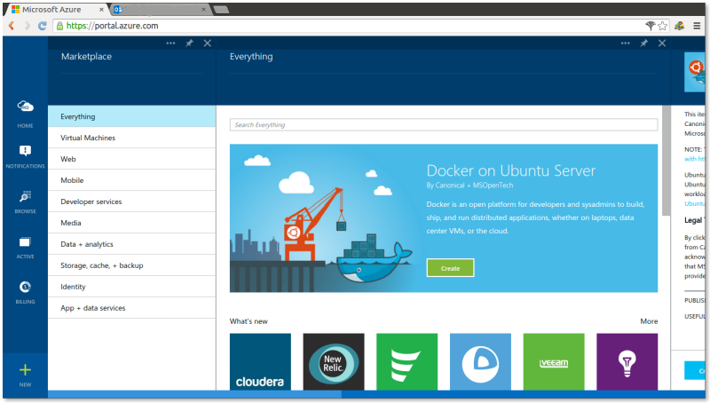

<properties 
	pageTitle="Schnelles Verwenden von Docker mit einem Ubuntu Docker VM-Image" 
	description="Beschreibt und veranschaulicht, wie Docker auf Ubuntu Server in Minuten direkt aus dem Azure-Imagekatalog verwendet werden kann." 
	services="virtual-machines" 
	documentationCenter="" 
	authors="squillace" 
	manager="timlt" 
	editor="tysonn"/>

<tags 
	ms.service="virtual-machines" 
	ms.devlang="na" 
	ms.topic="article" 
	ms.tgt_pltfrm="vm-linux" 
	ms.workload="infrastructure" 
	ms.date="02/02/2015" 
	ms.author="rasquill"/>

<!--The next line, with one pound sign at the beginning, is the page title--> 
#Gewusst wie: Schneller Einstieg mit Docker in Azure Marketplace 

Die schnellste Möglichkeit für die ersten Schritte mit [Docker] besteht darin, Azure Marketplace aufzurufen und einen virtuellen Computer mit der Imagevorlage **Docker on Ubuntu Server** zu erstellen, die von [Canonical] in Verbindung mit [MSOpenTech] erstellt wurde. Damit wird eine Ubuntu Server-VM erstellt und die [Docker VM-Erweiterung](http://azure.microsoft.com/documentation/articles/virtual-machines-docker-vm-extension/) zusammen mit dem **neuesten** Docker-Modul, das bereits auf Azure installiert und aktiv ist, automatisch installiert.  

Sie können sofort ohne zusätzlichen Aufwand eine Verbindung mit dem virtuellen Computer über SSH herstellen und direkt mit dem Ausführen von Aufgaben mit Docker beginnen. 

> [AZURE.NOTE]Der mit der Azure Marketplace-Vorlage erstellte virtuelle Computer ist kein Host für die Remote-API von Docker zur Verwaltung eines Remote-Docker-Clients. Informationen dazu, wie der Docker-Host auf diesem virtuellen Computer remote gesteuert werden kann, finden Sie unter [Ausführen von Docker mit https](https://docs.docker.com/articles/https/), oder führen Sie die Schritte unter [Verwenden der Docker-VM-Erweiterung mithilfe des Azure-Portals](http://azure.microsoft.com/documentation/articles/virtual-machines-docker-with-portal/) oder [Verwenden der Docker-VM-Erweiterung über die azure-cli](http://azure.microsoft.com/documentation/articles/virtual-machines-docker-with-xplat-cli/) aus. Sie können aber auch den [Windows-Docker-Client](https://github.com/ahmetalpbalkan/Docker.DotNet)von Github erstellen und ebenfalls ausprobieren (oder rufen Sie ihn einfach von [nuget](https://www.nuget.org/packages/Docker.DotNet/) ab). 

In diesem Thema:

- [Anmelden beim Portal]
- [Erstellen eines virtuellen Computers mit dem Docker-Image von Canonical und MSOpenTech]
- [Verbinden mit SSH und Spaß haben]

##<a id='logon'>Anmelden beim Portal</a>

Dieser Teil ist leicht, sofern Sie über ein Azure-Konto verfügen. [Sie können auch leicht ein kostenloses bekommen](http://azure.microsoft.com/pricing/free-trial/)!

##<a id='createvm'>Erstellen eines virtuellen Computers mit dem Docker-Image von Canonical und MSOpenTech</a>

1. Nun, da Sie angemeldet sind, klicken Sie unten links auf **Neu**, um ein neues VM-Image zu erstellen. Das richtige Image wird möglicherweise sofort im Banner angezeigt:

> 

2. Ist dies jedoch nicht der Fall, suchen Sie im Imagekatalog danach: 

> 

3. Geben Sie den Benutzernamen und das Kennwort für die Instanz oder eine **PEM**-Datei an, um SSH mit einem Zertifikat zu aktivieren. (Die unten dargestellte Abbildung zeigt die Angabe einer Kombination aus Benutzername und Kennwort.) Drücken Sie dann unten auf **Erstellen**.

> 

4. Warten Sie die Ausführung ab. Es sollte nicht all zu lange dauern.

> 

##<a id='havingfun'>Verbinden mit SSH und Spaß haben</a>

Jetzt beginnt der Spaß. Sie können sofort eine Verbindung mit dem virtuellen Computer über SSH herstellen:

> 

Beginnen Sie mit der Ausgabe von Docker-Befehlen, denken Sie daran, dass bei dieser Azure-VM für die Standardkonfiguration **`sudo`** erforderlich ist:

> 

<!--Every topic should have next steps and links to the next logical set of content to keep the customer engaged-->
##Nächste Schritte

Sie könnten mit der Verwendung von [Docker] beginnen! 

<!--Anchors-->
[Anmelden beim Portal]: #logon
[Erstellen eines virtuellen Computers mit dem Docker-Image von Canonical und MSOpenTech]: #createvm
[Verbinden mit SSH und Spaß haben]: #havingfun
[Nächste Schritte]: #next-steps

[Docker]: https://www.docker.com/
[BusyBox]: http://en.wikipedia.org/wiki/BusyBox
[Neues Docker-Image]: https://docs.docker.com/articles/baseimages/#creating-a-simple-base-image-using-scratch
[Canonical]: http://www.canonical.com/
[MSOpenTech]: http://msopentech.com/

<!--HONumber=47-->
