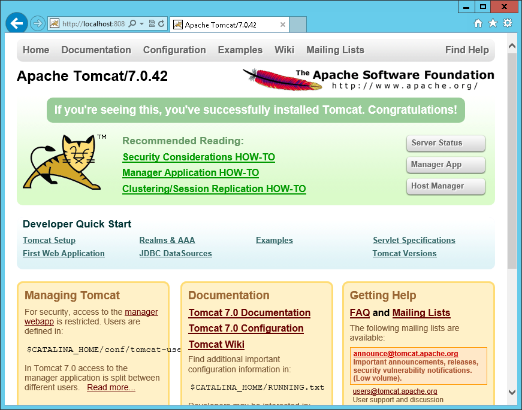
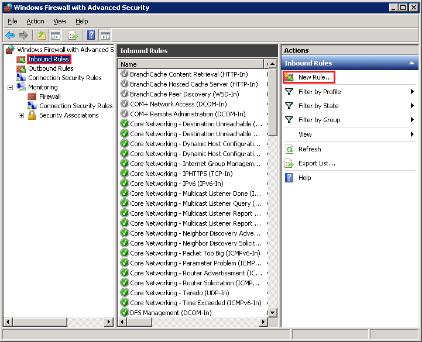
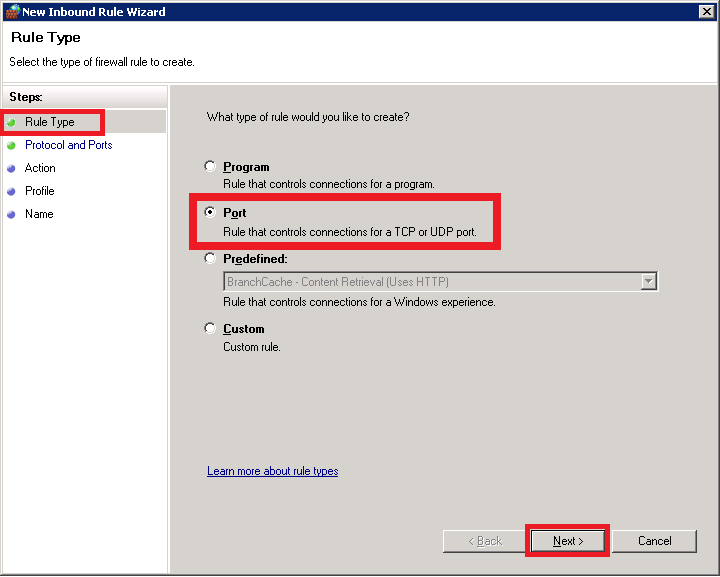
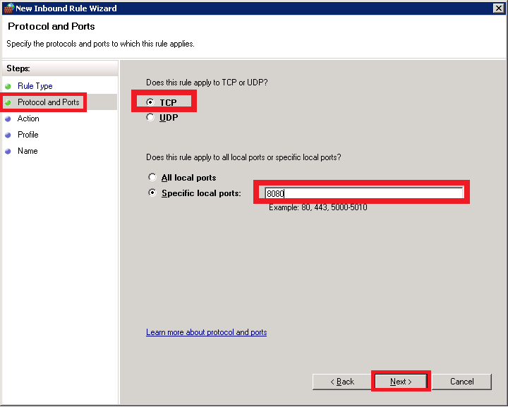
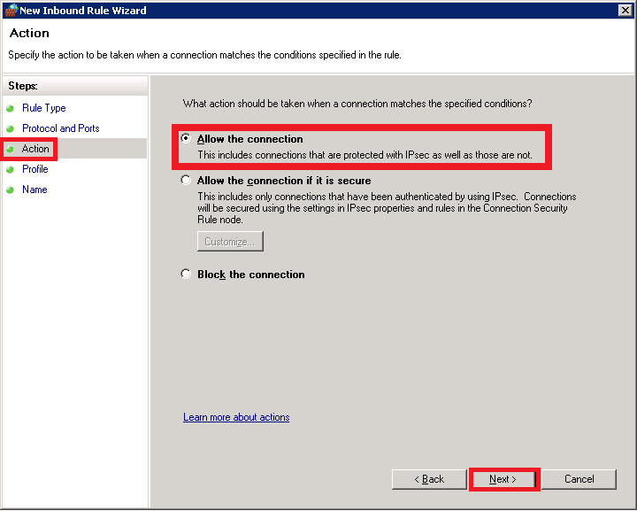
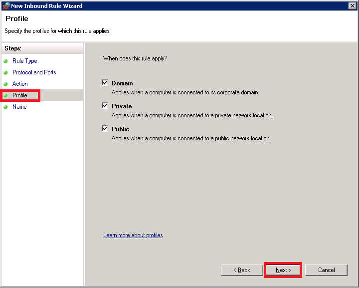
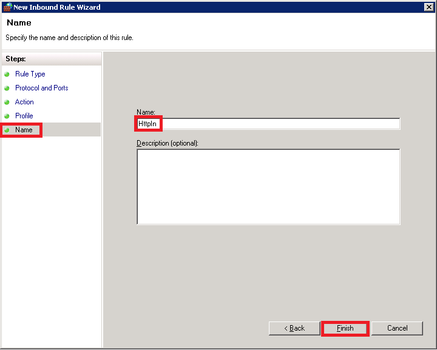
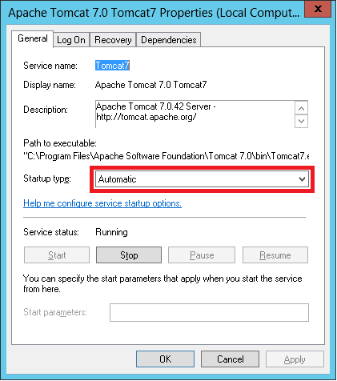

<properties linkid="dev-java-vm-application-server" urlDisplayName="Tomcat on Virtual Machine" pageTitle="Tomcat on a virtual machine - Azure tutorial" metaKeywords="Azure vm, creating vm Tomcat, configuring vm Tomcat" description="Learn how to create a Windows Virtual machine and configure the machine to run a Apache Tomcat application server." metaCanonical="" services="virtual-machines" documentationCenter="Java" title="How to run a Java application server on a virtual machine" authors="waltpo" solutions="" manager="" editor="" />

Ausführen eines Java-Anwendungsservers auf einem virtuellen Computer
====================================================================

Mit Azure können Sie einen virtuellen Computer nutzen, um Serverfunktionen bereitzustellen. Beispielsweise kann ein unter Azure ausgeführter virtueller Computer so konfiguriert werden, dass er einen Java-Anwendungsserver wie Apache Tomcat hostet. Nachdem Sie diesen Leitfaden durchgearbeitet haben, werden Sie besser verstehen, wie ein virtueller Computer unter Azure erstellt wird und wie er für die Ausführung eines Java-Anwendungsservers konfiguriert wird.

Sie erhalten Informationen zu folgenden Themen:

-   Erstellen eines virtuellen Computers, auf dem bereits ein JDK installiert ist
-   Remoteanmeldung an Ihrem virtuellen Computer
-   Installieren eines Java-Anwendungsservers auf dem virtuellen Computer
-   Erstellen eines Endpunkts für den virtuellen Computer
-   Öffnen eines Ports in der Firewall für den Anwendungsserver

Für dieses Lernprogramm wird ein Apache Tomcat-Anwendungsserver auf einem virtuellen Computer installiert. Das Ergebnis des Installationsvorgangs ist eine Tomcat-Installation, die der Folgenden ähnelt.

[WACOM.INCLUDE [create-account-and-vms-note](../includes/create-account-and-vms-note.md)]

So erstellen Sie einen virtuellen Computer
------------------------------------------

1.  Melden Sie sich am [Azure-Verwaltungsportal](https://manage.windowsazure.com) an.
2.  Klicken Sie auf **Neu**, auf **Berechnen** auf **Virtueller Computer** und dann auf **Aus Galerie**.
3.  Wählen Sie im Dialogfeld **Image des virtuellen Computers auswählen** die Option **JDK 7 Windows Server 2012** aus. Beachten Sie, dass **JDK 6 Windows Server 2012** verfügbar ist, wenn Sie Legacyanwendungen haben, die noch nicht in JDK 7 ausgeführt werden können.
4.  Klicken Sie auf **Weiter**.
5.  Gehen Sie im Dialogfeld **Konfiguration des virtuellen Computers** wie folgt vor:
    1.  Geben Sie einen Namen für den virtuellen Computer an.
    2.  Geben Sie die Größe für den virtuellen Computer an.
    3.  Geben Sie im Feld **Benutzername** einen Namen für den Administrator ein. Merken Sie sich diesen Namen und das als nächstes eingegebene Kennwort. Sie benötigen diese Daten, wenn Sie sich von einem Remotestandort aus an dem virtuellen Computer anmelden.
    4.  Geben Sie ein Kennwort in das Feld **Neues Kennwort** ein, und geben Sie das Kennwort dann erneut in das Feld **Kennwort bestätigen** ein. Dies ist das Kennwort für das Administratorkonto.
    5.  Klicken Sie auf **Weiter**.
6.  Gehen Sie im folgenden Dialogfeld **Konfiguration des virtuellen Computers** wie folgt vor:
    1.  Verwenden Sie für den **Cloud-Dienst** die Standardeinstellung **Neuen Cloud-Dienst erstellen**.
    2.  Der Wert für **DNS-Name des Cloud-Diensts** muss in **cloudapp.net** eindeutig sein. Ändern Sie diesen Wert bei Bedarf, sodass Azure ihn als eindeutig erkennt.
    3.  Geben Sie eine Region, eine Affinitätsgruppe oder ein virtuelles Netzwerk an. Geben Sie für dieses Lernprogramm als Region **West-USA** an.
    4.  Wählen Sie unter **Speicherkonto** die Option **Automatisch generiertes Speicherkonto verwenden** aus.
    5.  Wählen Sie unter **Verfügbarkeitssatz** die Option **(Keine)** aus.
    6.  Klicken Sie auf **Weiter**.
7.  Gehen Sie im letzten Dialogfeld **Konfiguration des virtuellen Computers** wie folgt vor:
    1.  Akzeptieren Sie die Standardeinträge für Endpunkte.
    2.  Klicken Sie auf **Fertig stellen**.

So melden Sie sich von einem Remotestandort aus an Ihrem virtuellen Computer an
-------------------------------------------------------------------------------

1.  Melden Sie sich am [Verwaltungsportal](https://manage.windowsazure.com) an.
2.  Klicken Sie auf **Virtuelle Computer**.
3.  Klicken Sie auf den Namen des virtuellen Computers, an dem Sie sich anmelden möchten.
4.  Klicken Sie auf **Verbinden**.
5.  Befolgen Sie die Anweisungen, um eine Verbindung mit dem virtuellen Computer herzustellen. Wenn Sie zur Eingabe des Administratornamens und des Kennworts aufgefordert werden, verwenden Sie die Werte, die Sie beim Erstellen des virtuellen Computers bereitgestellt haben.

So installieren Sie einen Java-Anwendungsserver auf dem virtuellen Computer
---------------------------------------------------------------------------

Sie können einen Java-Anwendungsserver auf den virtuellen Computer kopieren oder über ein Installationsprogramm installieren.

Für dieses Lernprogramm wird Tomcat installiert.

1.  Während Sie auf dem virtuellen Computer angemeldet sind, öffnen Sie einen Browser und navigieren zu <http://tomcat.apache.org/download-70.cgi>.
2.  Doppelklicken Sie auf den Link für den **Windows Installer-Dienst (32-Bit/64-Bit)**. Mit diesem Verfahren wird Tomcat als Windows-Dienst installiert.
3.  Starten Sie das Installationsprogramm, wenn Sie dazu aufgefordert werden.
4.  Befolgen Sie im Setup-Assistenten für **Apache Tomcat** die Anweisungen für die Installation von Tomcat. Für dieses Lernprogramm können die Standardeinstellungen übernommen werden. Wenn das Dialogfeld **Abschließen des Setup-Assistenten für Apache Tomcat** angezeigt wird, können Sie optional das Kontrollkästchen **Apache Tomcat ausführen** aktivieren, um Tomcat jetzt zu starten. Klicken Sie auf **Fertig stellen**, um die Installation von Tomcat abzuschließen.

So starten Sie Tomcat
---------------------

Wenn Sie im Dialogfeld **Abschließen des Setup-Assistenten für Apache Tomcat** nicht angegeben haben, dass Tomcat gestartet werden soll, öffnen Sie eine Eingabeaufforderung auf dem virtuellen Computer, und führen Sie folgenden Befehl aus: **net start Tomcat7**.

Öffnen Sie im Browser des virtuellen Computers die URL <http://localhost:8080>. Sie können nun sehen, dass Tomcat ausgeführt wird.

Um von externen Computern aus festzustellen, ob Tomcat ausgeführt wird, müssen Sie einen Endpunkt erstellen und einen Port öffnen.

So erstellen Sie einen Endpunkt für den virtuellen Computer
-----------------------------------------------------------

1.  Melden Sie sich am [Verwaltungsportal](https://manage.windowsazure.com) an.
2.  Klicken Sie auf **Virtuelle Computer**.
3.  Klicken Sie auf den Namen des virtuellen Computers, auf dem der Java-Anwendungsserver ausgeführt wird.
4.  Klicken Sie auf **Endpunkte**.
5.  Klicken Sie auf **Hinzufügen**.
6.  Stellen Sie im Dialogfeld **Endpunkt hinzufügen** sicher, dass das Kontrollkästchen **Standalone-Endpunkt hinzufügen** aktiviert ist, und klicken Sie dann auf **Weiter**.
7.  Gehen Sie im Dialogfeld **Details des neuen Endpunkts** wie folgt vor:
    1.  Geben Sie einen Namen für den Endpunkt an. Beispiel: **HttpIn**.
    2.  Geben Sie als Protokoll **TCP** an.
    3.  Geben Sie als öffentlichen Port **80** an.
    4.  Geben Sie als privaten Port **8080** an.
    5.  Klicken Sie auf die Schaltfläche **Fertig stellen**, um das Dialogfeld zu schließen. Der Endpunkt wird jetzt erstellt.

So öffnen Sie einen Port in der Firewall für den virtuellen Computer
--------------------------------------------------------------------
1.  Melden Sie sich an dem virtuellen Computer an.
2.  Klicken Sie unter Windows auf **Start**.
3.  Klicken Sie auf **Systemsteuerung**.
4.  Klicken Sie auf **System und Sicherheit**, auf **Windows-Firewall** und dann auf **Erweiterte Einstellungen**.
5.  Klicken Sie auf **Eingehende Regeln** und dann auf **Neue Regel**.

  

6.  Wählen Sie für die neue Regel unter **Regeltyp** die Option **Port** aus, und klicken Sie dann auf **Weiter**.

  

7.  Wählen Sie als Protokoll **TCP** aus, und geben Sie als Port **8080** an. Klicken Sie dann auf **Weiter**.

  

8.  Wählen Sie die Option **Verbindung zulassen** aus, und klicken Sie anschließend auf **Weiter**.

  

9.  Stellen Sie sicher, dass die Kontrollkästchen **Domäne**, **Privat** und **Öffentlich** für das Profil aktiviert sind, und klicken Sie dann auf **Weiter**.

  

10.  Geben Sie einen Namen für die Regel an, wie beispielsweise **HttpIn** (der Name der Regel muss jedoch nicht mit dem Namen des Endpunkts übereinstimmen). Klicken Sie anschließend auf **Fertig stellen**.

  

An dieser Stelle sollte es nun möglich sein, die Tomcat-Website über einen externen Browser anzuzeigen. Dabei wird eine URL in der Form **http://*Ihr\_DNS-Name*.cloudapp.net** verwendet, wobei ***Ihr\_DNS-Name*** der DNS-Name ist, den Sie beim Erstellen des virtuellen Computers angegeben haben.

Überlegungen zum Lebenszyklus von Anwendungen
---------------------------------------------

-   Sie können Ihr eigenes Webarchiv für Anwendungen (WAR) erstellen und im Ordner **webapps** hinzufügen. Erstellen Sie beispielsweise ein dynamisches JSP-Basiswebprojekt (Java Service Page), und exportieren Sie dieses als WAR-Datei. Kopieren Sie dann die WAR-Datei in den Apache Tomcat-Ordner **webapps** auf dem virtuellen Computer, und führen Sie das Projekt in einem Browser aus.
-   Wenn der Tomcat-Dienst installiert ist, wird standardmäßig der manuelle Start festgelegt. Über das Snap-In **Dienste** können Sie zum automatischen Start wechseln. Starten Sie das Snap-In **Dienste**, indem Sie unter Windows auf **Start**, auf **Verwaltung** und dann auf **Dienste** klicken. Um festzulegen, dass Tomcat automatisch gestartet wird, doppelklicken Sie auf den Dienst **Apache Tomcat** im Snap-In **Dienste**, und wählen Sie unter **Starttyp** die Option **Automatisch** aus, wie in der folgenden Abbildung gezeigt.

    

    Der automatische Start von Tomcat bietet den Vorteil, dass der Dienst wieder gestartet wird, wenn ein Neustart des virtuellen Computer erfolgt (zum Beispiel nach der Installation von Softwareupdates, die einen Neustart erfordern).

Nächste Schritte
----------------

-   Weitere Informationen zu anderen Diensten wie beispielsweise Azure Storage, Servicebus und SQL-Datenbank, die Sie möglicherweise zusammen mit Ihren Java-Anwendungen verwenden möchten, finden Sie unter <http://www.windowsazure.com/en-us/develop/java/>.

[virtual_machine_tomcat]: ./media/virtual-machines-java-run-tomcat-application-server/WA_VirtualMachineRunningApacheTomcat.png

[service_automatic_startup]: ./media/virtual-machines-java-run-tomcat-application-server/WA_TomcatServiceAutomaticStart.png
