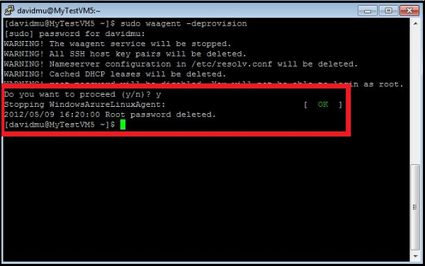

<properties linkid="manage-linux-howto-capture-an-image" urlDisplayName="Capture an image" pageTitle="Capture an image of a virtual machine running Linux" metaKeywords="Azure Linux vm, Linux vm" description="Learn how to capture an image of an Azure virtual machine (VM) running Linux. " metaCanonical="" services="virtual-machines" documentationCenter="" title="How to Capture an Image of a Virtual Machine Running Linux" authors="kathydav" solutions="" manager="jeffreyg" editor="tysonn" />

Erfassen des Images eines virtuellen Linux-Computers
====================================================

Sie können Images aus der Image-Galerie verwenden, um auf einfache Weise virtuelle Computer zu erstellen. Alternativ können Sie eigene Images erfassen und verwenden, um benutzerdefinierte virtuelle Computer zu erstellen. Ein Image stellt die Datei einer virtuellen Festplatte (.vhd) dar, die als Vorlage zum Erstellen eines virtuellen Computers dient. Ein Image ist eine Vorlage, da es nicht über spezifische Einstellungen verfügt wie ein konfigurierter virtueller Computer. Beispiele für diese Einstellungen sind Hostname und Benutzerkontoeinstellungen. Wenn Sie mehrere virtuelle Computer erstellen möchten, die auf die gleiche Weise eingerichtet sind, können Sie das Image eines konfigurierten virtuellen Computers erfassen und dieses als Vorlage verwenden.

1.  Stellen Sie eine Verbindung mit dem virtuellen Computer her. Eine Beschreibung der dafür erforderlichen Schritte finden Sie unter [Anmeldung auf einem virtuellen Linux-Computer](../virtual-machines-linux-how-to-log-on).

2.  Geben Sie im SSH-Fenster den folgenden Befehl ein, und geben Sie anschließend das Kennwort für das Konto ein, das Sie auf dem virtuellen Computer erstellt haben. Beachten Sie, dass das Ergebnis aus `waagent` je nach Version dieses Dienstprogramms geringfügig abweichen kann:

    `sudo waagent -deprovision`

    

3.  Geben Sie **y** ein, um fortzufahren.

    

4.  Geben Sie **Exit** ein, um den SSH-Client zu schließen.

5.  Wählen Sie im [Verwaltungsportal](http://manage.windowsazure.com) den virtuellen Computer, und klicken Sie anschließend auf **Shutdown**.

    

6.  Klicken Sie auf **Ja**, um zu bestätigen, dass Ihnen der virtuelle Computer weiterhin in Rechnung gestellt wird, auch wenn dieser nicht in Betrieb ist.

7.  Wenn der virtuelle Computer abgeschaltet wird, klicken Sie in der Befehlsleiste auf **Erfassen**.

    

    Das Dialogfeld **Erfassen des virtuellen Computers** wird angezeigt.

    

8.  Geben Sie unter **Image-Name** den Namen für das neue Image ein.

9.  Alle Linux-Images müssen *zurückgesetzt* werden, indem der Befehl `waagent` mit der Option `-deprovision` ausgeführt wird. Klicken Sie auf **Ich habe den De-provision-Befehl auf dem virtuellen Computer ausgeführt**, um anzuzeigen, dass das Betriebssystem darauf eingerichtet ist, als ein Image zu fungieren.

10. Aktivieren Sie das Kontrollkästchen, um das Image zu erfassen.

    Das neue Image steht nun unter **Images** zur Verfügung. Der virtuelle Computer wird gelöscht, nachdem das Image erfasst wurde.

    

    Wenn Sie einen virtuellen Computer erstellen, indem Sie die Methode **From Gallery** verwenden, können Sie das Image verwenden, das Sie erfasst haben, indem Sie auf **Meine Images** auf der Seite **Select the virtual machine operating system** klicken.

